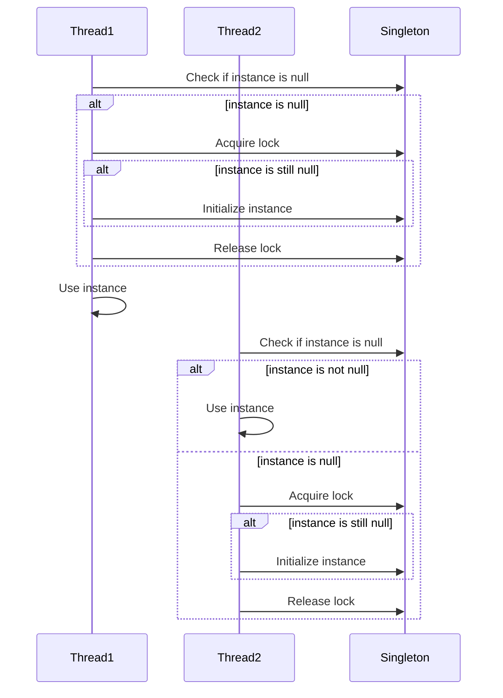

## 6.4 Double-Checked Locking Pattern

In the realm of concurrent programming, ensuring that resources are accessed safely and efficiently is paramount. The Double-Checked Locking (DCL) pattern is a concurrency design pattern that addresses the need for thread-safe lazy initialization while minimizing synchronization overhead. In this section, we will delve into the intricacies of the Double-Checked Locking pattern, exploring its intent, the problems it solves, and how it is implemented in modern Java.

### Understanding the Double-Checked Locking Pattern

The Double-Checked Locking pattern is a technique used to reduce the overhead of acquiring a lock by first testing the locking criterion (the "check") without actually acquiring the lock. Only if the criterion check indicates that locking is required does the actual locking logic proceed. This pattern is particularly useful in scenarios where you need to ensure that a resource is initialized only once and is accessed by multiple threads concurrently.

#### Intent of the Pattern

The primary intent of the Double-Checked Locking pattern is to improve performance while ensuring thread-safe lazy initialization. Lazy initialization refers to delaying the creation of an object until it is needed for the first time. In a multi-threaded environment, this pattern ensures that the object is initialized only once, even when multiple threads try to access it simultaneously.

### The Problem with Simple Lazy Initialization

In a single-threaded environment, lazy initialization is straightforward. However, in a multi-threaded context, simple lazy initialization can lead to race conditions where multiple threads might simultaneously attempt to initialize the same resource, leading to inconsistent states or redundant initializations.

Consider the following example of lazy initialization without synchronization:

```java
public class Singleton {
    private static Singleton instance;

    private Singleton() {}

    public static Singleton getInstance() {
        if (instance == null) {
            instance = new Singleton();
        }
        return instance;
    }
}
```

In this code, two threads could simultaneously find `instance` to be `null` and both proceed to create a new `Singleton` instance, violating the singleton property.

### Structure of the Double-Checked Locking Pattern

The Double-Checked Locking pattern involves two checks: one before acquiring the lock and another after acquiring the lock. This ensures that the lock is only acquired when necessary, reducing the overhead of synchronization.

Here's how the pattern is typically structured:

1. **First Check**: Check if the resource is already initialized. If it is, return it immediately without acquiring the lock.
2. **Synchronization Block**: If the resource is not initialized, acquire the lock.
3. **Second Check**: Re-check if the resource is initialized within the synchronized block. This is crucial because another thread might have initialized the resource between the first check and acquiring the lock.
4. **Initialization**: If the resource is still not initialized, proceed to initialize it.

Here is how the Double-Checked Locking pattern is implemented in Java:

```java
public class Singleton {
    private static volatile Singleton instance;

    private Singleton() {}

    public static Singleton getInstance() {
        if (instance == null) { // First check (no locking)
            synchronized (Singleton.class) {
                if (instance == null) { // Second check (with locking)
                    instance = new Singleton();
                }
            }
        }
        return instance;
    }
}
```

### Historical Issues and Modern Solutions

Historically, the Double-Checked Locking pattern was problematic in Java due to issues with the Java Memory Model (JMM) prior to Java 5. The reordering of instructions by the compiler or processor could lead to a situation where a partially constructed object was visible to other threads. This was because the `instance` reference could be assigned before the constructor finished executing.

#### Java Memory Model and Volatile Keyword

With the introduction of the revised Java Memory Model in Java 5, the `volatile` keyword was enhanced to address these issues. Declaring the `instance` variable as `volatile` ensures that writes to the variable are visible to all threads, preventing the reordering of instructions.

The `volatile` keyword guarantees that:

- Writes to a `volatile` variable are immediately visible to other threads.
- Reads from a `volatile` variable always return the most recent write by any thread.

By using `volatile`, the Double-Checked Locking pattern can be safely implemented in Java, ensuring that the singleton instance is correctly initialized and visible to all threads.

### Implementation Details and Best Practices

When implementing the Double-Checked Locking pattern, consider the following best practices:

- **Use `volatile`**: Always declare the singleton instance as `volatile` to prevent instruction reordering and ensure visibility across threads.
- **Minimize Synchronization**: The pattern minimizes synchronization overhead by acquiring the lock only when necessary, improving performance in high-concurrency environments.
- **Avoid Complex Initialization**: Keep the initialization logic simple to avoid potential deadlocks or performance bottlenecks.
- **Consider Alternatives**: In some cases, other patterns like the Initialization-on-Demand Holder idiom may be more suitable, especially if the initialization logic is complex or involves multiple resources.

### Visualizing the Double-Checked Locking Pattern

To better understand the flow of the Double-Checked Locking pattern, let's visualize it using a sequence diagram:



### Try It Yourself

To gain a deeper understanding of the Double-Checked Locking pattern, try modifying the code example provided. Experiment with removing the `volatile` keyword or the second check within the synchronized block and observe the behavior in a multi-threaded environment. This will help you appreciate the importance of each component in the pattern.

### Knowledge Check

- **Why is the `volatile` keyword important in the Double-Checked Locking pattern?**
- **What issues did the original Java Memory Model have with the Double-Checked Locking pattern?**
- **How does the Double-Checked Locking pattern improve performance compared to simple synchronization?**

### Summary

The Double-Checked Locking pattern is a powerful tool for ensuring thread-safe lazy initialization while minimizing synchronization overhead. By understanding its structure and the historical issues it addresses, you can implement this pattern effectively in your Java applications. Remember to use the `volatile` keyword and keep initialization logic simple to avoid potential pitfalls.

## Quiz Time!



### What is the primary intent of the Double-Checked Locking pattern?

- [x] To improve performance while ensuring thread-safe lazy initialization.
- [ ] To simplify code by removing synchronization.
- [ ] To ensure that multiple instances of a class are created.
- [ ] To replace the need for the `volatile` keyword.

> **Explanation:** The Double-Checked Locking pattern is designed to improve performance by reducing synchronization overhead while ensuring that a resource is initialized only once in a thread-safe manner.

### Why was the Double-Checked Locking pattern problematic before Java 5?

- [x] Due to issues with the Java Memory Model allowing instruction reordering.
- [ ] Because the `volatile` keyword did not exist.
- [ ] Because Java did not support multithreading.
- [ ] Because it required too much memory.

> **Explanation:** Before Java 5, the Java Memory Model allowed instruction reordering, which could lead to a partially constructed object being visible to other threads.

### What role does the `volatile` keyword play in the Double-Checked Locking pattern?

- [x] It prevents instruction reordering and ensures visibility of changes across threads.
- [ ] It locks the instance variable to prevent concurrent access.
- [ ] It initializes the instance variable.
- [ ] It replaces the need for synchronization.

> **Explanation:** The `volatile` keyword ensures that writes to a variable are immediately visible to other threads, preventing instruction reordering and ensuring correct initialization.

### In the Double-Checked Locking pattern, why is there a second check inside the synchronized block?

- [x] To ensure that the instance is still null before initializing it.
- [ ] To double the performance of the code.
- [ ] To make the code more readable.
- [ ] To ensure that the lock is always acquired.

> **Explanation:** The second check inside the synchronized block ensures that another thread has not already initialized the instance between the first check and acquiring the lock.

### What is a potential alternative to the Double-Checked Locking pattern for singleton initialization?

- [x] Initialization-on-Demand Holder idiom.
- [ ] Eager initialization.
- [ ] Using a static block.
- [ ] Using a synchronized method.

> **Explanation:** The Initialization-on-Demand Holder idiom is a thread-safe and lazy initialization technique that does not require synchronization.

### How does the Double-Checked Locking pattern minimize synchronization overhead?

- [x] By acquiring the lock only when the instance is null.
- [ ] By using the `volatile` keyword.
- [ ] By using a static block for initialization.
- [ ] By removing the need for a lock.

> **Explanation:** The pattern checks if the instance is null before acquiring the lock, reducing the number of times the lock is acquired.

### What is a key benefit of using the Double-Checked Locking pattern?

- [x] It provides thread-safe lazy initialization with reduced synchronization overhead.
- [ ] It simplifies code by removing the need for synchronization.
- [ ] It allows multiple threads to initialize the same instance.
- [ ] It eliminates the need for the `volatile` keyword.

> **Explanation:** The pattern ensures thread-safe lazy initialization while minimizing the performance impact of synchronization.

### What should you do if the initialization logic in the Double-Checked Locking pattern is complex?

- [x] Consider using an alternative pattern like the Initialization-on-Demand Holder idiom.
- [ ] Remove the `volatile` keyword.
- [ ] Use a synchronized method instead.
- [ ] Ignore the complexity and proceed with the pattern.

> **Explanation:** If the initialization logic is complex, consider using an alternative pattern that handles complexity better, such as the Initialization-on-Demand Holder idiom.

### True or False: The Double-Checked Locking pattern is only applicable to singleton initialization.

- [ ] True
- [x] False

> **Explanation:** While commonly used for singleton initialization, the Double-Checked Locking pattern can be applied to any scenario requiring thread-safe lazy initialization.

### Which of the following is NOT a component of the Double-Checked Locking pattern?

- [ ] First check
- [ ] Synchronization block
- [ ] Second check
- [x] Triple check

> **Explanation:** The Double-Checked Locking pattern involves two checks, not three.



Remember, mastering concurrency patterns like Double-Checked Locking is crucial for developing efficient and safe multi-threaded applications. Keep experimenting and refining your understanding to become proficient in handling concurrency in Java.
