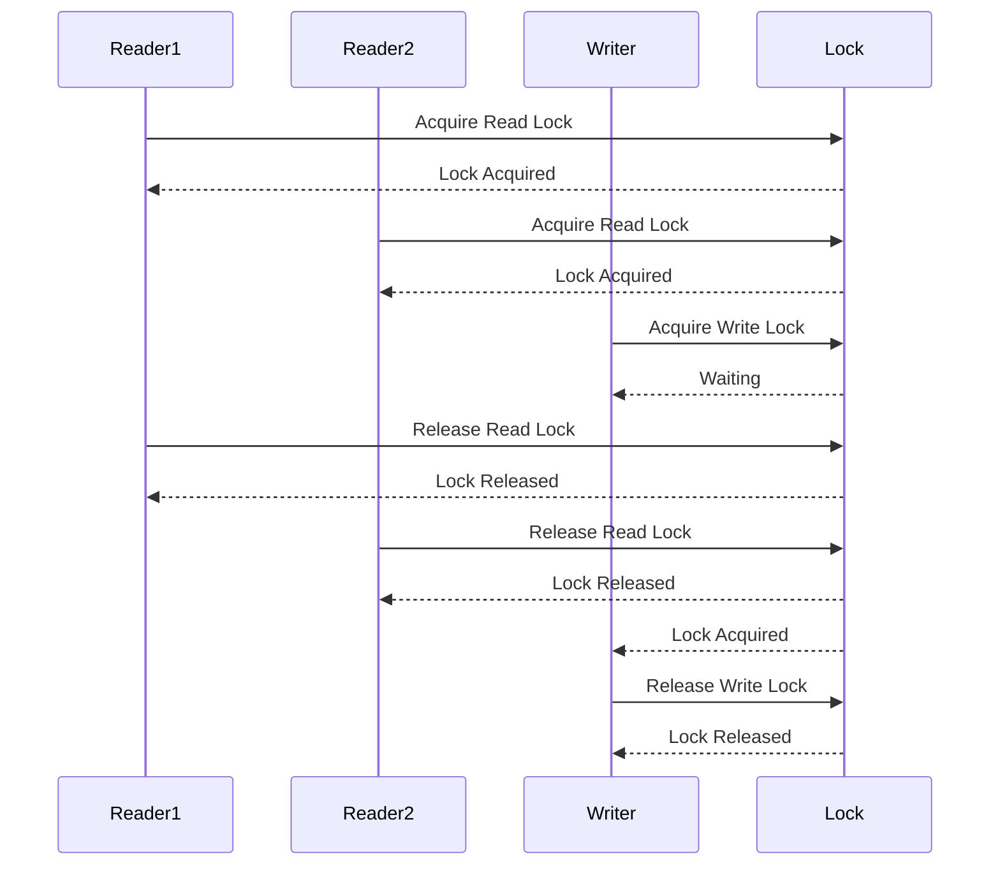

## 6.5.1 Implementing Read-Write Lock in Java

In this section, we delve into the implementation of the Read-Write Lock pattern in Java, a crucial concept for managing concurrent access to shared resources. We'll explore the `ReadWriteLock` interface and its primary implementation, `ReentrantReadWriteLock`, and demonstrate how to effectively use these tools to balance read and write operations in a multithreaded environment.

### Understanding Read-Write Locks

Read-Write Locks are a synchronization mechanism that allows multiple threads to read a shared resource concurrently while restricting write access to a single thread at a time. This approach is beneficial in scenarios where read operations are more frequent than write operations, as it maximizes concurrency and improves performance.

#### The `ReadWriteLock` Interface

The `ReadWriteLock` interface, part of the `java.util.concurrent.locks` package, provides two locks: a read lock and a write lock. These locks are designed to allow multiple threads to read the resource simultaneously, but only one thread can write to the resource at any given time.

- **Read Lock**: Allows multiple threads to acquire the lock simultaneously, provided no thread has acquired the write lock.
- **Write Lock**: Allows only one thread to acquire the lock, blocking all other threads, including those attempting to acquire the read lock.

#### The `ReentrantReadWriteLock` Class

The `ReentrantReadWriteLock` class is the most commonly used implementation of the `ReadWriteLock` interface. It supports both fair and non-fair lock acquisition modes:

- **Fair Mode**: Threads acquire locks in the order they requested them, preventing starvation.
- **Non-Fair Mode**: Threads may acquire locks out of order, which can lead to higher throughput but may cause starvation.

### Acquiring and Releasing Locks

To use a `ReentrantReadWriteLock`, you need to acquire and release the read and write locks appropriately. Let's explore how to do this with code examples.

#### Acquiring and Releasing Read Locks

To acquire a read lock, use the `readLock()` method. Always release the lock in a `finally` block to ensure it is released even if an exception occurs.

```java
import java.util.concurrent.locks.ReentrantReadWriteLock;
import java.util.concurrent.locks.Lock;

public class SharedResource {
    private final ReentrantReadWriteLock rwLock = new ReentrantReadWriteLock();
    private final Lock readLock = rwLock.readLock();

    public void read() {
        readLock.lock();
        try {
            // Perform read operations
            System.out.println("Reading data...");
        } finally {
            readLock.unlock();
        }
    }
}
```

#### Acquiring and Releasing Write Locks

Similarly, acquire a write lock using the `writeLock()` method and release it in a `finally` block.

```java
import java.util.concurrent.locks.Lock;

public class SharedResource {
    private final ReentrantReadWriteLock rwLock = new ReentrantReadWriteLock();
    private final Lock writeLock = rwLock.writeLock();

    public void write() {
        writeLock.lock();
        try {
            // Perform write operations
            System.out.println("Writing data...");
        } finally {
            writeLock.unlock();
        }
    }
}
```

### Practical Example: Read-Write Lock in Action

Let's consider a practical example where a shared resource, such as a database, is accessed by multiple threads. We'll implement a simple system where multiple threads read data, and occasionally, a thread writes data.

```java
import java.util.concurrent.locks.ReentrantReadWriteLock;
import java.util.concurrent.locks.Lock;
import java.util.ArrayList;
import java.util.List;

public class Database {
    private final List<String> data = new ArrayList<>();
    private final ReentrantReadWriteLock rwLock = new ReentrantReadWriteLock();
    private final Lock readLock = rwLock.readLock();
    private final Lock writeLock = rwLock.writeLock();

    public void readData() {
        readLock.lock();
        try {
            System.out.println("Reading data: " + data);
        } finally {
            readLock.unlock();
        }
    }

    public void writeData(String value) {
        writeLock.lock();
        try {
            data.add(value);
            System.out.println("Writing data: " + value);
        } finally {
            writeLock.unlock();
        }
    }

    public static void main(String[] args) {
        Database database = new Database();

        // Simulate multiple readers
        Runnable readTask = () -> {
            for (int i = 0; i < 5; i++) {
                database.readData();
                try {
                    Thread.sleep(100);
                } catch (InterruptedException e) {
                    Thread.currentThread().interrupt();
                }
            }
        };

        // Simulate a writer
        Runnable writeTask = () -> {
            for (int i = 0; i < 5; i++) {
                database.writeData("Value " + i);
                try {
                    Thread.sleep(150);
                } catch (InterruptedException e) {
                    Thread.currentThread().interrupt();
                }
            }
        };

        Thread reader1 = new Thread(readTask);
        Thread reader2 = new Thread(readTask);
        Thread writer = new Thread(writeTask);

        reader1.start();
        reader2.start();
        writer.start();
    }
}
```

### Best Practices for Using Read-Write Locks

1. **Minimize Lock Hold Times**: Keep the code within the lock as short as possible to reduce contention and improve performance.
2. **Avoid Nested Locks**: Nested locks can lead to deadlocks. If unavoidable, ensure a consistent locking order.
3. **Use Fair Locks Judiciously**: While fair locks prevent starvation, they may reduce throughput. Assess the trade-offs based on your application's needs.
4. **Handle Interruptions Gracefully**: Be prepared to handle `InterruptedException` and ensure locks are released in such cases.
5. **Monitor Lock Usage**: Use monitoring tools to detect contention and optimize lock usage.

### Considerations for Fairness and Starvation

Fairness in lock acquisition can prevent starvation, where a thread is perpetually denied access to a resource. However, fair locks may lead to reduced throughput due to increased context switching. Consider the following:

- **Fair Mode**: Use when starvation is a concern, such as in systems with critical write operations.
- **Non-Fair Mode**: Use when higher throughput is desired, and starvation is less of a concern.

### Error Handling and Ensuring Lock Release

Always release locks in a `finally` block to ensure they are released even if an exception occurs. This practice prevents deadlocks and resource leaks.

```java
public void safeWriteData(String value) {
    writeLock.lock();
    try {
        // Perform write operations
    } catch (Exception e) {
        // Handle exception
    } finally {
        writeLock.unlock();
    }
}
```

### Try It Yourself

Experiment with the code examples provided. Try modifying the number of reader and writer threads or changing the sleep durations to observe how the system behaves under different conditions. This hands-on approach will deepen your understanding of read-write locks and their impact on concurrency.

### Visualizing Read-Write Lock Mechanism

To better understand the flow of acquiring and releasing locks, let's visualize the process using a sequence diagram.



### Summary

Implementing Read-Write Locks in Java using `ReentrantReadWriteLock` is a powerful way to manage concurrent access to shared resources. By allowing multiple readers and a single writer, you can optimize performance in read-heavy applications. Remember to follow best practices, handle errors gracefully, and choose the appropriate fairness mode for your needs.

## Quiz Time!



### What is the primary benefit of using a Read-Write Lock?

- [x] It allows multiple threads to read a resource concurrently while restricting write access to one thread.
- [ ] It allows multiple threads to write to a resource concurrently.
- [ ] It prevents all threads from accessing a resource simultaneously.
- [ ] It eliminates the need for synchronization in multithreaded applications.

> **Explanation:** The primary benefit of a Read-Write Lock is that it allows concurrent read access while ensuring exclusive write access, optimizing performance in read-heavy scenarios.

### Which method is used to acquire a read lock in `ReentrantReadWriteLock`?

- [x] `readLock()`
- [ ] `writeLock()`
- [ ] `lock()`
- [ ] `unlock()`

> **Explanation:** The `readLock()` method is used to acquire a read lock in `ReentrantReadWriteLock`.

### What is a potential downside of using fair locks?

- [x] Reduced throughput due to increased context switching.
- [ ] Increased risk of deadlocks.
- [ ] Starvation of write operations.
- [ ] Lack of synchronization.

> **Explanation:** Fair locks can reduce throughput because they increase context switching, ensuring that threads acquire locks in the order they requested them.

### Why should locks be released in a `finally` block?

- [x] To ensure locks are released even if an exception occurs.
- [ ] To improve performance.
- [ ] To prevent deadlocks.
- [ ] To increase lock acquisition speed.

> **Explanation:** Releasing locks in a `finally` block ensures they are released even if an exception occurs, preventing deadlocks and resource leaks.

### What is the difference between fair and non-fair modes in `ReentrantReadWriteLock`?

- [x] Fair mode ensures threads acquire locks in the order they requested them, while non-fair mode does not.
- [ ] Fair mode allows multiple writers, while non-fair mode does not.
- [ ] Fair mode eliminates the need for read locks, while non-fair mode does not.
- [ ] Fair mode is faster than non-fair mode.

> **Explanation:** Fair mode ensures threads acquire locks in the order they requested them, preventing starvation, while non-fair mode may allow out-of-order acquisition for higher throughput.

### What is a common use case for Read-Write Locks?

- [x] Managing concurrent access to a shared resource with frequent reads and infrequent writes.
- [ ] Allowing multiple threads to write to a resource simultaneously.
- [ ] Preventing all threads from accessing a resource.
- [ ] Eliminating the need for synchronization.

> **Explanation:** Read-Write Locks are commonly used to manage concurrent access to a shared resource with frequent reads and infrequent writes, optimizing performance.

### Which class implements the `ReadWriteLock` interface in Java?

- [x] `ReentrantReadWriteLock`
- [ ] `ReentrantLock`
- [ ] `Semaphore`
- [ ] `CountDownLatch`

> **Explanation:** The `ReentrantReadWriteLock` class is the primary implementation of the `ReadWriteLock` interface in Java.

### How can you prevent starvation of write operations in a Read-Write Lock?

- [x] Use fair mode to ensure threads acquire locks in the order they requested them.
- [ ] Use non-fair mode to increase throughput.
- [ ] Avoid using read locks.
- [ ] Increase the number of writer threads.

> **Explanation:** Using fair mode ensures threads acquire locks in the order they requested them, preventing starvation of write operations.

### What is the purpose of the `writeLock()` method?

- [x] To acquire a write lock for exclusive access to a resource.
- [ ] To acquire a read lock for concurrent access to a resource.
- [ ] To release a write lock.
- [ ] To release a read lock.

> **Explanation:** The `writeLock()` method is used to acquire a write lock, allowing exclusive access to a resource.

### True or False: Read-Write Locks eliminate the need for synchronization in multithreaded applications.

- [ ] True
- [x] False

> **Explanation:** False. Read-Write Locks do not eliminate the need for synchronization; they provide a mechanism for managing concurrent access to shared resources.



Remember, mastering concurrency patterns like Read-Write Locks is a journey. Keep experimenting, stay curious, and enjoy the process of building robust, efficient multithreaded applications!
