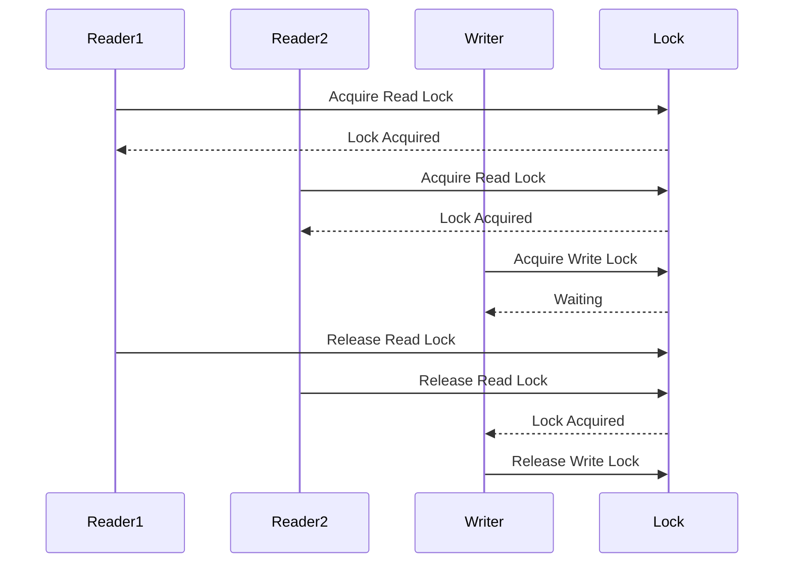

## 6.5.2 Optimizing Concurrent Access

In the realm of concurrent programming, optimizing access to shared resources is crucial for achieving high performance and scalability. The Read-Write Lock pattern is a powerful tool in this regard, especially in read-heavy environments. This section delves into strategies for enhancing performance using Read-Write Locks, providing insights into tuning lock settings, analyzing application patterns, and exploring alternative approaches.

### Understanding Read-Write Locks

Before we dive into optimization strategies, let's briefly revisit the concept of Read-Write Locks. Unlike a traditional lock, which allows only one thread to access a resource at a time, a Read-Write Lock distinguishes between read and write operations. It allows multiple threads to read a resource concurrently while ensuring exclusive access for write operations. This distinction can significantly improve throughput in scenarios where reads vastly outnumber writes.

### Enhancing Throughput with Concurrent Reads

One of the primary benefits of Read-Write Locks is the ability to allow multiple concurrent reads. In applications where read operations are frequent and write operations are rare, this can lead to substantial performance gains.

#### Code Example: Implementing Read-Write Lock

Let's consider a simple example where we use a `ReentrantReadWriteLock` from the `java.util.concurrent.locks` package to manage access to a shared resource.

```java
import java.util.concurrent.locks.ReentrantReadWriteLock;

public class SharedResource {
    private final ReentrantReadWriteLock rwLock = new ReentrantReadWriteLock();
    private int data = 0;

    public int readData() {
        rwLock.readLock().lock();
        try {
            return data;
        } finally {
            rwLock.readLock().unlock();
        }
    }

    public void writeData(int newData) {
        rwLock.writeLock().lock();
        try {
            data = newData;
        } finally {
            rwLock.writeLock().unlock();
        }
    }
}
```

In this example, the `readData` method acquires a read lock, allowing multiple threads to read the `data` concurrently. The `writeData` method acquires a write lock, ensuring exclusive access when modifying the `data`.

### Tuning Read-Write Lock Settings

To maximize the benefits of Read-Write Locks, it's essential to tune their settings according to your application's specific needs. One such setting is the fairness policy.

#### Fairness Policy

The fairness policy determines the order in which threads acquire locks. A fair lock grants access to threads in the order they requested it, which can prevent starvation. However, it may reduce throughput due to increased context switching. An unfair lock, on the other hand, may lead to higher throughput but can cause starvation, where some threads wait indefinitely.

```java
ReentrantReadWriteLock rwLock = new ReentrantReadWriteLock(true); // Fair lock
```

In the above code, setting the constructor parameter to `true` enables the fairness policy. Experiment with both fair and unfair locks to determine which provides better performance for your application.

### Analyzing Application Patterns

To decide whether Read-Write Locks will benefit your application, analyze the patterns of read and write operations. Consider the following factors:

- **Read-to-Write Ratio**: If reads significantly outnumber writes, Read-Write Locks can improve performance by allowing concurrent reads.
- **Write Contention**: High contention for write locks can negate the benefits of concurrent reads. Analyze whether write operations are a bottleneck.
- **Access Patterns**: Consider the frequency and distribution of read and write operations. Bursty writes or frequent writes may reduce the effectiveness of Read-Write Locks.

### Potential Issues with Read-Write Locks

While Read-Write Locks can enhance performance, they are not without potential pitfalls. One such issue is write lock contention.

#### Write Lock Contention

Write lock contention occurs when multiple threads compete for the write lock, leading to delays and reduced throughput. This is particularly problematic in applications with frequent write operations.

To mitigate write lock contention, consider the following strategies:

- **Batching Writes**: Accumulate changes and apply them in a single write operation to reduce the frequency of writes.
- **Optimistic Locking**: Allow reads without acquiring a lock and validate data before writing. If data has changed, retry the operation.

### Alternative Approaches

If Read-Write Locks do not yield the expected performance improvements, consider alternative approaches:

#### StampedLock

The `StampedLock` class, introduced in Java 8, offers an alternative to traditional Read-Write Locks. It provides three modes: read, write, and optimistic read. The optimistic read mode allows reads without acquiring a lock, improving performance in read-heavy scenarios.

```java
import java.util.concurrent.locks.StampedLock;

public class OptimisticReadExample {
    private final StampedLock stampedLock = new StampedLock();
    private int data = 0;

    public int readData() {
        long stamp = stampedLock.tryOptimisticRead();
        int currentData = data;
        if (!stampedLock.validate(stamp)) {
            stamp = stampedLock.readLock();
            try {
                currentData = data;
            } finally {
                stampedLock.unlockRead(stamp);
            }
        }
        return currentData;
    }

    public void writeData(int newData) {
        long stamp = stampedLock.writeLock();
        try {
            data = newData;
        } finally {
            stampedLock.unlockWrite(stamp);
        }
    }
}
```

In this example, the `readData` method uses an optimistic read, which is validated before returning the data. If the validation fails, it falls back to acquiring a read lock.

#### Lock-Free Data Structures

For certain applications, lock-free data structures can provide superior performance by avoiding locks altogether. These structures use atomic operations to ensure thread safety without the overhead of locks.

### Visualizing Read-Write Lock Mechanism

To better understand the Read-Write Lock mechanism, let's visualize it using a sequence diagram.



This diagram illustrates how multiple readers can acquire the read lock simultaneously, while a writer must wait for all readers to release the lock before acquiring the write lock.

### Try It Yourself

To gain hands-on experience with Read-Write Locks, try modifying the code examples provided:

- **Experiment with Fairness**: Toggle the fairness policy and observe its impact on performance.
- **Implement Batching**: Modify the `writeData` method to batch multiple updates into a single write operation.
- **Use StampedLock**: Replace the `ReentrantReadWriteLock` with `StampedLock` and compare performance in read-heavy scenarios.

### Knowledge Check

- **Question**: What is the primary advantage of using Read-Write Locks in read-heavy environments?
- **Challenge**: Implement a lock-free data structure for a simple use case and compare its performance with a Read-Write Lock implementation.

### Conclusion

Optimizing concurrent access with Read-Write Locks requires a careful analysis of application patterns and tuning of lock settings. While they can significantly improve performance in read-heavy environments, it's essential to be aware of potential issues such as write lock contention. By exploring alternative approaches like `StampedLock` and lock-free data structures, you can further enhance concurrency and scalability.

Remember, this is just the beginning. As you progress, you'll build more complex and interactive systems. Keep experimenting, stay curious, and enjoy the journey!

## Quiz Time!



### What is the primary benefit of using Read-Write Locks in read-heavy environments?

- [x] Allowing multiple concurrent reads
- [ ] Reducing write operation time
- [ ] Simplifying code complexity
- [ ] Eliminating the need for synchronization

> **Explanation:** Read-Write Locks allow multiple threads to read a resource concurrently, which is beneficial in read-heavy environments.

### How can fairness policy affect the performance of Read-Write Locks?

- [x] It can prevent starvation but may reduce throughput
- [ ] It always increases throughput
- [ ] It has no impact on performance
- [ ] It only affects write operations

> **Explanation:** A fair lock prevents starvation by granting access in the order requested, but it may reduce throughput due to increased context switching.

### What is a potential issue with Read-Write Locks in write-heavy environments?

- [x] Write lock contention
- [ ] Increased read operation time
- [ ] Deadlock
- [ ] Starvation of read operations

> **Explanation:** Write lock contention occurs when multiple threads compete for the write lock, leading to delays and reduced throughput.

### Which alternative to Read-Write Locks allows for optimistic reads?

- [x] StampedLock
- [ ] ReentrantLock
- [ ] Semaphore
- [ ] CountDownLatch

> **Explanation:** `StampedLock` provides an optimistic read mode, allowing reads without acquiring a lock.

### What is the role of the fairness policy in Read-Write Locks?

- [x] To determine the order of lock acquisition
- [ ] To increase the speed of read operations
- [ ] To ensure write operations are prioritized
- [ ] To eliminate the need for locks

> **Explanation:** The fairness policy determines the order in which threads acquire locks, affecting the likelihood of starvation and throughput.

### How can batching writes help mitigate write lock contention?

- [x] By reducing the frequency of write operations
- [ ] By increasing the number of write locks
- [ ] By prioritizing write operations
- [ ] By eliminating read operations

> **Explanation:** Batching writes accumulates changes and applies them in a single operation, reducing the frequency of write operations and contention.

### What is a key advantage of using lock-free data structures?

- [x] Avoiding the overhead of locks
- [ ] Simplifying code complexity
- [ ] Ensuring fairness in access
- [ ] Reducing read operation time

> **Explanation:** Lock-free data structures use atomic operations to ensure thread safety without the overhead of locks.

### Which Java class provides an alternative to traditional Read-Write Locks with three modes?

- [x] StampedLock
- [ ] ReentrantReadWriteLock
- [ ] Semaphore
- [ ] CountDownLatch

> **Explanation:** `StampedLock` offers read, write, and optimistic read modes, providing flexibility in concurrent access.

### What should be considered when analyzing application patterns for Read-Write Locks?

- [x] Read-to-Write Ratio
- [ ] Code complexity
- [ ] Number of threads
- [ ] Network latency

> **Explanation:** The Read-to-Write Ratio helps determine if Read-Write Locks will benefit performance by allowing concurrent reads.

### True or False: Fair locks always improve performance in concurrent applications.

- [ ] True
- [x] False

> **Explanation:** Fair locks prevent starvation but may reduce throughput due to increased context switching, so they don't always improve performance.


