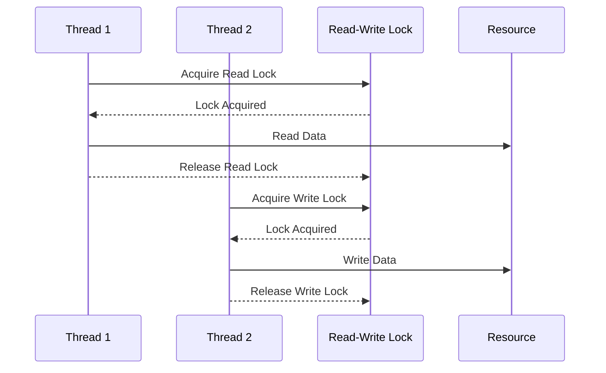

## 6.5.3 Use Cases and Examples

In the realm of concurrent programming, the Read-Write Lock pattern is a powerful tool that allows multiple threads to read a resource simultaneously while ensuring exclusive access for write operations. This pattern is particularly useful in scenarios where read operations vastly outnumber write operations, thereby enhancing performance and responsiveness. Let's delve into some practical use cases and examples to understand how the Read-Write Lock pattern can be effectively applied in Java.

### Understanding the Read-Write Lock Pattern

Before we explore specific use cases, it's crucial to understand the fundamental concept of the Read-Write Lock pattern. This pattern is designed to handle situations where a resource is frequently read but infrequently modified. By allowing multiple threads to read the resource concurrently, the pattern improves throughput and reduces contention. However, when a write operation is necessary, it ensures exclusive access to maintain data integrity.

In Java, the `ReadWriteLock` interface, along with its `ReentrantReadWriteLock` implementation, provides a robust mechanism to implement this pattern. The `ReadWriteLock` interface defines two locks: one for read operations and another for write operations. The `ReentrantReadWriteLock` class offers a fair and efficient way to manage these locks, ensuring that read and write requests are handled appropriately.

### Use Case 1: Caching Systems

Caching systems are a quintessential example of where the Read-Write Lock pattern shines. In a typical caching scenario, data is read frequently but updated only occasionally. By employing a read-write lock, we can allow multiple threads to access the cache concurrently for read operations, significantly boosting performance.

#### Code Example: Implementing a Cache with Read-Write Lock

Let's consider a simple cache implementation using the `ReentrantReadWriteLock`:

```java
import java.util.concurrent.locks.ReentrantReadWriteLock;
import java.util.HashMap;
import java.util.Map;

public class Cache<K, V> {
    private final Map<K, V> cache = new HashMap<>();
    private final ReentrantReadWriteLock lock = new ReentrantReadWriteLock();
    private final ReentrantReadWriteLock.ReadLock readLock = lock.readLock();
    private final ReentrantReadWriteLock.WriteLock writeLock = lock.writeLock();

    public V get(K key) {
        readLock.lock();
        try {
            return cache.get(key);
        } finally {
            readLock.unlock();
        }
    }

    public void put(K key, V value) {
        writeLock.lock();
        try {
            cache.put(key, value);
        } finally {
            writeLock.unlock();
        }
    }

    public void remove(K key) {
        writeLock.lock();
        try {
            cache.remove(key);
        } finally {
            writeLock.unlock();
        }
    }
}
```

In this example, the `Cache` class uses a `HashMap` to store key-value pairs. The `get` method acquires a read lock, allowing multiple threads to read from the cache concurrently. The `put` and `remove` methods acquire a write lock, ensuring exclusive access during updates.

#### Benefits

- **Increased Concurrency**: Multiple threads can read from the cache simultaneously, improving throughput.
- **Data Integrity**: Write operations are synchronized, preventing data corruption.

### Use Case 2: Shared Configuration Data Structure

In many applications, configuration data is accessed by multiple threads but updated infrequently. Using a read-write lock, we can optimize access to this shared data structure, ensuring that configuration reads do not block each other.

#### Code Example: Shared Configuration with Read-Write Lock

Consider a scenario where multiple threads need to access application configuration settings:

```java
import java.util.concurrent.locks.ReentrantReadWriteLock;
import java.util.HashMap;
import java.util.Map;

public class Configuration {
    private final Map<String, String> settings = new HashMap<>();
    private final ReentrantReadWriteLock lock = new ReentrantReadWriteLock();
    private final ReentrantReadWriteLock.ReadLock readLock = lock.readLock();
    private final ReentrantReadWriteLock.WriteLock writeLock = lock.writeLock();

    public String getSetting(String key) {
        readLock.lock();
        try {
            return settings.get(key);
        } finally {
            readLock.unlock();
        }
    }

    public void updateSetting(String key, String value) {
        writeLock.lock();
        try {
            settings.put(key, value);
        } finally {
            writeLock.unlock();
        }
    }
}
```

Here, the `Configuration` class manages application settings. The `getSetting` method allows concurrent reads, while the `updateSetting` method ensures exclusive access for updates.

#### Benefits

- **Responsiveness**: Configuration reads are non-blocking, enhancing application responsiveness.
- **Consistency**: Updates are synchronized, ensuring consistent configuration data.

### Use Case 3: File Systems and Databases

File systems and databases often involve scenarios where read operations are predominant. By employing read-write locks, we can optimize access to these resources, allowing multiple read operations to proceed concurrently.

#### Code Example: Simulating a File System with Read-Write Lock

Let's simulate a simple file system where files are read frequently but written infrequently:

```java
import java.util.concurrent.locks.ReentrantReadWriteLock;
import java.util.HashMap;
import java.util.Map;

public class FileSystem {
    private final Map<String, String> files = new HashMap<>();
    private final ReentrantReadWriteLock lock = new ReentrantReadWriteLock();
    private final ReentrantReadWriteLock.ReadLock readLock = lock.readLock();
    private final ReentrantReadWriteLock.WriteLock writeLock = lock.writeLock();

    public String readFile(String fileName) {
        readLock.lock();
        try {
            return files.get(fileName);
        } finally {
            readLock.unlock();
        }
    }

    public void writeFile(String fileName, String content) {
        writeLock.lock();
        try {
            files.put(fileName, content);
        } finally {
            writeLock.unlock();
        }
    }
}
```

In this `FileSystem` class, the `readFile` method allows concurrent reads, while the `writeFile` method ensures exclusive access for writes.

#### Benefits

- **Scalability**: The system can handle a large number of concurrent read requests efficiently.
- **Data Integrity**: Write operations are synchronized, preventing data corruption.

### Visualizing the Read-Write Lock Pattern

To better understand the flow of the Read-Write Lock pattern, let's visualize the interactions between threads and locks using a sequence diagram.



### Benefits of Using Read-Write Locks

The Read-Write Lock pattern offers several advantages in scenarios where read operations dominate:

- **Increased Concurrency**: By allowing multiple threads to read concurrently, the pattern enhances throughput and reduces contention.
- **Improved Responsiveness**: Non-blocking read operations lead to faster response times in read-heavy applications.
- **Data Integrity**: Write operations are synchronized, ensuring that data remains consistent and uncorrupted.

### Considerations and Best Practices

While the Read-Write Lock pattern offers significant benefits, it's essential to consider the following best practices:

- **Avoid Starvation**: Ensure that write operations are not starved by continuous read operations. Implement fair locking strategies if necessary.
- **Monitor Performance**: Regularly monitor the performance of your application to ensure that the read-write lock is providing the expected benefits.
- **Optimize Lock Granularity**: Consider the granularity of your locks. Fine-grained locks can improve concurrency but may increase complexity.

### Try It Yourself

To gain hands-on experience with the Read-Write Lock pattern, try modifying the code examples provided above. Experiment with different scenarios, such as increasing the number of concurrent threads or introducing delays in read and write operations. Observe how the pattern affects performance and responsiveness.

### Conclusion

The Read-Write Lock pattern is a valuable tool for optimizing read-heavy applications. By allowing multiple threads to read concurrently while ensuring exclusive access for writes, this pattern enhances performance and responsiveness. Whether you're implementing a caching system, managing shared configuration data, or optimizing file system access, the Read-Write Lock pattern can help you achieve your concurrency goals.

Remember, this is just the beginning. As you continue to explore concurrency patterns, you'll discover new ways to optimize your applications and improve their performance. Keep experimenting, stay curious, and enjoy the journey!

## Quiz Time!



### What is the primary advantage of using a Read-Write Lock pattern?

- [x] It allows multiple threads to read a resource simultaneously.
- [ ] It allows multiple threads to write to a resource simultaneously.
- [ ] It prevents all threads from accessing a resource.
- [ ] It only allows one thread to read or write at a time.

> **Explanation:** The Read-Write Lock pattern allows multiple threads to read a resource simultaneously, enhancing concurrency in read-heavy scenarios.


### In which scenario is a Read-Write Lock most beneficial?

- [x] When read operations vastly outnumber write operations.
- [ ] When write operations vastly outnumber read operations.
- [ ] When read and write operations are equal.
- [ ] When no operations are performed.

> **Explanation:** A Read-Write Lock is most beneficial when read operations vastly outnumber write operations, allowing for increased concurrency.


### What does the `ReentrantReadWriteLock` class in Java provide?

- [x] A fair and efficient way to manage read and write locks.
- [ ] A mechanism to lock only write operations.
- [ ] A way to prevent all threads from accessing a resource.
- [ ] A method to allow only one thread to read or write.

> **Explanation:** The `ReentrantReadWriteLock` class provides a fair and efficient way to manage read and write locks, allowing for concurrent reads and exclusive writes.


### How does the Read-Write Lock pattern improve performance in caching systems?

- [x] By allowing multiple threads to read from the cache concurrently.
- [ ] By allowing multiple threads to write to the cache concurrently.
- [ ] By preventing any thread from accessing the cache.
- [ ] By allowing only one thread to read or write at a time.

> **Explanation:** The Read-Write Lock pattern improves performance in caching systems by allowing multiple threads to read from the cache concurrently.


### What is a potential drawback of using Read-Write Locks?

- [x] Write operations may be starved by continuous read operations.
- [ ] Read operations may be starved by continuous write operations.
- [ ] All operations are blocked indefinitely.
- [ ] It prevents all threads from accessing a resource.

> **Explanation:** A potential drawback of using Read-Write Locks is that write operations may be starved by continuous read operations, leading to potential delays.


### What should you consider when implementing Read-Write Locks?

- [x] Avoiding starvation of write operations.
- [ ] Allowing all operations to proceed simultaneously.
- [ ] Preventing all threads from accessing a resource.
- [ ] Allowing only one thread to read or write at a time.

> **Explanation:** When implementing Read-Write Locks, it's important to avoid starvation of write operations to ensure data integrity and performance.


### Which Java interface provides the mechanism for Read-Write Locks?

- [x] `ReadWriteLock`
- [ ] `Lock`
- [ ] `Semaphore`
- [ ] `Mutex`

> **Explanation:** The `ReadWriteLock` interface provides the mechanism for implementing Read-Write Locks in Java.


### What is the role of the `ReadLock` in a Read-Write Lock pattern?

- [x] It allows multiple threads to read a resource concurrently.
- [ ] It allows multiple threads to write to a resource concurrently.
- [ ] It prevents all threads from accessing a resource.
- [ ] It only allows one thread to read or write at a time.

> **Explanation:** The `ReadLock` in a Read-Write Lock pattern allows multiple threads to read a resource concurrently, enhancing concurrency.


### How does the Read-Write Lock pattern ensure data integrity?

- [x] By synchronizing write operations to prevent data corruption.
- [ ] By allowing multiple threads to write to a resource simultaneously.
- [ ] By preventing all threads from accessing a resource.
- [ ] By allowing only one thread to read or write at a time.

> **Explanation:** The Read-Write Lock pattern ensures data integrity by synchronizing write operations, preventing data corruption.


### True or False: The Read-Write Lock pattern is beneficial in scenarios where write operations vastly outnumber read operations.

- [ ] True
- [x] False

> **Explanation:** False. The Read-Write Lock pattern is beneficial in scenarios where read operations vastly outnumber write operations, allowing for increased concurrency.




