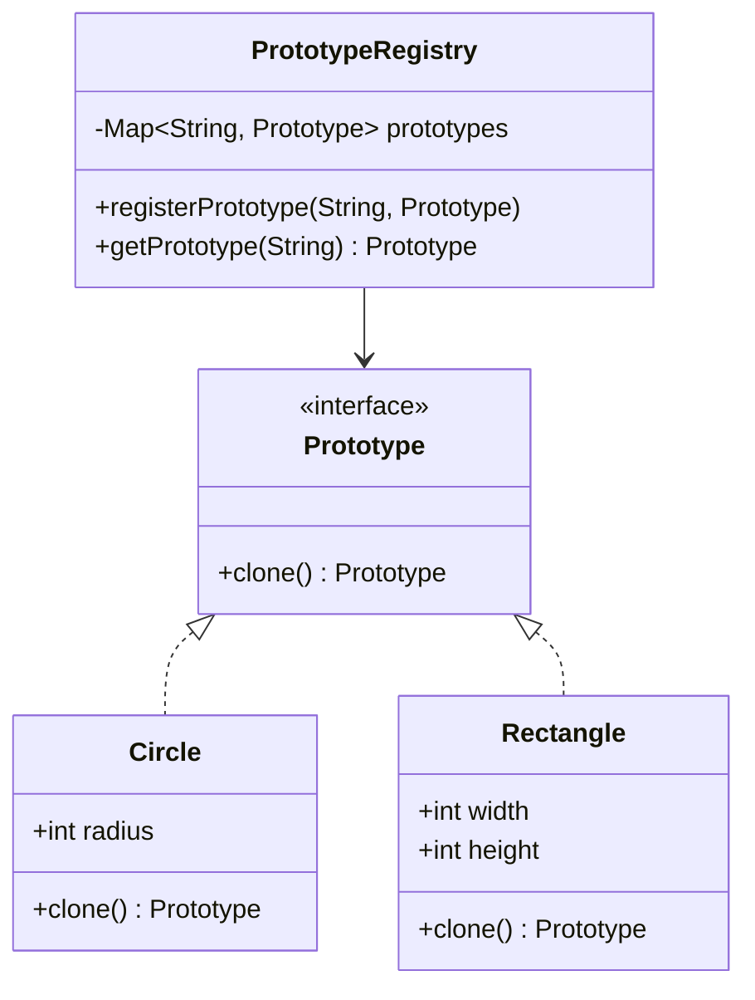

## 6.5.3 Prototype Registry

The Prototype Registry is a sophisticated extension of the Prototype Pattern, a creational design pattern that focuses on creating new objects by copying existing ones, known as prototypes. This registry acts as a centralized repository for managing prototypes, allowing developers to efficiently clone objects without the need for subclassing or complex instantiation logic. By leveraging a prototype registry, Java developers can streamline object creation, enhance performance, and simplify code maintenance.

### Understanding the Prototype Registry

#### How a Prototype Registry Works

A Prototype Registry is essentially a collection of pre-configured prototype instances. These prototypes are stored in a registry, which can be queried to retrieve and clone the desired prototype. This approach abstracts the instantiation process, enabling developers to create new objects by simply cloning a prototype from the registry.

The registry typically maintains a mapping between unique identifiers (such as strings or enums) and prototype instances. When a new object is needed, the registry is queried with the identifier, and the corresponding prototype is cloned to produce a new instance.

#### Benefits of Centralizing Prototype Management

Centralizing prototype management through a registry offers several advantages:

1. **Efficiency**: Cloning objects is generally faster than creating them from scratch, especially for complex objects with numerous configurations.

2. **Consistency**: By using a centralized registry, all instances of a particular type are created from the same prototype, ensuring consistency across the application.

3. **Flexibility**: The registry can be easily updated to include new prototypes or modify existing ones, providing flexibility in managing object creation.

4. **Simplified Code**: The registry abstracts the instantiation logic, reducing the complexity of the client code and making it easier to maintain.

5. **Reduced Dependency**: Clients are decoupled from the concrete classes of the objects they create, relying instead on the registry to provide the necessary instances.

### Implementing a Prototype Registry in Java

To implement a Prototype Registry in Java, follow these steps:

1. **Define the Prototype Interface**: Create an interface that declares the `clone` method. This interface will be implemented by all prototype classes.

2. **Implement Concrete Prototypes**: Develop concrete classes that implement the prototype interface and provide a concrete implementation of the `clone` method.

3. **Create the Prototype Registry**: Develop a registry class that maintains a collection of prototypes. This class should provide methods to register, retrieve, and clone prototypes.

4. **Use the Registry**: In the client code, use the registry to obtain and clone prototypes as needed.

#### Example: Implementing a Prototype Registry

Below is an example of implementing a Prototype Registry in Java:

```java
// Step 1: Define the Prototype Interface
interface Prototype {
    Prototype clone();
}

// Step 2: Implement Concrete Prototypes
class Circle implements Prototype {
    private int radius;

    public Circle(int radius) {
        this.radius = radius;
    }

    @Override
    public Prototype clone() {
        return new Circle(this.radius);
    }

    @Override
    public String toString() {
        return "Circle with radius: " + radius;
    }
}

class Rectangle implements Prototype {
    private int width;
    private int height;

    public Rectangle(int width, int height) {
        this.width = width;
        this.height = height;
    }

    @Override
    public Prototype clone() {
        return new Rectangle(this.width, this.height);
    }

    @Override
    public String toString() {
        return "Rectangle with width: " + width + " and height: " + height;
    }
}

// Step 3: Create the Prototype Registry
class PrototypeRegistry {
    private Map<String, Prototype> prototypes = new HashMap<>();

    public void registerPrototype(String key, Prototype prototype) {
        prototypes.put(key, prototype);
    }

    public Prototype getPrototype(String key) {
        Prototype prototype = prototypes.get(key);
        return prototype != null ? prototype.clone() : null;
    }
}

// Step 4: Use the Registry
public class PrototypeRegistryDemo {
    public static void main(String[] args) {
        PrototypeRegistry registry = new PrototypeRegistry();

        // Register prototypes
        registry.registerPrototype("smallCircle", new Circle(5));
        registry.registerPrototype("largeRectangle", new Rectangle(20, 30));

        // Clone prototypes
        Prototype clonedCircle = registry.getPrototype("smallCircle");
        Prototype clonedRectangle = registry.getPrototype("largeRectangle");

        System.out.println(clonedCircle);
        System.out.println(clonedRectangle);
    }
}
```

**Explanation**: In this example, the `Prototype` interface defines the `clone` method, which is implemented by the `Circle` and `Rectangle` classes. The `PrototypeRegistry` class maintains a map of prototypes and provides methods to register and retrieve them. The `PrototypeRegistryDemo` class demonstrates how to use the registry to clone prototypes.

### Scenarios Where a Registry Simplifies Object Creation

The Prototype Registry is particularly useful in scenarios where:

- **Complex Object Initialization**: When objects require complex initialization logic, a registry can simplify the process by providing pre-configured prototypes.

- **Performance Optimization**: In performance-critical applications, cloning objects from a registry can be more efficient than creating them from scratch.

- **Dynamic Object Creation**: In applications where the types of objects to be created are not known at compile time, a registry allows for dynamic object creation based on runtime conditions.

- **Configuration Management**: When objects need to be configured differently based on the environment or user preferences, a registry can manage multiple configurations and provide the appropriate prototype.

### Visualizing the Prototype Registry

To better understand the structure and interactions within a Prototype Registry, consider the following class diagram:



**Caption**: This diagram illustrates the structure of a Prototype Registry, showing the relationships between the `Prototype` interface, concrete prototype classes (`Circle` and `Rectangle`), and the `PrototypeRegistry` class.

### Best Practices and Considerations

When implementing a Prototype Registry, consider the following best practices:

- **Ensure Deep Cloning**: When cloning prototypes, ensure that a deep copy is made to avoid unintended sharing of mutable objects.

- **Manage Prototype Lifecycle**: Regularly update and manage the prototypes in the registry to reflect changes in requirements or configurations.

- **Handle Null Prototypes**: Implement error handling for cases where a requested prototype is not found in the registry.

- **Optimize for Performance**: Profile and optimize the cloning process to ensure it meets performance requirements, especially in high-load scenarios.

- **Document Prototype Usage**: Clearly document the purpose and configuration of each prototype to facilitate maintenance and updates.

### Related Patterns

The Prototype Registry is closely related to other creational patterns, such as:

- **[Factory Method Pattern]( "Factory Method Pattern")**: Both patterns abstract the instantiation process, but the Prototype Pattern focuses on cloning existing instances, while the Factory Method Pattern involves creating new instances.

- **[Singleton Pattern]( "Singleton Pattern")**: The Singleton Pattern ensures a single instance of a class, whereas the Prototype Registry manages multiple instances of prototypes.

### Conclusion

The Prototype Registry is a powerful tool for managing and cloning objects in Java applications. By centralizing prototype management, developers can enhance efficiency, consistency, and flexibility in object creation. This pattern is particularly beneficial in scenarios involving complex initialization, performance optimization, and dynamic object creation. By following best practices and leveraging the Prototype Registry, Java developers can create robust, maintainable, and efficient applications.

## Test Your Knowledge: Prototype Registry in Java Design Patterns



### What is the primary purpose of a Prototype Registry?

- [x] To centralize the management and cloning of prototype objects.
- [ ] To create new instances of objects from scratch.
- [ ] To ensure only one instance of a class exists.
- [ ] To manage object dependencies.

> **Explanation:** A Prototype Registry centralizes the management of prototypes, allowing for efficient cloning of objects.

### How does a Prototype Registry improve performance?

- [x] By cloning objects instead of creating them from scratch.
- [ ] By reducing the number of classes in an application.
- [ ] By ensuring thread safety.
- [ ] By minimizing memory usage.

> **Explanation:** Cloning objects is generally faster than creating them from scratch, especially for complex objects.

### Which method is essential in the Prototype interface?

- [x] clone()
- [ ] create()
- [ ] build()
- [ ] initialize()

> **Explanation:** The `clone()` method is essential in the Prototype interface, as it defines how objects are cloned.

### What is a key benefit of using a Prototype Registry?

- [x] Consistency in object creation.
- [ ] Reduced code readability.
- [ ] Increased coupling between classes.
- [ ] Decreased flexibility in object management.

> **Explanation:** A Prototype Registry ensures consistency by using the same prototype for creating multiple instances.

### In which scenario is a Prototype Registry particularly useful?

- [x] When objects require complex initialization logic.
- [ ] When objects are simple and require no configuration.
- [ ] When only one instance of an object is needed.
- [ ] When objects are immutable.

> **Explanation:** A Prototype Registry is useful when objects require complex initialization, as it simplifies the creation process.

### What should be ensured when cloning prototypes?

- [x] Deep cloning to avoid unintended sharing of mutable objects.
- [ ] Shallow cloning to improve performance.
- [ ] No cloning to maintain original object state.
- [ ] Random cloning to introduce variability.

> **Explanation:** Deep cloning ensures that mutable objects are not shared unintentionally, maintaining object integrity.

### How can a Prototype Registry handle missing prototypes?

- [x] Implement error handling for null prototypes.
- [ ] Ignore missing prototypes.
- [ ] Automatically create new prototypes.
- [ ] Use default prototypes.

> **Explanation:** Implementing error handling for null prototypes ensures robustness and prevents runtime errors.

### What is a common pitfall when using a Prototype Registry?

- [x] Failing to update prototypes in the registry.
- [ ] Overusing the registry for simple objects.
- [ ] Using too many prototypes.
- [ ] Not using interfaces.

> **Explanation:** Failing to update prototypes can lead to outdated configurations and inconsistencies.

### How does a Prototype Registry relate to the Factory Method Pattern?

- [x] Both abstract the instantiation process, but the Prototype Pattern focuses on cloning.
- [ ] Both ensure a single instance of a class.
- [ ] Both manage object dependencies.
- [ ] Both are used for immutable objects.

> **Explanation:** The Prototype Pattern focuses on cloning existing instances, while the Factory Method Pattern involves creating new instances.

### True or False: A Prototype Registry can manage multiple configurations of the same object type.

- [x] True
- [ ] False

> **Explanation:** A Prototype Registry can manage multiple configurations, providing flexibility in object creation.



By mastering the Prototype Registry, Java developers can enhance their ability to create efficient, maintainable, and scalable applications. This pattern is a valuable addition to any developer's toolkit, offering a robust solution for managing complex object creation scenarios.
