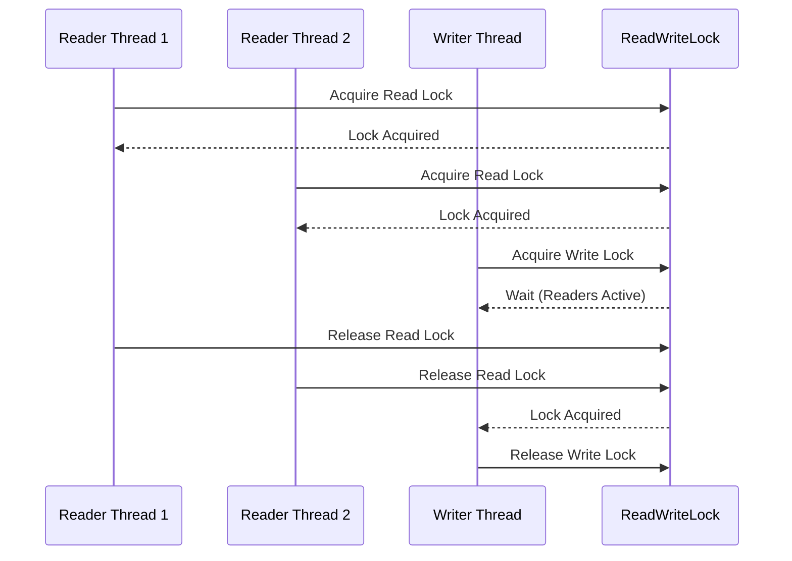

## 6.5 Read-Write Lock Pattern

In the realm of concurrent programming, efficiently managing access to shared resources is crucial for maintaining performance and ensuring data integrity. The Read-Write Lock pattern is a sophisticated synchronization mechanism designed to optimize access to shared resources by allowing multiple threads to read simultaneously while ensuring exclusive access for write operations. This pattern is particularly beneficial in scenarios where read operations vastly outnumber write operations, such as in caching systems and shared data structures.

### Understanding the Read-Write Lock Pattern

The Read-Write Lock pattern introduces a nuanced approach to synchronization by distinguishing between read and write operations. It allows multiple threads to read a resource concurrently, thus improving performance in read-heavy applications. However, when a write operation is required, the pattern ensures that only one thread can modify the resource at a time, preventing data inconsistencies and race conditions.

#### The Problem It Solves

In traditional lock mechanisms, such as the `synchronized` keyword in Java, both read and write operations are treated equally, meaning that only one thread can access the resource at any given time. This approach can lead to performance bottlenecks in applications where read operations are frequent and write operations are rare. The Read-Write Lock pattern addresses this issue by allowing multiple threads to read concurrently, thereby reducing contention and improving throughput.

### Differentiating Between Read and Write Operations

The core concept of the Read-Write Lock pattern is its ability to differentiate between read and write operations. This differentiation is achieved through two types of locks:

- **Read Lock**: Allows multiple threads to acquire the lock simultaneously, provided no thread holds the write lock. This lock is suitable for operations that do not modify the resource, ensuring that data can be read concurrently by multiple threads.

- **Write Lock**: Ensures exclusive access to the resource, allowing only one thread to hold the lock at a time. This lock is necessary for operations that modify the resource, preventing other threads from reading or writing until the write operation is complete.

### Benefits of Using Read-Write Locks

Implementing the Read-Write Lock pattern offers several advantages, particularly in terms of performance and scalability:

- **Increased Throughput**: By allowing concurrent read operations, the pattern significantly increases the throughput of read-heavy applications, as multiple threads can access the resource simultaneously without waiting for each other.

- **Reduced Contention**: The pattern minimizes contention by distinguishing between read and write operations, allowing more efficient use of system resources and reducing the likelihood of thread starvation.

- **Improved Scalability**: Applications that implement the Read-Write Lock pattern can scale more effectively, as the pattern optimizes resource access in multi-threaded environments, accommodating a larger number of concurrent threads.

### Implementation Details and Considerations

Before diving into the implementation of the Read-Write Lock pattern in Java, it's essential to understand the underlying considerations and best practices. Here are some key points to keep in mind:

- **Fairness**: Consider whether the lock should be fair, meaning that threads acquire locks in the order they requested them. Fair locks can prevent thread starvation but may introduce additional overhead.

- **Deadlock Prevention**: Ensure that the lock implementation avoids deadlocks, which can occur if threads are waiting indefinitely for resources held by each other.

- **Performance Overhead**: While the Read-Write Lock pattern improves performance in read-heavy scenarios, it may introduce overhead in write-heavy applications due to the additional complexity of managing multiple locks.

### Practical Examples of the Read-Write Lock Pattern

The Read-Write Lock pattern is particularly useful in scenarios where read operations dominate write operations. Here are some practical examples where this pattern can be beneficial:

- **Caching Systems**: In caching systems, data is frequently read by multiple threads, while updates to the cache are relatively infrequent. The Read-Write Lock pattern allows concurrent reads, improving cache access times.

- **Shared Data Structures**: In applications with shared data structures, such as maps or lists, the pattern enables multiple threads to read data concurrently while ensuring exclusive access for modifications.

- **Configuration Management**: Systems that frequently read configuration settings but rarely update them can benefit from the Read-Write Lock pattern, allowing efficient access to configuration data.

### Implementing Read-Write Lock in Java

Java provides built-in support for the Read-Write Lock pattern through the `java.util.concurrent.locks` package, which includes the `ReadWriteLock` interface and its implementation, `ReentrantReadWriteLock`. Let's explore how to implement this pattern in Java with a practical example.

#### Example: Implementing a Read-Write Lock

Consider a scenario where we have a shared data structure, such as a map, that needs to be accessed by multiple threads. We want to allow concurrent reads but ensure exclusive access for write operations.

```java
import java.util.concurrent.locks.ReadWriteLock;
import java.util.concurrent.locks.ReentrantReadWriteLock;
import java.util.HashMap;
import java.util.Map;

public class ReadWriteLockExample {
    private final Map<String, String> dataMap = new HashMap<>();
    private final ReadWriteLock lock = new ReentrantReadWriteLock();

    public String readData(String key) {
        lock.readLock().lock(); // Acquire the read lock
        try {
            return dataMap.get(key); // Read operation
        } finally {
            lock.readLock().unlock(); // Release the read lock
        }
    }

    public void writeData(String key, String value) {
        lock.writeLock().lock(); // Acquire the write lock
        try {
            dataMap.put(key, value); // Write operation
        } finally {
            lock.writeLock().unlock(); // Release the write lock
        }
    }

    public static void main(String[] args) {
        ReadWriteLockExample example = new ReadWriteLockExample();

        // Example usage
        example.writeData("key1", "value1");
        System.out.println("Read key1: " + example.readData("key1"));
    }
}
```

In this example, we use a `ReentrantReadWriteLock` to manage access to a shared `HashMap`. The `readData` method acquires a read lock, allowing multiple threads to read concurrently, while the `writeData` method acquires a write lock, ensuring exclusive access for modifications.

### Try It Yourself

To deepen your understanding of the Read-Write Lock pattern, try modifying the example code:

- **Experiment with Fairness**: Modify the `ReentrantReadWriteLock` to use a fair lock by passing `true` to its constructor. Observe how this affects the order in which threads acquire locks.

- **Simulate Concurrent Access**: Create multiple threads that perform read and write operations on the shared map. Observe how the Read-Write Lock pattern manages concurrent access.

- **Measure Performance**: Implement a simple benchmarking tool to measure the performance of read and write operations with and without the Read-Write Lock pattern.

### Visualizing the Read-Write Lock Pattern

To better understand the Read-Write Lock pattern, let's visualize the flow of read and write operations using a sequence diagram.



In this sequence diagram, we see how multiple reader threads can acquire the read lock simultaneously, while a writer thread must wait until all readers have released their locks before acquiring the write lock.

### Key Considerations and Best Practices

When implementing the Read-Write Lock pattern, consider the following best practices:

- **Balance Between Read and Write Operations**: Assess the ratio of read to write operations in your application. The Read-Write Lock pattern is most effective in read-heavy scenarios.

- **Avoid Deadlocks**: Ensure that your lock acquisition and release logic is consistent and avoids potential deadlocks. Always release locks in the reverse order of acquisition.

- **Monitor Performance**: Regularly monitor the performance of your application to ensure that the Read-Write Lock pattern is providing the expected benefits. Adjust your implementation as needed based on performance metrics.

### Conclusion

The Read-Write Lock pattern is a powerful tool for optimizing concurrent access to shared resources in read-heavy applications. By allowing multiple threads to read simultaneously while ensuring exclusive access for write operations, this pattern enhances performance, reduces contention, and improves scalability. As you implement this pattern in your applications, remember to consider the balance between read and write operations, avoid deadlocks, and monitor performance to ensure optimal results.

## Quiz Time!



### What is the primary benefit of using the Read-Write Lock pattern?

- [x] It allows multiple threads to read concurrently while ensuring exclusive access for write operations.
- [ ] It simplifies the implementation of thread synchronization.
- [ ] It eliminates the need for locks in concurrent programming.
- [ ] It improves the performance of write-heavy applications.

> **Explanation:** The Read-Write Lock pattern allows multiple threads to read concurrently, optimizing performance in read-heavy applications while ensuring exclusive access for writes.

### Which Java class provides an implementation of the Read-Write Lock pattern?

- [x] ReentrantReadWriteLock
- [ ] Semaphore
- [ ] CountDownLatch
- [ ] CyclicBarrier

> **Explanation:** The `ReentrantReadWriteLock` class in Java provides an implementation of the Read-Write Lock pattern.

### In the Read-Write Lock pattern, what is the purpose of a read lock?

- [x] To allow multiple threads to read concurrently without blocking each other.
- [ ] To ensure exclusive access for write operations.
- [ ] To prevent deadlocks in concurrent programming.
- [ ] To manage thread priorities in a fair manner.

> **Explanation:** A read lock allows multiple threads to read concurrently, improving performance in read-heavy applications.

### What should be considered when implementing the Read-Write Lock pattern?

- [x] The balance between read and write operations.
- [x] Avoiding deadlocks.
- [ ] The use of semaphores for synchronization.
- [ ] The elimination of all locks in the application.

> **Explanation:** When implementing the Read-Write Lock pattern, consider the balance between read and write operations and avoid deadlocks to ensure optimal performance.

### How can fairness be achieved in a Read-Write Lock implementation?

- [x] By using a fair lock, which acquires locks in the order they were requested.
- [ ] By prioritizing write operations over read operations.
- [ ] By eliminating all locks in the application.
- [ ] By using semaphores instead of locks.

> **Explanation:** Fairness can be achieved by using a fair lock, which acquires locks in the order they were requested, preventing thread starvation.

### What is a potential downside of using a fair lock in the Read-Write Lock pattern?

- [x] It may introduce additional overhead and reduce performance.
- [ ] It eliminates the need for locks in concurrent programming.
- [ ] It simplifies the implementation of thread synchronization.
- [ ] It improves the performance of write-heavy applications.

> **Explanation:** A fair lock may introduce additional overhead, which can reduce performance compared to non-fair locks.

### In the provided Java example, what does the `writeData` method do?

- [x] It acquires a write lock, modifies the shared data, and releases the lock.
- [ ] It acquires a read lock, reads the shared data, and releases the lock.
- [ ] It eliminates the need for locks in concurrent programming.
- [ ] It improves the performance of write-heavy applications.

> **Explanation:** The `writeData` method acquires a write lock, modifies the shared data, and releases the lock to ensure exclusive access.

### What is a common use case for the Read-Write Lock pattern?

- [x] Caching systems where read operations are frequent and write operations are rare.
- [ ] Applications with a high number of write operations.
- [ ] Systems that do not require synchronization.
- [ ] Single-threaded applications.

> **Explanation:** The Read-Write Lock pattern is commonly used in caching systems where read operations are frequent and write operations are rare.

### What is the role of the `ReentrantReadWriteLock` in Java?

- [x] To provide a mechanism for implementing the Read-Write Lock pattern.
- [ ] To eliminate the need for locks in concurrent programming.
- [ ] To simplify the implementation of thread synchronization.
- [ ] To improve the performance of write-heavy applications.

> **Explanation:** The `ReentrantReadWriteLock` in Java provides a mechanism for implementing the Read-Write Lock pattern, allowing concurrent reads and exclusive writes.

### True or False: The Read-Write Lock pattern is most effective in write-heavy applications.

- [ ] True
- [x] False

> **Explanation:** False. The Read-Write Lock pattern is most effective in read-heavy applications, where read operations vastly outnumber write operations.


