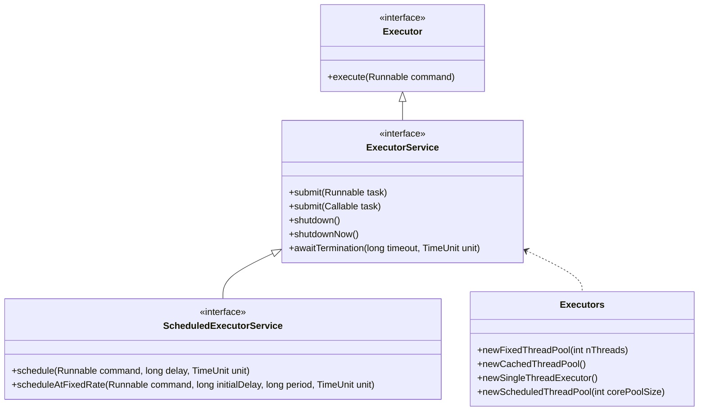

## 6.6.1 Implementing Thread Pool in Java

In the realm of concurrent programming, managing threads efficiently is crucial for building responsive and scalable applications. Java's `Executor` framework provides a robust solution for managing thread execution, encapsulating the complexities of thread creation and management. In this section, we'll delve into the implementation of the Thread Pool pattern in Java, exploring how to leverage the `ExecutorService` and its utility methods to create and manage thread pools effectively.

### Introduction to the Executor Framework

The `Executor` framework in Java is designed to decouple task submission from the mechanics of how each task will be run, including details of thread use, scheduling, etc. It provides a higher-level replacement for working directly with threads, offering a more flexible and powerful way to manage concurrency.

#### Key Interfaces

1. **Executor**: The simplest interface, representing an object that executes submitted `Runnable` tasks. It provides a single method, `execute(Runnable command)`, to submit tasks for execution.

2. **ExecutorService**: A more extensive interface that builds upon `Executor`, providing methods for managing task lifecycle, including methods to shut down the executor and to track the progress of tasks.

3. **ScheduledExecutorService**: Extends `ExecutorService` to support future and/or periodic execution of tasks.

### Creating Thread Pools with Executors

Java provides several factory methods in the `Executors` utility class to create different types of thread pools. Let's explore these methods and understand their use cases.

#### Fixed Thread Pool

A fixed thread pool is created with a set number of threads. This is useful when you want to limit the number of concurrent threads to a specific number.

```java
ExecutorService fixedThreadPool = Executors.newFixedThreadPool(5);
```

In this example, a thread pool with five threads is created. Tasks submitted to this pool will be executed by these threads. If all threads are busy, new tasks will wait in a queue until a thread becomes available.

#### Cached Thread Pool

A cached thread pool creates new threads as needed, but will reuse previously constructed threads when they are available. This type of pool is suitable for applications with many short-lived tasks.

```java
ExecutorService cachedThreadPool = Executors.newCachedThreadPool();
```

Cached thread pools are ideal when you have a large number of short-lived tasks and you want to minimize the overhead of thread creation.

#### Single Thread Executor

A single thread executor ensures that tasks are executed sequentially, using only one thread. This is useful for tasks that must be executed in a strict order.

```java
ExecutorService singleThreadExecutor = Executors.newSingleThreadExecutor();
```

This executor guarantees that no two tasks will execute concurrently, making it suitable for tasks that require strict sequential execution.

#### Scheduled Thread Pool

A scheduled thread pool is used for executing tasks after a given delay or periodically.

```java
ScheduledExecutorService scheduledThreadPool = Executors.newScheduledThreadPool(3);
```

This pool is ideal for tasks that need to be executed periodically or after a certain delay, such as scheduled maintenance tasks or periodic data fetching.

### Task Submission and Execution

Once a thread pool is created, tasks can be submitted for execution. The `ExecutorService` interface provides several methods for task submission, including `submit` and `invokeAll`.

#### Submitting Tasks

Tasks can be submitted to a thread pool using the `submit` method. This method accepts `Runnable` or `Callable` tasks.

```java
fixedThreadPool.submit(() -> {
    // Task logic here
    System.out.println("Executing task in fixed thread pool");
});
```

For tasks that return a result, use `Callable` instead of `Runnable`.

```java
Future<Integer> futureResult = fixedThreadPool.submit(() -> {
    // Task logic that returns a result
    return 42;
});
```

The `Future` object allows you to retrieve the result of the task once it completes.

#### Handling Task Completion

To handle task completion, you can use the `Future` object returned by the `submit` method. This object provides methods to check if the task is complete, wait for its completion, and retrieve the result.

```java
try {
    Integer result = futureResult.get(); // Blocks until the task is complete
    System.out.println("Task completed with result: " + result);
} catch (InterruptedException | ExecutionException e) {
    e.printStackTrace();
}
```

### Graceful Shutdown of Thread Pools

It's crucial to shut down thread pools gracefully to ensure that all running tasks are completed and resources are released properly. The `ExecutorService` interface provides methods for shutting down the executor.

#### Shutdown Methods

1. **shutdown()**: Initiates an orderly shutdown in which previously submitted tasks are executed, but no new tasks will be accepted.

```java
fixedThreadPool.shutdown();
```

2. **shutdownNow()**: Attempts to stop all actively executing tasks and halts the processing of waiting tasks.

```java
List<Runnable> notExecutedTasks = fixedThreadPool.shutdownNow();
```

#### Awaiting Termination

After initiating a shutdown, you can wait for the executor to terminate using the `awaitTermination` method.

```java
try {
    if (!fixedThreadPool.awaitTermination(60, TimeUnit.SECONDS)) {
        fixedThreadPool.shutdownNow();
    }
} catch (InterruptedException e) {
    fixedThreadPool.shutdownNow();
}
```

This ensures that the executor has a chance to complete all tasks before being forcefully terminated.

### Best Practices for Thread Pool Usage

Choosing the right type of thread pool and managing it effectively is essential for optimal performance and resource utilization.

#### Selecting the Appropriate Thread Pool

- **Fixed Thread Pool**: Use when you have a known number of tasks and want to limit the number of concurrent threads.
- **Cached Thread Pool**: Ideal for applications with many short-lived tasks.
- **Single Thread Executor**: Suitable for tasks that need to be executed sequentially.
- **Scheduled Thread Pool**: Best for tasks that need to be executed periodically or with a delay.

#### Handling Exceptions

It's important to handle exceptions within tasks to prevent thread leakage and ensure the stability of the application.

```java
fixedThreadPool.submit(() -> {
    try {
        // Task logic
    } catch (Exception e) {
        // Handle exception
    }
});
```

Uncaught exceptions can cause threads to terminate unexpectedly, leading to resource leaks and inconsistent application behavior.

### Visualizing Thread Pool Architecture

To better understand how thread pools manage tasks and threads, let's visualize the architecture using a class diagram.



### Try It Yourself

To solidify your understanding, try modifying the code examples provided:

- Change the number of threads in the fixed thread pool and observe how it affects task execution.
- Experiment with different types of tasks (e.g., long-running vs. short-lived) in a cached thread pool.
- Implement a periodic task using a scheduled thread pool and adjust the scheduling parameters.

### References and Further Reading

- [Java Concurrency in Practice](https://www.amazon.com/Java-Concurrency-Practice-Brian-Goetz/dp/0321349601) by Brian Goetz
- [Java Platform, Standard Edition Documentation](https://docs.oracle.com/javase/8/docs/api/java/util/concurrent/package-summary.html)
- [Oracle's Java Tutorials: Concurrency](https://docs.oracle.com/javase/tutorial/essential/concurrency/)

### Knowledge Check

Before we wrap up, let's reinforce what we've learned with a few questions.

- What is the primary purpose of the `Executor` framework?
- How does a fixed thread pool differ from a cached thread pool?
- Why is it important to handle exceptions within tasks submitted to a thread pool?

### Embrace the Journey

Remember, mastering concurrency in Java is a journey. As you continue to explore and experiment with thread pools, you'll gain deeper insights into building efficient and scalable applications. Keep experimenting, stay curious, and enjoy the journey!

## Quiz Time!



### What is the primary purpose of the `Executor` framework in Java?

- [x] To decouple task submission from the mechanics of how each task will be run.
- [ ] To create new threads for each task.
- [ ] To manage memory allocation for threads.
- [ ] To provide a graphical interface for thread management.

> **Explanation:** The `Executor` framework is designed to decouple task submission from the mechanics of how each task will be run, including details of thread use, scheduling, etc.

### Which method is used to create a fixed thread pool in Java?

- [x] Executors.newFixedThreadPool(int nThreads)
- [ ] Executors.newCachedThreadPool()
- [ ] Executors.newSingleThreadExecutor()
- [ ] Executors.newScheduledThreadPool(int corePoolSize)

> **Explanation:** The `Executors.newFixedThreadPool(int nThreads)` method is used to create a fixed thread pool with a specified number of threads.

### How does a cached thread pool differ from a fixed thread pool?

- [x] A cached thread pool creates new threads as needed and reuses them when available, while a fixed thread pool has a set number of threads.
- [ ] A cached thread pool has a set number of threads, while a fixed thread pool creates new threads as needed.
- [ ] A cached thread pool is used for long-running tasks, while a fixed thread pool is used for short-lived tasks.
- [ ] A cached thread pool is slower than a fixed thread pool.

> **Explanation:** A cached thread pool creates new threads as needed and reuses previously constructed threads when they are available, whereas a fixed thread pool has a set number of threads.

### What is the role of the `Future` object in task submission?

- [x] To allow retrieval of the result of a task once it completes.
- [ ] To execute tasks in parallel.
- [ ] To manage the lifecycle of the thread pool.
- [ ] To provide a graphical interface for task management.

> **Explanation:** The `Future` object allows you to retrieve the result of a task once it completes, and provides methods to check if the task is complete and to wait for its completion.

### Why is it important to handle exceptions within tasks submitted to a thread pool?

- [x] To prevent thread leakage and ensure the stability of the application.
- [ ] To increase the speed of task execution.
- [ ] To reduce memory usage.
- [ ] To improve the graphical interface of the application.

> **Explanation:** Handling exceptions within tasks is important to prevent thread leakage and ensure the stability of the application, as uncaught exceptions can cause threads to terminate unexpectedly.

### Which method initiates an orderly shutdown of a thread pool?

- [x] shutdown()
- [ ] shutdownNow()
- [ ] awaitTermination()
- [ ] execute()

> **Explanation:** The `shutdown()` method initiates an orderly shutdown in which previously submitted tasks are executed, but no new tasks will be accepted.

### What is a suitable use case for a single thread executor?

- [x] Tasks that need to be executed sequentially.
- [ ] Tasks that require high concurrency.
- [ ] Tasks that need to be executed periodically.
- [ ] Tasks that require a large number of threads.

> **Explanation:** A single thread executor is suitable for tasks that need to be executed sequentially, as it ensures that no two tasks will execute concurrently.

### How can you wait for a thread pool to terminate after initiating a shutdown?

- [x] Using the awaitTermination(long timeout, TimeUnit unit) method.
- [ ] Using the execute() method.
- [ ] Using the submit() method.
- [ ] Using the schedule() method.

> **Explanation:** The `awaitTermination(long timeout, TimeUnit unit)` method can be used to wait for a thread pool to terminate after initiating a shutdown.

### What is the advantage of using a scheduled thread pool?

- [x] It allows tasks to be executed periodically or after a certain delay.
- [ ] It provides the highest level of concurrency.
- [ ] It minimizes memory usage.
- [ ] It is the fastest type of thread pool.

> **Explanation:** A scheduled thread pool is advantageous because it allows tasks to be executed periodically or after a certain delay, making it suitable for scheduled maintenance tasks or periodic data fetching.

### True or False: A fixed thread pool can dynamically adjust the number of threads based on the workload.

- [ ] True
- [x] False

> **Explanation:** False. A fixed thread pool has a set number of threads and does not dynamically adjust the number of threads based on the workload.


