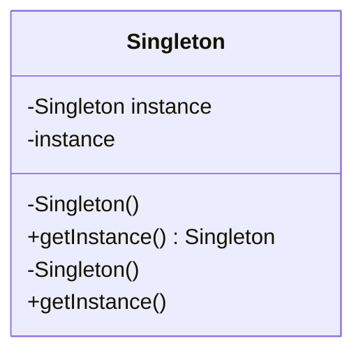

## 6.6.1 Implementing Singleton in Java

### Introduction

The Singleton pattern is a fundamental design pattern in software engineering, particularly within the realm of object-oriented programming. Its primary purpose is to ensure that a class has only one instance while providing a global point of access to that instance. This pattern is part of the creational design patterns, which focus on the creation of objects in a manner suitable to the situation.

### Intent and Use Cases

#### Intent

The Singleton pattern is designed to solve the problem of ensuring that a class has only one instance and providing a global point of access to it. This is particularly useful in scenarios where a single instance of a class is required to coordinate actions across a system.

#### Use Cases

- **Configuration Management**: When a single configuration object is needed to manage application settings.
- **Logging**: To ensure that all parts of an application log to the same file or logging service.
- **Resource Management**: Managing shared resources like database connections or thread pools.
- **Caching**: When a single cache instance is needed to store and retrieve data efficiently.

### Basic Implementation of Singleton in Java

To implement a Singleton in Java, follow these steps:

1. **Private Constructor**: Ensure that the constructor of the class is private to prevent instantiation from outside the class.
2. **Static Instance**: Declare a static instance of the class within the class itself.
3. **Static Access Method**: Provide a static method that returns the instance of the class.

#### Example Code

```java
public class Singleton {
    // Static variable to hold the single instance of the class
    private static Singleton instance;

    // Private constructor to prevent instantiation
    private Singleton() {}

    // Static method to provide access to the instance
    public static Singleton getInstance() {
        if (instance == null) {
            instance = new Singleton();
        }
        return instance;
    }
}
```

### Importance of Private Constructor and Static Access Method

- **Private Constructor**: By making the constructor private, you prevent other classes from creating new instances of the Singleton class. This is crucial to maintaining a single instance.
- **Static Access Method**: The static method `getInstance()` provides a controlled access point to the Singleton instance. It ensures that the instance is created only when needed and provides a global point of access.

### Issues with Basic Implementation in Multithreaded Environments

The basic Singleton implementation shown above is not thread-safe. In a multithreaded environment, multiple threads could simultaneously enter the `getInstance()` method and create multiple instances of the Singleton class. This violates the Singleton principle and can lead to unexpected behavior.

#### Thread Safety Concerns

- **Race Conditions**: Multiple threads accessing the `getInstance()` method simultaneously can lead to race conditions, resulting in multiple instances being created.
- **Performance Overhead**: Implementing thread safety can introduce performance overhead if not done correctly.

### Ensuring Thread Safety

To ensure thread safety in a Singleton implementation, several strategies can be employed:

#### 1. Synchronized Method

Synchronize the `getInstance()` method to ensure that only one thread can execute it at a time.

```java
public class Singleton {
    private static Singleton instance;

    private Singleton() {}

    public static synchronized Singleton getInstance() {
        if (instance == null) {
            instance = new Singleton();
        }
        return instance;
    }
}
```

**Pros**: Simple to implement.

**Cons**: Synchronizing the entire method can lead to performance bottlenecks, especially in high-concurrency scenarios.

#### 2. Double-Checked Locking

Use double-checked locking to reduce the overhead of acquiring a lock by first checking if the instance is already created.

```java
public class Singleton {
    private static volatile Singleton instance;

    private Singleton() {}

    public static Singleton getInstance() {
        if (instance == null) {
            synchronized (Singleton.class) {
                if (instance == null) {
                    instance = new Singleton();
                }
            }
        }
        return instance;
    }
}
```

**Pros**: Reduces the performance overhead by only synchronizing the critical section of code.

**Cons**: More complex to implement and understand.

#### 3. Bill Pugh Singleton Design

Leverage the Java class loader mechanism to ensure thread safety without synchronization.

```java
public class Singleton {
    private Singleton() {}

    private static class SingletonHelper {
        private static final Singleton INSTANCE = new Singleton();
    }

    public static Singleton getInstance() {
        return SingletonHelper.INSTANCE;
    }
}
```

**Pros**: Lazy initialization and thread-safe without synchronization.

**Cons**: Slightly more complex than the basic implementation.

### Visualizing the Singleton Pattern

To better understand the Singleton pattern, consider the following class diagram:



**Diagram Explanation**: The diagram illustrates the Singleton class with a private static instance variable, a private constructor, and a public static method to access the instance.

### Advanced Considerations

#### Serialization Issues

When a Singleton class implements `Serializable`, it can be deserialized into multiple instances. To prevent this, implement the `readResolve()` method.

```java
protected Object readResolve() {
    return getInstance();
}
```

#### Cloning Issues

Prevent cloning by overriding the `clone()` method and throwing a `CloneNotSupportedException`.

```java
@Override
protected Object clone() throws CloneNotSupportedException {
    throw new CloneNotSupportedException();
}
```

#### Reflection Issues

Reflection can be used to break the Singleton pattern by invoking the private constructor. To prevent this, throw an exception if an instance already exists.

```java
private Singleton() {
    if (instance != null) {
        throw new IllegalStateException("Instance already exists");
    }
}
```

### Sample Use Cases

- **Database Connection Pool**: A Singleton can manage a pool of database connections, ensuring efficient use of resources.
- **Configuration Manager**: A Singleton can store application configuration settings, providing a centralized access point.
- **Logger**: A Singleton logger can ensure that all parts of an application log to the same destination.

### Related Patterns

- **Factory Pattern**: Often used in conjunction with Singleton to create instances of a class.
- **Prototype Pattern**: Provides a way to create new objects by copying an existing instance, which contrasts with the Singleton's single instance approach.

### Known Uses

- **Java Runtime Environment**: The `Runtime` class in Java is an example of a Singleton.
- **Spring Framework**: The Spring framework uses Singleton beans by default for dependency injection.

### Conclusion

The Singleton pattern is a powerful tool in a Java developer's toolkit, providing a way to ensure a single instance of a class and a global point of access. However, care must be taken to ensure thread safety and handle potential pitfalls such as serialization, cloning, and reflection. By understanding and implementing the Singleton pattern correctly, developers can create robust and efficient applications.

### Key Takeaways

- The Singleton pattern ensures a class has only one instance and provides a global point of access.
- Implementing a Singleton requires a private constructor, a static instance, and a static access method.
- Thread safety is a critical consideration in Singleton implementation, with several strategies available to ensure it.
- Advanced considerations include handling serialization, cloning, and reflection issues.

### Exercises

1. Implement a thread-safe Singleton class for managing application configuration settings.
2. Modify the basic Singleton implementation to handle serialization issues.
3. Explore the use of the Singleton pattern in a real-world Java application, such as a logging framework.

## Test Your Knowledge: Singleton Pattern in Java Quiz



### What is the primary purpose of the Singleton pattern?

- [x] To ensure a class has only one instance and provide a global point of access to it.
- [ ] To create multiple instances of a class.
- [ ] To manage memory allocation for objects.
- [ ] To provide a template for creating objects.

> **Explanation:** The Singleton pattern is designed to ensure that a class has only one instance and provides a global point of access to it.

### Which method is used to provide access to the Singleton instance?

- [x] A static method
- [ ] A public constructor
- [ ] An instance method
- [ ] A private method

> **Explanation:** A static method is used to provide access to the Singleton instance, ensuring that it is globally accessible.

### What is a common issue with the basic Singleton implementation in a multithreaded environment?

- [x] Multiple instances can be created.
- [ ] The instance cannot be accessed.
- [ ] The constructor is not private.
- [ ] The class cannot be serialized.

> **Explanation:** In a multithreaded environment, multiple threads can create multiple instances of the Singleton class, violating the Singleton principle.

### How can thread safety be ensured in a Singleton implementation?

- [x] By synchronizing the access method
- [ ] By making the constructor public
- [ ] By using instance methods
- [ ] By using a private method

> **Explanation:** Synchronizing the access method ensures that only one thread can execute it at a time, preventing multiple instances from being created.

### What is the advantage of using double-checked locking in Singleton implementation?

- [x] It reduces the performance overhead of synchronization.
- [ ] It simplifies the code.
- [x] It ensures lazy initialization.
- [ ] It makes the constructor public.

> **Explanation:** Double-checked locking reduces the performance overhead by only synchronizing the critical section of code and ensures lazy initialization.

### Which method can be used to prevent multiple instances during serialization?

- [x] readResolve()
- [ ] writeObject()
- [ ] clone()
- [ ] finalize()

> **Explanation:** The `readResolve()` method can be used to return the existing Singleton instance during deserialization, preventing multiple instances.

### How can cloning be prevented in a Singleton class?

- [x] By overriding the clone() method and throwing CloneNotSupportedException
- [ ] By making the constructor public
- [x] By using a static method
- [ ] By using a private method

> **Explanation:** Overriding the `clone()` method and throwing `CloneNotSupportedException` prevents cloning of the Singleton instance.

### What is a potential issue with using reflection on a Singleton class?

- [x] It can break the Singleton pattern by invoking the private constructor.
- [ ] It can make the class non-serializable.
- [ ] It can prevent access to the instance.
- [ ] It can make the constructor public.

> **Explanation:** Reflection can be used to invoke the private constructor, breaking the Singleton pattern by creating multiple instances.

### Which of the following is a real-world example of the Singleton pattern?

- [x] Java Runtime Environment's Runtime class
- [ ] Java's ArrayList class
- [ ] Java's HashMap class
- [ ] Java's String class

> **Explanation:** The `Runtime` class in Java is an example of a Singleton, providing a single instance for managing the runtime environment.

### True or False: The Singleton pattern is part of the structural design patterns.

- [x] False
- [ ] True

> **Explanation:** The Singleton pattern is part of the creational design patterns, not structural design patterns.



By mastering the Singleton pattern and its implementation in Java, developers can ensure efficient resource management and maintainability in their applications.
