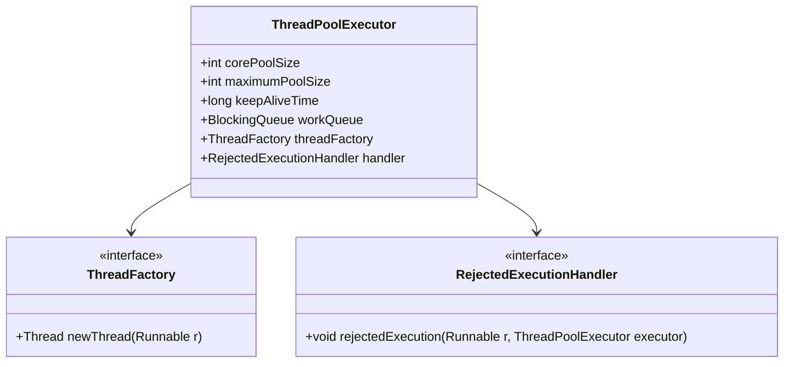

## 6.6.2 Configuring Thread Pools

In the realm of Java concurrency, configuring thread pools is a critical task that can significantly impact the performance and efficiency of your applications. Thread pools are a powerful tool for managing concurrent execution, but their effectiveness hinges on proper configuration. In this section, we will delve into the nuances of configuring thread pools, covering aspects such as setting thread pool sizes, queue capacities, rejection policies, and customizing threads with `ThreadFactory`. 

### Understanding Thread Pools

Before we dive into configuration specifics, let's briefly revisit what a thread pool is. A thread pool manages a collection of reusable threads for executing tasks. By reusing threads, we avoid the overhead of thread creation and destruction, which can be costly in terms of performance. Thread pools are especially useful in scenarios involving a large number of short-lived tasks.

### Factors Influencing Thread Pool Size

Determining the optimal number of threads in a pool is crucial for maximizing performance. Several factors should be considered:

1. **CPU Cores**: The number of available CPU cores is a primary consideration. For CPU-bound tasks, a good starting point is to set the thread pool size to the number of available cores. This ensures that all cores are utilized without excessive context switching.

2. **I/O Operations**: For I/O-bound tasks, the thread pool size can exceed the number of cores. This is because I/O operations often involve waiting, during which other threads can execute.

3. **Task Nature**: Consider the nature of the tasks. Are they CPU-intensive, I/O-bound, or a mix of both? This will influence the ideal thread pool size.

4. **System Load**: Monitor the system load and adjust the thread pool size accordingly. A system under heavy load may require a smaller pool to prevent resource contention.

5. **Application Requirements**: Different applications have varying concurrency needs. Understand the specific requirements of your application to configure the thread pool appropriately.

### Configuring Queue Sizes

The queue in a thread pool holds tasks waiting to be executed. Configuring the queue size involves choosing between bounded and unbounded queues:

- **Bounded Queues**: These have a fixed capacity. They help prevent resource exhaustion by limiting the number of waiting tasks. However, they can lead to task rejection if the queue is full.

- **Unbounded Queues**: These have no fixed capacity, allowing an unlimited number of tasks to wait. While they prevent task rejection, they can lead to resource exhaustion if too many tasks accumulate.

**Choosing the Right Queue**: The choice between bounded and unbounded queues depends on your application's tolerance for task rejection and resource availability. Bounded queues are generally safer, as they provide a backpressure mechanism.

### Handling Task Overload: Rejection Policies

When a thread pool is saturated, tasks may need to be rejected. Java provides several rejection policies to handle such scenarios:

1. **AbortPolicy**: Throws a `RejectedExecutionException` when a task is rejected. This is the default policy.

2. **CallerRunsPolicy**: The task is executed in the caller's thread, providing a simple form of backpressure.

3. **DiscardPolicy**: Silently discards the rejected task.

4. **DiscardOldestPolicy**: Discards the oldest unhandled task and retries the submission.

**Example**: Configuring a thread pool with a rejection policy.

```java
ExecutorService executor = new ThreadPoolExecutor(
    2,  // core pool size
    4,  // maximum pool size
    60, // keep-alive time
    TimeUnit.SECONDS,
    new ArrayBlockingQueue<>(2), // bounded queue
    new ThreadPoolExecutor.AbortPolicy() // rejection policy
);
```

### Customizing Threads with `ThreadFactory`

Customizing thread creation can be achieved using a `ThreadFactory`. This allows you to set thread names, priorities, daemon status, and more.

**Example**: Creating a custom `ThreadFactory`.

```java
ThreadFactory customThreadFactory = new ThreadFactory() {
    private final AtomicInteger threadNumber = new AtomicInteger(1);
    private final String namePrefix = "CustomPool-Thread-";

    @Override
    public Thread newThread(Runnable r) {
        Thread t = new Thread(r, namePrefix + threadNumber.getAndIncrement());
        if (t.isDaemon()) {
            t.setDaemon(false);
        }
        if (t.getPriority() != Thread.NORM_PRIORITY) {
            t.setPriority(Thread.NORM_PRIORITY);
        }
        return t;
    }
};

ExecutorService executor = new ThreadPoolExecutor(
    2, 4, 60, TimeUnit.SECONDS,
    new ArrayBlockingQueue<>(2),
    customThreadFactory
);
```

### Monitoring and Adjusting Configurations

Thread pool configurations are not static. As application demands change, so should your configurations. Regularly monitor thread pool performance using metrics such as:

- **Task Completion Time**: Measure how long tasks take to complete.
- **Queue Length**: Monitor the number of tasks waiting in the queue.
- **Thread Utilization**: Check how effectively threads are being utilized.

**Adjusting Configurations**: Based on monitoring data, adjust thread pool sizes, queue capacities, and rejection policies to optimize performance.

### Visualizing Thread Pool Configuration

To better understand the configuration of a thread pool, let's visualize it using a class diagram.



**Diagram Description**: This diagram illustrates the key components of a `ThreadPoolExecutor`, highlighting the relationships between the core pool size, maximum pool size, keep-alive time, work queue, thread factory, and rejection handler.

### Try It Yourself

Experiment with the provided code examples by:

- Modifying the core and maximum pool sizes to see how it affects performance.
- Changing the queue type from bounded to unbounded and observing the impact on resource utilization.
- Implementing different rejection policies and noting how they handle task overload.
- Customizing the `ThreadFactory` to set different thread priorities or daemon statuses.

### Knowledge Check

- What factors should you consider when determining the number of threads in a pool?
- How do bounded and unbounded queues differ, and when might you use each?
- What are some common rejection policies, and how do they handle task overload?
- How can a `ThreadFactory` be used to customize thread creation?

### Summary

Configuring thread pools in Java is a nuanced process that requires careful consideration of various factors, including CPU cores, I/O operations, task nature, and system load. By setting appropriate thread pool sizes, queue capacities, and rejection policies, and by customizing threads with `ThreadFactory`, you can optimize performance and resource utilization. Remember to monitor and adjust configurations as application demands evolve.

## Quiz Time!



### What is a primary factor to consider when determining thread pool size?

- [x] Number of CPU cores
- [ ] Amount of available memory
- [ ] Number of network connections
- [ ] Disk space

> **Explanation:** The number of CPU cores is crucial for determining thread pool size, especially for CPU-bound tasks.

### Which type of queue is safer for preventing resource exhaustion?

- [x] Bounded Queue
- [ ] Unbounded Queue
- [ ] Priority Queue
- [ ] Circular Queue

> **Explanation:** Bounded queues limit the number of waiting tasks, preventing resource exhaustion.

### What does the `CallerRunsPolicy` rejection policy do?

- [x] Executes the task in the caller's thread
- [ ] Discards the task silently
- [ ] Throws an exception
- [ ] Retries the task submission

> **Explanation:** `CallerRunsPolicy` executes the task in the caller's thread, providing a simple form of backpressure.

### How can a `ThreadFactory` be used?

- [x] To customize thread creation
- [ ] To manage task execution
- [ ] To handle task rejection
- [ ] To configure queue sizes

> **Explanation:** A `ThreadFactory` allows customization of thread creation, such as setting names and priorities.

### What is a benefit of using a custom `ThreadFactory`?

- [x] Setting custom thread names
- [ ] Increasing task execution speed
- [ ] Reducing memory usage
- [ ] Simplifying code logic

> **Explanation:** A custom `ThreadFactory` can set custom thread names, priorities, and other attributes.

### Why is monitoring thread pool performance important?

- [x] To adjust configurations based on application demands
- [ ] To increase the number of threads
- [ ] To decrease the number of tasks
- [ ] To simplify code logic

> **Explanation:** Monitoring helps adjust configurations to optimize performance as demands change.

### What is a key metric to monitor in a thread pool?

- [x] Task completion time
- [ ] Network latency
- [ ] Disk read speed
- [ ] User login frequency

> **Explanation:** Task completion time is a key metric for assessing thread pool performance.

### How does a bounded queue help in thread pool configuration?

- [x] It limits the number of waiting tasks
- [ ] It increases task execution speed
- [ ] It reduces memory usage
- [ ] It simplifies code logic

> **Explanation:** A bounded queue limits the number of waiting tasks, preventing resource exhaustion.

### What is the role of a `RejectedExecutionHandler`?

- [x] To handle tasks that cannot be executed
- [ ] To manage thread creation
- [ ] To configure queue sizes
- [ ] To monitor system load

> **Explanation:** A `RejectedExecutionHandler` handles tasks that cannot be executed due to overload.

### True or False: Unbounded queues can lead to resource exhaustion.

- [x] True
- [ ] False

> **Explanation:** Unbounded queues can accumulate too many tasks, leading to resource exhaustion.



Remember, configuring thread pools is an ongoing process. As you gain more insights into your application's behavior, continue to refine your configurations for optimal performance. Stay curious, keep experimenting, and enjoy the journey of mastering Java concurrency!
