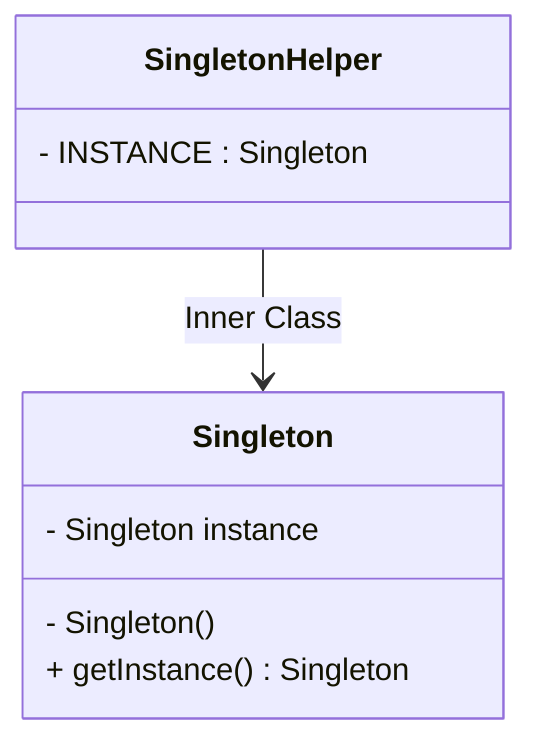

## 6.6.2 Thread-Safe Singleton Implementations

### Introduction

The Singleton pattern is a creational design pattern that ensures a class has only one instance and provides a global point of access to it. While the basic implementation of a Singleton is straightforward, making it thread-safe in a concurrent environment presents challenges. This section delves into various strategies for implementing thread-safe Singletons in Java, addressing concurrency issues and exploring the pros and cons of each approach.

### Concurrency Challenges in Singleton Creation

In a multithreaded environment, multiple threads may attempt to create an instance of a Singleton simultaneously, leading to the creation of multiple instances. This violates the Singleton pattern's core principle. Ensuring thread safety in Singleton implementations is crucial to prevent such scenarios.

### Thread-Safe Singleton Implementations

#### Synchronized Method

One of the simplest ways to make a Singleton thread-safe is to synchronize the method that creates the instance. This approach ensures that only one thread can execute the method at a time.

##### Implementation

```java
public class Singleton {
    private static Singleton instance;

    private Singleton() {
        // Private constructor to prevent instantiation
    }

    public static synchronized Singleton getInstance() {
        if (instance == null) {
            instance = new Singleton();
        }
        return instance;
    }
}
```

##### Explanation

- **Synchronized Keyword**: The `synchronized` keyword ensures that only one thread can execute the `getInstance()` method at a time, preventing multiple threads from creating separate instances.

##### Pros and Cons

- **Pros**: Simple to implement and understand.
- **Cons**: Synchronization can lead to performance bottlenecks, especially when the method is called frequently.

#### Double-Checked Locking

Double-checked locking reduces the overhead of acquiring a lock by first checking the instance without synchronization. This approach is more efficient than synchronizing the entire method.

##### Implementation

```java
public class Singleton {
    private static volatile Singleton instance;

    private Singleton() {
        // Private constructor to prevent instantiation
    }

    public static Singleton getInstance() {
        if (instance == null) {
            synchronized (Singleton.class) {
                if (instance == null) {
                    instance = new Singleton();
                }
            }
        }
        return instance;
    }
}
```

##### Explanation

- **Volatile Keyword**: The `volatile` keyword ensures that changes to the `instance` variable are visible to all threads.
- **Double-Checked Locking**: The instance is checked twice, once without synchronization and once within the synchronized block, to minimize synchronization overhead.

##### Pros and Cons

- **Pros**: Improved performance over synchronized methods by reducing lock acquisition.
- **Cons**: Complexity in implementation and potential issues in older Java versions (prior to Java 5).

#### Static Inner Class

The static inner class approach leverages the class loader mechanism to ensure thread safety. The Singleton instance is created when the inner class is loaded.

##### Implementation

```java
public class Singleton {
    private Singleton() {
        // Private constructor to prevent instantiation
    }

    private static class SingletonHelper {
        private static final Singleton INSTANCE = new Singleton();
    }

    public static Singleton getInstance() {
        return SingletonHelper.INSTANCE;
    }
}
```

##### Explanation

- **Lazy Initialization**: The Singleton instance is created only when the `getInstance()` method is called, ensuring lazy initialization.
- **Thread Safety**: The class loader mechanism guarantees that the instance is created in a thread-safe manner.

##### Pros and Cons

- **Pros**: Simple, efficient, and lazy initialization without explicit synchronization.
- **Cons**: Less intuitive for developers unfamiliar with the class loader mechanism.

### Visualizing the Singleton Implementations

To better understand the structure and flow of these implementations, consider the following class diagram:



**Diagram Explanation**: This diagram illustrates the relationship between the `Singleton` class and the `SingletonHelper` inner class, highlighting how the instance is managed.

### Practical Applications and Real-World Scenarios

Thread-safe Singleton implementations are crucial in scenarios where a single instance of a class is required across multiple threads, such as:

- **Configuration Management**: Ensuring consistent access to configuration settings across an application.
- **Logging**: Providing a single point of access to logging mechanisms.
- **Resource Management**: Managing shared resources like database connections or thread pools.

### Historical Context and Evolution

The Singleton pattern has evolved over time, particularly with the introduction of multithreading in Java. Early implementations often overlooked thread safety, leading to the development of more sophisticated techniques like double-checked locking and static inner classes.

### Best Practices and Expert Tips

- **Use Lazy Initialization**: Prefer lazy initialization to avoid unnecessary resource consumption.
- **Consider Performance**: Evaluate the performance implications of synchronization and choose an approach that balances safety and efficiency.
- **Stay Updated**: Keep abreast of Java language updates and improvements in concurrency utilities.

### Common Pitfalls and How to Avoid Them

- **Over-Synchronization**: Avoid excessive synchronization, which can degrade performance.
- **Complexity**: Be cautious of overly complex implementations that may introduce bugs or maintenance challenges.
- **Compatibility**: Ensure compatibility with the Java version in use, particularly when using volatile variables or double-checked locking.

### Exercises and Practice Problems

1. **Modify the Synchronized Method**: Experiment with removing synchronization and observe the effects in a multithreaded environment.
2. **Implement a Singleton with Double-Checked Locking**: Create a Singleton using double-checked locking and test its performance compared to a synchronized method.
3. **Explore Static Inner Classes**: Implement a Singleton using a static inner class and explain how it ensures thread safety.

### Summary and Key Takeaways

- **Thread Safety is Crucial**: Ensuring thread safety in Singleton implementations is essential in concurrent environments.
- **Multiple Approaches**: Various methods exist to achieve thread safety, each with its own trade-offs.
- **Balance Performance and Safety**: Choose an implementation that provides the necessary safety without compromising performance.

### Reflection

Consider how these thread-safe Singleton implementations can be applied to your projects. Reflect on the balance between simplicity and performance, and how these patterns can enhance the robustness of your applications.

### Related Patterns

- **[6.6 Singleton Pattern]( "Singleton Pattern")**: Explore the basic Singleton pattern and its applications.
- **Factory Method Pattern**: Often used in conjunction with Singleton to manage object creation.

### Known Uses

- **Java Runtime Environment**: The `Runtime` class in Java is a well-known example of a Singleton.
- **Spring Framework**: The Spring IoC container manages beans as Singletons by default.

## Test Your Knowledge: Thread-Safe Singleton Implementations Quiz



### Which keyword is used to ensure visibility of changes to a variable across threads in Java?

- [x] volatile
- [ ] synchronized
- [ ] transient
- [ ] static

> **Explanation:** The `volatile` keyword ensures that changes to a variable are visible to all threads, preventing caching issues.

### What is the primary advantage of using double-checked locking in Singleton implementations?

- [x] It reduces the overhead of acquiring a lock.
- [ ] It simplifies the code.
- [ ] It eliminates the need for synchronization.
- [ ] It ensures eager initialization.

> **Explanation:** Double-checked locking minimizes synchronization overhead by checking the instance twice, reducing the need for locking.

### In the static inner class approach, when is the Singleton instance created?

- [x] When the inner class is loaded.
- [ ] When the outer class is loaded.
- [ ] When the application starts.
- [ ] When the JVM initializes.

> **Explanation:** The Singleton instance is created when the static inner class is loaded, ensuring lazy initialization.

### What is a potential drawback of using synchronized methods for Singleton creation?

- [x] Performance bottlenecks due to synchronization.
- [ ] Complexity in implementation.
- [ ] Lack of thread safety.
- [ ] Eager initialization.

> **Explanation:** Synchronization can lead to performance bottlenecks, especially if the method is frequently called.

### Which of the following is a benefit of using a static inner class for Singleton implementation?

- [x] Lazy initialization
- [ ] Eager initialization
- [x] Thread safety without explicit synchronization
- [ ] Simplified code

> **Explanation:** The static inner class approach provides lazy initialization and thread safety without explicit synchronization.

### What is the role of the `volatile` keyword in double-checked locking?

- [x] Ensures visibility of changes to the instance variable.
- [ ] Prevents multiple threads from entering a block of code.
- [ ] Initializes the instance eagerly.
- [ ] Simplifies the code structure.

> **Explanation:** The `volatile` keyword ensures that changes to the instance variable are visible to all threads, preventing caching issues.

### How does the class loader mechanism ensure thread safety in the static inner class approach?

- [x] By loading the class only once.
- [ ] By synchronizing the class loading process.
- [x] By creating the instance when the class is loaded.
- [ ] By using the `volatile` keyword.

> **Explanation:** The class loader mechanism ensures that the class is loaded only once, creating the instance in a thread-safe manner.

### What is a common use case for Singleton patterns in applications?

- [x] Configuration management
- [ ] Data processing
- [ ] User authentication
- [ ] UI rendering

> **Explanation:** Singletons are often used in configuration management to provide consistent access to settings across an application.

### Which pattern is often used in conjunction with Singleton for object creation?

- [x] Factory Method Pattern
- [ ] Observer Pattern
- [ ] Strategy Pattern
- [ ] Decorator Pattern

> **Explanation:** The Factory Method Pattern is often used with Singleton to manage object creation.

### True or False: The static inner class approach requires explicit synchronization to ensure thread safety.

- [x] False
- [ ] True

> **Explanation:** The static inner class approach does not require explicit synchronization, as the class loader mechanism ensures thread safety.


