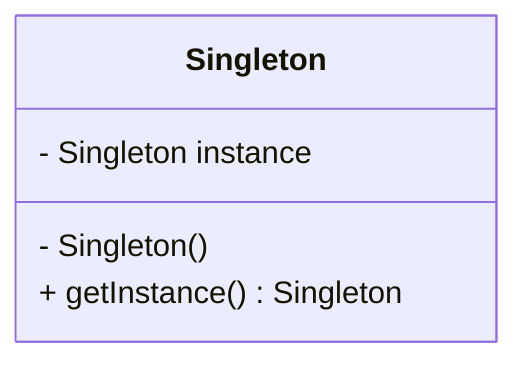
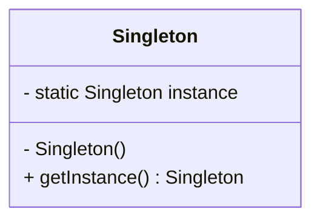

## 6.6.3 Lazy Initialization vs. Eager Initialization

In the realm of software design patterns, the Singleton pattern stands out as a creational pattern that ensures a class has only one instance and provides a global point of access to it. Within the Singleton pattern, two primary initialization strategies are employed: **Lazy Initialization** and **Eager Initialization**. Understanding these strategies is crucial for optimizing performance and resource utilization in Java applications.

### Lazy Initialization

**Lazy Initialization** is a technique where the instance of a class is not created until it is needed. This approach is particularly useful when the instance is resource-intensive to create or when it may not be used at all during the application's lifecycle.

#### Intent

- **Description**: Lazy Initialization delays the creation of an object until the first time it is accessed. This can lead to performance improvements by avoiding unnecessary computations and resource allocations.

#### Motivation

Lazy Initialization is motivated by the need to optimize resource usage and improve application startup times. By deferring the creation of an object, applications can reduce their initial memory footprint and only incur the cost of object creation when absolutely necessary.

#### Applicability

- **Guidelines**: Use Lazy Initialization when:
  - The object is resource-intensive to create.
  - The object may not be used during the application's lifecycle.
  - You want to improve application startup time.

#### Structure



- **Caption**: Diagram illustrating the structure of a Singleton class using Lazy Initialization.

#### Participants

- **Singleton**: The class that manages its own instance and provides a method to access it.

#### Collaborations

- **Interactions**: The Singleton class checks if its instance is null before creating it, ensuring that the object is only instantiated when needed.

#### Consequences

- **Analysis**: Lazy Initialization can lead to improved performance and reduced resource usage. However, it may introduce thread-safety issues in a multithreaded environment.

#### Implementation

- **Implementation Guidelines**: Ensure thread safety when implementing Lazy Initialization, especially in a multithreaded context.

- **Sample Code Snippets**:

```java
public class LazySingleton {
    private static LazySingleton instance;

    private LazySingleton() {
        // Private constructor to prevent instantiation
    }

    public static LazySingleton getInstance() {
        if (instance == null) {
            instance = new LazySingleton();
        }
        return instance;
    }
}
```

- **Explanation**: The `getInstance()` method checks if the instance is null before creating it, ensuring that the Singleton is only instantiated when needed.

#### Sample Use Cases

- **Real-world Scenarios**: Lazy Initialization is commonly used in scenarios where the Singleton object is expensive to create, such as database connections or configuration managers.

#### Related Patterns

- **Connections**: Lazy Initialization is often compared with Eager Initialization, as both are strategies for implementing the Singleton pattern.

#### Known Uses

- **Examples in Libraries or Frameworks**: Lazy Initialization is used in various Java frameworks, such as Spring, to defer bean creation until they are needed.

### Eager Initialization

**Eager Initialization** is a strategy where the instance of a class is created at the time of class loading. This approach is straightforward and ensures that the instance is available immediately when needed.

#### Intent

- **Description**: Eager Initialization creates the Singleton instance at class loading time, ensuring that it is readily available for use.

#### Motivation

Eager Initialization is motivated by the need for simplicity and thread safety. By creating the instance at class loading time, developers can avoid the complexities of synchronized access in a multithreaded environment.

#### Applicability

- **Guidelines**: Use Eager Initialization when:
  - The object is lightweight and inexpensive to create.
  - The object will definitely be used during the application's lifecycle.
  - You want to ensure thread safety without additional synchronization.

#### Structure



- **Caption**: Diagram illustrating the structure of a Singleton class using Eager Initialization.

#### Participants

- **Singleton**: The class that manages its own instance and provides a method to access it.

#### Collaborations

- **Interactions**: The Singleton class creates its instance at class loading time, ensuring that it is available immediately when needed.

#### Consequences

- **Analysis**: Eager Initialization is simple and thread-safe. However, it may lead to unnecessary resource usage if the instance is never used.

#### Implementation

- **Implementation Guidelines**: Ensure that the instance is lightweight and inexpensive to create.

- **Sample Code Snippets**:

```java
public class EagerSingleton {
    private static final EagerSingleton instance = new EagerSingleton();

    private EagerSingleton() {
        // Private constructor to prevent instantiation
    }

    public static EagerSingleton getInstance() {
        return instance;
    }
}
```

- **Explanation**: The instance is created at class loading time, ensuring that it is available immediately when needed.

#### Sample Use Cases

- **Real-world Scenarios**: Eager Initialization is suitable for lightweight objects that are guaranteed to be used, such as configuration settings or utility classes.

#### Related Patterns

- **Connections**: Eager Initialization is often compared with Lazy Initialization, as both are strategies for implementing the Singleton pattern.

#### Known Uses

- **Examples in Libraries or Frameworks**: Eager Initialization is used in various Java frameworks for lightweight objects that are guaranteed to be used.

### Comparison of Lazy and Eager Initialization

| Aspect                | Lazy Initialization                                   | Eager Initialization                                  |
|-----------------------|--------------------------------------------------------|-------------------------------------------------------|
| **Creation Time**     | Delayed until first use                                | At class loading time                                 |
| **Resource Usage**    | Potentially lower if the instance is never used        | Higher if the instance is never used                  |
| **Thread Safety**     | Requires additional synchronization for thread safety  | Thread-safe without additional synchronization        |
| **Complexity**        | More complex due to synchronization requirements       | Simpler implementation                                |
| **Performance**       | Can improve startup time and reduce memory footprint   | Immediate availability but potentially higher memory usage |

### Best Practices and Considerations

- **Thread Safety**: Ensure thread safety when implementing Lazy Initialization. Consider using the `synchronized` keyword or the `volatile` keyword to prevent multiple threads from creating multiple instances.
- **Resource Management**: Evaluate the resource cost of creating the Singleton instance. Use Lazy Initialization for resource-intensive objects and Eager Initialization for lightweight objects.
- **Application Requirements**: Consider the application's requirements and usage patterns when choosing between Lazy and Eager Initialization.

### Conclusion

Lazy and Eager Initialization are two strategies for implementing the Singleton pattern in Java. Each approach has its own benefits and drawbacks, and the choice between them depends on the specific requirements of the application. By understanding the differences between these strategies, developers can make informed decisions to optimize performance and resource utilization in their Java applications.

## Test Your Knowledge: Lazy vs. Eager Initialization Quiz



### What is the primary benefit of Lazy Initialization?

- [x] It delays instance creation until needed, reducing resource usage.
- [ ] It ensures thread safety without additional synchronization.
- [ ] It creates the instance at class loading time.
- [ ] It simplifies the implementation of the Singleton pattern.

> **Explanation:** Lazy Initialization delays the creation of an object until it is needed, which can reduce resource usage if the instance is never used.

### Which initialization strategy is more suitable for lightweight objects that are guaranteed to be used?

- [ ] Lazy Initialization
- [x] Eager Initialization
- [ ] Both are equally suitable
- [ ] Neither is suitable

> **Explanation:** Eager Initialization is more suitable for lightweight objects that are guaranteed to be used, as it creates the instance at class loading time.

### What is a potential drawback of Eager Initialization?

- [ ] It requires additional synchronization for thread safety.
- [x] It may lead to unnecessary resource usage if the instance is never used.
- [ ] It delays instance creation until needed.
- [ ] It increases the complexity of the implementation.

> **Explanation:** Eager Initialization may lead to unnecessary resource usage if the instance is never used, as it creates the instance at class loading time.

### How can thread safety be ensured in Lazy Initialization?

- [x] By using the `synchronized` keyword or the `volatile` keyword.
- [ ] By creating the instance at class loading time.
- [ ] By delaying instance creation until needed.
- [ ] By simplifying the implementation of the Singleton pattern.

> **Explanation:** Thread safety in Lazy Initialization can be ensured by using the `synchronized` keyword or the `volatile` keyword to prevent multiple threads from creating multiple instances.

### Which initialization strategy can improve application startup time?

- [x] Lazy Initialization
- [ ] Eager Initialization
- [ ] Both can improve startup time
- [ ] Neither can improve startup time

> **Explanation:** Lazy Initialization can improve application startup time by delaying the creation of an object until it is needed, reducing the initial memory footprint.

### What is the primary benefit of Eager Initialization?

- [ ] It delays instance creation until needed.
- [x] It ensures thread safety without additional synchronization.
- [ ] It reduces resource usage if the instance is never used.
- [ ] It increases the complexity of the implementation.

> **Explanation:** Eager Initialization ensures thread safety without additional synchronization by creating the instance at class loading time.

### Which initialization strategy is more complex due to synchronization requirements?

- [x] Lazy Initialization
- [ ] Eager Initialization
- [ ] Both are equally complex
- [ ] Neither is complex

> **Explanation:** Lazy Initialization is more complex due to synchronization requirements, as it requires additional synchronization to ensure thread safety.

### What is a potential benefit of Lazy Initialization in terms of performance?

- [x] It can reduce memory footprint and improve startup time.
- [ ] It ensures thread safety without additional synchronization.
- [ ] It creates the instance at class loading time.
- [ ] It simplifies the implementation of the Singleton pattern.

> **Explanation:** Lazy Initialization can reduce memory footprint and improve startup time by delaying the creation of an object until it is needed.

### Which initialization strategy is thread-safe without additional synchronization?

- [ ] Lazy Initialization
- [x] Eager Initialization
- [ ] Both are thread-safe without additional synchronization
- [ ] Neither is thread-safe without additional synchronization

> **Explanation:** Eager Initialization is thread-safe without additional synchronization, as it creates the instance at class loading time.

### True or False: Lazy Initialization always leads to better performance than Eager Initialization.

- [ ] True
- [x] False

> **Explanation:** False. Lazy Initialization can lead to better performance in terms of reduced memory footprint and improved startup time, but it may introduce thread-safety issues and complexity. The choice between Lazy and Eager Initialization depends on the specific requirements of the application.



By understanding and applying the concepts of Lazy and Eager Initialization, Java developers can optimize their applications for performance and resource utilization, ensuring that Singleton instances are created efficiently and effectively.
