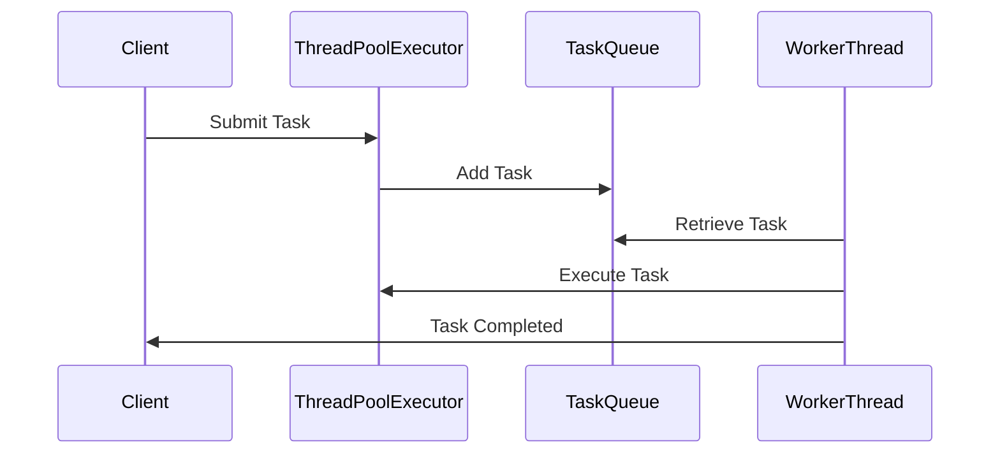

## 6.6.3 Monitoring and Tuning

In the realm of Java concurrency, the Thread Pool Pattern is a cornerstone for managing multiple threads efficiently. However, to harness its full potential, it is crucial to monitor and tune thread pools effectively. This section delves into the best practices for managing thread pools, including monitoring performance and tuning settings to optimize concurrency in Java applications.

### Understanding Thread Pool Metrics

Before diving into monitoring and tuning, it's essential to understand the key metrics associated with thread pools:

- **Thread Usage**: The number of active threads in the pool at any given time.
- **Queue Sizes**: The number of tasks waiting in the queue to be executed.
- **Task Completion Times**: The time taken to complete individual tasks.
- **Rejection Count**: The number of tasks rejected due to a full queue.
- **Idle Threads**: Threads that are currently not executing any tasks.

### Tools and Techniques for Monitoring

Monitoring thread pools involves tracking these metrics to ensure that the system is performing optimally. Here are some tools and techniques to consider:

#### Java Management Extensions (JMX)

Java Management Extensions (JMX) is a powerful technology for monitoring and managing Java applications. It provides a standard way to instrument Java code, allowing you to monitor thread pools effectively.

- **Setting Up JMX**: Enable JMX in your Java application by adding the necessary JVM arguments. For example:
  ```shell
  -Dcom.sun.management.jmxremote
  -Dcom.sun.management.jmxremote.port=9010
  -Dcom.sun.management.jmxremote.authenticate=false
  -Dcom.sun.management.jmxremote.ssl=false
  ```

- **Using JMX to Monitor Thread Pools**: You can use JConsole or VisualVM to connect to your application and monitor thread pool metrics. These tools provide a graphical interface to view the number of active threads, queue sizes, and more.

#### Third-Party Libraries

Several third-party libraries can enhance monitoring capabilities:

- **Dropwizard Metrics**: This library provides a comprehensive suite of tools for monitoring and reporting on the performance of your application. It can be integrated with thread pools to track metrics like task execution times and queue sizes.

- **Prometheus and Grafana**: Use Prometheus to collect metrics and Grafana to visualize them. This combination is particularly useful for monitoring thread pools in a distributed system.

### Interpreting Metrics and Identifying Bottlenecks

Once you have set up monitoring, the next step is to interpret the metrics and identify any bottlenecks:

- **High Thread Usage**: If the number of active threads is consistently high, it may indicate that the pool size is too small for the workload.

- **Large Queue Sizes**: A large queue size suggests that tasks are arriving faster than they can be processed. This could be due to an undersized thread pool or inefficient task execution.

- **Long Task Completion Times**: If tasks are taking longer than expected to complete, investigate the task logic for potential inefficiencies.

- **Rejection Count**: A high rejection count indicates that the queue is full, and tasks are being rejected. This may require increasing the queue size or the thread pool size.

### Strategies for Tuning Thread Pools

Tuning thread pools involves adjusting their configuration to improve performance. Here are some strategies to consider:

#### Adjusting Pool Sizes

- **Core Pool Size**: This is the minimum number of threads that are always kept alive. Increase the core pool size if tasks are frequently queued.

- **Maximum Pool Size**: This is the maximum number of threads that can be created. Increase this if the core pool size is insufficient to handle peak loads.

- **Keep-Alive Time**: This is the time that excess idle threads will wait for new tasks before terminating. Adjust this to balance resource usage and responsiveness.

#### Splitting Workloads

- **Task Categorization**: Divide tasks into categories based on their resource requirements and execution times. Create separate thread pools for each category to optimize resource allocation.

- **Priority Queues**: Use priority queues to ensure that high-priority tasks are executed before low-priority ones.

#### Continuous Monitoring and Adjustment

- **Regular Reviews**: Continuously monitor thread pool metrics and adjust configurations as needed. This is especially important in production environments where workloads can change over time.

- **Automated Alerts**: Set up automated alerts to notify you of potential issues, such as high rejection counts or long task completion times.

### Code Example: Monitoring with JMX

Let's look at a simple example of how to monitor a thread pool using JMX:

```java
import java.util.concurrent.Executors;
import java.util.concurrent.ThreadPoolExecutor;
import java.util.concurrent.TimeUnit;

public class ThreadPoolMonitoring {

    public static void main(String[] args) {
        ThreadPoolExecutor executor = (ThreadPoolExecutor) Executors.newFixedThreadPool(5);

        for (int i = 0; i < 10; i++) {
            executor.submit(new Task());
        }

        // Monitor the thread pool
        System.out.println("Core Pool Size: " + executor.getCorePoolSize());
        System.out.println("Maximum Pool Size: " + executor.getMaximumPoolSize());
        System.out.println("Active Threads: " + executor.getActiveCount());
        System.out.println("Task Count: " + executor.getTaskCount());
        System.out.println("Completed Task Count: " + executor.getCompletedTaskCount());

        executor.shutdown();
    }

    static class Task implements Runnable {
        @Override
        public void run() {
            try {
                TimeUnit.SECONDS.sleep(2);
            } catch (InterruptedException e) {
                Thread.currentThread().interrupt();
            }
        }
    }
}
```

### Try It Yourself

Experiment with the code example by:

- **Changing the Pool Size**: Modify the number of threads in the pool and observe how it affects the metrics.
- **Adding More Tasks**: Increase the number of tasks submitted to the pool and see how the queue size and task completion times change.
- **Simulating Long-Running Tasks**: Alter the `Task` class to simulate longer execution times and monitor the impact on thread usage.

### Visualizing Thread Pool Monitoring

To better understand the flow of tasks and threads in a thread pool, let's visualize it using a sequence diagram:



**Diagram Description**: This sequence diagram illustrates the interaction between a client, thread pool executor, task queue, and worker threads. It shows how tasks are submitted, queued, and executed by worker threads.

### References and Further Reading

- [Java Management Extensions (JMX)](https://docs.oracle.com/javase/8/docs/technotes/guides/management/overview.html)
- [Dropwizard Metrics](https://metrics.dropwizard.io/4.1.2/)
- [Prometheus](https://prometheus.io/)
- [Grafana](https://grafana.com/)

### Knowledge Check

- **Question**: What does a high rejection count in a thread pool indicate?
- **Exercise**: Modify the code example to use a `ScheduledThreadPoolExecutor` and observe how it handles scheduled tasks.

### Embrace the Journey

Remember, monitoring and tuning thread pools is an ongoing process. As your application evolves, so will its concurrency requirements. Stay vigilant, keep experimenting, and enjoy the journey of optimizing your Java applications for peak performance!

## Quiz Time!



### What is the primary purpose of monitoring thread pools?

- [x] To ensure optimal performance and resource utilization
- [ ] To increase the number of threads indefinitely
- [ ] To reduce the number of tasks processed
- [ ] To disable thread pooling

> **Explanation:** Monitoring thread pools helps ensure that resources are used efficiently and performance is optimized.

### Which tool can be used to monitor Java applications using JMX?

- [x] JConsole
- [ ] Eclipse
- [ ] IntelliJ IDEA
- [ ] NetBeans

> **Explanation:** JConsole is a tool that can connect to Java applications using JMX for monitoring purposes.

### What does a large queue size in a thread pool indicate?

- [x] Tasks are arriving faster than they can be processed
- [ ] The pool size is too large
- [ ] There are no tasks in the queue
- [ ] The system is idle

> **Explanation:** A large queue size suggests that tasks are being queued faster than they are being processed, indicating a potential bottleneck.

### How can you adjust the responsiveness of a thread pool?

- [x] By adjusting the keep-alive time for idle threads
- [ ] By increasing the number of tasks
- [ ] By decreasing the maximum pool size
- [ ] By disabling the queue

> **Explanation:** Adjusting the keep-alive time can help balance resource usage and responsiveness.

### What is a benefit of using priority queues in thread pools?

- [x] Ensures high-priority tasks are executed first
- [ ] Increases the number of threads
- [ ] Reduces task execution time
- [ ] Eliminates the need for monitoring

> **Explanation:** Priority queues allow high-priority tasks to be executed before lower-priority ones, optimizing task handling.

### Which library provides tools for monitoring Java application performance?

- [x] Dropwizard Metrics
- [ ] Apache Commons
- [ ] Log4j
- [ ] JUnit

> **Explanation:** Dropwizard Metrics offers a suite of tools for monitoring and reporting on Java application performance.

### What does a high rejection count in a thread pool typically indicate?

- [x] The queue is full, and tasks are being rejected
- [ ] The pool size is too large
- [ ] Tasks are completing too quickly
- [ ] There are no tasks to process

> **Explanation:** A high rejection count means the queue is full, and new tasks are being rejected.

### How can you visualize thread pool interactions?

- [x] Using sequence diagrams
- [ ] Using bar charts
- [ ] Using pie charts
- [ ] Using histograms

> **Explanation:** Sequence diagrams effectively illustrate the interactions between components in a thread pool.

### What is the role of Java Management Extensions (JMX) in monitoring?

- [x] It provides a standard way to instrument Java code for monitoring
- [ ] It increases the number of threads
- [ ] It reduces task execution time
- [ ] It disables thread pooling

> **Explanation:** JMX offers a standard method for monitoring and managing Java applications.

### True or False: Continuous monitoring of thread pools is only necessary during development.

- [ ] True
- [x] False

> **Explanation:** Continuous monitoring is crucial in production environments to ensure ongoing optimal performance.


