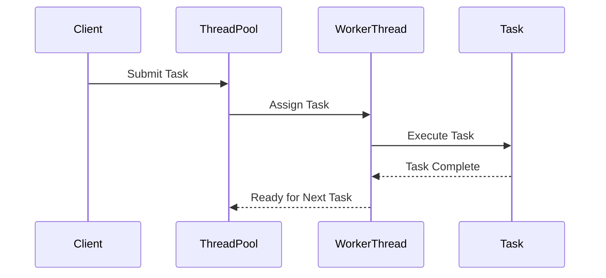

## 6.6.4 Use Cases and Examples

The Thread Pool pattern is a cornerstone of efficient concurrent programming in Java. By managing a pool of reusable threads, it allows applications to handle multiple tasks simultaneously without the overhead of constantly creating and destroying threads. This section delves into practical applications of the Thread Pool pattern, illustrating its use in web servers, batch processing systems, and asynchronous messaging systems. We'll explore how thread pools enhance throughput and resource utilization, provide code examples, and discuss challenges such as task coordination and exception handling.

### Web Server Handling HTTP Requests

Web servers are quintessential examples of systems that benefit from the Thread Pool pattern. When a web server receives HTTP requests, it must handle them concurrently to provide timely responses. Creating a new thread for each request is inefficient and can lead to resource exhaustion. Instead, a thread pool can be used to manage a fixed number of threads that process incoming requests.

#### Code Example: Simple Web Server with Thread Pool

Let's consider a simple web server that uses a thread pool to handle HTTP requests. We'll use Java's `ExecutorService` to manage the thread pool.

```java
import java.io.IOException;
import java.net.ServerSocket;
import java.net.Socket;
import java.util.concurrent.ExecutorService;
import java.util.concurrent.Executors;

public class SimpleWebServer {
    private static final int PORT = 8080;
    private static final int THREAD_POOL_SIZE = 10;

    public static void main(String[] args) {
        ExecutorService threadPool = Executors.newFixedThreadPool(THREAD_POOL_SIZE);

        try (ServerSocket serverSocket = new ServerSocket(PORT)) {
            System.out.println("Web server started on port " + PORT);

            while (true) {
                Socket clientSocket = serverSocket.accept();
                threadPool.execute(new RequestHandler(clientSocket));
            }
        } catch (IOException e) {
            e.printStackTrace();
        } finally {
            threadPool.shutdown();
        }
    }
}

class RequestHandler implements Runnable {
    private final Socket clientSocket;

    public RequestHandler(Socket clientSocket) {
        this.clientSocket = clientSocket;
    }

    @Override
    public void run() {
        // Handle the request here
        System.out.println("Handling request from " + clientSocket.getRemoteSocketAddress());
        // Close the socket after handling the request
        try {
            clientSocket.close();
        } catch (IOException e) {
            e.printStackTrace();
        }
    }
}
```

In this example, the `SimpleWebServer` listens for incoming connections on port 8080. When a connection is accepted, it delegates the request handling to a `RequestHandler` using a thread from the pool. This approach ensures that the server can handle multiple requests concurrently without overwhelming the system.

#### Benefits of Using Thread Pools in Web Servers

- **Improved Throughput**: By reusing threads, the server can handle more requests per second compared to creating a new thread for each request.
- **Resource Management**: Limits the number of concurrent threads, preventing resource exhaustion.
- **Reduced Latency**: Minimizes the time spent on thread creation and destruction, leading to faster response times.

### Batch Processing Systems

Batch processing systems often need to execute a large number of tasks in parallel. Using a thread pool allows these systems to distribute tasks across multiple threads, leveraging multi-core processors for improved performance.

#### Code Example: Batch Processing with Thread Pool

Consider a batch processing system that processes a list of tasks using a thread pool.

```java
import java.util.List;
import java.util.concurrent.ExecutorService;
import java.util.concurrent.Executors;
import java.util.concurrent.TimeUnit;

public class BatchProcessor {
    private static final int THREAD_POOL_SIZE = 5;

    public static void main(String[] args) {
        ExecutorService threadPool = Executors.newFixedThreadPool(THREAD_POOL_SIZE);

        List<Runnable> tasks = List.of(
            new Task("Task 1"),
            new Task("Task 2"),
            new Task("Task 3"),
            new Task("Task 4"),
            new Task("Task 5")
        );

        for (Runnable task : tasks) {
            threadPool.execute(task);
        }

        threadPool.shutdown();
        try {
            if (!threadPool.awaitTermination(60, TimeUnit.SECONDS)) {
                threadPool.shutdownNow();
            }
        } catch (InterruptedException e) {
            threadPool.shutdownNow();
        }
    }
}

class Task implements Runnable {
    private final String name;

    public Task(String name) {
        this.name = name;
    }

    @Override
    public void run() {
        System.out.println(name + " is being processed by " + Thread.currentThread().getName());
        try {
            Thread.sleep(2000); // Simulate processing time
        } catch (InterruptedException e) {
            Thread.currentThread().interrupt();
        }
    }
}
```

In this example, the `BatchProcessor` creates a fixed thread pool and submits a list of tasks for execution. Each task is processed by a thread from the pool, allowing multiple tasks to run concurrently.

#### Benefits of Using Thread Pools in Batch Processing

- **Parallel Execution**: Distributes tasks across multiple threads, maximizing CPU utilization.
- **Scalability**: Easily scales with the number of tasks and available resources.
- **Efficiency**: Reduces the overhead of thread management, focusing resources on task execution.

### Asynchronous Messaging Systems

In messaging systems, asynchronous processing of messages is crucial for maintaining high throughput and responsiveness. Thread pools can be used to process messages concurrently, ensuring that the system can handle a high volume of messages without delay.

#### Code Example: Asynchronous Message Processing with Thread Pool

Let's look at an example where a messaging system processes incoming messages using a thread pool.

```java
import java.util.concurrent.BlockingQueue;
import java.util.concurrent.ExecutorService;
import java.util.concurrent.Executors;
import java.util.concurrent.LinkedBlockingQueue;

public class MessagingSystem {
    private static final int THREAD_POOL_SIZE = 3;
    private static final BlockingQueue<String> messageQueue = new LinkedBlockingQueue<>();

    public static void main(String[] args) {
        ExecutorService threadPool = Executors.newFixedThreadPool(THREAD_POOL_SIZE);

        // Simulate incoming messages
        new Thread(() -> {
            for (int i = 1; i <= 10; i++) {
                try {
                    messageQueue.put("Message " + i);
                } catch (InterruptedException e) {
                    Thread.currentThread().interrupt();
                }
            }
        }).start();

        // Process messages using the thread pool
        for (int i = 0; i < THREAD_POOL_SIZE; i++) {
            threadPool.execute(new MessageProcessor());
        }

        threadPool.shutdown();
    }
}

class MessageProcessor implements Runnable {
    @Override
    public void run() {
        while (true) {
            try {
                String message = MessagingSystem.messageQueue.take();
                System.out.println(Thread.currentThread().getName() + " processing " + message);
                // Simulate message processing time
                Thread.sleep(1000);
            } catch (InterruptedException e) {
                Thread.currentThread().interrupt();
                break;
            }
        }
    }
}
```

In this example, the `MessagingSystem` uses a `LinkedBlockingQueue` to hold incoming messages. A separate thread simulates message arrival, while the thread pool processes messages concurrently. This setup allows the system to handle a high volume of messages efficiently.

#### Benefits of Using Thread Pools in Messaging Systems

- **High Throughput**: Processes multiple messages simultaneously, increasing system capacity.
- **Responsiveness**: Quickly handles incoming messages, reducing wait times.
- **Resource Optimization**: Balances load across available threads, preventing bottlenecks.

### Challenges and Considerations

While thread pools offer significant advantages, they also introduce challenges that must be addressed to ensure effective implementation.

#### Task Coordination

Coordinating tasks within a thread pool requires careful management to avoid issues such as deadlocks and race conditions. It's essential to design tasks that are independent and do not rely on shared resources without proper synchronization.

#### Exception Handling

Exceptions within tasks can disrupt the execution flow and potentially leave the system in an inconsistent state. Implement robust exception handling within tasks to ensure that failures are managed gracefully.

#### Resource Management

Configuring the thread pool size is critical to balancing performance and resource utilization. A pool that's too small may lead to underutilization, while a pool that's too large can exhaust system resources.

#### Monitoring and Tuning

Regularly monitor the performance of the thread pool and adjust configurations as necessary. Use profiling tools to identify bottlenecks and optimize thread usage.

### Try It Yourself

Experiment with the provided code examples by modifying the number of threads in the pool or the number of tasks/messages. Observe how these changes affect performance and resource utilization. Consider implementing additional features such as task prioritization or dynamic thread pool resizing.

### Visualizing Thread Pool Workflow

To better understand the workflow of a thread pool, let's visualize the process using a sequence diagram.



This diagram illustrates the interaction between a client submitting a task, the thread pool assigning the task to a worker thread, and the worker thread executing the task. Once the task is complete, the worker thread returns to the pool, ready to handle the next task.

### Conclusion

The Thread Pool pattern is an indispensable tool for building efficient, scalable concurrent applications in Java. By reusing threads, it reduces the overhead associated with thread creation and destruction, improving throughput and resource utilization. Whether you're developing a web server, batch processing system, or messaging system, leveraging thread pools can significantly enhance performance.

Remember, this is just the beginning. As you progress, you'll build more complex and interactive systems. Keep experimenting, stay curious, and enjoy the journey!

## Quiz Time!



### What is a key benefit of using a thread pool in a web server?

- [x] Improved throughput by reusing threads
- [ ] Increased latency due to thread management
- [ ] Reduced server capacity
- [ ] Higher memory usage

> **Explanation:** Thread pools improve throughput by reusing threads, reducing the overhead of creating and destroying threads for each request.


### In the batch processing example, what is the main advantage of using a thread pool?

- [x] Parallel execution of tasks
- [ ] Sequential task processing
- [ ] Increased task latency
- [ ] Reduced CPU utilization

> **Explanation:** Thread pools allow tasks to be executed in parallel, maximizing CPU utilization and improving performance.


### What challenge is associated with task coordination in thread pools?

- [x] Avoiding deadlocks and race conditions
- [ ] Ensuring tasks are dependent on each other
- [ ] Increasing task interdependence
- [ ] Reducing task independence

> **Explanation:** Task coordination involves managing dependencies and synchronization to prevent issues like deadlocks and race conditions.


### How can exceptions within tasks be managed effectively?

- [x] Implement robust exception handling within tasks
- [ ] Ignore exceptions to maintain flow
- [ ] Log exceptions without handling
- [ ] Terminate the thread pool on exceptions

> **Explanation:** Robust exception handling ensures that failures are managed gracefully, preventing disruptions in execution flow.


### What is a potential downside of configuring a thread pool with too many threads?

- [x] Exhausting system resources
- [ ] Underutilization of resources
- [ ] Reduced task throughput
- [ ] Increased task latency

> **Explanation:** A thread pool with too many threads can exhaust system resources, leading to performance degradation.


### What tool can be used to monitor and optimize thread pool performance?

- [x] Profiling tools
- [ ] Debugging tools
- [ ] Text editors
- [ ] Version control systems

> **Explanation:** Profiling tools help identify bottlenecks and optimize thread usage for better performance.


### What does the sequence diagram illustrate in the context of a thread pool?

- [x] Interaction between client, thread pool, worker thread, and task
- [ ] Data flow between client and server
- [ ] Network communication between servers
- [ ] User interface interactions

> **Explanation:** The sequence diagram shows the workflow of task submission, assignment, execution, and completion within a thread pool.


### What is the role of a worker thread in a thread pool?

- [x] Execute assigned tasks
- [ ] Submit tasks to the pool
- [ ] Monitor task execution
- [ ] Manage thread pool configuration

> **Explanation:** Worker threads execute tasks assigned by the thread pool, handling the actual processing.


### How does a thread pool improve resource management in a web server?

- [x] Limits the number of concurrent threads
- [ ] Increases the number of threads indefinitely
- [ ] Reduces the number of requests handled
- [ ] Decreases server capacity

> **Explanation:** By limiting the number of concurrent threads, a thread pool prevents resource exhaustion and optimizes resource usage.


### True or False: Thread pools can be used to process messages asynchronously in a messaging system.

- [x] True
- [ ] False

> **Explanation:** Thread pools are effective for asynchronous message processing, allowing multiple messages to be handled concurrently.


