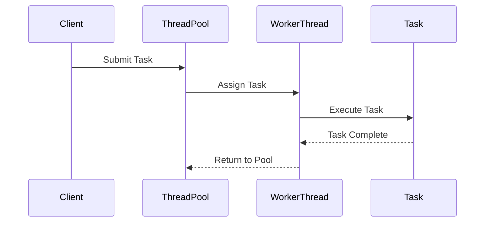

## 6.6 Thread Pool Pattern

In the realm of concurrent programming, the Thread Pool pattern stands out as a pivotal design strategy that enhances the efficiency and performance of applications by managing a pool of reusable threads. This pattern is particularly beneficial in environments where tasks are short-lived and frequent, such as web servers and concurrent processing systems. Let's delve into the intricacies of the Thread Pool pattern, exploring its intent, the problems it addresses, and its implementation in Java.

### Understanding the Thread Pool Pattern

The Thread Pool pattern is a concurrency design pattern that manages a collection of pre-instantiated, reusable threads. These threads are used to execute tasks, thereby reducing the overhead associated with creating and destroying threads for each task. By maintaining a pool of threads, the pattern ensures that system resources are utilized efficiently, leading to improved application performance and responsiveness.

#### Intent of the Thread Pool Pattern

The primary intent of the Thread Pool pattern is to:

- **Enhance Performance**: By reusing existing threads, the pattern minimizes the time and resources spent on thread creation and destruction.
- **Optimize Resource Utilization**: It ensures that a fixed number of threads are used, preventing resource exhaustion and maintaining system stability.
- **Simplify Task Management**: The pattern provides a structured way to manage and execute tasks concurrently, improving code organization and maintainability.

### The Problem: Overhead of Creating and Destroying Threads

In a typical multithreaded application, each task may require a new thread for execution. However, creating and destroying threads is a resource-intensive process that can lead to significant overhead, especially in applications with high task throughput. This overhead can result in:

- **Increased Latency**: The time taken to create and destroy threads can add latency to task execution.
- **Resource Exhaustion**: Unchecked thread creation can lead to resource exhaustion, causing the application to crash or become unresponsive.
- **Complex Thread Management**: Managing a large number of threads can complicate the application's architecture and increase the likelihood of concurrency-related bugs.

### The Solution: Efficient Execution with Thread Pools

The Thread Pool pattern addresses these challenges by maintaining a pool of reusable threads. When a task needs to be executed, a thread from the pool is assigned to it. Once the task is complete, the thread is returned to the pool, ready to be reused for another task. This approach offers several benefits:

- **Reduced Overhead**: By reusing threads, the pattern significantly reduces the overhead associated with thread creation and destruction.
- **Controlled Resource Usage**: The number of threads in the pool can be controlled, preventing resource exhaustion and ensuring system stability.
- **Improved Task Throughput**: With threads readily available, tasks can be executed more quickly, improving overall application throughput.

### Components of the Thread Pool Pattern

The Thread Pool pattern consists of several key components that work together to manage task execution efficiently:

1. **Thread Pool Manager**: This component is responsible for managing the lifecycle of the threads in the pool. It handles thread creation, assignment, and destruction, ensuring that the pool operates efficiently.

2. **Work Queue**: Tasks that need to be executed are placed in a work queue. The queue acts as a buffer, holding tasks until a thread becomes available to execute them. This decouples task submission from execution, allowing tasks to be submitted even when no threads are available.

3. **Worker Threads**: These are the threads that execute the tasks. Each worker thread retrieves a task from the work queue and executes it. Once the task is complete, the thread returns to the pool, ready to execute another task.

4. **Task Interface**: Tasks submitted to the thread pool must implement a specific interface, typically `Runnable` or `Callable`, which defines the task's execution logic.

### Preparing for Implementation

Before diving into the implementation details, it's important to consider several factors that can influence the design and performance of a thread pool:

- **Pool Size**: The number of threads in the pool should be carefully chosen based on the application's workload and the system's capabilities. A pool that is too small may lead to task queuing and increased latency, while a pool that is too large can exhaust system resources.

- **Task Characteristics**: Understanding the nature of the tasks to be executed (e.g., CPU-bound vs. I/O-bound) can help in tuning the thread pool for optimal performance.

- **Error Handling**: Implementing robust error handling mechanisms is crucial to ensure that the thread pool can recover from task failures and continue operating smoothly.

- **Shutdown and Cleanup**: Proper shutdown and cleanup procedures should be implemented to gracefully terminate the thread pool and release resources when they are no longer needed.

### Implementation in Java

Java provides robust support for implementing the Thread Pool pattern through the `java.util.concurrent` package. The `ExecutorService` interface and its implementations, such as `ThreadPoolExecutor`, offer a flexible and efficient way to manage thread pools.

#### Basic Implementation

Let's start with a basic implementation of a thread pool using `ExecutorService`:

```java
import java.util.concurrent.ExecutorService;
import java.util.concurrent.Executors;

public class ThreadPoolExample {
    public static void main(String[] args) {
        // Create a fixed thread pool with 5 threads
        ExecutorService executor = Executors.newFixedThreadPool(5);

        // Submit tasks to the thread pool
        for (int i = 0; i < 10; i++) {
            Runnable task = new Task(i);
            executor.submit(task);
        }

        // Shutdown the executor
        executor.shutdown();
    }
}

class Task implements Runnable {
    private final int taskId;

    public Task(int taskId) {
        this.taskId = taskId;
    }

    @Override
    public void run() {
        System.out.println("Executing Task " + taskId + " on Thread " + Thread.currentThread().getName());
    }
}
```

In this example, we create a fixed thread pool with 5 threads using `Executors.newFixedThreadPool()`. We then submit 10 tasks to the pool, each represented by an instance of the `Task` class, which implements the `Runnable` interface. The `executor.shutdown()` method is called to initiate an orderly shutdown of the thread pool.

#### Advanced Configuration

For more advanced configurations, the `ThreadPoolExecutor` class provides additional options for customizing the behavior of the thread pool:

```java
import java.util.concurrent.*;

public class AdvancedThreadPoolExample {
    public static void main(String[] args) {
        // Create a custom thread pool
        ThreadPoolExecutor executor = new ThreadPoolExecutor(
                2, // core pool size
                4, // maximum pool size
                60, // keep-alive time
                TimeUnit.SECONDS,
                new LinkedBlockingQueue<Runnable>(2) // work queue
        );

        // Submit tasks to the thread pool
        for (int i = 0; i < 10; i++) {
            Runnable task = new Task(i);
            executor.submit(task);
        }

        // Shutdown the executor
        executor.shutdown();
    }
}
```

In this example, we create a `ThreadPoolExecutor` with a core pool size of 2, a maximum pool size of 4, and a keep-alive time of 60 seconds. The work queue is a `LinkedBlockingQueue` with a capacity of 2. This configuration allows for more fine-grained control over the thread pool's behavior.

### Use Cases for the Thread Pool Pattern

The Thread Pool pattern is vital in various scenarios where efficient task execution and resource management are crucial:

- **Web Servers**: In web servers, thread pools are used to handle incoming client requests concurrently. By reusing threads, the server can efficiently manage multiple connections without incurring the overhead of thread creation and destruction.

- **Concurrent Processing Applications**: Applications that perform concurrent data processing, such as batch processing systems or data analysis tools, benefit from thread pools by executing tasks in parallel, thereby reducing processing time.

- **Real-Time Systems**: In real-time systems, where timely task execution is critical, thread pools ensure that tasks are executed promptly by maintaining a ready pool of threads.

- **GUI Applications**: In GUI applications, thread pools can be used to offload background tasks, such as file I/O or network operations, ensuring that the user interface remains responsive.

### Visualizing the Thread Pool Pattern

To better understand the flow of tasks and threads in a thread pool, let's visualize the process using a sequence diagram:



In this diagram, we see the interaction between the client, the thread pool, worker threads, and tasks. The client submits a task to the thread pool, which assigns it to an available worker thread. The worker thread executes the task and, upon completion, returns to the pool, ready for the next task.

### Considerations and Best Practices

When implementing the Thread Pool pattern, consider the following best practices to ensure optimal performance and reliability:

- **Choose the Right Pool Size**: The optimal pool size depends on the nature of the tasks and the system's resources. For CPU-bound tasks, a pool size equal to the number of available processors is often ideal. For I/O-bound tasks, a larger pool size may be beneficial.

- **Monitor and Tune**: Regularly monitor the performance of the thread pool and adjust its configuration as needed. Tools like Java Mission Control and VisualVM can help identify bottlenecks and optimize performance.

- **Handle Exceptions Gracefully**: Implement robust exception handling within tasks to prevent thread termination due to unhandled exceptions. Consider using `ThreadPoolExecutor.setUncaughtExceptionHandler()` to handle uncaught exceptions at the pool level.

- **Implement Proper Shutdown**: Ensure that the thread pool is properly shut down when the application is terminated. Use `executor.shutdown()` for an orderly shutdown and `executor.shutdownNow()` for an immediate shutdown.

### Try It Yourself

To gain hands-on experience with the Thread Pool pattern, try modifying the code examples provided:

- **Experiment with Different Pool Sizes**: Change the number of threads in the pool and observe how it affects task execution and system performance.

- **Implement a Custom Task**: Create a more complex task that performs I/O operations or computations, and observe how the thread pool handles it.

- **Add Error Handling**: Introduce error handling within the tasks to see how exceptions are managed in the thread pool.

### Knowledge Check

Before we conclude, let's reinforce your understanding of the Thread Pool pattern with a few questions:

- What are the main benefits of using a thread pool in a concurrent application?
- How does the Thread Pool pattern improve resource utilization and system performance?
- What factors should be considered when configuring a thread pool?

### Conclusion

The Thread Pool pattern is a powerful tool in the arsenal of any Java developer working with concurrent applications. By managing a pool of reusable threads, it enhances performance, optimizes resource utilization, and simplifies task management. As you continue to explore and implement this pattern, remember to consider the specific needs of your application and system to achieve the best results.

## Quiz Time!



### What is the primary intent of the Thread Pool pattern?

- [x] To enhance performance by reusing threads
- [ ] To simplify the creation of new threads
- [ ] To reduce the number of tasks in an application
- [ ] To eliminate the need for multithreading

> **Explanation:** The Thread Pool pattern enhances performance by reusing threads, reducing the overhead of creating and destroying threads for each task.

### Which component of the Thread Pool pattern is responsible for managing the lifecycle of threads?

- [ ] Work Queue
- [x] Thread Pool Manager
- [ ] Task Interface
- [ ] Worker Threads

> **Explanation:** The Thread Pool Manager is responsible for managing the lifecycle of threads, including creation, assignment, and destruction.

### How does the Thread Pool pattern improve resource utilization?

- [x] By maintaining a fixed number of reusable threads
- [ ] By creating new threads for each task
- [ ] By reducing the number of tasks in the system
- [ ] By eliminating the need for a work queue

> **Explanation:** The Thread Pool pattern maintains a fixed number of reusable threads, preventing resource exhaustion and optimizing resource utilization.

### What is a key benefit of using a work queue in the Thread Pool pattern?

- [x] It decouples task submission from execution
- [ ] It increases the number of threads in the pool
- [ ] It reduces the need for error handling
- [ ] It simplifies the creation of new tasks

> **Explanation:** The work queue decouples task submission from execution, allowing tasks to be submitted even when no threads are available.

### In which scenario is the Thread Pool pattern particularly beneficial?

- [x] Web servers handling multiple client requests
- [ ] Single-threaded applications
- [ ] Applications with no concurrency requirements
- [ ] Applications with low task throughput

> **Explanation:** The Thread Pool pattern is beneficial in web servers that handle multiple client requests concurrently, optimizing resource usage and performance.

### What should be considered when choosing the pool size for a thread pool?

- [x] The nature of the tasks and system resources
- [ ] The number of tasks in the application
- [ ] The number of users accessing the application
- [ ] The complexity of the application's architecture

> **Explanation:** The pool size should be chosen based on the nature of the tasks (CPU-bound vs. I/O-bound) and the system's resources to ensure optimal performance.

### How can exceptions be handled in a thread pool to prevent thread termination?

- [x] Implement robust exception handling within tasks
- [ ] Avoid using exception handling altogether
- [ ] Use a larger pool size to accommodate exceptions
- [ ] Submit tasks without any error handling

> **Explanation:** Implementing robust exception handling within tasks prevents thread termination due to unhandled exceptions, ensuring the pool continues to operate smoothly.

### What is the purpose of the `executor.shutdown()` method in a thread pool?

- [x] To initiate an orderly shutdown of the thread pool
- [ ] To immediately terminate all threads in the pool
- [ ] To increase the number of threads in the pool
- [ ] To submit new tasks to the pool

> **Explanation:** The `executor.shutdown()` method initiates an orderly shutdown of the thread pool, allowing previously submitted tasks to complete before termination.

### Which Java class provides advanced configuration options for thread pools?

- [ ] Executors
- [x] ThreadPoolExecutor
- [ ] Runnable
- [ ] Callable

> **Explanation:** The `ThreadPoolExecutor` class provides advanced configuration options for thread pools, allowing for fine-grained control over their behavior.

### True or False: The Thread Pool pattern eliminates the need for multithreading in applications.

- [ ] True
- [x] False

> **Explanation:** False. The Thread Pool pattern does not eliminate the need for multithreading; rather, it optimizes the management and execution of threads in concurrent applications.


