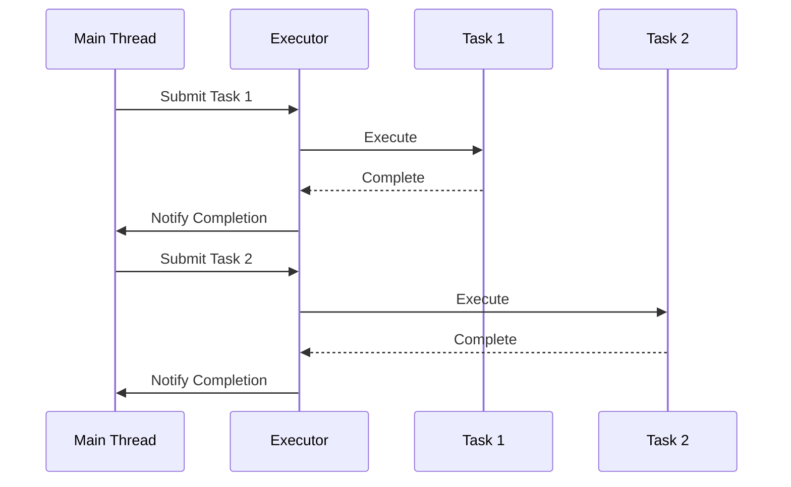

## 6.7.1 Implementing Future in Java

In the realm of Java concurrency, the `Future` interface and its more advanced counterpart, `CompletableFuture`, play pivotal roles in enabling asynchronous programming. These constructs allow developers to execute tasks asynchronously, improving application responsiveness and performance. In this section, we will delve into the intricacies of implementing `Future` in Java, explore the limitations of `Future`, and introduce the more powerful `CompletableFuture` and `CompletionStage` for advanced asynchronous computations.

### Understanding the Future Interface

The `Future` interface in Java, introduced in Java 5, represents the result of an asynchronous computation. It provides methods to check if the computation is complete, to wait for its completion, and to retrieve the result. Let's explore the key methods of the `Future` interface:

- **`get()`**: Waits for the computation to complete and retrieves its result. This method blocks the calling thread until the result is available.
- **`isDone()`**: Returns `true` if the computation is complete, regardless of whether it completed successfully or failed.
- **`cancel(boolean mayInterruptIfRunning)`**: Attempts to cancel the execution of the task.
- **`isCancelled()`**: Returns `true` if the task was cancelled before it completed.

#### Code Example: Using Future

```java
import java.util.concurrent.*;

public class FutureExample {
    public static void main(String[] args) {
        ExecutorService executor = Executors.newSingleThreadExecutor();
        
        Future<Integer> future = executor.submit(() -> {
            // Simulate a long-running task
            Thread.sleep(2000);
            return 42;
        });

        try {
            System.out.println("Future result: " + future.get()); // This will block until the result is available
        } catch (InterruptedException | ExecutionException e) {
            e.printStackTrace();
        } finally {
            executor.shutdown();
        }
    }
}
```

In this example, we submit a task to an `ExecutorService` that returns a `Future`. The `get()` method is called to retrieve the result, blocking the main thread until the task completes.

### Limitations of Future

While `Future` provides a basic mechanism for asynchronous computation, it has several limitations:

1. **Blocking Operations**: The `get()` method blocks the calling thread until the result is available, which can lead to performance bottlenecks.
2. **No Direct Support for Callbacks**: `Future` does not provide a way to specify actions to be performed upon task completion.
3. **No Chaining of Tasks**: It lacks the ability to chain multiple asynchronous tasks together.

### Introducing CompletableFuture

To overcome the limitations of `Future`, Java 8 introduced `CompletableFuture`, which implements both `Future` and `CompletionStage` interfaces. `CompletableFuture` provides a comprehensive API for asynchronous programming, including support for non-blocking operations, callbacks, and task chaining.

#### Key Features of CompletableFuture

- **Non-blocking Operations**: Methods like `thenApply`, `thenAccept`, and `thenRun` allow you to specify actions to be executed upon task completion without blocking.
- **Task Chaining**: `CompletableFuture` supports chaining of tasks, enabling complex asynchronous workflows.
- **Exception Handling**: Methods like `exceptionally` and `handle` provide mechanisms for handling exceptions in asynchronous computations.

#### Code Example: Using CompletableFuture

```java
import java.util.concurrent.CompletableFuture;

public class CompletableFutureExample {
    public static void main(String[] args) {
        CompletableFuture.supplyAsync(() -> {
            // Simulate a long-running task
            sleep(2000);
            return 42;
        }).thenApply(result -> {
            // Process the result
            return "Result: " + result;
        }).thenAccept(System.out::println)
          .exceptionally(ex -> {
              System.out.println("Exception: " + ex.getMessage());
              return null;
          });

        // Keep the main thread alive to see the result
        sleep(3000);
    }

    private static void sleep(int milliseconds) {
        try {
            Thread.sleep(milliseconds);
        } catch (InterruptedException e) {
            Thread.currentThread().interrupt();
        }
    }
}
```

In this example, `CompletableFuture.supplyAsync` is used to execute a task asynchronously. The `thenApply` method processes the result, and `thenAccept` prints it. The `exceptionally` method handles any exceptions that occur during the computation.

### Chaining Tasks with CompletableFuture

One of the most powerful features of `CompletableFuture` is its ability to chain tasks together. This allows you to build complex asynchronous workflows with ease.

#### Code Example: Chaining Tasks

```java
import java.util.concurrent.CompletableFuture;

public class CompletableFutureChaining {
    public static void main(String[] args) {
        CompletableFuture.supplyAsync(() -> {
            // First task
            sleep(1000);
            return "Task 1";
        }).thenCompose(result -> {
            // Second task, dependent on the first
            return CompletableFuture.supplyAsync(() -> {
                sleep(1000);
                return result + " -> Task 2";
            });
        }).thenCompose(result -> {
            // Third task, dependent on the second
            return CompletableFuture.supplyAsync(() -> {
                sleep(1000);
                return result + " -> Task 3";
            });
        }).thenAccept(System.out::println);

        // Keep the main thread alive to see the result
        sleep(4000);
    }

    private static void sleep(int milliseconds) {
        try {
            Thread.sleep(milliseconds);
        } catch (InterruptedException e) {
            Thread.currentThread().interrupt();
        }
    }
}
```

In this example, `thenCompose` is used to chain tasks together. Each task depends on the result of the previous one, allowing for sequential execution of asynchronous tasks.

### Handling Results with Callbacks

`CompletableFuture` provides several methods for handling results using callbacks. These methods allow you to specify actions to be performed when a computation completes, without blocking the calling thread.

#### Key Methods for Callbacks

- **`thenApply(Function)`**: Transforms the result of a computation.
- **`thenAccept(Consumer)`**: Consumes the result of a computation.
- **`thenRun(Runnable)`**: Executes a runnable after the computation completes.
- **`exceptionally(Function)`**: Handles exceptions that occur during the computation.
- **`handle(BiFunction)`**: Processes the result or exception of a computation.

#### Code Example: Handling Results with Callbacks

```java
import java.util.concurrent.CompletableFuture;

public class CompletableFutureCallbacks {
    public static void main(String[] args) {
        CompletableFuture.supplyAsync(() -> {
            // Simulate a task
            sleep(1000);
            return "Hello";
        }).thenApply(result -> result + " World")
          .thenAccept(System.out::println)
          .exceptionally(ex -> {
              System.out.println("Exception: " + ex.getMessage());
              return null;
          });

        // Keep the main thread alive to see the result
        sleep(2000);
    }

    private static void sleep(int milliseconds) {
        try {
            Thread.sleep(milliseconds);
        } catch (InterruptedException e) {
            Thread.currentThread().interrupt();
        }
    }
}
```

In this example, `thenApply` is used to transform the result, `thenAccept` prints it, and `exceptionally` handles any exceptions.

### Benefits of Non-blocking Operations

Non-blocking operations are a cornerstone of modern asynchronous programming. They allow applications to perform other tasks while waiting for a computation to complete, leading to improved responsiveness and resource utilization.

#### Advantages of Non-blocking Operations

- **Improved Responsiveness**: Non-blocking operations prevent the application from freezing while waiting for a task to complete.
- **Better Resource Utilization**: Threads can be used more efficiently, as they are not idly waiting for tasks to finish.
- **Enhanced Scalability**: Applications can handle more concurrent tasks without being constrained by thread availability.

### Thread Management Considerations

When working with asynchronous computations, it's crucial to manage threads effectively. `CompletableFuture` provides several methods for controlling the execution of tasks on different threads.

#### Key Thread Management Methods

- **`supplyAsync(Supplier)`**: Executes a task asynchronously using the common fork-join pool.
- **`supplyAsync(Supplier, Executor)`**: Executes a task asynchronously using a specified executor.
- **`runAsync(Runnable)`**: Executes a runnable asynchronously.
- **`runAsync(Runnable, Executor)`**: Executes a runnable asynchronously using a specified executor.

#### Code Example: Thread Management with CompletableFuture

```java
import java.util.concurrent.CompletableFuture;
import java.util.concurrent.ExecutorService;
import java.util.concurrent.Executors;

public class CompletableFutureThreadManagement {
    public static void main(String[] args) {
        ExecutorService executor = Executors.newFixedThreadPool(2);

        CompletableFuture.supplyAsync(() -> {
            // Task 1
            sleep(1000);
            return "Task 1";
        }, executor).thenAccept(result -> System.out.println("Result: " + result));

        CompletableFuture.runAsync(() -> {
            // Task 2
            sleep(1000);
            System.out.println("Task 2 completed");
        }, executor);

        // Allow time for tasks to complete
        sleep(3000);
        executor.shutdown();
    }

    private static void sleep(int milliseconds) {
        try {
            Thread.sleep(milliseconds);
        } catch (InterruptedException e) {
            Thread.currentThread().interrupt();
        }
    }
}
```

In this example, tasks are executed using a custom executor, allowing for more control over thread management.

### Try It Yourself

Experiment with the code examples provided by making the following modifications:

1. **Change the Executor**: Modify the executor to use a different thread pool configuration and observe the impact on task execution.
2. **Add More Tasks**: Add additional tasks to the `CompletableFuture` chains and explore how the results are combined.
3. **Handle Exceptions**: Introduce exceptions in the tasks and implement custom exception handling logic.

### Visualizing Asynchronous Computations

To better understand the flow of asynchronous computations, let's visualize the process using a sequence diagram.



This diagram illustrates the submission and execution of tasks in an asynchronous workflow. The main thread submits tasks to the executor, which executes them and notifies the main thread upon completion.

### References and Links

For further reading and deeper understanding of asynchronous programming in Java, consider exploring the following resources:

- [Java Concurrency in Practice](https://www.oreilly.com/library/view/java-concurrency-in/0321349601/) by Brian Goetz
- [CompletableFuture API Documentation](https://docs.oracle.com/javase/8/docs/api/java/util/concurrent/CompletableFuture.html)
- [Java 8 in Action](https://www.manning.com/books/java-8-in-action) by Raoul-Gabriel Urma, Mario Fusco, and Alan Mycroft

### Knowledge Check

To reinforce your understanding of implementing `Future` in Java, consider the following questions:

1. What are the main limitations of the `Future` interface?
2. How does `CompletableFuture` improve upon `Future`?
3. What are the benefits of non-blocking operations in asynchronous programming?
4. How can you manage threads effectively when using `CompletableFuture`?

### Embrace the Journey

Remember, mastering asynchronous programming in Java is a journey. As you explore and experiment with `Future` and `CompletableFuture`, you'll unlock new possibilities for building responsive and efficient applications. Keep experimenting, stay curious, and enjoy the journey!

## Quiz Time!



### What is a primary limitation of the `Future` interface in Java?

- [x] It blocks the calling thread until the result is available.
- [ ] It allows chaining of tasks.
- [ ] It supports non-blocking operations.
- [ ] It provides direct support for callbacks.

> **Explanation:** The `Future` interface blocks the calling thread when retrieving the result, which can lead to performance bottlenecks.

### Which method in `CompletableFuture` is used to transform the result of a computation?

- [x] thenApply
- [ ] thenAccept
- [ ] exceptionally
- [ ] handle

> **Explanation:** The `thenApply` method is used to transform the result of a computation in `CompletableFuture`.

### How does `CompletableFuture` handle exceptions in asynchronous computations?

- [x] Using methods like `exceptionally` and `handle`.
- [ ] By blocking the calling thread.
- [ ] By ignoring exceptions.
- [ ] By terminating the program.

> **Explanation:** `CompletableFuture` provides methods like `exceptionally` and `handle` to manage exceptions in asynchronous computations.

### What is the benefit of non-blocking operations in asynchronous programming?

- [x] Improved responsiveness and resource utilization.
- [ ] Increased blocking of threads.
- [ ] Reduced scalability.
- [ ] Decreased application performance.

> **Explanation:** Non-blocking operations improve application responsiveness and resource utilization, allowing for better performance and scalability.

### Which method in `CompletableFuture` allows you to execute a task asynchronously using a specified executor?

- [x] supplyAsync(Supplier, Executor)
- [ ] runAsync(Runnable)
- [ ] thenRun(Runnable)
- [ ] exceptionally(Function)

> **Explanation:** The `supplyAsync(Supplier, Executor)` method allows you to execute a task asynchronously using a specified executor.

### What is the role of the `thenCompose` method in `CompletableFuture`?

- [x] To chain tasks together, allowing for sequential execution.
- [ ] To handle exceptions.
- [ ] To block the calling thread.
- [ ] To execute a runnable after the computation completes.

> **Explanation:** The `thenCompose` method is used to chain tasks together, enabling sequential execution of asynchronous tasks.

### Which method in `CompletableFuture` is used to consume the result of a computation?

- [x] thenAccept
- [ ] thenApply
- [ ] handle
- [ ] exceptionally

> **Explanation:** The `thenAccept` method is used to consume the result of a computation in `CompletableFuture`.

### How can you manage threads effectively when using `CompletableFuture`?

- [x] By using custom executors with methods like `supplyAsync(Supplier, Executor)`.
- [ ] By blocking the main thread.
- [ ] By ignoring thread management.
- [ ] By using only the common fork-join pool.

> **Explanation:** Effective thread management can be achieved by using custom executors with methods like `supplyAsync(Supplier, Executor)`.

### What is the purpose of the `exceptionally` method in `CompletableFuture`?

- [x] To handle exceptions that occur during the computation.
- [ ] To transform the result of a computation.
- [ ] To execute a runnable after the computation completes.
- [ ] To block the calling thread.

> **Explanation:** The `exceptionally` method is used to handle exceptions that occur during the computation in `CompletableFuture`.

### True or False: `CompletableFuture` allows for non-blocking operations and task chaining.

- [x] True
- [ ] False

> **Explanation:** `CompletableFuture` supports non-blocking operations and task chaining, making it a powerful tool for asynchronous programming.




