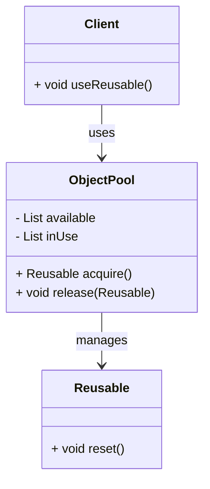

## 6.7.1 Implementing Object Pool in Java

The Object Pool pattern is a creational design pattern that provides a way to manage a set of initialized objects ready for use, rather than creating and destroying them on demand. This pattern is particularly useful in scenarios where object creation is costly in terms of time and resources, such as database connections, thread pools, or large data structures.

### Intent

The primary intent of the Object Pool pattern is to improve performance and resource utilization by reusing objects that are expensive to create. By maintaining a pool of reusable objects, the pattern minimizes the overhead associated with object instantiation and garbage collection.

### Benefits

- **Performance Improvement**: Reduces the time and resources required to create and destroy objects.
- **Resource Management**: Efficiently manages limited resources, such as database connections or network sockets.
- **Scalability**: Supports high-load scenarios by reusing objects and reducing the need for frequent garbage collection.

### Applicability

The Object Pool pattern is applicable in scenarios where:

- Object creation is expensive or time-consuming.
- There is a need to manage a limited number of resources.
- The system experiences high load and requires efficient resource utilization.

### Structure

The Object Pool pattern typically involves the following components:

- **Pool**: Manages the lifecycle of pooled objects, including creation, reuse, and destruction.
- **Reusable**: The objects that are managed by the pool.
- **Client**: The consumer of the pooled objects.



*Diagram: Structure of the Object Pool pattern, showing the relationships between the pool, reusable objects, and clients.*

### Implementation

#### Step-by-Step Implementation

1. **Define the Reusable Object**: Create a class representing the objects to be pooled. Ensure that these objects can be reset to a clean state before reuse.

```java
public class Reusable {
    // Example fields
    private String state;

    public Reusable() {
        // Initialize the object
    }

    public void reset() {
        // Reset the object to its initial state
        this.state = null;
    }

    // Additional methods
}
```

2. **Create the Object Pool**: Implement a class that manages the pool of reusable objects. This class should handle acquiring and releasing objects.

```java
import java.util.LinkedList;
import java.util.Queue;

public class ObjectPool {
    private final Queue<Reusable> available = new LinkedList<>();
    private final int maxPoolSize;

    public ObjectPool(int initialSize, int maxPoolSize) {
        this.maxPoolSize = maxPoolSize;
        for (int i = 0; i < initialSize; i++) {
            available.add(new Reusable());
        }
    }

    public synchronized Reusable acquire() {
        if (available.isEmpty()) {
            if (available.size() + inUse.size() < maxPoolSize) {
                available.add(new Reusable());
            } else {
                throw new RuntimeException("Max pool size reached");
            }
        }
        Reusable reusable = available.poll();
        inUse.add(reusable);
        return reusable;
    }

    public synchronized void release(Reusable reusable) {
        reusable.reset();
        inUse.remove(reusable);
        available.add(reusable);
    }
}
```

3. **Implement Thread Safety**: Use synchronization to ensure that the pool can be safely accessed by multiple threads.

4. **Manage Resource Limits**: Implement logic to handle scenarios where the pool reaches its maximum size.

#### Sample Code Snippets

```java
public class Client {
    private final ObjectPool pool;

    public Client(ObjectPool pool) {
        this.pool = pool;
    }

    public void useReusable() {
        Reusable reusable = pool.acquire();
        try {
            // Use the reusable object
        } finally {
            pool.release(reusable);
        }
    }
}
```

*Explanation*: The `Client` class demonstrates how to acquire and release objects from the pool, ensuring that resources are properly managed.

### Considerations for Thread Safety and Resource Limits

- **Thread Safety**: Use synchronization or concurrent collections to ensure that the pool can be accessed safely by multiple threads.
- **Resource Limits**: Implement logic to handle scenarios where the pool reaches its maximum size, such as blocking until an object becomes available or throwing an exception.

### Sample Use Cases

- **Database Connection Pooling**: Reuse database connections to reduce the overhead of establishing new connections.
- **Thread Pooling**: Manage a pool of threads to handle concurrent tasks efficiently.
- **Graphics Object Pooling**: Reuse graphical objects in a game or simulation to improve performance.

### Related Patterns

- **[6.6 Singleton Pattern]( "Singleton Pattern")**: Often used in conjunction with the Object Pool pattern to ensure a single instance of the pool.
- **Flyweight Pattern**: Shares objects to minimize memory usage, similar to object pooling but with a focus on sharing rather than reuse.

### Known Uses

- **Java Database Connectivity (JDBC)**: Connection pooling is a common implementation of the Object Pool pattern.
- **Java Thread Pool Executor**: Manages a pool of threads to execute tasks concurrently.

### Best Practices

- **Reset Objects**: Ensure that objects are reset to a clean state before being returned to the pool.
- **Monitor Pool Usage**: Implement monitoring to track pool usage and identify potential bottlenecks.
- **Optimize Pool Size**: Tune the initial and maximum pool sizes based on application requirements and performance testing.

### Common Pitfalls

- **Resource Leaks**: Ensure that objects are always released back to the pool to avoid resource leaks.
- **Deadlocks**: Avoid deadlocks by carefully managing synchronization and resource acquisition.

### Exercises

1. **Implement a Custom Object Pool**: Create an object pool for a custom class and test its performance compared to creating new instances.
2. **Enhance Thread Safety**: Modify the object pool implementation to use `java.util.concurrent` collections for improved thread safety.
3. **Monitor Pool Usage**: Add logging to track the number of objects in use and available in the pool.

### Summary

The Object Pool pattern is a powerful tool for optimizing resource utilization and improving performance in Java applications. By reusing objects, developers can reduce the overhead associated with object creation and destruction, leading to more efficient and scalable systems. Implementing this pattern requires careful consideration of thread safety and resource limits, but the benefits can be substantial in high-load scenarios.

## Test Your Knowledge: Object Pool Pattern in Java Quiz



### What is the primary benefit of using the Object Pool pattern?

- [x] It reduces the overhead of object creation and destruction.
- [ ] It simplifies the code structure.
- [ ] It increases the number of objects in memory.
- [ ] It eliminates the need for garbage collection.

> **Explanation:** The Object Pool pattern reduces the overhead associated with creating and destroying objects by reusing them.

### In which scenario is the Object Pool pattern most beneficial?

- [x] When object creation is expensive.
- [ ] When objects are lightweight and simple.
- [ ] When memory is unlimited.
- [ ] When objects are immutable.

> **Explanation:** The Object Pool pattern is most beneficial when object creation is expensive in terms of time and resources.

### What is a key consideration when implementing an object pool?

- [x] Thread safety.
- [ ] Object immutability.
- [ ] Reducing object size.
- [ ] Increasing object complexity.

> **Explanation:** Thread safety is crucial when implementing an object pool to ensure that it can be accessed safely by multiple threads.

### How does the Object Pool pattern improve performance?

- [x] By reusing objects instead of creating new ones.
- [ ] By increasing the number of objects in memory.
- [ ] By simplifying the code structure.
- [ ] By eliminating the need for synchronization.

> **Explanation:** The Object Pool pattern improves performance by reusing objects, which reduces the time and resources needed for object creation.

### What should be done to objects before returning them to the pool?

- [x] They should be reset to a clean state.
- [ ] They should be destroyed.
- [ ] They should be duplicated.
- [ ] They should be serialized.

> **Explanation:** Objects should be reset to a clean state before being returned to the pool to ensure they are ready for reuse.

### Which Java feature can enhance thread safety in an object pool?

- [x] `java.util.concurrent` collections.
- [ ] `java.lang.ref` package.
- [ ] `java.io` package.
- [ ] `java.awt` package.

> **Explanation:** `java.util.concurrent` collections provide thread-safe data structures that can enhance the thread safety of an object pool.

### What is a potential drawback of the Object Pool pattern?

- [x] Resource leaks if objects are not properly released.
- [ ] Increased memory usage.
- [ ] Simplified code structure.
- [ ] Reduced object complexity.

> **Explanation:** A potential drawback of the Object Pool pattern is resource leaks if objects are not properly released back to the pool.

### How can pool usage be monitored?

- [x] By adding logging to track objects in use and available.
- [ ] By increasing the pool size.
- [ ] By reducing the number of objects.
- [ ] By simplifying the object structure.

> **Explanation:** Pool usage can be monitored by adding logging to track the number of objects in use and available in the pool.

### What is a common use case for the Object Pool pattern?

- [x] Database connection pooling.
- [ ] Immutable object creation.
- [ ] Simple data structure management.
- [ ] User interface design.

> **Explanation:** Database connection pooling is a common use case for the Object Pool pattern, as it involves reusing expensive-to-create connections.

### True or False: The Object Pool pattern eliminates the need for garbage collection.

- [ ] True
- [x] False

> **Explanation:** The Object Pool pattern does not eliminate the need for garbage collection; it reduces the frequency of object creation and destruction, which can reduce the load on the garbage collector.



By understanding and implementing the Object Pool pattern, Java developers can significantly enhance the performance and scalability of their applications, particularly in resource-intensive environments.
