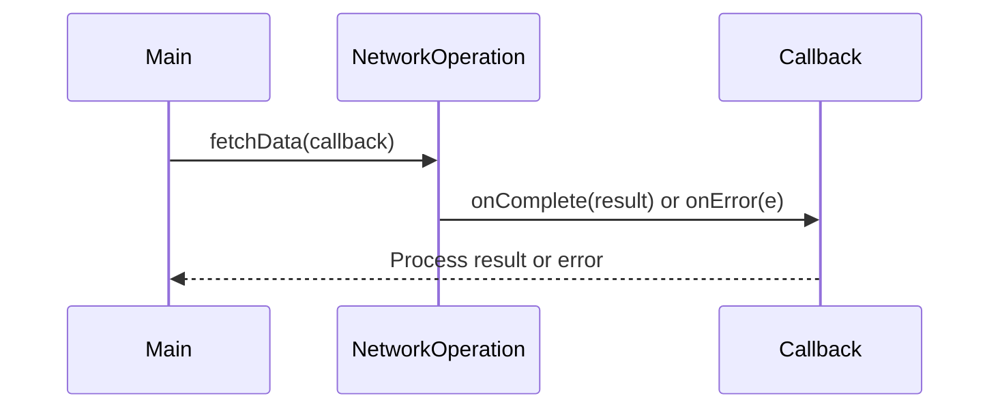

## 6.7.2 Asynchronous Programming Models

In modern software development, handling asynchronous tasks efficiently is crucial for building responsive and high-performance applications. Java provides several models for managing asynchronous computations, each with its own strengths and use cases. In this section, we will explore three primary asynchronous programming models: callbacks, promises (using `CompletableFuture`), and reactive streams. We will also compare these models to synchronous programming, highlighting their benefits and complexities.

### Understanding Asynchronous Programming

Asynchronous programming allows a program to perform tasks without waiting for other tasks to complete, enabling better resource utilization and responsiveness. This is particularly important in applications that involve I/O operations, such as network requests or file handling, where waiting for a response can block the main execution thread.

### Callback Model

#### What Are Callbacks?

A callback is a function passed as an argument to another function, which is then invoked after the completion of a task. This model is one of the simplest forms of asynchronous programming and is widely used in Java for handling asynchronous results.

#### Implementing Callbacks in Java

Let's consider a simple example where we perform a network operation asynchronously using callbacks:

```java
interface Callback {
    void onComplete(String result);
    void onError(Exception e);
}

class NetworkOperation {
    public void fetchData(Callback callback) {
        new Thread(() -> {
            try {
                // Simulate network operation
                Thread.sleep(2000);
                String result = "Data from network";
                callback.onComplete(result);
            } catch (Exception e) {
                callback.onError(e);
            }
        }).start();
    }
}

public class CallbackExample {
    public static void main(String[] args) {
        NetworkOperation operation = new NetworkOperation();
        operation.fetchData(new Callback() {
            @Override
            public void onComplete(String result) {
                System.out.println("Received: " + result);
            }

            @Override
            public void onError(Exception e) {
                System.err.println("Error: " + e.getMessage());
            }
        });
    }
}
```

In this example, `fetchData` performs a network operation on a separate thread and uses the `Callback` interface to notify the caller of the operation's completion or failure.

#### Challenges with Callbacks

While callbacks are straightforward, they can lead to complex and hard-to-maintain code, especially when multiple asynchronous operations are chained together. This is often referred to as "callback hell" or "pyramid of doom."

### Promises and `CompletableFuture`

#### Introduction to Promises

Promises provide a more structured way to handle asynchronous operations, allowing developers to compose and chain tasks more elegantly. In Java, promises are represented by the `CompletableFuture` class, introduced in Java 8.

#### Using `CompletableFuture` in Java

`CompletableFuture` allows you to write asynchronous code that is easier to read and maintain. Here's an example:

```java
import java.util.concurrent.CompletableFuture;

public class CompletableFutureExample {
    public static void main(String[] args) {
        CompletableFuture<String> future = CompletableFuture.supplyAsync(() -> {
            // Simulate long-running task
            try {
                Thread.sleep(2000);
            } catch (InterruptedException e) {
                throw new IllegalStateException(e);
            }
            return "Result from CompletableFuture";
        });

        future.thenAccept(result -> System.out.println("Received: " + result))
              .exceptionally(ex -> {
                  System.err.println("Error: " + ex.getMessage());
                  return null;
              });

        // Keep the main thread alive to see the result
        try {
            Thread.sleep(3000);
        } catch (InterruptedException e) {
            e.printStackTrace();
        }
    }
}
```

In this example, `supplyAsync` runs a task asynchronously, and `thenAccept` is used to handle the result. The `exceptionally` method handles any exceptions that occur during the computation.

#### Benefits of Using `CompletableFuture`

- **Chaining and Composition**: `CompletableFuture` allows chaining of multiple asynchronous operations, making the code more readable and maintainable.
- **Error Handling**: Provides built-in methods for handling exceptions, reducing boilerplate code.
- **Non-blocking**: Operations are non-blocking, allowing other tasks to proceed while waiting for the result.

### Reactive Programming

#### Introduction to Reactive Programming

Reactive programming is a paradigm that focuses on asynchronous data streams and the propagation of change. It is particularly useful for applications that require high scalability and responsiveness. Libraries like RxJava and Project Reactor provide tools for implementing reactive programming in Java.

#### Key Concepts in Reactive Programming

- **Observable Streams**: Data is represented as streams that can be observed and manipulated.
- **Backpressure**: Mechanism to handle situations where data is produced faster than it can be consumed.
- **Operators**: Functions that transform, filter, or combine data streams.

#### Implementing Reactive Programming with RxJava

RxJava is a popular library for reactive programming in Java. Here's a simple example:

```java
import io.reactivex.Observable;

public class RxJavaExample {
    public static void main(String[] args) {
        Observable<String> observable = Observable.create(emitter -> {
            try {
                emitter.onNext("Hello");
                emitter.onNext("Reactive");
                emitter.onNext("World");
                emitter.onComplete();
            } catch (Exception e) {
                emitter.onError(e);
            }
        });

        observable.subscribe(
            item -> System.out.println("Received: " + item),
            error -> System.err.println("Error: " + error),
            () -> System.out.println("Completed")
        );
    }
}
```

In this example, an `Observable` emits a series of strings, and a subscriber consumes these items, handling each emitted item, errors, and completion events.

#### Benefits of Reactive Programming

- **Declarative**: Code is more declarative, focusing on "what" to do rather than "how" to do it.
- **Scalable**: Naturally supports asynchronous and concurrent operations, making it suitable for high-load applications.
- **Composability**: Operators allow easy composition of complex data flows.

### Comparing Synchronous and Asynchronous Models

#### Synchronous Programming

In synchronous programming, tasks are executed sequentially, and each task must complete before the next one begins. This model is simple but can lead to inefficiencies, especially in I/O-bound applications.

#### Asynchronous Programming

Asynchronous programming allows tasks to run concurrently, improving resource utilization and responsiveness. However, it introduces complexity in managing task dependencies and error handling.

#### Benefits of Asynchronous Models

- **Improved Performance**: Non-blocking operations lead to better performance in I/O-bound applications.
- **Responsiveness**: Applications remain responsive to user interactions while performing background tasks.
- **Scalability**: Easier to scale applications to handle more concurrent tasks.

### Choosing the Right Model

The choice between callbacks, promises, and reactive programming depends on the application's requirements and complexity:

- **Callbacks**: Suitable for simple, isolated asynchronous tasks.
- **Promises (`CompletableFuture`)**: Ideal for tasks that require chaining and composition.
- **Reactive Programming**: Best for applications with complex data flows and high concurrency requirements.

### Try It Yourself

Experiment with the provided code examples by modifying the tasks, adding error handling, or chaining additional operations. This hands-on approach will help solidify your understanding of asynchronous programming models in Java.

### Visualizing Asynchronous Programming Models

To better understand the flow of asynchronous programming models, let's visualize the process using a sequence diagram:



This diagram illustrates the interaction between the main program, the network operation, and the callback interface. The main program initiates the network operation, which then notifies the callback upon completion or error.

### References and Further Reading

- [Java Concurrency in Practice](https://www.oreilly.com/library/view/java-concurrency-in/0321349601/)
- [Reactive Programming with RxJava](https://www.oreilly.com/library/view/reactive-programming-with/9781491931653/)
- [Project Reactor Documentation](https://projectreactor.io/docs)

### Knowledge Check

- What are the main differences between callbacks, promises, and reactive programming?
- How does `CompletableFuture` improve upon traditional callback mechanisms?
- What are some challenges associated with asynchronous programming?
- When should you consider using reactive programming over other models?

### Embrace the Journey

Remember, mastering asynchronous programming is a journey. As you continue to explore and experiment with different models, you'll gain a deeper understanding of how to build responsive and efficient applications. Keep experimenting, stay curious, and enjoy the journey!

## Quiz Time!



### What is a callback in Java?

- [x] A function passed as an argument to another function to be executed later
- [ ] A method that returns a result immediately
- [ ] A synchronous operation handler
- [ ] A type of Java exception

> **Explanation:** A callback is a function passed to another function, which is then called after the completion of a task, allowing asynchronous operations.

### Which Java class represents promises?

- [ ] Future
- [x] CompletableFuture
- [ ] Thread
- [ ] Callable

> **Explanation:** `CompletableFuture` in Java represents promises, providing a more structured way to handle asynchronous operations.

### What is a key benefit of using `CompletableFuture`?

- [x] It allows chaining and composition of asynchronous tasks
- [ ] It blocks the main thread until completion
- [ ] It simplifies synchronous programming
- [ ] It requires no error handling

> **Explanation:** `CompletableFuture` allows chaining and composition of tasks, making asynchronous code more readable and maintainable.

### What does reactive programming focus on?

- [ ] Sequential execution
- [x] Asynchronous data streams and change propagation
- [ ] Blocking I/O operations
- [ ] Synchronous task handling

> **Explanation:** Reactive programming focuses on asynchronous data streams and the propagation of changes, enabling scalable and responsive applications.

### Which library is commonly used for reactive programming in Java?

- [ ] java.util.concurrent
- [x] RxJava
- [ ] java.io
- [ ] java.nio

> **Explanation:** RxJava is a popular library for implementing reactive programming in Java, providing tools for working with asynchronous data streams.

### What is a challenge of using callbacks?

- [ ] They simplify error handling
- [x] They can lead to complex and hard-to-maintain code
- [ ] They eliminate the need for multithreading
- [ ] They provide built-in exception handling

> **Explanation:** Callbacks can lead to complex and hard-to-maintain code, especially when multiple asynchronous operations are chained together.

### What is backpressure in reactive programming?

- [ ] A method for improving synchronous performance
- [x] A mechanism to handle data production faster than consumption
- [ ] A technique for blocking threads
- [ ] A way to simplify error handling

> **Explanation:** Backpressure is a mechanism in reactive programming to handle situations where data is produced faster than it can be consumed.

### When should you use reactive programming?

- [x] For applications with complex data flows and high concurrency requirements
- [ ] For simple, isolated tasks
- [ ] For blocking I/O operations
- [ ] For single-threaded applications

> **Explanation:** Reactive programming is best suited for applications with complex data flows and high concurrency requirements, offering scalability and responsiveness.

### What is the main advantage of asynchronous programming over synchronous programming?

- [x] Improved performance and responsiveness
- [ ] Simpler code structure
- [ ] Easier error handling
- [ ] Reduced resource utilization

> **Explanation:** Asynchronous programming improves performance and responsiveness by allowing tasks to run concurrently, making better use of resources.

### True or False: `CompletableFuture` is non-blocking.

- [x] True
- [ ] False

> **Explanation:** `CompletableFuture` is non-blocking, allowing other tasks to proceed while waiting for the result of an asynchronous operation.


