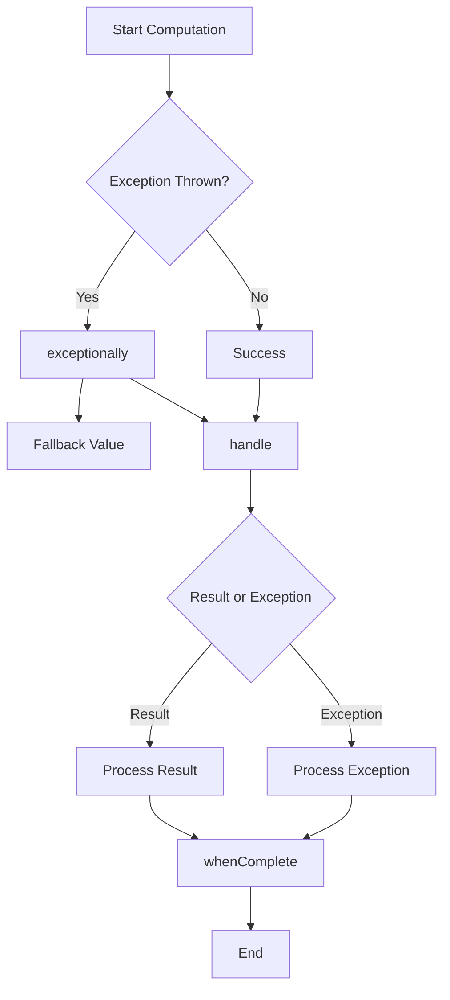

## 6.7.3 Error Handling

In the realm of asynchronous programming, error handling becomes a critical aspect of ensuring application stability and reliability. Java's `CompletableFuture` provides a robust framework for managing asynchronous computations, but with it comes the complexity of handling exceptions that may arise during these computations. In this section, we will delve into strategies for managing exceptions and errors in asynchronous computations using `CompletableFuture`, focusing on methods like `exceptionally`, `handle`, and `whenComplete`. We will also discuss the importance of proper error propagation, best practices for logging, retry mechanisms, and fallback strategies to maintain application stability.

### Understanding Exceptions in Asynchronous Computations

In synchronous programming, exceptions are typically caught and handled using try-catch blocks. However, in asynchronous programming, exceptions can occur at any point in the computation chain, making it challenging to manage them effectively. Java's `CompletableFuture` provides several methods to handle exceptions, allowing developers to define how errors should be managed at different stages of the computation.

#### Key Methods for Error Handling in CompletableFuture

1. **exceptionally**: This method allows you to handle exceptions by providing a fallback value or computation when an exception occurs. It is a simple way to catch exceptions and provide an alternative result.

2. **handle**: This method is more versatile, as it allows you to handle both the result and the exception. It provides a way to process the outcome of the computation, regardless of whether it completed normally or exceptionally.

3. **whenComplete**: This method is invoked after the computation is complete, whether it completed successfully or with an exception. It allows you to perform actions based on the outcome but does not alter the result or exception.

Let's explore these methods with examples to understand how they can be used to manage errors effectively.

### Using `exceptionally` for Fallback Values

The `exceptionally` method is a straightforward way to handle exceptions by providing a fallback value or computation. It is used to define a recovery path when an exception occurs during the asynchronous computation.

```java
import java.util.concurrent.CompletableFuture;

public class ExceptionallyExample {
    public static void main(String[] args) {
        CompletableFuture<String> future = CompletableFuture.supplyAsync(() -> {
            if (Math.random() > 0.5) {
                throw new RuntimeException("Something went wrong!");
            }
            return "Success!";
        });

        CompletableFuture<String> result = future.exceptionally(ex -> {
            System.out.println("Exception occurred: " + ex.getMessage());
            return "Fallback result";
        });

        result.thenAccept(System.out::println);
    }
}
```

In this example, if the asynchronous computation throws an exception, the `exceptionally` method catches it and provides a fallback result. This ensures that the application can continue running even if an error occurs.

### Handling Both Results and Exceptions with `handle`

The `handle` method provides more flexibility by allowing you to process both the result and the exception. It is useful when you need to perform different actions based on whether the computation was successful or not.

```java
import java.util.concurrent.CompletableFuture;

public class HandleExample {
    public static void main(String[] args) {
        CompletableFuture<String> future = CompletableFuture.supplyAsync(() -> {
            if (Math.random() > 0.5) {
                throw new RuntimeException("Something went wrong!");
            }
            return "Success!";
        });

        CompletableFuture<String> result = future.handle((res, ex) -> {
            if (ex != null) {
                System.out.println("Exception occurred: " + ex.getMessage());
                return "Handled exception";
            }
            return res;
        });

        result.thenAccept(System.out::println);
    }
}
```

Here, the `handle` method checks if an exception occurred and processes it accordingly. If no exception is thrown, it simply returns the result.

### Performing Actions After Completion with `whenComplete`

The `whenComplete` method allows you to perform actions after the computation is complete, regardless of its outcome. It is useful for logging or cleanup operations that need to be executed after the computation.

```java
import java.util.concurrent.CompletableFuture;

public class WhenCompleteExample {
    public static void main(String[] args) {
        CompletableFuture<String> future = CompletableFuture.supplyAsync(() -> {
            if (Math.random() > 0.5) {
                throw new RuntimeException("Something went wrong!");
            }
            return "Success!";
        });

        future.whenComplete((res, ex) -> {
            if (ex != null) {
                System.out.println("Exception occurred: " + ex.getMessage());
            } else {
                System.out.println("Result: " + res);
            }
        });
    }
}
```

In this example, `whenComplete` is used to log the result or exception after the computation is complete. It does not alter the result or exception, making it ideal for side-effect operations.

### Importance of Proper Error Propagation

Proper error propagation is crucial in asynchronous code to ensure that exceptions are not silently swallowed, leading to unexpected behaviors. By using the methods discussed above, you can propagate errors effectively and ensure that they are handled appropriately at each stage of the computation.

### Best Practices for Error Handling in Asynchronous Code

1. **Logging**: Always log exceptions to provide visibility into what went wrong. This is essential for debugging and monitoring the application's behavior.

2. **Retry Mechanisms**: Implement retry mechanisms for transient errors, such as network failures. Use exponential backoff strategies to avoid overwhelming the system.

3. **Fallback Strategies**: Define fallback strategies for critical operations to ensure that the application can continue functioning even if some components fail.

4. **Graceful Degradation**: Design your application to degrade gracefully in the face of errors. This means providing alternative functionality or reduced service levels instead of complete failure.

5. **Testing**: Test your error handling code thoroughly to ensure that it behaves as expected under different failure scenarios.

### Visualizing Error Handling in CompletableFuture

To better understand how these methods work together, let's visualize the flow of error handling in `CompletableFuture`.



This diagram illustrates the flow of error handling in `CompletableFuture`. The computation starts, and if an exception is thrown, it is handled by `exceptionally`. The result or exception is then processed by `handle`, and finally, `whenComplete` performs any necessary actions after completion.

### Try It Yourself

To gain a deeper understanding of error handling in `CompletableFuture`, try modifying the examples provided. Experiment with different scenarios, such as:

- Changing the probability of an exception being thrown.
- Adding additional logging statements to track the flow of execution.
- Implementing a retry mechanism using `thenCompose` to retry the computation if an exception occurs.

### Conclusion

Error handling in asynchronous computations is a complex but essential aspect of building robust applications. By leveraging the methods provided by `CompletableFuture`, you can manage exceptions effectively and ensure that your application remains stable even in the face of errors. Remember to follow best practices, such as logging, retry mechanisms, and fallback strategies, to maintain application stability and reliability.

## Quiz Time!



### What is the primary purpose of the `exceptionally` method in `CompletableFuture`?

- [x] To provide a fallback value when an exception occurs.
- [ ] To handle both results and exceptions.
- [ ] To perform actions after the computation is complete.
- [ ] To retry the computation if an exception occurs.

> **Explanation:** The `exceptionally` method is used to provide a fallback value or computation when an exception occurs during the asynchronous computation.

### Which method allows you to handle both the result and the exception in `CompletableFuture`?

- [ ] exceptionally
- [x] handle
- [ ] whenComplete
- [ ] thenApply

> **Explanation:** The `handle` method allows you to process both the result and the exception, providing flexibility in handling the outcome of the computation.

### What is the role of the `whenComplete` method in `CompletableFuture`?

- [ ] To provide a fallback value when an exception occurs.
- [ ] To handle both results and exceptions.
- [x] To perform actions after the computation is complete.
- [ ] To retry the computation if an exception occurs.

> **Explanation:** The `whenComplete` method is invoked after the computation is complete, whether it completed successfully or with an exception, allowing you to perform actions based on the outcome.

### Why is proper error propagation important in asynchronous code?

- [x] To ensure exceptions are not silently swallowed.
- [ ] To increase the speed of computations.
- [ ] To reduce the number of exceptions thrown.
- [ ] To simplify the code.

> **Explanation:** Proper error propagation is crucial to ensure that exceptions are handled appropriately and not silently swallowed, which could lead to unexpected behaviors.

### Which of the following is a best practice for error handling in asynchronous code?

- [x] Logging exceptions
- [x] Implementing retry mechanisms
- [x] Defining fallback strategies
- [ ] Ignoring exceptions

> **Explanation:** Logging exceptions, implementing retry mechanisms, and defining fallback strategies are best practices for error handling in asynchronous code to maintain application stability.

### How can you implement a retry mechanism in `CompletableFuture`?

- [ ] Using exceptionally
- [ ] Using whenComplete
- [x] Using thenCompose
- [ ] Using handle

> **Explanation:** You can implement a retry mechanism using `thenCompose` to chain another computation if an exception occurs.

### What is the purpose of graceful degradation in error handling?

- [x] To provide alternative functionality or reduced service levels instead of complete failure.
- [ ] To increase the complexity of the application.
- [ ] To ensure all exceptions are ignored.
- [ ] To reduce the number of computations performed.

> **Explanation:** Graceful degradation ensures that the application can continue functioning by providing alternative functionality or reduced service levels instead of complete failure.

### Which method in `CompletableFuture` is ideal for side-effect operations?

- [ ] exceptionally
- [ ] handle
- [x] whenComplete
- [ ] thenApply

> **Explanation:** The `whenComplete` method is ideal for side-effect operations, as it allows you to perform actions after the computation is complete without altering the result or exception.

### What should you do to ensure your error handling code behaves as expected?

- [x] Test it thoroughly under different failure scenarios.
- [ ] Ignore it during testing.
- [ ] Only test it in production.
- [ ] Assume it will work without testing.

> **Explanation:** Testing your error handling code thoroughly under different failure scenarios ensures that it behaves as expected and maintains application stability.

### True or False: The `handle` method in `CompletableFuture` can only process exceptions.

- [ ] True
- [x] False

> **Explanation:** The `handle` method can process both the result and the exception, providing flexibility in handling the outcome of the computation.


