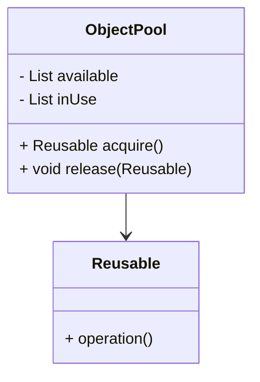
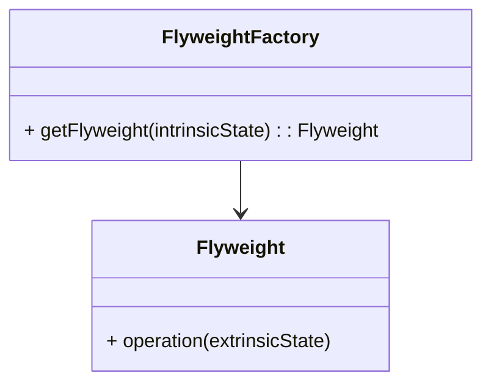

## 6.7.3 Object Pool vs. Flyweight Pattern

In the realm of software design patterns, the **Object Pool** and **Flyweight** patterns are often discussed in tandem due to their shared goal of optimizing resource usage. However, they achieve this goal through different mechanisms and are suited to different scenarios. This section will delve into the intricacies of each pattern, providing a comprehensive comparison to help you determine the most appropriate pattern for your specific needs.

### Object Pool Pattern

#### Intent

- **Description**: The Object Pool pattern is a creational design pattern that manages a set of initialized objects ready for use, rather than creating and destroying them on demand. This pattern is particularly useful in scenarios where object creation is expensive in terms of time and resources.

#### Motivation

- **Explanation**: Object creation can be resource-intensive, especially when dealing with complex objects or when the system frequently creates and destroys objects. By reusing objects from a pool, the Object Pool pattern minimizes the overhead associated with object creation and garbage collection.

#### Applicability

- **Guidelines**: Use the Object Pool pattern when:
  - Object creation is costly.
  - You need to manage a large number of objects that are used and discarded frequently.
  - You want to improve performance by reusing objects instead of creating new ones.

#### Structure



- **Caption**: The Object Pool pattern involves a pool manager that handles the lifecycle of reusable objects.

#### Participants

- **ObjectPool**: Manages the pool of reusable objects, handling their acquisition and release.
- **Reusable**: Represents the objects that are pooled and reused.

#### Collaborations

- **Interactions**: The client requests an object from the pool, uses it, and then returns it to the pool for future use.

#### Consequences

- **Analysis**: The Object Pool pattern can significantly improve performance by reducing the overhead of object creation and destruction. However, it requires careful management of object states to avoid issues such as stale data or resource leaks.

#### Implementation

- **Implementation Guidelines**: Ensure thread safety when implementing the Object Pool pattern, especially in a multithreaded environment.

- **Sample Code Snippets**:

```java
import java.util.concurrent.ConcurrentLinkedQueue;

class Reusable {
    public void operation() {
        // Perform some operation
    }
}

class ObjectPool {
    private ConcurrentLinkedQueue<Reusable> pool = new ConcurrentLinkedQueue<>();

    public Reusable acquire() {
        Reusable reusable = pool.poll();
        return (reusable != null) ? reusable : new Reusable();
    }

    public void release(Reusable reusable) {
        pool.offer(reusable);
    }
}

public class ObjectPoolDemo {
    public static void main(String[] args) {
        ObjectPool pool = new ObjectPool();
        Reusable reusable = pool.acquire();
        reusable.operation();
        pool.release(reusable);
    }
}
```

- **Explanation**: This example demonstrates a simple object pool using a concurrent queue to manage reusable objects.

#### Sample Use Cases

- **Real-world Scenarios**: Database connection pools, thread pools, and network socket pools are common examples of the Object Pool pattern in action.

### Flyweight Pattern

#### Intent

- **Description**: The Flyweight pattern is a structural design pattern that minimizes memory usage by sharing as much data as possible with similar objects. It is particularly useful for managing large numbers of fine-grained objects efficiently.

#### Motivation

- **Explanation**: In scenarios where many objects share common data, the Flyweight pattern reduces memory consumption by storing shared data externally and referencing it from multiple objects.

#### Applicability

- **Guidelines**: Use the Flyweight pattern when:
  - You need to manage a large number of similar objects.
  - The objects can share common data.
  - You want to reduce memory usage by sharing data.

#### Structure



- **Caption**: The Flyweight pattern involves a factory that creates and manages flyweight objects, sharing intrinsic state among them.

#### Participants

- **Flyweight**: Defines the interface for flyweight objects, which share intrinsic state.
- **FlyweightFactory**: Creates and manages flyweight objects, ensuring that shared data is used efficiently.

#### Collaborations

- **Interactions**: The client uses the FlyweightFactory to obtain flyweight objects, which share intrinsic state while maintaining unique extrinsic state.

#### Consequences

- **Analysis**: The Flyweight pattern can significantly reduce memory usage by sharing data among objects. However, it may introduce complexity in managing the separation of intrinsic and extrinsic state.

#### Implementation

- **Implementation Guidelines**: Carefully separate intrinsic and extrinsic state to maximize the benefits of the Flyweight pattern.

- **Sample Code Snippets**:

```java
import java.util.HashMap;
import java.util.Map;

interface Flyweight {
    void operation(String extrinsicState);
}

class ConcreteFlyweight implements Flyweight {
    private final String intrinsicState;

    public ConcreteFlyweight(String intrinsicState) {
        this.intrinsicState = intrinsicState;
    }

    @Override
    public void operation(String extrinsicState) {
        System.out.println("Intrinsic: " + intrinsicState + ", Extrinsic: " + extrinsicState);
    }
}

class FlyweightFactory {
    private final Map<String, Flyweight> flyweights = new HashMap<>();

    public Flyweight getFlyweight(String intrinsicState) {
        flyweights.putIfAbsent(intrinsicState, new ConcreteFlyweight(intrinsicState));
        return flyweights.get(intrinsicState);
    }
}

public class FlyweightDemo {
    public static void main(String[] args) {
        FlyweightFactory factory = new FlyweightFactory();
        Flyweight flyweight1 = factory.getFlyweight("State1");
        Flyweight flyweight2 = factory.getFlyweight("State1");

        flyweight1.operation("Extrinsic1");
        flyweight2.operation("Extrinsic2");
    }
}
```

- **Explanation**: This example demonstrates the Flyweight pattern, where shared intrinsic state is managed by a factory.

#### Sample Use Cases

- **Real-world Scenarios**: Text editors using glyphs, graphical applications with shared textures, and caching mechanisms are examples of the Flyweight pattern.

### Comparing Object Pool and Flyweight Patterns

#### Key Differences

- **Purpose**: The Object Pool pattern focuses on reusing objects to minimize creation and destruction overhead, while the Flyweight pattern focuses on sharing data to reduce memory usage.
- **State Management**: Object Pool manages the lifecycle of objects, ensuring they are in a usable state. Flyweight separates intrinsic and extrinsic state, sharing the former among objects.
- **Use Cases**: Object Pool is suitable for scenarios with expensive object creation, such as database connections. Flyweight is ideal for scenarios with many similar objects, such as graphical elements.

#### Considerations in Choosing Between Them

- **Performance Needs**: Consider the performance bottleneck in your application. If object creation is the issue, use Object Pool. If memory usage is the concern, use Flyweight.
- **Complexity**: Evaluate the complexity introduced by each pattern. Object Pool requires careful management of object states, while Flyweight requires separation of state.
- **Scalability**: Consider the scalability of each pattern. Object Pool can improve performance by reusing objects, while Flyweight can reduce memory usage by sharing data.

### Conclusion

Both the Object Pool and Flyweight patterns offer significant benefits in optimizing resource usage, but they do so through different mechanisms. Understanding the nuances of each pattern will enable you to choose the most appropriate one for your specific needs, enhancing the performance and efficiency of your Java applications.

---

## Test Your Knowledge: Object Pool vs. Flyweight Patterns Quiz



### What is the primary goal of the Object Pool pattern?

- [x] To reuse objects and minimize creation and destruction overhead.
- [ ] To share data among similar objects.
- [ ] To separate intrinsic and extrinsic state.
- [ ] To manage object lifecycles.

> **Explanation:** The Object Pool pattern aims to reuse objects to reduce the overhead associated with their creation and destruction.

### Which pattern is best suited for scenarios with many similar objects?

- [ ] Object Pool
- [x] Flyweight
- [ ] Singleton
- [ ] Factory

> **Explanation:** The Flyweight pattern is designed to manage large numbers of similar objects by sharing common data.

### How does the Flyweight pattern reduce memory usage?

- [x] By sharing intrinsic state among objects.
- [ ] By reusing objects.
- [ ] By managing object lifecycles.
- [ ] By separating extrinsic state.

> **Explanation:** The Flyweight pattern reduces memory usage by sharing intrinsic state, which is common data among objects.

### What is a common use case for the Object Pool pattern?

- [x] Database connection pools.
- [ ] Text editors using glyphs.
- [ ] Graphical applications with shared textures.
- [ ] Caching mechanisms.

> **Explanation:** Database connection pools are a common use case for the Object Pool pattern, where object creation is costly.

### Which pattern requires careful management of object states?

- [x] Object Pool
- [ ] Flyweight
- [ ] Singleton
- [ ] Factory

> **Explanation:** The Object Pool pattern requires careful management of object states to ensure they are in a usable state.

### What is the main challenge when implementing the Flyweight pattern?

- [x] Separating intrinsic and extrinsic state.
- [ ] Managing object lifecycles.
- [ ] Reusing objects.
- [ ] Minimizing creation overhead.

> **Explanation:** The main challenge in implementing the Flyweight pattern is separating intrinsic and extrinsic state to maximize data sharing.

### Which pattern is ideal for scenarios with expensive object creation?

- [x] Object Pool
- [ ] Flyweight
- [ ] Singleton
- [ ] Factory

> **Explanation:** The Object Pool pattern is ideal for scenarios where object creation is expensive, such as database connections.

### What is a key benefit of the Flyweight pattern?

- [x] Reduced memory usage.
- [ ] Improved object reuse.
- [ ] Simplified object lifecycle management.
- [ ] Enhanced performance.

> **Explanation:** The Flyweight pattern's key benefit is reduced memory usage through data sharing.

### Which pattern involves a factory for managing objects?

- [ ] Object Pool
- [x] Flyweight
- [ ] Singleton
- [ ] Factory

> **Explanation:** The Flyweight pattern involves a factory that manages flyweight objects and ensures efficient data sharing.

### True or False: The Object Pool pattern is primarily concerned with memory usage.

- [ ] True
- [x] False

> **Explanation:** The Object Pool pattern is primarily concerned with reusing objects to minimize creation and destruction overhead, not memory usage.



---
