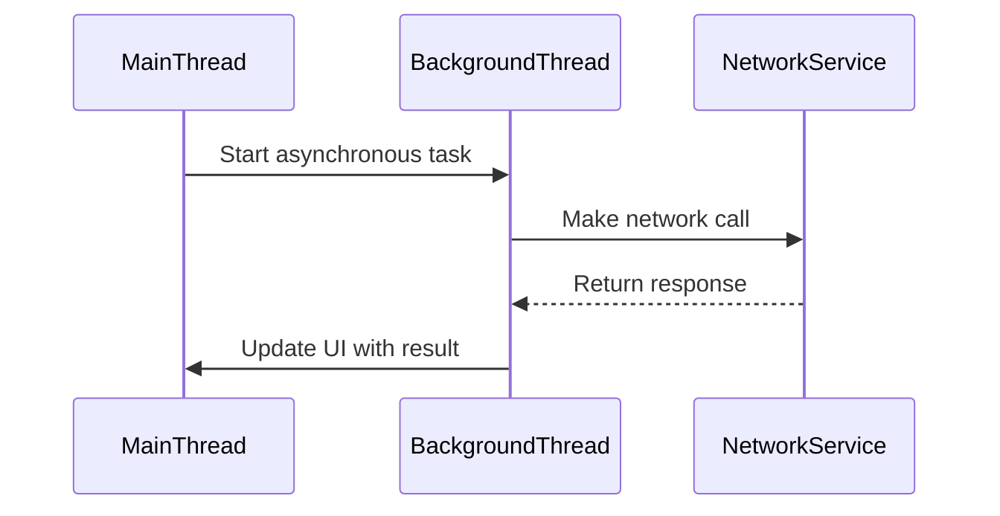

## 6.7.4 Use Cases and Examples

In modern software development, creating responsive and efficient applications is paramount. The Future and Promise patterns in Java offer robust solutions for handling asynchronous operations, allowing developers to perform tasks in the background without blocking the main application thread. This section delves into practical scenarios where these patterns can significantly enhance user experience and system performance.

### Performing Background Computations in a GUI Application

In graphical user interfaces (GUIs), responsiveness is crucial. Users expect immediate feedback from their actions, and any delay can lead to frustration. By leveraging the Future and Promise patterns, we can offload heavy computations to background threads, ensuring the UI remains responsive.

#### Example: Calculating Fibonacci Numbers

Consider a scenario where a GUI application calculates Fibonacci numbers. Calculating large Fibonacci numbers can be computationally intensive, and performing this operation on the main thread would freeze the UI.

```java
import java.util.concurrent.CompletableFuture;
import javax.swing.*;

public class FibonacciCalculator {

    public static void main(String[] args) {
        JFrame frame = new JFrame("Fibonacci Calculator");
        JButton button = new JButton("Calculate Fibonacci");
        JLabel label = new JLabel("Result: ");

        button.addActionListener(e -> {
            int n = 40; // Example input
            CompletableFuture.supplyAsync(() -> fibonacci(n))
                .thenAccept(result -> SwingUtilities.invokeLater(() -> label.setText("Result: " + result)));
        });

        frame.setLayout(new BoxLayout(frame.getContentPane(), BoxLayout.Y_AXIS));
        frame.add(button);
        frame.add(label);
        frame.setSize(300, 200);
        frame.setDefaultCloseOperation(JFrame.EXIT_ON_CLOSE);
        frame.setVisible(true);
    }

    private static long fibonacci(int n) {
        if (n <= 1) return n;
        return fibonacci(n - 1) + fibonacci(n - 2);
    }
}
```

**Explanation:**

- **CompletableFuture.supplyAsync**: This method is used to perform the Fibonacci calculation asynchronously.
- **thenAccept**: Once the computation is complete, the result is updated on the UI thread using `SwingUtilities.invokeLater`.

This approach keeps the UI thread free, allowing users to interact with the application while computations are processed in the background.

### Making Non-Blocking Network Calls in a Web Service Client

In web service clients, making synchronous network calls can lead to bottlenecks, especially when dealing with slow or unreliable networks. By using Futures and Promises, we can perform non-blocking network operations, improving the overall responsiveness of the application.

#### Example: Fetching Data from a REST API

Let's consider a web service client that fetches data from a REST API. Using the Future pattern, we can make non-blocking calls to the API.

```java
import java.net.http.HttpClient;
import java.net.http.HttpRequest;
import java.net.http.HttpResponse;
import java.net.URI;
import java.util.concurrent.CompletableFuture;

public class WebServiceClient {

    private static final HttpClient client = HttpClient.newHttpClient();

    public static void main(String[] args) {
        fetchDataFromApi("https://api.example.com/data")
            .thenAccept(response -> System.out.println("Response: " + response))
            .exceptionally(ex -> {
                System.err.println("Failed to fetch data: " + ex.getMessage());
                return null;
            });
    }

    public static CompletableFuture<String> fetchDataFromApi(String url) {
        HttpRequest request = HttpRequest.newBuilder()
            .uri(URI.create(url))
            .build();

        return client.sendAsync(request, HttpResponse.BodyHandlers.ofString())
            .thenApply(HttpResponse::body);
    }
}
```

**Explanation:**

- **HttpClient.sendAsync**: Sends the HTTP request asynchronously, returning a `CompletableFuture`.
- **thenApply**: Processes the response body once the request is complete.
- **exceptionally**: Handles any exceptions that occur during the request.

This non-blocking approach allows the application to continue processing other tasks while waiting for the network response.

### Processing Large Datasets Asynchronously

Processing large datasets can be time-consuming and resource-intensive. By utilizing Futures and Promises, we can process data asynchronously, preventing the main application thread from being blocked.

#### Example: Asynchronous Data Processing

Consider an application that processes a large dataset to generate reports. Using the Future pattern, we can distribute the processing across multiple threads.

```java
import java.util.concurrent.CompletableFuture;
import java.util.concurrent.ExecutorService;
import java.util.concurrent.Executors;
import java.util.List;
import java.util.stream.Collectors;
import java.util.stream.IntStream;

public class DataProcessor {

    private static final ExecutorService executor = Executors.newFixedThreadPool(4);

    public static void main(String[] args) {
        List<Integer> dataset = IntStream.range(0, 1000).boxed().collect(Collectors.toList());

        List<CompletableFuture<Void>> futures = dataset.stream()
            .map(data -> CompletableFuture.runAsync(() -> processData(data), executor))
            .collect(Collectors.toList());

        CompletableFuture.allOf(futures.toArray(new CompletableFuture[0]))
            .thenRun(() -> System.out.println("All data processed."));
    }

    private static void processData(int data) {
        // Simulate processing
        System.out.println("Processing data: " + data);
    }
}
```

**Explanation:**

- **ExecutorService**: Manages a pool of threads for executing tasks concurrently.
- **CompletableFuture.runAsync**: Processes each data item asynchronously.
- **CompletableFuture.allOf**: Waits for all tasks to complete before executing the final action.

This method allows the application to handle large datasets efficiently without blocking the main thread.

### Visualizing Asynchronous Operations

To better understand how asynchronous operations work, let's visualize the flow of a typical asynchronous task using Mermaid.js.



**Diagram Explanation:**

- The **MainThread** initiates an asynchronous task, delegating it to the **BackgroundThread**.
- The **BackgroundThread** performs a network call to the **NetworkService**.
- Once the **NetworkService** returns a response, the **BackgroundThread** updates the **MainThread** with the result.

This diagram illustrates how asynchronous tasks can be managed without blocking the main application thread.

### Managing Dependencies Between Tasks

In complex applications, tasks often have dependencies. Managing these dependencies is crucial to ensure that tasks are executed in the correct order.

#### Example: Task Chaining with CompletableFuture

Using `CompletableFuture`, we can chain tasks together, ensuring that each task is executed only after its predecessor has completed.

```java
import java.util.concurrent.CompletableFuture;

public class TaskChaining {

    public static void main(String[] args) {
        CompletableFuture.supplyAsync(() -> fetchData())
            .thenApply(data -> processData(data))
            .thenAccept(result -> displayResult(result))
            .exceptionally(ex -> {
                System.err.println("Error: " + ex.getMessage());
                return null;
            });
    }

    private static String fetchData() {
        // Simulate fetching data
        return "data";
    }

    private static String processData(String data) {
        // Simulate processing data
        return "processed " + data;
    }

    private static void displayResult(String result) {
        System.out.println("Result: " + result);
    }
}
```

**Explanation:**

- **thenApply**: Processes the data once it is fetched.
- **thenAccept**: Displays the result after processing.
- **exceptionally**: Handles any errors that occur during the task chain.

This approach ensures that tasks are executed in a logical sequence, respecting their dependencies.

### Encouraging Scalability and Responsiveness

By incorporating Future and Promise patterns, developers can build applications that are not only responsive but also scalable. These patterns allow for efficient resource utilization, enabling applications to handle increased loads without degrading performance.

### Try It Yourself

To deepen your understanding, try modifying the code examples provided:

- **Experiment with Different Thread Pools**: Change the number of threads in the `ExecutorService` to see how it affects performance.
- **Add Error Handling**: Implement more robust error handling in the network call example.
- **Chain Additional Tasks**: Extend the task chaining example by adding more processing steps.

### Conclusion

The Future and Promise patterns in Java provide powerful tools for handling asynchronous operations, enhancing both responsiveness and performance. By applying these patterns, developers can create applications that deliver a seamless user experience, even under heavy computational loads.

## Quiz Time!



### What is the primary benefit of using Futures and Promises in a GUI application?

- [x] Keeping the UI responsive by offloading tasks to background threads.
- [ ] Simplifying the code structure.
- [ ] Increasing the application's memory usage.
- [ ] Reducing the need for error handling.

> **Explanation:** Futures and Promises allow tasks to be executed asynchronously, ensuring that the UI remains responsive while computations are performed in the background.

### How does the `CompletableFuture.supplyAsync` method enhance performance in Java applications?

- [x] By executing tasks asynchronously without blocking the main thread.
- [ ] By reducing the number of threads needed.
- [ ] By simplifying the code syntax.
- [ ] By automatically handling exceptions.

> **Explanation:** `CompletableFuture.supplyAsync` executes tasks asynchronously, allowing the main thread to continue processing other tasks, thus enhancing performance.

### In the context of non-blocking network calls, what role does `HttpClient.sendAsync` play?

- [x] It sends HTTP requests asynchronously, allowing the application to remain responsive.
- [ ] It blocks the main thread until a response is received.
- [ ] It simplifies the process of parsing HTTP responses.
- [ ] It automatically retries failed requests.

> **Explanation:** `HttpClient.sendAsync` sends requests without blocking the main thread, enabling the application to perform other tasks while waiting for the response.

### What is the purpose of `CompletableFuture.allOf` in asynchronous data processing?

- [x] To wait for all asynchronous tasks to complete before executing a final action.
- [ ] To execute tasks in parallel without waiting for completion.
- [ ] To handle exceptions in asynchronous tasks.
- [ ] To automatically retry failed tasks.

> **Explanation:** `CompletableFuture.allOf` ensures that all specified tasks are completed before proceeding with a subsequent action, useful for coordinating multiple asynchronous operations.

### How can task dependencies be managed using `CompletableFuture`?

- [x] By chaining tasks using methods like `thenApply` and `thenAccept`.
- [ ] By executing tasks in a single thread.
- [ ] By using synchronized blocks.
- [ ] By manually checking task completion status.

> **Explanation:** `CompletableFuture` allows tasks to be chained, ensuring that each task is executed in sequence after its predecessor completes.

### Which of the following is a key advantage of using the Future and Promise patterns?

- [x] They enable asynchronous programming, improving application responsiveness.
- [ ] They reduce the need for multithreading.
- [ ] They simplify exception handling.
- [ ] They automatically optimize memory usage.

> **Explanation:** Futures and Promises facilitate asynchronous programming, allowing applications to perform tasks without blocking, thus improving responsiveness.

### What is a common use case for the Future pattern in web service clients?

- [x] Making non-blocking network calls to improve responsiveness.
- [ ] Simplifying the parsing of JSON responses.
- [ ] Automatically handling authentication.
- [ ] Reducing the size of HTTP requests.

> **Explanation:** The Future pattern is often used to make non-blocking network calls, allowing the application to remain responsive while waiting for a response.

### In the context of GUI applications, why is it important to perform computations on a background thread?

- [x] To prevent the UI from freezing and maintain responsiveness.
- [ ] To increase the application's memory usage.
- [ ] To simplify the codebase.
- [ ] To automatically handle user input.

> **Explanation:** Performing computations on a background thread prevents the UI from freezing, ensuring that the application remains responsive to user interactions.

### How does the use of `ExecutorService` contribute to asynchronous data processing?

- [x] It manages a pool of threads, allowing tasks to be executed concurrently.
- [ ] It simplifies the code structure.
- [ ] It reduces the need for error handling.
- [ ] It automatically retries failed tasks.

> **Explanation:** `ExecutorService` manages a pool of threads, enabling tasks to be executed concurrently, which is essential for efficient asynchronous data processing.

### True or False: The Future and Promise patterns can only be used in web applications.

- [ ] True
- [x] False

> **Explanation:** The Future and Promise patterns are versatile and can be used in various types of applications, including GUI applications, web services, and data processing systems.


