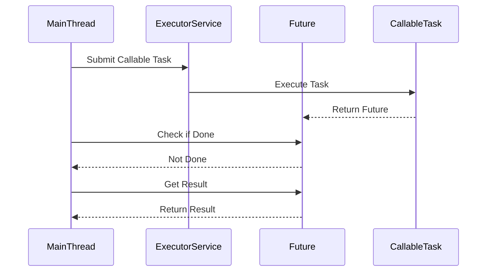

## 6.7 Future and Promise Patterns

In the realm of software engineering, especially when dealing with concurrent programming, the need for non-blocking operations is paramount. The Future and Promise patterns provide a robust solution for managing asynchronous computations, allowing tasks to run concurrently while offering a mechanism to retrieve results at a later time. This section delves into these patterns, explaining their roles, benefits, and practical applications in modern Java programming.

### Understanding Futures and Promises

#### What are Futures?

A **Future** represents a placeholder for a result that is initially unknown but will be computed eventually. It is a part of the Java concurrency framework that allows you to write asynchronous code. When you submit a task to an executor service, it returns a Future object, which you can use to check if the task is complete, wait for its completion, and retrieve the result.

#### What are Promises?

A **Promise**, on the other hand, is a more flexible construct that represents a value that may be available now, or in the future, or never. While Java's standard library does not have a Promise class, the concept is widely used in other programming languages and libraries, such as JavaScript. In Java, Promises can be implemented using CompletableFuture, which provides a more comprehensive API for handling asynchronous programming.

### The Role of Futures and Promises in Asynchronous Programming

Futures and Promises are crucial in asynchronous programming as they allow developers to write non-blocking code. This means that a program can continue executing other tasks while waiting for the result of an asynchronous operation. This is particularly useful in scenarios where operations may take an indeterminate amount of time, such as network requests, file I/O, or complex computations.

### Solving the Problem of Blocking Operations

In traditional synchronous programming, operations that take a long time can block the execution of a program, leading to inefficiencies and poor user experience. For example, in a GUI application, a long-running task could freeze the user interface, making it unresponsive. Futures and Promises solve this problem by allowing these tasks to run in the background, enabling the application to remain responsive.

### Enhancing Resource Utilization and Responsiveness

By leveraging Futures and Promises, applications can make better use of system resources. Instead of waiting idly for a task to complete, the system can perform other operations, improving overall throughput and responsiveness. This is particularly beneficial in environments where multiple tasks need to be managed concurrently, such as web servers handling numerous client requests simultaneously.

### Implementation Details and Considerations

Before diving into the implementation of Futures and Promises, it's essential to understand the underlying principles and considerations:

- **Concurrency vs. Parallelism**: Concurrency involves managing multiple tasks at the same time, while parallelism involves executing multiple tasks simultaneously. Futures and Promises are primarily about concurrency, allowing tasks to be managed efficiently.
- **Thread Management**: Proper management of threads is crucial to avoid issues such as deadlocks and race conditions. Java's concurrency framework provides tools to manage threads effectively.
- **Error Handling**: Asynchronous programming introduces new challenges in error handling. Futures and Promises must provide mechanisms to handle exceptions gracefully.

### Practical Examples of Futures and Promises

#### Web Services

In web services, Futures and Promises can be used to handle requests asynchronously. For instance, when a client makes a request that requires data from a remote server, the server can use a Future to process the request without blocking the main thread, allowing it to handle other requests concurrently.

#### GUI Applications

In GUI applications, long-running tasks such as loading data or performing computations can be executed in the background using Futures and Promises. This ensures that the user interface remains responsive, providing a better user experience.

### Code Examples

Let's explore some code examples to illustrate the use of Futures and Promises in Java.

#### Using Future with ExecutorService

```java
import java.util.concurrent.Callable;
import java.util.concurrent.ExecutionException;
import java.util.concurrent.ExecutorService;
import java.util.concurrent.Executors;
import java.util.concurrent.Future;

public class FutureExample {
    public static void main(String[] args) {
        ExecutorService executor = Executors.newSingleThreadExecutor();

        Callable<String> callableTask = () -> {
            Thread.sleep(2000);
            return "Task's execution";
        };

        Future<String> future = executor.submit(callableTask);

        try {
            // Perform other tasks while the callable is executing
            System.out.println("Doing other tasks...");

            // Get the result of the callable task
            String result = future.get();
            System.out.println("Result: " + result);
        } catch (InterruptedException | ExecutionException e) {
            e.printStackTrace();
        } finally {
            executor.shutdown();
        }
    }
}
```

In this example, we use an `ExecutorService` to submit a `Callable` task that simulates a long-running operation. The `Future` object allows us to retrieve the result once the task is complete, without blocking the main thread.

#### Using CompletableFuture for Promises

```java
import java.util.concurrent.CompletableFuture;
import java.util.concurrent.ExecutionException;

public class CompletableFutureExample {
    public static void main(String[] args) {
        CompletableFuture<String> future = CompletableFuture.supplyAsync(() -> {
            try {
                Thread.sleep(2000);
            } catch (InterruptedException e) {
                throw new IllegalStateException(e);
            }
            return "Result of the asynchronous computation";
        });

        // Attach a callback to the Future
        future.thenAccept(result -> System.out.println("Result: " + result));

        // Perform other tasks
        System.out.println("Doing other tasks...");

        try {
            // Block and wait for the future to complete
            future.get();
        } catch (InterruptedException | ExecutionException e) {
            e.printStackTrace();
        }
    }
}
```

Here, we use `CompletableFuture` to handle asynchronous computations. The `supplyAsync` method runs the task in a separate thread, and `thenAccept` allows us to specify a callback to be executed once the computation is complete.

### Visualizing Futures and Promises

To better understand how Futures and Promises work, let's visualize their interaction in a typical asynchronous workflow.



In this diagram, the main thread submits a task to the executor service, which executes the task in a separate thread. The Future object acts as a placeholder for the result, allowing the main thread to continue executing other tasks until the result is ready.

### Try It Yourself

To gain a deeper understanding of Futures and Promises, try modifying the code examples provided:

- **Experiment with Different Executors**: Use different types of executors, such as `FixedThreadPool` or `CachedThreadPool`, to see how they affect task execution.
- **Handle Exceptions Gracefully**: Modify the `CompletableFuture` example to handle exceptions using the `exceptionally` method.
- **Chain Multiple CompletableFutures**: Create a sequence of dependent tasks using `thenCompose` or `thenCombine`.

### Key Takeaways

- Futures and Promises are essential for writing non-blocking, asynchronous code in Java.
- They enable tasks to run concurrently, improving resource utilization and responsiveness.
- Proper error handling and thread management are crucial when working with asynchronous patterns.
- Futures and Promises are widely applicable in scenarios such as web services and GUI applications.

### Further Reading

For more information on Java concurrency and asynchronous programming, consider exploring the following resources:

- [Java Concurrency in Practice](https://www.amazon.com/Java-Concurrency-Practice-Brian-Goetz/dp/0321349601) by Brian Goetz
- [CompletableFuture Documentation](https://docs.oracle.com/javase/8/docs/api/java/util/concurrent/CompletableFuture.html)
- [Java ExecutorService Tutorial](https://www.baeldung.com/java-executor-service-tutorial)

## Quiz Time!



### What is a Future in Java?

- [x] A placeholder for a result that will be computed in the future.
- [ ] A mechanism to execute tasks in parallel.
- [ ] A tool for managing threads.
- [ ] A type of thread pool.

> **Explanation:** A Future is a placeholder for a result that is initially unknown but will be computed eventually.

### What is a Promise in the context of asynchronous programming?

- [x] A construct that represents a value that may be available now, or in the future, or never.
- [ ] A method for executing tasks in parallel.
- [ ] A type of thread management tool.
- [ ] A class in Java's standard library.

> **Explanation:** A Promise is a construct that represents a value that may be available now, or in the future, or never, and is often used in asynchronous programming.

### How do Futures and Promises improve application responsiveness?

- [x] By allowing tasks to run in the background, enabling the application to remain responsive.
- [ ] By executing all tasks in parallel.
- [ ] By blocking the main thread until tasks are complete.
- [ ] By reducing the number of threads used.

> **Explanation:** Futures and Promises allow tasks to run in the background, enabling the application to remain responsive while waiting for results.

### What is the main challenge when working with asynchronous programming?

- [x] Proper error handling and thread management.
- [ ] Writing synchronous code.
- [ ] Managing a single thread.
- [ ] Executing tasks in a specific order.

> **Explanation:** Proper error handling and thread management are crucial challenges when working with asynchronous programming.

### Which Java class provides a more comprehensive API for handling asynchronous programming?

- [x] CompletableFuture
- [ ] Future
- [ ] ExecutorService
- [ ] Thread

> **Explanation:** CompletableFuture provides a more comprehensive API for handling asynchronous programming in Java.

### What is the role of the ExecutorService in the Future pattern?

- [x] It manages the execution of tasks submitted to it.
- [ ] It provides a placeholder for results.
- [ ] It represents a value that may be available in the future.
- [ ] It handles exceptions in asynchronous tasks.

> **Explanation:** The ExecutorService manages the execution of tasks submitted to it, allowing for concurrent task management.

### How can you handle exceptions in a CompletableFuture?

- [x] By using the `exceptionally` method.
- [ ] By using a try-catch block.
- [ ] By using the `get` method.
- [ ] By using the `submit` method.

> **Explanation:** The `exceptionally` method in CompletableFuture allows you to handle exceptions that occur during asynchronous computation.

### Which method in CompletableFuture allows you to specify a callback to be executed once the computation is complete?

- [x] thenAccept
- [ ] supplyAsync
- [ ] exceptionally
- [ ] get

> **Explanation:** The `thenAccept` method allows you to specify a callback to be executed once the computation is complete.

### What is the primary benefit of using non-blocking operations in applications?

- [x] Improved responsiveness and resource utilization.
- [ ] Increased complexity in code.
- [ ] Reduced number of threads.
- [ ] Synchronous task execution.

> **Explanation:** Non-blocking operations improve responsiveness and resource utilization by allowing tasks to run concurrently without blocking the main thread.

### True or False: Futures and Promises are only applicable in web services.

- [ ] True
- [x] False

> **Explanation:** Futures and Promises are applicable in various scenarios, including web services, GUI applications, and any situation requiring asynchronous operations.


