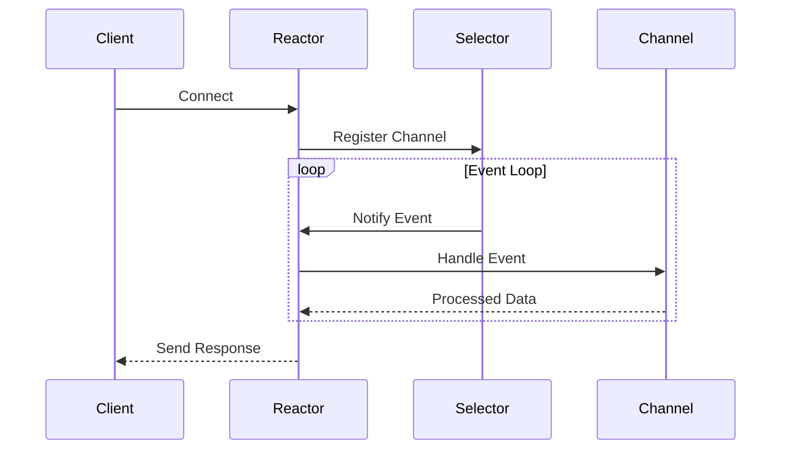

## 6.8.1 Implementing Reactor in Java

The Reactor pattern is a powerful design pattern used for handling service requests delivered concurrently to an application by one or more clients. It efficiently manages multiple I/O operations without blocking, making it ideal for high-performance network applications. In this section, we will explore how to implement the Reactor pattern in Java using the New I/O (NIO) package, focusing on the `Selector` class for multiplexing I/O events.

### Introduction to Java NIO and the Selector Class

Java NIO (New Input/Output) is a collection of Java programming language APIs that offer features for intensive I/O operations. Unlike the traditional I/O, which is stream-oriented and blocking, NIO is buffer-oriented and non-blocking, providing a more scalable and flexible approach to I/O operations.

The `Selector` class is a central component in Java NIO, allowing a single thread to manage multiple channels, which can be either sockets or files. This is achieved by multiplexing I/O operations, meaning that a single thread can monitor multiple channels for events such as reading, writing, or accepting connections.

### Setting Up Channels, Selectors, and Event Loops

To implement the Reactor pattern, we need to set up channels, selectors, and an event loop. Let's walk through the process step-by-step.

#### Step 1: Creating a Selector

The first step is to create a `Selector` instance. This will be used to monitor multiple channels for I/O events.

```java
import java.io.IOException;
import java.nio.channels.Selector;

public class Reactor {
    private Selector selector;

    public Reactor() throws IOException {
        this.selector = Selector.open();
    }
}
```

#### Step 2: Setting Up Channels

Channels are the gateways for data transfer between the application and the I/O devices. We need to configure these channels to be non-blocking and register them with the selector.

```java
import java.io.IOException;
import java.net.InetSocketAddress;
import java.nio.channels.ServerSocketChannel;
import java.nio.channels.SocketChannel;

public class Reactor {
    private Selector selector;

    public Reactor() throws IOException {
        this.selector = Selector.open();
        setupServerChannel();
    }

    private void setupServerChannel() throws IOException {
        ServerSocketChannel serverChannel = ServerSocketChannel.open();
        serverChannel.configureBlocking(false);
        serverChannel.bind(new InetSocketAddress("localhost", 8080));
        serverChannel.register(selector, SelectionKey.OP_ACCEPT);
    }
}
```

#### Step 3: Implementing the Event Loop

The event loop is the core of the Reactor pattern, continuously monitoring the selector for events and dispatching them to the appropriate handlers.

```java
import java.io.IOException;
import java.nio.channels.SelectionKey;
import java.nio.channels.Selector;
import java.util.Iterator;
import java.util.Set;

public class Reactor {
    private Selector selector;

    public Reactor() throws IOException {
        this.selector = Selector.open();
        setupServerChannel();
    }

    public void run() throws IOException {
        while (true) {
            selector.select();
            Set<SelectionKey> selectedKeys = selector.selectedKeys();
            Iterator<SelectionKey> keyIterator = selectedKeys.iterator();

            while (keyIterator.hasNext()) {
                SelectionKey key = keyIterator.next();
                if (key.isAcceptable()) {
                    handleAccept(key);
                } else if (key.isReadable()) {
                    handleRead(key);
                } else if (key.isWritable()) {
                    handleWrite(key);
                }
                keyIterator.remove();
            }
        }
    }

    private void handleAccept(SelectionKey key) {
        // Handle accept logic
    }

    private void handleRead(SelectionKey key) {
        // Handle read logic
    }

    private void handleWrite(SelectionKey key) {
        // Handle write logic
    }
}
```

### Registering Channels with Selectors and Handling Events

Once the channels are set up and registered with the selector, we need to handle the events. Each channel can register for different types of events, such as `OP_ACCEPT`, `OP_READ`, `OP_WRITE`, and `OP_CONNECT`.

#### Handling Accept Events

When a new connection is accepted, we need to configure the new socket channel and register it with the selector for read operations.

```java
private void handleAccept(SelectionKey key) throws IOException {
    ServerSocketChannel serverChannel = (ServerSocketChannel) key.channel();
    SocketChannel clientChannel = serverChannel.accept();
    clientChannel.configureBlocking(false);
    clientChannel.register(selector, SelectionKey.OP_READ);
    System.out.println("Accepted new connection from " + clientChannel.getRemoteAddress());
}
```

#### Handling Read Events

For read events, we read data from the channel into a buffer and process it.

```java
import java.nio.ByteBuffer;

private void handleRead(SelectionKey key) throws IOException {
    SocketChannel clientChannel = (SocketChannel) key.channel();
    ByteBuffer buffer = ByteBuffer.allocate(256);
    int bytesRead = clientChannel.read(buffer);

    if (bytesRead == -1) {
        clientChannel.close();
        System.out.println("Connection closed by client");
    } else {
        buffer.flip();
        byte[] data = new byte[buffer.limit()];
        buffer.get(data);
        System.out.println("Received: " + new String(data));
        clientChannel.register(selector, SelectionKey.OP_WRITE);
    }
}
```

#### Handling Write Events

For write events, we write data back to the client. This could be a response to the data received or any other information.

```java
private void handleWrite(SelectionKey key) throws IOException {
    SocketChannel clientChannel = (SocketChannel) key.channel();
    ByteBuffer buffer = ByteBuffer.wrap("Response from server".getBytes());
    clientChannel.write(buffer);

    if (!buffer.hasRemaining()) {
        clientChannel.register(selector, SelectionKey.OP_READ);
    }
}
```

### Best Practices for Managing the Event Loop

Managing the event loop efficiently is crucial for the performance of the Reactor pattern. Here are some best practices:

- **Avoid Blocking Calls**: Ensure that all operations within the event loop are non-blocking. Blocking calls can delay the processing of other events and reduce the responsiveness of the application.

- **Efficient Buffer Management**: Use direct buffers for I/O operations when possible, as they can be more efficient than heap buffers.

- **Error Handling**: Implement robust error handling within the event loop to manage exceptions and prevent the application from crashing.

- **Resource Management**: Properly close channels and release resources when they are no longer needed to avoid resource leaks.

### Thread Management and Efficient I/O Operations

While the Reactor pattern is designed to handle multiple I/O operations with a single thread, there are scenarios where additional threads may be beneficial, such as:

- **Offloading CPU-Intensive Tasks**: Use a thread pool to offload CPU-intensive tasks from the event loop, allowing it to focus on I/O operations.

- **Handling Long-Running Operations**: For operations that may take a long time to complete, consider using asynchronous I/O or delegating the task to a separate thread.

- **Balancing Load**: In high-load scenarios, distributing the load across multiple threads or reactors can improve performance and scalability.

### Visualizing the Reactor Pattern

To better understand the flow of the Reactor pattern, let's visualize the process using a sequence diagram.



**Diagram Description**: This sequence diagram illustrates the interaction between a client, the reactor, the selector, and the channel. The reactor registers channels with the selector, which notifies the reactor of events. The reactor then processes these events and sends responses back to the client.

### Try It Yourself

To deepen your understanding, try modifying the code examples provided:

- **Experiment with Different Ports**: Change the port number and observe how the server handles connections on different ports.
- **Implement a Simple Protocol**: Extend the server to implement a simple protocol, such as echoing back messages with a timestamp.
- **Add Logging**: Integrate a logging framework to capture detailed information about the events and operations occurring within the reactor.

### References and Further Reading

For more information on Java NIO and the Reactor pattern, consider the following resources:

- [Java NIO Documentation](https://docs.oracle.com/javase/8/docs/api/java/nio/package-summary.html)
- [Reactor Pattern on Wikipedia](https://en.wikipedia.org/wiki/Reactor_pattern)
- [Non-blocking I/O with Java NIO](https://www.baeldung.com/java-nio-selector)

### Knowledge Check

Before moving on, let's summarize the key takeaways:

- The Reactor pattern efficiently handles multiple I/O operations using a single thread.
- Java NIO provides the `Selector` class for multiplexing I/O events.
- Channels must be configured as non-blocking and registered with the selector.
- The event loop processes events and dispatches them to appropriate handlers.
- Proper resource management and error handling are crucial for maintaining performance.

Remember, mastering the Reactor pattern and Java NIO can significantly enhance your ability to build scalable and high-performance applications. Keep experimenting, stay curious, and enjoy the journey!

## Quiz Time!



### What is the primary purpose of the Reactor pattern in Java?

- [x] Efficiently handling multiple I/O operations without blocking
- [ ] Simplifying the implementation of multithreaded applications
- [ ] Providing a framework for building graphical user interfaces
- [ ] Managing memory allocation for large datasets

> **Explanation:** The Reactor pattern is designed to efficiently handle multiple I/O operations without blocking, making it ideal for high-performance network applications.

### Which Java class is central to implementing the Reactor pattern?

- [ ] SocketChannel
- [x] Selector
- [ ] ByteBuffer
- [ ] ServerSocket

> **Explanation:** The `Selector` class is central to implementing the Reactor pattern as it allows a single thread to manage multiple channels by multiplexing I/O events.

### What type of channels can be registered with a Selector?

- [ ] Only file channels
- [x] Both socket and file channels
- [ ] Only socket channels
- [ ] Only UDP channels

> **Explanation:** Both socket and file channels can be registered with a `Selector` for monitoring I/O events.

### In the Reactor pattern, what is the role of the event loop?

- [ ] To initialize the server and start listening for connections
- [x] To continuously monitor the selector for events and dispatch them to handlers
- [ ] To manage the lifecycle of client connections
- [ ] To handle data serialization and deserialization

> **Explanation:** The event loop continuously monitors the selector for events and dispatches them to the appropriate handlers for processing.

### How should channels be configured for use with a Selector?

- [ ] As blocking
- [x] As non-blocking
- [ ] As synchronous
- [ ] As asynchronous

> **Explanation:** Channels should be configured as non-blocking when used with a `Selector` to allow efficient multiplexing of I/O operations.

### What is a best practice for managing the event loop in the Reactor pattern?

- [ ] Use blocking calls to simplify the code
- [ ] Avoid error handling to improve performance
- [x] Implement robust error handling to manage exceptions
- [ ] Use synchronous I/O operations for better control

> **Explanation:** Implementing robust error handling is a best practice for managing the event loop, ensuring that exceptions are properly managed and the application remains stable.

### When might additional threads be beneficial in a Reactor-based application?

- [ ] When handling simple read and write operations
- [x] When offloading CPU-intensive tasks from the event loop
- [ ] When managing a small number of client connections
- [ ] When using blocking I/O operations

> **Explanation:** Additional threads can be beneficial for offloading CPU-intensive tasks from the event loop, allowing it to focus on I/O operations.

### What is the advantage of using direct buffers in Java NIO?

- [ ] They are easier to manage than heap buffers
- [x] They can be more efficient for I/O operations
- [ ] They automatically handle memory allocation
- [ ] They simplify error handling

> **Explanation:** Direct buffers can be more efficient for I/O operations as they allow the operating system to perform I/O operations directly on the buffer, bypassing the JVM heap.

### What is a potential use case for the Reactor pattern?

- [ ] Building a graphical user interface
- [ ] Managing a database connection pool
- [x] Developing a high-performance network server
- [ ] Implementing a file compression algorithm

> **Explanation:** The Reactor pattern is well-suited for developing high-performance network servers that need to handle multiple client connections efficiently.

### True or False: The Reactor pattern requires multiple threads to handle I/O operations.

- [ ] True
- [x] False

> **Explanation:** The Reactor pattern is designed to handle multiple I/O operations using a single thread, although additional threads can be used for CPU-intensive tasks.




