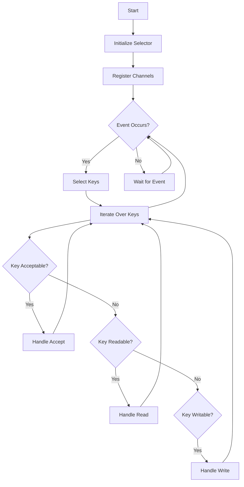

## 6.8.2 Event Demultiplexing

Event demultiplexing is a critical concept in the Reactor Pattern, which is part of Java's concurrency patterns. It involves managing multiple input sources by efficiently demultiplexing events to the appropriate handlers. This section will delve into the role of the demultiplexer, strategies for handling various event types, scaling event handling, and the importance of non-blocking operations. We will also discuss potential challenges such as handling high loads and ensuring responsiveness.

### Understanding Event Demultiplexing

Event demultiplexing is the process of monitoring multiple input sources, such as network connections or file I/O, and directing events to the appropriate handlers. The demultiplexer acts as a central hub that listens for events and dispatches them to the correct handler based on predefined criteria.

#### The Role of the Demultiplexer

The demultiplexer's primary role is to efficiently monitor multiple channels for events. It uses a selector to detect events on various channels, such as sockets or file descriptors. When an event occurs, the demultiplexer determines which handler should process the event and dispatches it accordingly.

In Java, the `Selector` class from the `java.nio` package is commonly used for event demultiplexing. It allows a single thread to monitor multiple channels for events, making it an essential component of the Reactor Pattern.

```java
import java.io.IOException;
import java.nio.channels.Selector;
import java.nio.channels.SelectionKey;
import java.nio.channels.ServerSocketChannel;
import java.nio.channels.SocketChannel;
import java.util.Iterator;

public class EventDemultiplexer {
    private Selector selector;

    public EventDemultiplexer() throws IOException {
        this.selector = Selector.open();
    }

    public void registerChannel(ServerSocketChannel serverChannel) throws IOException {
        serverChannel.register(selector, SelectionKey.OP_ACCEPT);
    }

    public void start() throws IOException {
        while (true) {
            selector.select(); // Block until an event occurs
            Iterator<SelectionKey> keys = selector.selectedKeys().iterator();
            while (keys.hasNext()) {
                SelectionKey key = keys.next();
                keys.remove();
                if (key.isAcceptable()) {
                    handleAccept(key);
                } else if (key.isReadable()) {
                    handleRead(key);
                }
            }
        }
    }

    private void handleAccept(SelectionKey key) throws IOException {
        ServerSocketChannel serverChannel = (ServerSocketChannel) key.channel();
        SocketChannel clientChannel = serverChannel.accept();
        clientChannel.configureBlocking(false);
        clientChannel.register(selector, SelectionKey.OP_READ);
    }

    private void handleRead(SelectionKey key) throws IOException {
        SocketChannel clientChannel = (SocketChannel) key.channel();
        // Read data from the channel
    }
}
```

### Handling Different Types of Events

Event demultiplexing is versatile and can handle various types of events, such as network connections, file I/O, and timers. Each event type requires specific handling logic, which the demultiplexer must accommodate.

#### Network Connections

For network connections, the demultiplexer listens for events such as connection acceptance, data readiness for reading, and data readiness for writing. The `SelectionKey` class provides constants like `OP_ACCEPT`, `OP_READ`, and `OP_WRITE` to identify these events.

#### File I/O

File I/O events involve monitoring file descriptors for readiness to read or write. This is particularly useful in applications that need to handle large files or multiple file operations simultaneously.

#### Timers and Scheduled Events

Timers and scheduled events can also be integrated into the event demultiplexing process. By using a combination of the `Selector` and scheduled tasks, you can efficiently manage time-based events alongside other types of events.

### Scaling Event Handling

As applications grow, the need to scale event handling becomes crucial. There are several strategies to achieve this, such as using multiple reactors or worker threads.

#### Multiple Reactors

One approach to scaling is to use multiple reactors, each handling a subset of the total events. This can be achieved by partitioning the input sources and assigning each partition to a separate reactor. This approach allows for parallel processing of events, improving throughput and reducing latency.

#### Worker Threads

Another strategy is to use worker threads to process events. The demultiplexer can quickly dispatch events to a pool of worker threads, which handle the actual processing. This approach offloads the processing workload from the main thread, allowing it to focus on event demultiplexing.

```java
import java.util.concurrent.ExecutorService;
import java.util.concurrent.Executors;

public class ScalableEventDemultiplexer {
    private ExecutorService workerPool;

    public ScalableEventDemultiplexer(int poolSize) {
        this.workerPool = Executors.newFixedThreadPool(poolSize);
    }

    public void handleEvent(Runnable eventHandler) {
        workerPool.submit(eventHandler);
    }
}
```

### Importance of Non-blocking Operations

Non-blocking operations are essential in event demultiplexing to prevent the reactor from being blocked. Blocking operations can lead to performance bottlenecks and reduced responsiveness, especially under high load conditions.

#### Non-blocking I/O

Java's NIO package provides non-blocking I/O capabilities, allowing channels to be configured in non-blocking mode. This enables the reactor to continue processing other events while waiting for I/O operations to complete.

#### Asynchronous Processing

Asynchronous processing is another technique to enhance non-blocking operations. By using asynchronous APIs, you can initiate operations and receive notifications upon completion, allowing the reactor to remain responsive.

### Challenges and Solutions

Event demultiplexing presents several challenges, such as handling high loads, ensuring responsiveness, and managing resource contention. Here are some strategies to address these challenges:

#### Handling High Loads

To handle high loads, consider using load balancing techniques, such as distributing events across multiple reactors or worker threads. This can help prevent any single component from becoming a bottleneck.

#### Ensuring Responsiveness

Maintaining responsiveness is critical in event-driven systems. Use non-blocking operations and asynchronous processing to ensure that the reactor can quickly respond to new events.

#### Managing Resource Contention

Resource contention can occur when multiple threads or processes compete for the same resources. To mitigate this, use synchronization mechanisms, such as locks or semaphores, to coordinate access to shared resources.

### Visualizing Event Demultiplexing

To better understand event demultiplexing, let's visualize the process using a flowchart. This diagram illustrates how events are detected and dispatched to the appropriate handlers.



### Try It Yourself

To reinforce your understanding of event demultiplexing, try modifying the code examples provided. Experiment with different event types, such as file I/O or timers, and observe how the demultiplexer handles them. Consider implementing a simple chat server that uses event demultiplexing to manage multiple client connections.

### References and Further Reading

- [Java NIO Documentation](https://docs.oracle.com/javase/8/docs/api/java/nio/package-summary.html)
- [Reactor Pattern](https://en.wikipedia.org/wiki/Reactor_pattern)
- [Non-blocking I/O with Java NIO](https://www.baeldung.com/java-nio-selector)

### Key Takeaways

- Event demultiplexing is a crucial component of the Reactor Pattern, enabling efficient handling of multiple input sources.
- The demultiplexer monitors channels for events and dispatches them to appropriate handlers.
- Non-blocking operations and asynchronous processing are essential for maintaining responsiveness.
- Scaling event handling can be achieved through multiple reactors or worker threads.
- Challenges such as high loads and resource contention can be addressed with load balancing and synchronization mechanisms.

## Quiz Time!



### What is the primary role of the demultiplexer in event demultiplexing?

- [x] To monitor multiple channels for events and dispatch them to the appropriate handlers.
- [ ] To process events directly without dispatching.
- [ ] To block all incoming events until processed.
- [ ] To handle only network-related events.

> **Explanation:** The demultiplexer monitors multiple channels and dispatches events to the appropriate handlers based on predefined criteria.

### Which Java class is commonly used for event demultiplexing?

- [x] Selector
- [ ] Socket
- [ ] ServerSocket
- [ ] FileChannel

> **Explanation:** The `Selector` class from the `java.nio` package is used for event demultiplexing, allowing a single thread to monitor multiple channels.

### What is a key advantage of using non-blocking operations in event demultiplexing?

- [x] It prevents the reactor from being blocked, maintaining responsiveness.
- [ ] It simplifies the code structure.
- [ ] It reduces the need for event handlers.
- [ ] It increases the complexity of the system.

> **Explanation:** Non-blocking operations prevent the reactor from being blocked, ensuring that it remains responsive to new events.

### What strategy can be used to scale event handling in a system?

- [x] Using multiple reactors or worker threads.
- [ ] Increasing the number of event types.
- [ ] Reducing the number of channels monitored.
- [ ] Blocking all events until processed.

> **Explanation:** Scaling can be achieved by using multiple reactors or worker threads to distribute the event handling workload.

### What challenge does resource contention present in event demultiplexing?

- [x] Multiple threads or processes competing for the same resources.
- [ ] Limited number of event types.
- [ ] Excessive responsiveness.
- [ ] Simplified event handling.

> **Explanation:** Resource contention occurs when multiple threads or processes compete for the same resources, requiring synchronization mechanisms to manage access.

### What is the purpose of the `SelectionKey` class in event demultiplexing?

- [x] To identify the type of event that occurred on a channel.
- [ ] To block events until processed.
- [ ] To directly process events.
- [ ] To handle only file-related events.

> **Explanation:** The `SelectionKey` class provides constants like `OP_ACCEPT`, `OP_READ`, and `OP_WRITE` to identify the type of event that occurred on a channel.

### How can load balancing help in handling high loads in event demultiplexing?

- [x] By distributing events across multiple reactors or worker threads.
- [ ] By reducing the number of event handlers.
- [ ] By blocking all events until processed.
- [ ] By simplifying event types.

> **Explanation:** Load balancing distributes events across multiple reactors or worker threads, preventing any single component from becoming a bottleneck.

### What is a potential challenge of using non-blocking operations?

- [x] Complexity in managing asynchronous processing.
- [ ] Reduced responsiveness.
- [ ] Increased blocking of events.
- [ ] Simplified code structure.

> **Explanation:** Non-blocking operations can introduce complexity in managing asynchronous processing, requiring careful design to maintain responsiveness.

### Which of the following is a strategy for ensuring responsiveness in event-driven systems?

- [x] Using non-blocking operations and asynchronous processing.
- [ ] Increasing the number of event handlers.
- [ ] Blocking all events until processed.
- [ ] Simplifying event types.

> **Explanation:** Non-blocking operations and asynchronous processing ensure that the reactor can quickly respond to new events, maintaining responsiveness.

### True or False: Event demultiplexing can only handle network-related events.

- [ ] True
- [x] False

> **Explanation:** Event demultiplexing can handle various types of events, including network connections, file I/O, and timers.


