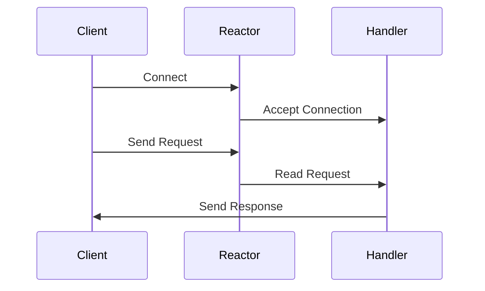

## 6.8.3 Use Cases and Examples

In this section, we will delve into the practical applications of the Reactor pattern, a powerful design pattern used to handle multiple service requests simultaneously in a single-threaded manner. This pattern is particularly useful in scenarios where high scalability and performance are required, such as web servers, chat servers, and event-driven applications. We will explore how the Reactor pattern can be implemented in Java, leveraging its non-blocking I/O capabilities, and discuss the benefits it brings to these use cases.

### Understanding the Reactor Pattern

The Reactor pattern is a design pattern for handling service requests delivered concurrently to a service handler by one or more inputs. The pattern provides a mechanism to demultiplex and dispatch service requests that are delivered to an application from one or more clients. The key components of the Reactor pattern include:

- **Event Demultiplexer**: Waits for events on a set of handles and returns those that are ready.
- **Dispatcher**: Dispatches the event to the appropriate handler.
- **Handlers**: Handle the events and perform the necessary operations.

The Reactor pattern is commonly used in event-driven applications where it is necessary to handle multiple events or requests concurrently without the overhead of creating a new thread for each request.

### Use Case 1: Web Server with Java NIO

One of the most common applications of the Reactor pattern is in the development of web servers. Traditional web servers use a thread-per-request model, which can become inefficient and resource-intensive as the number of concurrent connections increases. The Reactor pattern, combined with Java's Non-blocking I/O (NIO), allows a web server to handle multiple client connections using a single thread, significantly improving scalability and performance.

#### Implementing a Simple Web Server

Let's look at a simple implementation of a web server using the Reactor pattern with Java NIO.

```java
import java.io.IOException;
import java.net.InetSocketAddress;
import java.nio.ByteBuffer;
import java.nio.channels.SelectionKey;
import java.nio.channels.Selector;
import java.nio.channels.ServerSocketChannel;
import java.nio.channels.SocketChannel;
import java.util.Iterator;

public class ReactorWebServer {
    private Selector selector;

    public ReactorWebServer(int port) throws IOException {
        selector = Selector.open();
        ServerSocketChannel serverSocket = ServerSocketChannel.open();
        serverSocket.bind(new InetSocketAddress(port));
        serverSocket.configureBlocking(false);
        serverSocket.register(selector, SelectionKey.OP_ACCEPT);
    }

    public void start() throws IOException {
        while (true) {
            selector.select();
            Iterator<SelectionKey> keys = selector.selectedKeys().iterator();
            while (keys.hasNext()) {
                SelectionKey key = keys.next();
                keys.remove();

                if (!key.isValid()) continue;

                if (key.isAcceptable()) {
                    accept(key);
                } else if (key.isReadable()) {
                    read(key);
                }
            }
        }
    }

    private void accept(SelectionKey key) throws IOException {
        ServerSocketChannel serverSocket = (ServerSocketChannel) key.channel();
        SocketChannel client = serverSocket.accept();
        client.configureBlocking(false);
        client.register(selector, SelectionKey.OP_READ);
    }

    private void read(SelectionKey key) throws IOException {
        SocketChannel client = (SocketChannel) key.channel();
        ByteBuffer buffer = ByteBuffer.allocate(256);
        int bytesRead = client.read(buffer);
        if (bytesRead == -1) {
            client.close();
            return;
        }
        String request = new String(buffer.array()).trim();
        System.out.println("Received request: " + request);
        client.write(ByteBuffer.wrap("HTTP/1.1 200 OK\r\nContent-Length: 0\r\n\r\n".getBytes()));
    }

    public static void main(String[] args) {
        try {
            new ReactorWebServer(8080).start();
        } catch (IOException e) {
            e.printStackTrace();
        }
    }
}
```

**Explanation:**

- **Selector**: A selector is used to manage multiple channels (connections) and determine which channels are ready for I/O operations.
- **ServerSocketChannel**: This channel listens for incoming connections.
- **SocketChannel**: Represents a connection to a client.
- **SelectionKey**: Represents the registration of a channel with a selector, indicating what operations are of interest (e.g., accept, read).

This simple web server can handle multiple client connections using a single thread, thanks to the non-blocking I/O capabilities provided by Java NIO.

### Use Case 2: Chat Server for Real-Time Communication

Another excellent use case for the Reactor pattern is in building chat servers, where real-time communication between multiple clients is essential. The Reactor pattern allows the server to handle numerous client connections efficiently, ensuring that messages are delivered promptly without the overhead of managing multiple threads.

#### Implementing a Chat Server

Here's a basic implementation of a chat server using the Reactor pattern:

```java
import java.io.IOException;
import java.net.InetSocketAddress;
import java.nio.ByteBuffer;
import java.nio.channels.SelectionKey;
import java.nio.channels.Selector;
import java.nio.channels.ServerSocketChannel;
import java.nio.channels.SocketChannel;
import java.util.HashMap;
import java.util.Iterator;
import java.util.Map;

public class ReactorChatServer {
    private Selector selector;
    private Map<SocketChannel, String> clientMap;

    public ReactorChatServer(int port) throws IOException {
        selector = Selector.open();
        clientMap = new HashMap<>();
        ServerSocketChannel serverSocket = ServerSocketChannel.open();
        serverSocket.bind(new InetSocketAddress(port));
        serverSocket.configureBlocking(false);
        serverSocket.register(selector, SelectionKey.OP_ACCEPT);
    }

    public void start() throws IOException {
        while (true) {
            selector.select();
            Iterator<SelectionKey> keys = selector.selectedKeys().iterator();
            while (keys.hasNext()) {
                SelectionKey key = keys.next();
                keys.remove();

                if (!key.isValid()) continue;

                if (key.isAcceptable()) {
                    accept(key);
                } else if (key.isReadable()) {
                    read(key);
                }
            }
        }
    }

    private void accept(SelectionKey key) throws IOException {
        ServerSocketChannel serverSocket = (ServerSocketChannel) key.channel();
        SocketChannel client = serverSocket.accept();
        client.configureBlocking(false);
        client.register(selector, SelectionKey.OP_READ);
        clientMap.put(client, "Client" + client.hashCode());
    }

    private void read(SelectionKey key) throws IOException {
        SocketChannel client = (SocketChannel) key.channel();
        ByteBuffer buffer = ByteBuffer.allocate(256);
        int bytesRead = client.read(buffer);
        if (bytesRead == -1) {
            clientMap.remove(client);
            client.close();
            return;
        }
        String message = new String(buffer.array()).trim();
        System.out.println(clientMap.get(client) + ": " + message);
        broadcast(message, client);
    }

    private void broadcast(String message, SocketChannel sender) throws IOException {
        for (SocketChannel client : clientMap.keySet()) {
            if (client != sender) {
                client.write(ByteBuffer.wrap((clientMap.get(sender) + ": " + message).getBytes()));
            }
        }
    }

    public static void main(String[] args) {
        try {
            new ReactorChatServer(9090).start();
        } catch (IOException e) {
            e.printStackTrace();
        }
    }
}
```

**Explanation:**

- **Client Map**: Maintains a mapping of connected clients to their identifiers.
- **Broadcast**: Sends messages to all clients except the sender, enabling real-time communication.

This chat server efficiently manages multiple client connections and broadcasts messages using the Reactor pattern.

### Use Case 3: Event-Driven Applications

Event-driven applications, such as GUI frameworks or system monitors, benefit significantly from the Reactor pattern. These applications often need to respond to various events, such as user inputs or system changes, in a non-blocking manner.

#### Implementing an Event-Driven System Monitor

Consider a system monitor that tracks CPU and memory usage and updates the display whenever there's a change. The Reactor pattern can be used to handle these events efficiently.

```java
import java.io.IOException;
import java.nio.channels.SelectionKey;
import java.nio.channels.Selector;
import java.nio.channels.SocketChannel;
import java.util.Iterator;

public class ReactorSystemMonitor {
    private Selector selector;

    public ReactorSystemMonitor() throws IOException {
        selector = Selector.open();
    }

    public void start() throws IOException {
        while (true) {
            selector.select();
            Iterator<SelectionKey> keys = selector.selectedKeys().iterator();
            while (keys.hasNext()) {
                SelectionKey key = keys.next();
                keys.remove();

                if (!key.isValid()) continue;

                if (key.isReadable()) {
                    handleEvent(key);
                }
            }
        }
    }

    private void handleEvent(SelectionKey key) throws IOException {
        SocketChannel channel = (SocketChannel) key.channel();
        // Simulate reading system metrics
        System.out.println("System metrics updated.");
    }

    public static void main(String[] args) {
        try {
            new ReactorSystemMonitor().start();
        } catch (IOException e) {
            e.printStackTrace();
        }
    }
}
```

**Explanation:**

- **Event Handling**: The system monitor listens for events and processes them without blocking the main thread, ensuring that the application remains responsive.

### Benefits of the Reactor Pattern

The Reactor pattern offers several advantages in the contexts discussed:

- **Scalability**: By using a single-threaded model, the Reactor pattern can handle a large number of connections or events concurrently without the overhead of managing multiple threads.
- **Performance**: Non-blocking I/O operations reduce the time spent waiting for I/O operations to complete, improving the overall performance of the application.
- **Resource Management**: The Reactor pattern efficiently manages resources by reusing the same thread for multiple connections or events, reducing the need for additional resources.

### Error Handling and Resource Management

When implementing the Reactor pattern, it is crucial to consider error handling and resource management:

- **Error Handling**: Ensure that exceptions are caught and handled appropriately to prevent the application from crashing. Use try-catch blocks around I/O operations and log errors for debugging.
- **Resource Management**: Properly close channels and release resources when they are no longer needed to prevent resource leaks. Use finally blocks or try-with-resources to ensure resources are released.

### Encouragement for High-Performance Applications

The Reactor pattern is an excellent choice for building high-performance event-driven applications. Its ability to handle multiple connections or events concurrently with minimal resource usage makes it ideal for scenarios where scalability and performance are critical. Consider using the Reactor pattern in your next project to take advantage of its benefits and improve the efficiency of your application.

### Visualizing the Reactor Pattern

To better understand the flow of the Reactor pattern, let's visualize it using a sequence diagram:



**Diagram Explanation:**

- **Client**: Initiates a connection and sends requests.
- **Reactor**: Accepts connections and dispatches requests to the appropriate handler.
- **Handler**: Processes the request and sends a response back to the client.

### Try It Yourself

Experiment with the provided code examples to gain a deeper understanding of the Reactor pattern. Try modifying the code to add new features or handle different types of events. For example:

- **Modify the Web Server**: Add support for handling different HTTP methods (e.g., GET, POST) and serving static files.
- **Enhance the Chat Server**: Implement user authentication and private messaging between clients.
- **Extend the System Monitor**: Add support for monitoring additional system metrics, such as disk usage or network activity.

### Conclusion

The Reactor pattern is a powerful tool for building scalable and high-performance applications. By leveraging non-blocking I/O and event-driven architectures, you can efficiently manage multiple connections or events with minimal resource usage. As you continue to explore and implement the Reactor pattern, you'll discover its potential to enhance the performance and scalability of your applications.

## Quiz Time!



### What is the primary advantage of using the Reactor pattern in a web server?

- [x] It allows handling multiple client connections using a single thread.
- [ ] It simplifies the code by using blocking I/O.
- [ ] It increases the number of threads required for handling connections.
- [ ] It eliminates the need for error handling.

> **Explanation:** The Reactor pattern allows handling multiple client connections using a single thread, improving scalability and performance.

### In the Reactor pattern, what role does the Selector play?

- [x] It manages multiple channels and determines which are ready for I/O operations.
- [ ] It directly processes client requests.
- [ ] It handles error logging and debugging.
- [ ] It manages the application's user interface.

> **Explanation:** The Selector manages multiple channels and determines which are ready for I/O operations, allowing efficient event handling.

### How does the Reactor pattern improve resource management?

- [x] By reusing the same thread for multiple connections or events.
- [ ] By creating a new thread for each connection.
- [ ] By using blocking I/O operations.
- [ ] By eliminating the need for error handling.

> **Explanation:** The Reactor pattern improves resource management by reusing the same thread for multiple connections or events, reducing the need for additional resources.

### What is a key consideration when implementing the Reactor pattern?

- [x] Proper error handling and resource management.
- [ ] Using blocking I/O operations.
- [ ] Increasing the number of threads for better performance.
- [ ] Eliminating the need for logging.

> **Explanation:** Proper error handling and resource management are crucial when implementing the Reactor pattern to prevent resource leaks and application crashes.

### Which of the following is a use case for the Reactor pattern?

- [x] Web servers
- [x] Chat servers
- [ ] Single-threaded applications
- [ ] Batch processing systems

> **Explanation:** The Reactor pattern is suitable for web servers and chat servers, where handling multiple connections or events concurrently is essential.

### What is the role of the Handler in the Reactor pattern?

- [x] It processes events and performs necessary operations.
- [ ] It manages the application's user interface.
- [ ] It handles error logging and debugging.
- [ ] It directly manages client connections.

> **Explanation:** The Handler processes events and performs necessary operations, such as reading requests and sending responses.

### How can the Reactor pattern be visualized?

- [x] Using a sequence diagram to show the flow of events.
- [ ] Using a class diagram to show the structure of classes.
- [ ] Using a flowchart to show the application's logic.
- [ ] Using a pie chart to show resource usage.

> **Explanation:** A sequence diagram can be used to visualize the flow of events in the Reactor pattern, showing how clients, the reactor, and handlers interact.

### What is a potential modification you can try with the provided chat server example?

- [x] Implement user authentication and private messaging.
- [ ] Use blocking I/O operations for better performance.
- [ ] Eliminate the use of selectors.
- [ ] Increase the number of threads for handling connections.

> **Explanation:** Implementing user authentication and private messaging is a potential modification to enhance the chat server's functionality.

### What is the benefit of using non-blocking I/O in the Reactor pattern?

- [x] It reduces the time spent waiting for I/O operations to complete.
- [ ] It increases the number of threads required for handling connections.
- [ ] It simplifies the code by using blocking I/O.
- [ ] It eliminates the need for error handling.

> **Explanation:** Non-blocking I/O reduces the time spent waiting for I/O operations to complete, improving the overall performance of the application.

### True or False: The Reactor pattern is only suitable for single-threaded applications.

- [ ] True
- [x] False

> **Explanation:** False. The Reactor pattern is suitable for applications that require handling multiple connections or events concurrently, such as web servers and chat servers.


