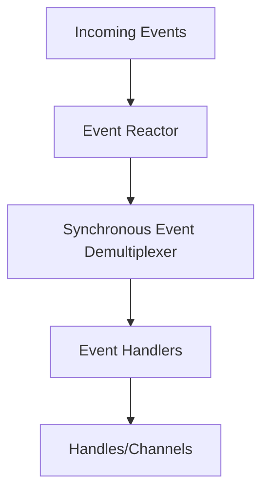
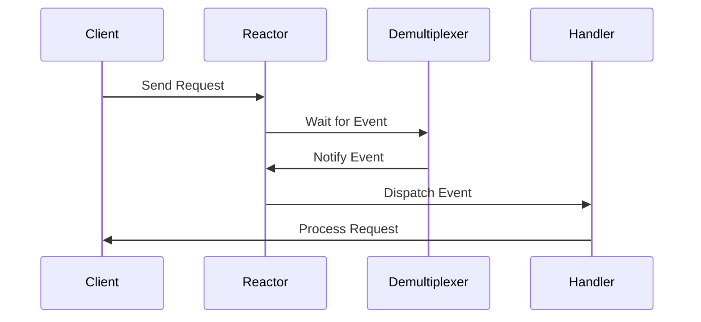

## 6.8 Reactor Pattern

In the world of concurrent programming, efficiently handling multiple simultaneous events is crucial for building high-performance, scalable applications. The Reactor Pattern is a design pattern that addresses this need by demultiplexing incoming events and dispatching them synchronously to the appropriate handlers. This pattern is particularly beneficial in scenarios like web servers and network applications where handling numerous concurrent connections is essential.

### Understanding the Reactor Pattern

The Reactor Pattern is a structural pattern that provides a mechanism to handle service requests delivered concurrently to an application by one or more clients. It demultiplexes incoming events and dispatches them to the appropriate event handlers. The pattern is designed to handle multiple inputs simultaneously, making it ideal for applications that require high throughput and low latency.

#### Intent of the Reactor Pattern

The primary intent of the Reactor Pattern is to efficiently manage multiple simultaneous events by using a single-threaded event loop. This approach minimizes the overhead associated with thread management and context switching, which can be a bottleneck in high-performance applications. By using non-blocking I/O operations, the Reactor Pattern allows applications to handle many connections with a small number of threads, improving scalability and performance.

#### Problem Solved by the Reactor Pattern

In traditional multi-threaded server designs, each incoming connection is typically handled by a separate thread. While this approach is straightforward, it does not scale well with a large number of connections due to the overhead of thread management. The Reactor Pattern solves this problem by using a single-threaded event loop to handle all incoming events. This design reduces the complexity and overhead associated with managing multiple threads, allowing the application to handle a large number of connections efficiently.

### Structure of the Reactor Pattern

The Reactor Pattern consists of several key components that work together to handle events efficiently:

1. **Event Reactor**: The core component that listens for incoming events and dispatches them to the appropriate event handlers. It uses a synchronous event demultiplexer to wait for events on multiple channels.

2. **Synchronous Event Demultiplexer**: A mechanism that blocks waiting for events to occur on a set of channels. When an event occurs, it notifies the Event Reactor.

3. **Event Handlers**: Components that process specific types of events. Each handler is responsible for handling a particular type of event, such as a read or write operation.

4. **Handles or Channels**: Abstractions representing resources that can generate events, such as network connections or file descriptors.

#### Diagram: Reactor Pattern Structure

Below is a diagram illustrating the structure of the Reactor Pattern:



**Caption**: The Reactor Pattern structure showing the flow of events from incoming requests to the Event Reactor, through the Synchronous Event Demultiplexer, and finally to the Event Handlers.

### How the Reactor Pattern Works

The Reactor Pattern operates by continuously monitoring a set of handles or channels for events. When an event occurs, the Synchronous Event Demultiplexer notifies the Event Reactor, which then dispatches the event to the appropriate Event Handler. This process allows the application to handle multiple events concurrently using a single-threaded event loop.

#### Step-by-Step Process

1. **Initialization**: The Event Reactor initializes the Synchronous Event Demultiplexer with a set of handles or channels to monitor.

2. **Event Loop**: The Event Reactor enters an event loop, where it waits for events to occur on the monitored handles.

3. **Event Demultiplexing**: When an event occurs, the Synchronous Event Demultiplexer notifies the Event Reactor.

4. **Event Dispatching**: The Event Reactor dispatches the event to the appropriate Event Handler based on the type of event.

5. **Event Handling**: The Event Handler processes the event, performing the necessary operations, such as reading data from a network connection or writing data to a file.

6. **Repeat**: The process repeats, with the Event Reactor continuing to monitor for new events.

### Benefits of the Reactor Pattern

The Reactor Pattern offers several benefits that make it ideal for high-performance, scalable applications:

- **Scalability**: By using a single-threaded event loop, the Reactor Pattern can handle a large number of connections with minimal overhead.

- **Performance**: The pattern reduces the overhead associated with thread management and context switching, resulting in improved performance.

- **Simplicity**: The single-threaded design simplifies the application architecture, making it easier to develop and maintain.

- **Resource Efficiency**: The pattern uses non-blocking I/O operations, allowing the application to handle many connections with a small number of threads.

### Use Cases for the Reactor Pattern

The Reactor Pattern is particularly beneficial in scenarios where high performance and scalability are essential. Some common use cases include:

- **Web Servers**: Handling multiple simultaneous connections from clients efficiently.

- **Network Applications**: Managing numerous network connections with minimal overhead.

- **Event-Driven Applications**: Processing events in real-time with low latency.

### Implementing the Reactor Pattern in Java

Let's explore how to implement the Reactor Pattern in Java. We'll create a simple example of a server that uses the Reactor Pattern to handle incoming connections.

#### Code Example: Reactor Pattern in Java

```java
import java.io.IOException;
import java.nio.channels.*;
import java.util.Iterator;
import java.util.Set;

public class Reactor implements Runnable {
    private final Selector selector;

    public Reactor() throws IOException {
        this.selector = Selector.open();
    }

    public void registerChannel(SelectableChannel channel, int ops, EventHandler handler) throws IOException {
        channel.configureBlocking(false);
        SelectionKey key = channel.register(selector, ops);
        key.attach(handler);
    }

    @Override
    public void run() {
        try {
            while (!Thread.currentThread().isInterrupted()) {
                selector.select();
                Set<SelectionKey> selectedKeys = selector.selectedKeys();
                Iterator<SelectionKey> iterator = selectedKeys.iterator();
                while (iterator.hasNext()) {
                    SelectionKey key = iterator.next();
                    iterator.remove();
                    dispatch(key);
                }
            }
        } catch (IOException e) {
            e.printStackTrace();
        }
    }

    private void dispatch(SelectionKey key) {
        EventHandler handler = (EventHandler) key.attachment();
        if (handler != null) {
            handler.handleEvent(key);
        }
    }
}

interface EventHandler {
    void handleEvent(SelectionKey key);
}
```

**Explanation**: In this example, we define a `Reactor` class that implements the `Runnable` interface. The `Reactor` uses a `Selector` to monitor multiple channels for events. The `registerChannel` method is used to register a channel with the selector and attach an `EventHandler` to it. The `run` method contains the event loop, which waits for events and dispatches them to the appropriate handler.

#### Try It Yourself

To experiment with this code, try adding different types of `EventHandler` implementations to handle specific events, such as reading from a socket or writing to a file. You can also modify the event loop to handle additional event types or implement custom logic for specific events.

### Visualizing Event Demultiplexing and Dispatching

To better understand how the Reactor Pattern handles events, let's visualize the process of event demultiplexing and dispatching.

#### Diagram: Event Demultiplexing and Dispatching



**Caption**: The sequence diagram illustrates the flow of events from a client request to the Reactor, through the Demultiplexer, and finally to the appropriate Handler for processing.

### High-Performance, Scalable Event-Driven Applications

The Reactor Pattern is a powerful tool for building high-performance, scalable event-driven applications. By efficiently managing multiple simultaneous events, the pattern enables applications to handle a large number of connections with minimal overhead. This makes it ideal for scenarios where performance and scalability are critical, such as web servers and network applications.

### Further Reading and Resources

For more information on the Reactor Pattern and its applications, consider exploring the following resources:

- [Java NIO Documentation](https://docs.oracle.com/javase/8/docs/api/java/nio/package-summary.html): Official documentation for Java's non-blocking I/O package.
- [Reactor Pattern on Wikipedia](https://en.wikipedia.org/wiki/Reactor_pattern): A comprehensive overview of the Reactor Pattern and its use cases.
- [Netty Project](https://netty.io/): An open-source framework that uses the Reactor Pattern for building high-performance network applications.

### Knowledge Check

To reinforce your understanding of the Reactor Pattern, consider the following questions:

- What is the primary intent of the Reactor Pattern?
- How does the Reactor Pattern improve scalability and performance in event-driven applications?
- What are the key components of the Reactor Pattern, and what roles do they play?
- How does the Reactor Pattern differ from traditional multi-threaded server designs?

### Conclusion

The Reactor Pattern is an essential design pattern for building high-performance, scalable event-driven applications. By efficiently managing multiple simultaneous events, the pattern enables applications to handle a large number of connections with minimal overhead. As you continue to explore concurrency patterns in Java, consider how the Reactor Pattern can enhance the performance and scalability of your applications.

## Quiz Time!



### What is the primary intent of the Reactor Pattern?

- [x] To efficiently manage multiple simultaneous events using a single-threaded event loop.
- [ ] To handle events using multiple threads for each connection.
- [ ] To simplify the architecture of multi-threaded applications.
- [ ] To improve the readability of event-driven code.

> **Explanation:** The Reactor Pattern's primary intent is to efficiently manage multiple simultaneous events using a single-threaded event loop, minimizing the overhead of thread management.

### How does the Reactor Pattern improve scalability?

- [x] By using a single-threaded event loop to handle many connections.
- [ ] By creating a new thread for each incoming connection.
- [ ] By using blocking I/O operations.
- [ ] By reducing the number of event handlers.

> **Explanation:** The Reactor Pattern improves scalability by using a single-threaded event loop to handle many connections, reducing the overhead associated with thread management.

### Which component of the Reactor Pattern is responsible for dispatching events?

- [ ] Synchronous Event Demultiplexer
- [x] Event Reactor
- [ ] Event Handler
- [ ] Handle or Channel

> **Explanation:** The Event Reactor is responsible for dispatching events to the appropriate event handlers.

### What is the role of the Synchronous Event Demultiplexer in the Reactor Pattern?

- [x] To block and wait for events on multiple channels.
- [ ] To handle specific types of events.
- [ ] To process client requests directly.
- [ ] To create new threads for each event.

> **Explanation:** The Synchronous Event Demultiplexer blocks and waits for events on multiple channels, notifying the Event Reactor when an event occurs.

### In what scenarios is the Reactor Pattern particularly beneficial?

- [x] Web servers
- [x] Network applications
- [ ] Single-threaded desktop applications
- [ ] Simple command-line tools

> **Explanation:** The Reactor Pattern is particularly beneficial in scenarios like web servers and network applications where handling numerous concurrent connections efficiently is essential.

### What is a key benefit of using the Reactor Pattern?

- [x] Improved performance and scalability
- [ ] Simplified code readability
- [ ] Increased number of threads
- [ ] Reduced number of event types

> **Explanation:** A key benefit of the Reactor Pattern is improved performance and scalability by efficiently managing multiple simultaneous events.

### How does the Reactor Pattern differ from traditional multi-threaded server designs?

- [x] It uses a single-threaded event loop instead of multiple threads for each connection.
- [ ] It creates a new thread for each incoming connection.
- [ ] It uses blocking I/O operations.
- [ ] It simplifies the architecture of event-driven applications.

> **Explanation:** The Reactor Pattern differs from traditional multi-threaded server designs by using a single-threaded event loop to handle multiple connections, reducing overhead.

### What is the role of an Event Handler in the Reactor Pattern?

- [ ] To block and wait for events on multiple channels.
- [ ] To dispatch events to the appropriate handlers.
- [x] To process specific types of events.
- [ ] To manage the lifecycle of the Reactor.

> **Explanation:** An Event Handler is responsible for processing specific types of events in the Reactor Pattern.

### What is a common use case for the Reactor Pattern?

- [x] Handling multiple simultaneous connections in a web server.
- [ ] Managing a single-threaded desktop application.
- [ ] Simplifying command-line tool architecture.
- [ ] Reducing the number of event types in an application.

> **Explanation:** A common use case for the Reactor Pattern is handling multiple simultaneous connections in a web server, where performance and scalability are crucial.

### True or False: The Reactor Pattern uses non-blocking I/O operations to handle events.

- [x] True
- [ ] False

> **Explanation:** True. The Reactor Pattern uses non-blocking I/O operations to handle events, allowing it to efficiently manage multiple connections with minimal overhead.


