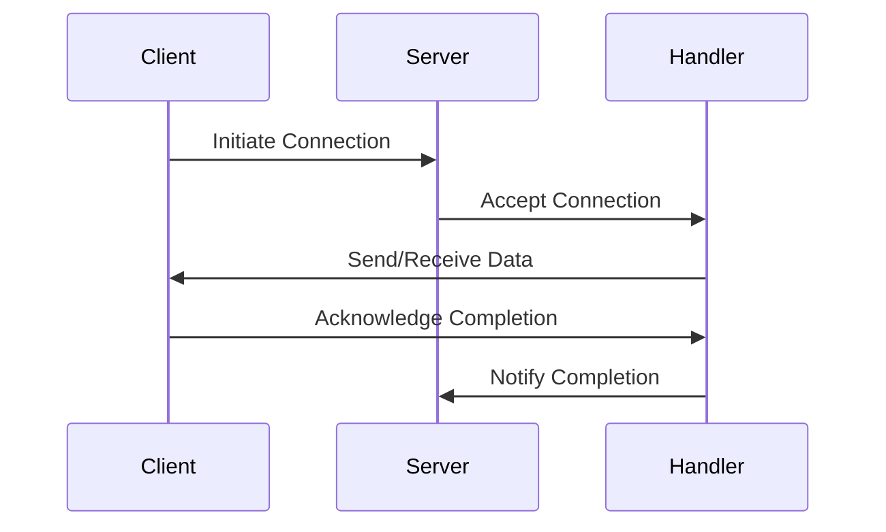

## 6.9.1 Implementing Proactor in Java

In this section, we will delve into the implementation of the Proactor pattern in Java, leveraging the power of Java's Asynchronous I/O (AIO) APIs. The Proactor pattern is a concurrency pattern that allows handling asynchronous operations efficiently by delegating the completion of operations to handlers. This pattern is particularly useful in scenarios where non-blocking I/O operations are required, such as in network servers and high-performance applications.

### Understanding Java's Asynchronous I/O (AIO) APIs

Java's Asynchronous I/O APIs, introduced in Java 7 as part of the New I/O (NIO) package, provide a robust framework for performing non-blocking I/O operations. The key components of this framework include:

- **AsynchronousSocketChannel**: This class is used for asynchronous socket communication.
- **AsynchronousServerSocketChannel**: This class allows for asynchronous server socket operations.
- **CompletionHandler**: An interface that defines methods to handle the completion of asynchronous operations.

These components enable developers to initiate I/O operations without blocking the executing thread, allowing the application to perform other tasks while waiting for the I/O operations to complete.

### Initiating Asynchronous Operations

To implement the Proactor pattern, we first need to understand how to initiate asynchronous operations using Java's AIO APIs. Let's start by looking at how to set up an asynchronous server using `AsynchronousServerSocketChannel`.

```java
import java.net.InetSocketAddress;
import java.nio.ByteBuffer;
import java.nio.channels.AsynchronousServerSocketChannel;
import java.nio.channels.AsynchronousSocketChannel;
import java.nio.channels.CompletionHandler;
import java.io.IOException;

public class AsyncServer {

    public static void main(String[] args) {
        try {
            // Create an asynchronous server socket channel bound to a local address
            AsynchronousServerSocketChannel serverChannel = 
                AsynchronousServerSocketChannel.open().bind(new InetSocketAddress(5000));

            System.out.println("Server listening on port 5000");

            // Accept a connection
            serverChannel.accept(null, new CompletionHandler<AsynchronousSocketChannel, Void>() {
                @Override
                public void completed(AsynchronousSocketChannel clientChannel, Void attachment) {
                    // Accept the next connection
                    serverChannel.accept(null, this);

                    // Handle the client connection
                    ByteBuffer buffer = ByteBuffer.allocate(1024);
                    clientChannel.read(buffer, buffer, new CompletionHandler<Integer, ByteBuffer>() {
                        @Override
                        public void completed(Integer result, ByteBuffer buffer) {
                            buffer.flip();
                            clientChannel.write(buffer, buffer, new CompletionHandler<Integer, ByteBuffer>() {
                                @Override
                                public void completed(Integer result, ByteBuffer buffer) {
                                    buffer.clear();
                                    clientChannel.read(buffer, buffer, this);
                                }

                                @Override
                                public void failed(Throwable exc, ByteBuffer buffer) {
                                    try {
                                        clientChannel.close();
                                    } catch (IOException e) {
                                        e.printStackTrace();
                                    }
                                }
                            });
                        }

                        @Override
                        public void failed(Throwable exc, ByteBuffer buffer) {
                            try {
                                clientChannel.close();
                            } catch (IOException e) {
                                e.printStackTrace();
                            }
                        }
                    });
                }

                @Override
                public void failed(Throwable exc, Void attachment) {
                    System.out.println("Failed to accept a connection");
                    exc.printStackTrace();
                }
            });

            // Keep the server running
            Thread.currentThread().join();

        } catch (IOException | InterruptedException e) {
            e.printStackTrace();
        }
    }
}
```

### Registering Completion Handlers

In the code example above, we use `CompletionHandler` to manage the completion of asynchronous operations. The `CompletionHandler` interface provides two methods:

- `completed(V result, A attachment)`: Invoked when the operation completes successfully.
- `failed(Throwable exc, A attachment)`: Invoked when the operation fails.

By implementing these methods, we can define the logic to execute upon the completion of an asynchronous operation. In our server example, we handle both reading from and writing to the client socket asynchronously.

### Invoking Completion Handlers

The completion handlers are invoked automatically by the underlying system when an asynchronous operation completes. This allows the application to continue executing other tasks while waiting for I/O operations to finish. The non-blocking nature of this approach is what makes the Proactor pattern so powerful in handling high-concurrency scenarios.

### Managing Multiple Asynchronous Operations

When dealing with multiple asynchronous operations, it's essential to manage them efficiently to avoid resource contention and ensure optimal performance. Here are some strategies to consider:

1. **Thread Management**: Use a thread pool to manage the threads handling completion events. This prevents the creation of too many threads, which can degrade performance.

2. **Resource Allocation**: Allocate resources such as buffers judiciously to prevent memory leaks and ensure efficient use of system resources.

3. **Concurrency Control**: Use synchronization mechanisms to manage shared resources and prevent race conditions.

### Best Practices for Error Handling and Resource Management

Error handling and resource management are critical aspects of implementing the Proactor pattern. Here are some best practices to follow:

- **Graceful Error Handling**: Implement robust error handling in the `failed` method of the `CompletionHandler` to manage exceptions and ensure the application remains stable.

- **Resource Cleanup**: Ensure that resources such as channels and buffers are released when no longer needed to prevent resource leaks.

- **Logging and Monitoring**: Use logging to track the flow of operations and identify issues. Monitoring tools can help detect performance bottlenecks and resource usage patterns.

### Visualizing the Proactor Pattern

To better understand the flow of the Proactor pattern, let's visualize it using a sequence diagram:



**Diagram Description**: This sequence diagram illustrates the interaction between a client, server, and handler in the Proactor pattern. The client initiates a connection, which the server accepts. The handler manages data exchange and notifies the server upon completion.

### Try It Yourself

To deepen your understanding of the Proactor pattern, try modifying the code example provided:

- **Experiment with Different Buffer Sizes**: Change the buffer size in the `ByteBuffer.allocate()` method and observe the impact on performance.
- **Implement Additional Handlers**: Add more completion handlers to manage different types of operations, such as file I/O.
- **Simulate Network Latency**: Introduce artificial delays in the completion handlers to simulate network latency and observe how the application behaves.

### References and Further Reading

- [Java NIO Asynchronous I/O](https://docs.oracle.com/javase/7/docs/api/java/nio/channels/AsynchronousChannelGroup.html)
- [Java AsynchronousSocketChannel](https://docs.oracle.com/javase/7/docs/api/java/nio/channels/AsynchronousSocketChannel.html)
- [Proactor Pattern](https://en.wikipedia.org/wiki/Proactor_pattern)

### Knowledge Check

Before we conclude, let's reinforce what we've learned with some questions:

1. What is the primary advantage of using the Proactor pattern in Java?
2. How does the `CompletionHandler` interface facilitate asynchronous operations?
3. What are some strategies for managing multiple asynchronous operations efficiently?
4. Why is error handling crucial in asynchronous operations?
5. How can you visualize the flow of the Proactor pattern?

### Embrace the Journey

Implementing the Proactor pattern in Java can significantly enhance the performance and scalability of your applications. Remember, this is just the beginning. As you continue to explore and experiment, you'll discover new ways to leverage asynchronous operations to build robust, high-performance systems. Keep pushing the boundaries, stay curious, and enjoy the journey!

## Quiz Time!



### What is the primary advantage of the Proactor pattern?

- [x] It allows for non-blocking I/O operations.
- [ ] It simplifies synchronous operations.
- [ ] It reduces the need for multithreading.
- [ ] It eliminates the need for error handling.

> **Explanation:** The Proactor pattern is designed to handle asynchronous operations, allowing for non-blocking I/O, which is its primary advantage.

### Which Java class is used for asynchronous socket communication?

- [x] AsynchronousSocketChannel
- [ ] SocketChannel
- [ ] ServerSocket
- [ ] DatagramSocket

> **Explanation:** `AsynchronousSocketChannel` is part of Java's NIO package and is used for asynchronous socket communication.

### What method in CompletionHandler is invoked upon successful completion of an operation?

- [x] completed(V result, A attachment)
- [ ] failed(Throwable exc, A attachment)
- [ ] onSuccess()
- [ ] onComplete()

> **Explanation:** The `completed` method is called when an asynchronous operation completes successfully.

### How can you manage multiple asynchronous operations efficiently?

- [x] Use a thread pool.
- [ ] Create a new thread for each operation.
- [ ] Use synchronous operations.
- [ ] Ignore resource allocation.

> **Explanation:** Using a thread pool helps manage resources efficiently and prevents the creation of too many threads.

### Why is error handling crucial in asynchronous operations?

- [x] To ensure application stability.
- [ ] To increase operation speed.
- [ ] To avoid using completion handlers.
- [ ] To reduce code complexity.

> **Explanation:** Error handling is crucial to manage exceptions and maintain application stability in asynchronous operations.

### What is a key component of Java's Asynchronous I/O APIs?

- [x] CompletionHandler
- [ ] InputStream
- [ ] BufferedReader
- [ ] PrintWriter

> **Explanation:** `CompletionHandler` is a key component that handles the completion of asynchronous operations in Java's AIO APIs.

### What is the role of the `failed` method in CompletionHandler?

- [x] It handles exceptions during asynchronous operations.
- [ ] It logs successful operations.
- [ ] It initiates new operations.
- [ ] It manages resource allocation.

> **Explanation:** The `failed` method is invoked when an asynchronous operation encounters an error, allowing for exception handling.

### How does the Proactor pattern enhance performance?

- [x] By allowing non-blocking I/O operations.
- [ ] By reducing code size.
- [ ] By eliminating the need for handlers.
- [ ] By simplifying synchronous operations.

> **Explanation:** The Proactor pattern enhances performance by enabling non-blocking I/O operations, allowing other tasks to proceed concurrently.

### What is a best practice for resource management in asynchronous operations?

- [x] Ensure resources are released when no longer needed.
- [ ] Allocate maximum resources at the start.
- [ ] Avoid using buffers.
- [ ] Use blocking operations for simplicity.

> **Explanation:** Proper resource management involves releasing resources when they are no longer needed to prevent leaks and ensure efficiency.

### True or False: The Proactor pattern is only useful for network applications.

- [ ] True
- [x] False

> **Explanation:** While the Proactor pattern is beneficial for network applications, it is also applicable in any scenario requiring asynchronous operations, such as file I/O and high-performance computing.


