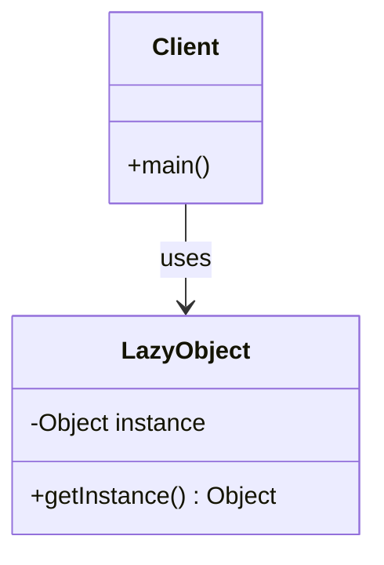

## 6.9.1 Implementing Lazy Initialization in Java

Lazy Initialization is a design pattern commonly used in software development to delay the creation of an object, the calculation of a value, or some other expensive process until the first time it is needed. This pattern is particularly useful in scenarios where resource-intensive operations can be deferred, thereby optimizing performance and resource utilization.

### Intent

The primary intent of Lazy Initialization is to improve the efficiency of a program by avoiding unnecessary computations and resource allocations. By deferring the initialization of an object until it is actually needed, applications can reduce memory usage and improve startup times.

### Motivation

Consider a scenario where an application needs to load a large dataset from a database. If this dataset is only occasionally used, loading it at startup would waste resources and slow down the application. Lazy Initialization allows the dataset to be loaded only when it is accessed for the first time, thereby optimizing resource usage.

### Applicability

Lazy Initialization is applicable in situations where:

- The cost of creating an object is high, and the object is not always needed.
- The object is used infrequently, and delaying its creation can lead to performance improvements.
- Memory usage is a concern, and deferring object creation can help manage resources more effectively.

### Structure

The Lazy Initialization pattern can be implemented using various techniques in Java. Below is a class diagram illustrating a basic structure of Lazy Initialization:



**Diagram Explanation**: The `LazyObject` class contains a method `getInstance()` that initializes the `instance` only when it is first accessed. The `Client` class demonstrates how this lazy-loaded object is used.

### Implementation

#### Basic Lazy Initialization

A straightforward way to implement Lazy Initialization is by using a simple `if` check within a getter method. Here's an example:

```java
public class LazyObject {
    private Object instance;

    public Object getInstance() {
        if (instance == null) {
            instance = new Object(); // Expensive operation
        }
        return instance;
    }
}
```

**Explanation**: In this example, the `instance` is only created when `getInstance()` is called for the first time. This approach is simple but not thread-safe.

#### Thread Safety Considerations

In a multithreaded environment, the basic lazy initialization approach can lead to race conditions. To ensure thread safety, synchronization can be used:

```java
public class ThreadSafeLazyObject {
    private Object instance;

    public synchronized Object getInstance() {
        if (instance == null) {
            instance = new Object(); // Expensive operation
        }
        return instance;
    }
}
```

**Explanation**: By synchronizing the `getInstance()` method, we ensure that only one thread can execute it at a time, preventing race conditions. However, this approach can lead to performance bottlenecks due to the overhead of synchronization.

#### Double-Checked Locking

To reduce the overhead of synchronization, the double-checked locking pattern can be used:

```java
public class DoubleCheckedLockingLazyObject {
    private volatile Object instance;

    public Object getInstance() {
        if (instance == null) {
            synchronized (this) {
                if (instance == null) {
                    instance = new Object(); // Expensive operation
                }
            }
        }
        return instance;
    }
}
```

**Explanation**: This pattern checks if the `instance` is `null` before and after acquiring the lock, ensuring that synchronization is only used when necessary. The `volatile` keyword ensures visibility of changes across threads.

#### Initialization-on-Demand Holder Idiom

A more elegant and efficient way to implement lazy initialization in Java is using the Initialization-on-Demand Holder Idiom:

```java
public class HolderLazyObject {
    private static class Holder {
        private static final Object INSTANCE = new Object(); // Expensive operation
    }

    public static Object getInstance() {
        return Holder.INSTANCE;
    }
}
```

**Explanation**: The `Holder` class is not loaded until `getInstance()` is called, ensuring lazy initialization. This approach is thread-safe without requiring synchronization.

### Sample Use Cases

- **Database Connections**: Establishing a connection to a database can be resource-intensive. Lazy Initialization can be used to open a connection only when it is needed.
- **Configuration Loading**: Applications often load configuration settings from files or remote services. Lazy Initialization can defer this loading until the settings are actually required.
- **Singleton Pattern**: Lazy Initialization is commonly used in the [6.6 Singleton Pattern]( "Singleton Pattern") to ensure that the singleton instance is created only when it is first accessed.

### Related Patterns

- **[6.6 Singleton Pattern]( "Singleton Pattern")**: Often uses lazy initialization to create the singleton instance.
- **Proxy Pattern**: Can be used to control access to an object, potentially deferring its creation.

### Known Uses

- **Java Collections Framework**: The `java.util.HashMap` uses lazy initialization for its internal table.
- **Spring Framework**: Uses lazy initialization for beans to optimize startup time and resource usage.

### Best Practices

- **Avoid Overuse**: While lazy initialization can improve performance, it should not be overused. In some cases, eager initialization might be more appropriate.
- **Consider Thread Safety**: Always consider thread safety when implementing lazy initialization in a multithreaded environment.
- **Use Modern Java Features**: Utilize Java's concurrency utilities and idioms like the Initialization-on-Demand Holder to implement lazy initialization efficiently.

### Exercises

1. Implement a lazy-loaded cache that stores expensive-to-compute values.
2. Modify the `DoubleCheckedLockingLazyObject` example to use a `ReentrantLock` instead of synchronized blocks.
3. Create a lazy-loaded configuration manager that reads settings from a file only when accessed.

### Summary

Lazy Initialization is a powerful pattern that can optimize resource usage and improve performance by deferring expensive operations until they are needed. By understanding and applying this pattern, developers can create more efficient and responsive applications. However, it is crucial to consider thread safety and choose the appropriate implementation strategy based on the specific requirements of the application.

## Test Your Knowledge: Lazy Initialization in Java Quiz



### What is the primary benefit of using Lazy Initialization?

- [x] It delays object creation until needed, optimizing resource usage.
- [ ] It ensures objects are created eagerly.
- [ ] It simplifies code structure.
- [ ] It increases memory usage.

> **Explanation:** Lazy Initialization delays the creation of an object until it is needed, which can optimize resource usage and improve performance.

### Which of the following is a thread-safe way to implement Lazy Initialization?

- [x] Initialization-on-Demand Holder Idiom
- [ ] Basic Lazy Initialization
- [ ] Eager Initialization
- [ ] None of the above

> **Explanation:** The Initialization-on-Demand Holder Idiom is a thread-safe way to implement Lazy Initialization without synchronization overhead.

### What is a potential drawback of using synchronized methods for Lazy Initialization?

- [x] Performance bottlenecks due to synchronization overhead.
- [ ] Increased memory usage.
- [ ] Simplified code structure.
- [ ] None of the above

> **Explanation:** Synchronization can lead to performance bottlenecks because it restricts access to the method to one thread at a time, which can be costly in terms of performance.

### How does the Double-Checked Locking pattern improve performance?

- [x] It reduces synchronization overhead by checking the instance twice.
- [ ] It uses eager initialization.
- [ ] It avoids using locks altogether.
- [ ] It increases memory usage.

> **Explanation:** Double-Checked Locking reduces synchronization overhead by checking the instance both before and after acquiring the lock, ensuring that synchronization is only used when necessary.

### Which Java keyword ensures visibility of changes across threads in the Double-Checked Locking pattern?

- [x] volatile
- [ ] synchronized
- [ ] transient
- [ ] static

> **Explanation:** The `volatile` keyword ensures that changes to the variable are visible across threads, which is crucial for the Double-Checked Locking pattern.

### What is the Initialization-on-Demand Holder Idiom?

- [x] A technique that uses a static inner class to hold the instance.
- [ ] A method of eager initialization.
- [ ] A way to avoid using lazy initialization.
- [ ] None of the above

> **Explanation:** The Initialization-on-Demand Holder Idiom uses a static inner class to hold the instance, ensuring lazy initialization and thread safety without synchronization.

### In which scenario is Lazy Initialization most beneficial?

- [x] When object creation is expensive and infrequent.
- [ ] When objects are always needed immediately.
- [ ] When memory usage is not a concern.
- [ ] None of the above

> **Explanation:** Lazy Initialization is most beneficial when object creation is expensive and the object is not always needed, allowing for optimized resource usage.

### Which pattern often uses Lazy Initialization to create its instance?

- [x] Singleton Pattern
- [ ] Factory Pattern
- [ ] Observer Pattern
- [ ] Strategy Pattern

> **Explanation:** The Singleton Pattern often uses Lazy Initialization to ensure that the singleton instance is created only when it is first accessed.

### What is a common use case for Lazy Initialization in Java applications?

- [x] Loading configuration settings only when needed.
- [ ] Always loading all resources at startup.
- [ ] Avoiding object creation altogether.
- [ ] None of the above

> **Explanation:** Lazy Initialization is commonly used to load configuration settings or resources only when they are needed, optimizing startup time and resource usage.

### True or False: Lazy Initialization should always be used in Java applications.

- [ ] True
- [x] False

> **Explanation:** Lazy Initialization should not always be used; it is beneficial in specific scenarios where resource optimization is needed. In some cases, eager initialization might be more appropriate.



By mastering Lazy Initialization, Java developers can enhance the efficiency and responsiveness of their applications, ensuring that resources are used judiciously and performance is optimized.
