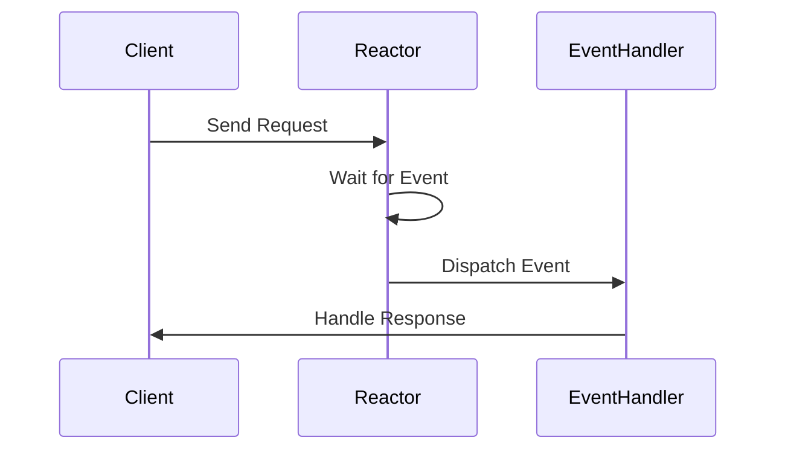
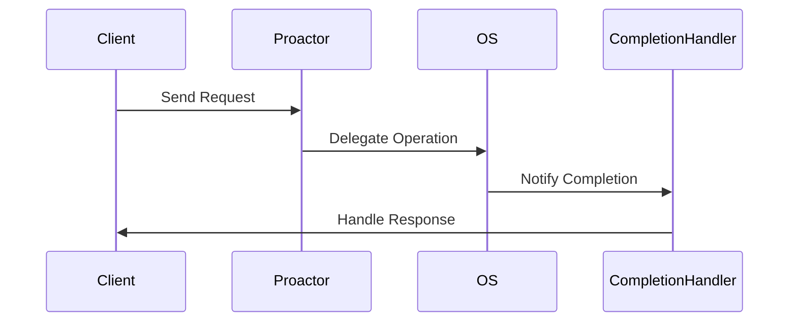

## 6.9.2 Difference from Reactor

In the realm of software design patterns, particularly those dealing with concurrency, the Reactor and Proactor patterns stand out for their distinct approaches to handling I/O operations. Understanding these patterns is crucial for expert software engineers who aim to design scalable and efficient systems. In this section, we will delve into the differences between the Reactor and Proactor patterns, focusing on their use of synchronous and asynchronous I/O, their performance implications, and scenarios where each pattern might be more suitable.

### Understanding the Reactor Pattern

The Reactor pattern is a design pattern used to handle service requests delivered concurrently to an application by one or more clients. It uses synchronous non-blocking I/O to demultiplex and dispatch service requests that are delivered to an application from one or more clients.

#### Key Concepts of the Reactor Pattern

- **Synchronous Non-blocking I/O**: The Reactor pattern relies on synchronous non-blocking I/O operations. This means the event loop continuously checks for events and processes them as they occur without blocking the execution of the program.
  
- **Event Loop**: The core of the Reactor pattern is the event loop, which waits for events and dispatches them to the appropriate event handlers.

- **Event Handlers**: These are callback functions that are invoked by the event loop when specific events occur.

```java
// Example of a simple Reactor pattern implementation in Java
public class Reactor {
    private Selector selector;

    public Reactor() throws IOException {
        selector = Selector.open();
    }

    public void registerChannel(SelectableChannel channel, int ops, EventHandler handler) throws IOException {
        channel.configureBlocking(false);
        SelectionKey key = channel.register(selector, ops);
        key.attach(handler);
    }

    public void run() throws IOException {
        while (true) {
            selector.select();
            Set<SelectionKey> selectedKeys = selector.selectedKeys();
            Iterator<SelectionKey> iterator = selectedKeys.iterator();
            while (iterator.hasNext()) {
                SelectionKey key = iterator.next();
                iterator.remove();
                if (key.isValid()) {
                    EventHandler handler = (EventHandler) key.attachment();
                    handler.handleEvent(key);
                }
            }
        }
    }
}

interface EventHandler {
    void handleEvent(SelectionKey key);
}
```

### Understanding the Proactor Pattern

The Proactor pattern, on the other hand, is designed to handle asynchronous I/O operations. It delegates operations to the operating system or a separate thread, which performs the operations asynchronously. Once the operation is complete, a completion handler is invoked.

#### Key Concepts of the Proactor Pattern

- **Asynchronous I/O**: The Proactor pattern uses asynchronous I/O operations, where the I/O operations are performed in the background, and the program continues executing other tasks.

- **Completion Handlers**: These are callback functions that are invoked once the asynchronous operation is complete.

- **Operation Delegation**: The actual I/O operations are delegated to the operating system or a separate thread, freeing the main application from waiting for the operations to complete.

```java
// Example of a simple Proactor pattern implementation in Java
public class Proactor {
    private ExecutorService executor = Executors.newFixedThreadPool(10);

    public void executeAsync(Runnable task, CompletionHandler handler) {
        executor.submit(() -> {
            task.run();
            handler.onComplete();
        });
    }
}

interface CompletionHandler {
    void onComplete();
}
```

### Performance Implications

The choice between Reactor and Proactor patterns can significantly impact the performance and scalability of an application. Let's explore these implications in more detail.

#### Reactor Pattern Performance

- **Low Latency**: The Reactor pattern is well-suited for applications that require low latency, as it can handle multiple connections simultaneously without blocking.

- **CPU Utilization**: Since the Reactor pattern uses an event loop, it can efficiently utilize CPU resources by processing multiple events in a single thread.

- **Scalability**: The pattern is scalable for applications with a high number of concurrent connections, as it minimizes the overhead of thread management.

#### Proactor Pattern Performance

- **High Throughput**: The Proactor pattern is ideal for applications that require high throughput, as it allows I/O operations to be performed in parallel with other tasks.

- **Resource Utilization**: By offloading I/O operations to the operating system or separate threads, the Proactor pattern can optimize resource utilization and reduce the load on the main application thread.

- **Complexity**: Implementing the Proactor pattern can be more complex due to the need for managing asynchronous operations and completion handlers.

### Suitability Scenarios

Choosing between the Reactor and Proactor patterns depends on the specific requirements of your application. Here are some scenarios where one pattern may be more suitable than the other.

#### When to Use the Reactor Pattern

- **Real-time Applications**: The Reactor pattern is ideal for real-time applications that require low latency and quick response times.

- **High-concurrency Applications**: Applications that need to handle a large number of concurrent connections, such as web servers and chat applications, can benefit from the Reactor pattern.

- **Simplicity**: If simplicity and ease of implementation are priorities, the Reactor pattern is generally easier to implement and maintain.

#### When to Use the Proactor Pattern

- **High-throughput Applications**: The Proactor pattern is well-suited for applications that require high throughput and can benefit from parallel processing of I/O operations.

- **Resource-intensive Operations**: Applications that perform resource-intensive I/O operations, such as file transfers and database queries, can leverage the Proactor pattern to optimize resource utilization.

- **Asynchronous Processing**: If your application can benefit from asynchronous processing and non-blocking I/O, the Proactor pattern is a suitable choice.

### Visualizing the Differences

To better understand the differences between the Reactor and Proactor patterns, let's visualize their workflows using Mermaid.js diagrams.



**Figure 1: Workflow of the Reactor Pattern**

In the Reactor pattern, the client sends a request to the Reactor, which waits for events and dispatches them to the appropriate event handlers.



**Figure 2: Workflow of the Proactor Pattern**

In the Proactor pattern, the client sends a request to the Proactor, which delegates the operation to the operating system. Upon completion, the OS notifies the completion handler, which handles the response.

### Try It Yourself

To deepen your understanding of these patterns, try modifying the provided code examples. Experiment with different types of I/O operations and observe how each pattern handles them. Consider implementing a simple server using both patterns and compare their performance under different loads.

### Knowledge Check

- What are the key differences between synchronous and asynchronous I/O?
- How does the Reactor pattern handle multiple connections?
- What are the benefits of using the Proactor pattern for high-throughput applications?
- In what scenarios would you choose the Reactor pattern over the Proactor pattern?

### References and Further Reading

- [Reactor Pattern on Wikipedia](https://en.wikipedia.org/wiki/Reactor_pattern)
- [Proactor Pattern on Wikipedia](https://en.wikipedia.org/wiki/Proactor_pattern)
- [Java NIO Documentation](https://docs.oracle.com/javase/8/docs/api/java/nio/package-summary.html)
- [Java Concurrency in Practice](https://www.oreilly.com/library/view/java-concurrency-in/0321349601/)

### Conclusion

Understanding the differences between the Reactor and Proactor patterns is essential for designing efficient and scalable concurrent applications. By considering the specific requirements of your application, you can choose the pattern that best meets your needs. Remember, this is just the beginning. As you progress, you'll build more complex and interactive systems. Keep experimenting, stay curious, and enjoy the journey!

## Quiz Time!



### What is the main difference between the Reactor and Proactor patterns?

- [x] Reactor uses synchronous non-blocking I/O, while Proactor uses asynchronous I/O.
- [ ] Reactor uses asynchronous I/O, while Proactor uses synchronous non-blocking I/O.
- [ ] Both patterns use synchronous blocking I/O.
- [ ] Both patterns use asynchronous blocking I/O.

> **Explanation:** The Reactor pattern relies on synchronous non-blocking I/O, whereas the Proactor pattern uses asynchronous I/O operations.

### Which pattern is more suitable for real-time applications requiring low latency?

- [x] Reactor Pattern
- [ ] Proactor Pattern
- [ ] Both are equally suitable
- [ ] Neither is suitable

> **Explanation:** The Reactor pattern is ideal for real-time applications due to its low latency and efficient event handling.

### What is a key advantage of the Proactor pattern?

- [x] High throughput due to asynchronous processing
- [ ] Simplicity of implementation
- [ ] Low latency for real-time applications
- [ ] Synchronous event handling

> **Explanation:** The Proactor pattern allows for high throughput by performing I/O operations asynchronously, enabling parallel processing.

### In the Reactor pattern, what is the role of the event loop?

- [x] To wait for events and dispatch them to handlers
- [ ] To perform asynchronous I/O operations
- [ ] To handle completion notifications
- [ ] To manage thread pools

> **Explanation:** The event loop in the Reactor pattern waits for events and dispatches them to the appropriate event handlers.

### Which pattern is more complex to implement due to asynchronous operations?

- [ ] Reactor Pattern
- [x] Proactor Pattern
- [ ] Both are equally complex
- [ ] Neither is complex

> **Explanation:** The Proactor pattern is more complex due to the need for managing asynchronous operations and completion handlers.

### What type of I/O does the Reactor pattern use?

- [x] Synchronous non-blocking I/O
- [ ] Asynchronous I/O
- [ ] Synchronous blocking I/O
- [ ] Asynchronous blocking I/O

> **Explanation:** The Reactor pattern uses synchronous non-blocking I/O to handle multiple connections efficiently.

### Which pattern is better suited for applications with resource-intensive I/O operations?

- [ ] Reactor Pattern
- [x] Proactor Pattern
- [ ] Both are equally suitable
- [ ] Neither is suitable

> **Explanation:** The Proactor pattern is better suited for resource-intensive I/O operations due to its asynchronous processing capabilities.

### How does the Proactor pattern handle I/O operations?

- [x] By delegating operations to the OS and using completion handlers
- [ ] By using an event loop to wait for events
- [ ] By blocking the main thread until operations complete
- [ ] By using synchronous non-blocking I/O

> **Explanation:** The Proactor pattern delegates I/O operations to the operating system and uses completion handlers to process results asynchronously.

### What is a completion handler in the context of the Proactor pattern?

- [x] A callback function invoked upon completion of an asynchronous operation
- [ ] A function that waits for events in the event loop
- [ ] A handler that processes synchronous I/O operations
- [ ] A method for managing thread pools

> **Explanation:** A completion handler is a callback function that is invoked when an asynchronous operation completes in the Proactor pattern.

### True or False: The Reactor pattern is more suitable for high-throughput applications than the Proactor pattern.

- [ ] True
- [x] False

> **Explanation:** The Proactor pattern is more suitable for high-throughput applications due to its ability to perform I/O operations asynchronously.


