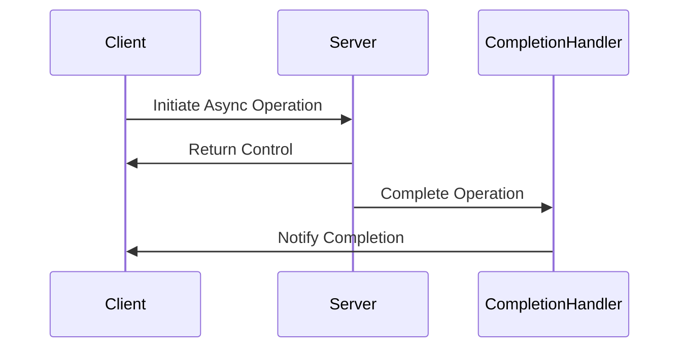

## 6.9.3 Use Cases and Examples

The Proactor pattern is a powerful design pattern for handling asynchronous I/O operations, particularly in environments where high concurrency and minimal latency are critical. This section delves into practical scenarios where the Proactor pattern is applied, demonstrating its effectiveness in enhancing performance and responsiveness in Java applications.

### Understanding the Proactor Pattern

Before we dive into specific use cases, let's briefly revisit what the Proactor pattern entails. The Proactor pattern is designed to handle asynchronous operations by delegating the completion of these operations to completion handlers. This pattern is particularly useful in scenarios where I/O operations are non-blocking and can be processed independently of the main application logic.

### Use Case 1: Asynchronous File Server

One of the primary applications of the Proactor pattern is in building file servers that handle large I/O operations asynchronously. Traditional file servers often rely on blocking I/O operations, which can lead to inefficiencies and increased latency, especially when dealing with large files or a high volume of requests.

#### Implementation Overview

In a Proactor-based file server, the server initiates file read/write operations and immediately returns control to the application. Once the I/O operation is complete, a completion handler is invoked to process the result. This approach allows the server to handle multiple I/O operations concurrently without blocking.

#### Java Code Example

Below is a simplified example of how a Proactor-based file server might be implemented in Java:

```java
import java.nio.channels.*;
import java.nio.*;
import java.io.IOException;
import java.util.concurrent.*;

public class AsyncFileServer {
    private final AsynchronousFileChannel fileChannel;
    private final ExecutorService executor;

    public AsyncFileServer(String filePath) throws IOException {
        this.fileChannel = AsynchronousFileChannel.open(Paths.get(filePath), StandardOpenOption.READ);
        this.executor = Executors.newFixedThreadPool(10);
    }

    public void readFile(long position, int size, CompletionHandler<Integer, ByteBuffer> handler) {
        ByteBuffer buffer = ByteBuffer.allocate(size);
        fileChannel.read(buffer, position, buffer, handler);
    }

    public void shutdown() throws IOException {
        fileChannel.close();
        executor.shutdown();
    }

    public static void main(String[] args) throws IOException {
        AsyncFileServer server = new AsyncFileServer("largefile.txt");
        server.readFile(0, 1024, new CompletionHandler<>() {
            @Override
            public void completed(Integer result, ByteBuffer buffer) {
                System.out.println("Read " + result + " bytes.");
                // Process the buffer
            }

            @Override
            public void failed(Throwable exc, ByteBuffer buffer) {
                System.err.println("Failed to read file: " + exc.getMessage());
            }
        });
    }
}
```

#### Benefits

- **Reduced Latency**: By avoiding blocking I/O operations, the server can handle multiple requests simultaneously, reducing wait times for clients.
- **Increased Throughput**: The server can process more requests in parallel, improving overall throughput.
- **Resource Efficiency**: Asynchronous operations free up resources that would otherwise be tied up in blocking calls.

### Use Case 2: High-Throughput Messaging System

Another compelling use case for the Proactor pattern is in high-throughput messaging systems. These systems often need to process a large number of messages concurrently, making asynchronous processing a natural fit.

#### Implementation Overview

In a Proactor-based messaging system, messages are received and processed asynchronously. The system uses completion handlers to manage the processing of each message, allowing it to handle a high volume of messages without bottlenecking.

#### Java Code Example

Here's an example of how a Proactor-based messaging system might be structured in Java:

```java
import java.nio.channels.*;
import java.nio.*;
import java.util.concurrent.*;

public class AsyncMessagingSystem {
    private final AsynchronousSocketChannel socketChannel;
    private final ExecutorService executor;

    public AsyncMessagingSystem(String host, int port) throws IOException {
        this.socketChannel = AsynchronousSocketChannel.open();
        this.socketChannel.connect(new InetSocketAddress(host, port)).get();
        this.executor = Executors.newFixedThreadPool(10);
    }

    public void receiveMessage(CompletionHandler<Integer, ByteBuffer> handler) {
        ByteBuffer buffer = ByteBuffer.allocate(1024);
        socketChannel.read(buffer, buffer, handler);
    }

    public void shutdown() throws IOException {
        socketChannel.close();
        executor.shutdown();
    }

    public static void main(String[] args) throws IOException, InterruptedException, ExecutionException {
        AsyncMessagingSystem messagingSystem = new AsyncMessagingSystem("localhost", 8080);
        messagingSystem.receiveMessage(new CompletionHandler<>() {
            @Override
            public void completed(Integer result, ByteBuffer buffer) {
                System.out.println("Received message: " + new String(buffer.array()).trim());
                // Process the message
            }

            @Override
            public void failed(Throwable exc, ByteBuffer buffer) {
                System.err.println("Failed to receive message: " + exc.getMessage());
            }
        });
    }
}
```

#### Benefits

- **Parallel Processing**: Messages can be processed in parallel, maximizing the use of available resources.
- **Scalability**: The system can easily scale to handle more messages by adding more completion handlers.
- **Responsiveness**: Asynchronous processing ensures that the system remains responsive even under heavy load.

### Use Case 3: Network Applications with Minimal Latency

Network applications, such as real-time communication platforms or online gaming servers, benefit significantly from the Proactor pattern due to their need for minimal latency and high concurrency.

#### Implementation Overview

In such applications, network requests are handled asynchronously, allowing the server to manage multiple connections simultaneously. Completion handlers are used to process incoming and outgoing data, ensuring that the application remains responsive.

#### Java Code Example

Below is a basic example of a Proactor-based network application in Java:

```java
import java.nio.channels.*;
import java.nio.*;
import java.net.*;
import java.util.concurrent.*;

public class AsyncNetworkServer {
    private final AsynchronousServerSocketChannel serverChannel;
    private final ExecutorService executor;

    public AsyncNetworkServer(int port) throws IOException {
        this.serverChannel = AsynchronousServerSocketChannel.open().bind(new InetSocketAddress(port));
        this.executor = Executors.newFixedThreadPool(10);
    }

    public void acceptConnections() {
        serverChannel.accept(null, new CompletionHandler<AsynchronousSocketChannel, Void>() {
            @Override
            public void completed(AsynchronousSocketChannel clientChannel, Void attachment) {
                // Accept the next connection
                serverChannel.accept(null, this);

                // Handle the current connection
                ByteBuffer buffer = ByteBuffer.allocate(1024);
                clientChannel.read(buffer, buffer, new CompletionHandler<>() {
                    @Override
                    public void completed(Integer result, ByteBuffer buffer) {
                        System.out.println("Received data: " + new String(buffer.array()).trim());
                        // Process the data
                    }

                    @Override
                    public void failed(Throwable exc, ByteBuffer buffer) {
                        System.err.println("Failed to read data: " + exc.getMessage());
                    }
                });
            }

            @Override
            public void failed(Throwable exc, Void attachment) {
                System.err.println("Failed to accept connection: " + exc.getMessage());
            }
        });
    }

    public void shutdown() throws IOException {
        serverChannel.close();
        executor.shutdown();
    }

    public static void main(String[] args) throws IOException {
        AsyncNetworkServer server = new AsyncNetworkServer(9090);
        server.acceptConnections();
    }
}
```

#### Benefits

- **High Concurrency**: The server can handle many connections simultaneously without blocking.
- **Low Latency**: Asynchronous handling reduces the time clients wait for responses.
- **Scalable Architecture**: The server can scale to accommodate more connections by increasing the number of threads and handlers.

### Visualizing the Proactor Pattern

To better understand how the Proactor pattern operates, let's visualize the flow of an asynchronous operation using a sequence diagram.



**Diagram Description**: The sequence diagram illustrates the asynchronous operation flow in the Proactor pattern. The client initiates an operation with the server, which immediately returns control. Once the operation is complete, the completion handler is invoked, notifying the client of the completion.

### Encouraging Experimentation

The Proactor pattern is a versatile tool for handling asynchronous operations, particularly in environments with intensive I/O requirements. We encourage you to experiment with the provided code examples, modifying them to suit your specific needs. Consider implementing additional features such as error handling, logging, and performance monitoring to enhance the robustness of your applications.

### Key Takeaways

- The Proactor pattern is ideal for applications requiring high concurrency and minimal latency.
- Asynchronous processing allows for efficient resource utilization and improved responsiveness.
- Practical applications include file servers, messaging systems, and network applications.

### Further Reading

For more information on the Proactor pattern and asynchronous I/O in Java, consider exploring the following resources:

- [Java NIO Documentation](https://docs.oracle.com/javase/8/docs/api/java/nio/package-summary.html)
- [Asynchronous I/O in Java](https://www.baeldung.com/java-nio2-async)
- [Concurrency in Practice](https://www.oreilly.com/library/view/java-concurrency-in/0321349601/)

## Quiz Time!



### What is the primary benefit of using the Proactor pattern in file servers?

- [x] Reduced latency and increased throughput
- [ ] Simplified code structure
- [ ] Enhanced security
- [ ] Improved user interface

> **Explanation:** The Proactor pattern reduces latency and increases throughput by handling I/O operations asynchronously, allowing the server to process multiple requests concurrently.

### In a Proactor-based messaging system, what role does the completion handler play?

- [x] It processes the result of an asynchronous operation.
- [ ] It initiates the asynchronous operation.
- [ ] It manages user authentication.
- [ ] It logs system errors.

> **Explanation:** The completion handler is responsible for processing the result once an asynchronous operation is complete, allowing the system to handle multiple operations concurrently.

### Which Java class is commonly used for asynchronous file operations in a Proactor pattern?

- [x] AsynchronousFileChannel
- [ ] FileInputStream
- [ ] BufferedReader
- [ ] FileWriter

> **Explanation:** `AsynchronousFileChannel` is used for non-blocking file operations, making it suitable for implementing the Proactor pattern.

### How does the Proactor pattern enhance network applications?

- [x] By reducing latency and allowing high concurrency
- [ ] By simplifying network protocols
- [ ] By improving data encryption
- [ ] By enhancing graphical interfaces

> **Explanation:** The Proactor pattern reduces latency and allows high concurrency by handling network requests asynchronously, making it ideal for real-time applications.

### What is a key advantage of using asynchronous processing in high-throughput systems?

- [x] Parallel processing of tasks
- [ ] Simplified debugging
- [x] Scalability
- [ ] Improved graphics rendering

> **Explanation:** Asynchronous processing allows tasks to be processed in parallel, enhancing scalability and making the system capable of handling more requests simultaneously.

### Which of the following is a common use case for the Proactor pattern?

- [x] High-performance network applications
- [ ] Static web pages
- [ ] Simple command-line tools
- [ ] Basic arithmetic operations

> **Explanation:** The Proactor pattern is commonly used in high-performance network applications where asynchronous I/O operations are beneficial.

### What is the role of the `CompletionHandler` in Java's asynchronous I/O?

- [x] It handles the result of an asynchronous operation.
- [ ] It initiates the asynchronous operation.
- [ ] It manages file permissions.
- [ ] It compresses data.

> **Explanation:** The `CompletionHandler` handles the result of an asynchronous operation, allowing the application to continue processing other tasks.

### Which of the following is NOT a benefit of the Proactor pattern?

- [ ] Reduced latency
- [ ] Increased throughput
- [ ] High concurrency
- [x] Simplified user interface

> **Explanation:** The Proactor pattern primarily benefits performance and concurrency, not user interface simplification.

### How does the Proactor pattern differ from the Reactor pattern?

- [x] The Proactor pattern uses completion handlers for asynchronous operations.
- [ ] The Proactor pattern is used for synchronous operations.
- [ ] The Proactor pattern is only applicable to GUI applications.
- [ ] The Proactor pattern requires more threads.

> **Explanation:** The Proactor pattern uses completion handlers to manage asynchronous operations, whereas the Reactor pattern typically handles synchronous events.

### True or False: The Proactor pattern is suitable for applications with intensive I/O requirements.

- [x] True
- [ ] False

> **Explanation:** True. The Proactor pattern is designed to efficiently handle intensive I/O operations asynchronously, making it suitable for such applications.



Remember, this is just the beginning. As you progress, you'll build more complex and interactive applications. Keep experimenting, stay curious, and enjoy the journey!
