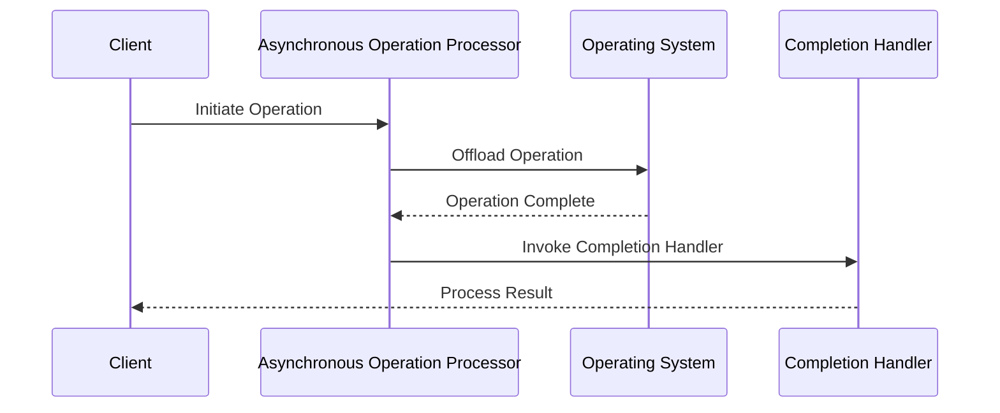
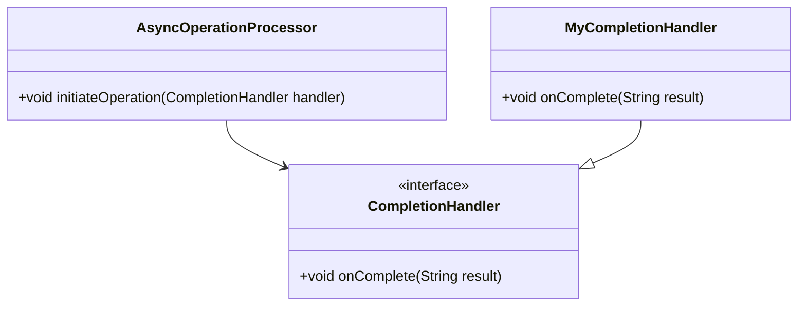

## 6.9 Proactor Pattern

In the realm of software design, especially when dealing with high-load environments, the Proactor pattern emerges as a powerful tool for managing asynchronous event handling. This pattern is particularly useful in scenarios where efficiency and scalability are of paramount importance. Let's delve into the intricacies of the Proactor pattern, its structure, and how it can be implemented in Java.

### Understanding the Proactor Pattern

The Proactor pattern is a design pattern used to handle asynchronous operations. It allows applications to offload work to an asynchronous operation dispatcher, which then uses completion handlers to process the results once the operations are complete. This pattern is particularly beneficial in high-performance network applications where non-blocking I/O operations are essential.

#### Intent of the Proactor Pattern

The primary intent of the Proactor pattern is to decouple the initiation of an operation from its completion. By doing so, it allows the application to remain responsive and handle other tasks while waiting for the operation to complete. This is achieved by delegating the operation to an asynchronous operation processor, which notifies the application via a completion handler once the operation is done.

#### Problem Solved by the Proactor Pattern

In traditional synchronous programming models, operations that involve I/O or other long-running tasks can block the execution of a program. This blocking behavior can lead to inefficiencies and reduced responsiveness, especially in high-load environments. The Proactor pattern addresses this issue by allowing these operations to be executed asynchronously, thus freeing up the application to perform other tasks in the meantime.

### Proactor vs. Reactor Pattern

Before diving deeper into the Proactor pattern, it's essential to understand how it differs from the Reactor pattern, another popular design pattern for handling I/O operations.

- **Reactor Pattern**: In the Reactor pattern, the application waits for an event to occur and then reacts to it. The pattern uses an event demultiplexer to handle multiple events and dispatches them to the appropriate handlers. The Reactor pattern is typically used for synchronous I/O operations.

- **Proactor Pattern**: Unlike the Reactor pattern, the Proactor pattern is designed for asynchronous operations. It initiates an operation and then uses a completion handler to process the result once the operation is complete. This allows for non-blocking I/O operations, making it more suitable for high-performance applications.

### Structure of the Proactor Pattern

The Proactor pattern consists of several key components, each playing a crucial role in handling asynchronous operations efficiently.

#### Asynchronous Operation Processor

The Asynchronous Operation Processor is responsible for initiating and managing asynchronous operations. It offloads the work to the operating system or a dedicated thread pool, allowing the application to remain responsive.

#### Completion Handlers

Completion Handlers are callback functions that are invoked once an asynchronous operation is complete. They process the results of the operation and perform any necessary actions, such as updating the user interface or storing data.

#### Asynchronous Operation Dispatcher

The Asynchronous Operation Dispatcher coordinates the execution of asynchronous operations. It ensures that operations are executed in the correct order and that completion handlers are invoked once the operations are complete.

#### Sequence Diagram of the Proactor Pattern

To better understand the flow of the Proactor pattern, let's visualize it using a sequence diagram.



### Implementing the Proactor Pattern in Java

Let's explore how the Proactor pattern can be implemented in Java. We'll create a simple example that demonstrates the pattern's core components and how they interact.

#### Step 1: Define the Asynchronous Operation Processor

The Asynchronous Operation Processor is responsible for initiating and managing asynchronous operations. In Java, this can be achieved using a thread pool or the `CompletableFuture` class.

```java
import java.util.concurrent.CompletableFuture;

public class AsyncOperationProcessor {

    public void initiateOperation(CompletionHandler handler) {
        CompletableFuture.runAsync(() -> {
            // Simulate a long-running operation
            try {
                Thread.sleep(2000);
            } catch (InterruptedException e) {
                Thread.currentThread().interrupt();
            }
            // Notify the completion handler
            handler.onComplete("Operation completed successfully");
        });
    }
}
```

#### Step 2: Define the Completion Handler Interface

The Completion Handler interface defines the callback method that will be invoked once the operation is complete.

```java
public interface CompletionHandler {
    void onComplete(String result);
}
```

#### Step 3: Implement the Completion Handler

Next, we implement the Completion Handler to process the result of the asynchronous operation.

```java
public class MyCompletionHandler implements CompletionHandler {

    @Override
    public void onComplete(String result) {
        System.out.println("Completion Handler: " + result);
    }
}
```

#### Step 4: Use the Proactor Pattern

Finally, we use the Proactor pattern by initiating an operation and providing a completion handler.

```java
public class ProactorPatternExample {

    public static void main(String[] args) {
        AsyncOperationProcessor processor = new AsyncOperationProcessor();
        CompletionHandler handler = new MyCompletionHandler();

        System.out.println("Initiating operation...");
        processor.initiateOperation(handler);

        System.out.println("Operation initiated. Main thread is free to perform other tasks.");
    }
}
```

### Benefits of the Proactor Pattern

The Proactor pattern offers several benefits, particularly in high-performance applications:

- **Non-Blocking I/O**: By offloading operations to an asynchronous processor, the application can perform other tasks while waiting for the operation to complete.

- **Scalability**: The pattern allows applications to handle a large number of concurrent operations efficiently, making it ideal for high-load environments.

- **Responsiveness**: By decoupling the initiation and completion of operations, the application remains responsive and can provide a better user experience.

### Use Cases for the Proactor Pattern

The Proactor pattern is particularly beneficial in scenarios where high performance and scalability are required. Some common use cases include:

- **High-Performance Network Applications**: Applications that require efficient handling of network I/O operations, such as web servers and chat applications, can benefit from the Proactor pattern.

- **Real-Time Data Processing**: Systems that process large volumes of data in real-time, such as financial trading platforms, can use the Proactor pattern to handle asynchronous data streams efficiently.

- **Asynchronous File I/O**: Applications that perform file I/O operations, such as video streaming services, can use the Proactor pattern to read and write data asynchronously.

### Try It Yourself

Now that we've explored the Proactor pattern, try experimenting with the code examples provided. Here are some suggestions:

- Modify the `AsyncOperationProcessor` to perform different types of operations, such as network requests or file I/O.
- Implement additional completion handlers to handle different types of results.
- Experiment with different thread pool configurations to see how they affect performance.

### Visualizing the Proactor Pattern

To further enhance your understanding, let's visualize the Proactor pattern using a class diagram.



### Conclusion

The Proactor pattern is a powerful tool for handling asynchronous operations in high-performance applications. By decoupling the initiation and completion of operations, it allows applications to remain responsive and scalable. Whether you're building a high-performance network application or a real-time data processing system, the Proactor pattern can help you achieve efficient and scalable solutions.

### Further Reading

For more information on the Proactor pattern and asynchronous programming in Java, consider exploring the following resources:

- [Java Concurrency in Practice](https://www.amazon.com/Java-Concurrency-Practice-Brian-Goetz/dp/0321349601)
- [Asynchronous Programming with Java](https://www.oracle.com/java/technologies/javase/asynchronous-programming.html)
- [Reactive Programming in Java](https://www.reactive-streams.org/)

## Quiz Time!



### What is the primary intent of the Proactor pattern?

- [x] To decouple the initiation of an operation from its completion
- [ ] To handle synchronous I/O operations
- [ ] To manage event demultiplexing
- [ ] To provide a blocking I/O model

> **Explanation:** The Proactor pattern aims to decouple the initiation of an operation from its completion, allowing for asynchronous processing.

### How does the Proactor pattern differ from the Reactor pattern?

- [x] The Proactor pattern is designed for asynchronous operations, while the Reactor pattern is for synchronous operations.
- [ ] The Proactor pattern uses event demultiplexing, while the Reactor pattern does not.
- [ ] The Proactor pattern is used for blocking I/O, while the Reactor pattern is for non-blocking I/O.
- [ ] The Proactor pattern is less efficient than the Reactor pattern.

> **Explanation:** The Proactor pattern is specifically designed for asynchronous operations, unlike the Reactor pattern, which handles synchronous operations.

### What role does the Asynchronous Operation Processor play in the Proactor pattern?

- [x] It initiates and manages asynchronous operations.
- [ ] It handles synchronous I/O operations.
- [ ] It processes completion handlers.
- [ ] It manages event demultiplexing.

> **Explanation:** The Asynchronous Operation Processor is responsible for initiating and managing asynchronous operations in the Proactor pattern.

### What is the function of Completion Handlers in the Proactor pattern?

- [x] They process the results of asynchronous operations once they are complete.
- [ ] They initiate asynchronous operations.
- [ ] They handle synchronous I/O operations.
- [ ] They manage event demultiplexing.

> **Explanation:** Completion Handlers are callback functions that process the results of asynchronous operations once they are complete.

### Which of the following is a benefit of using the Proactor pattern?

- [x] Non-blocking I/O
- [x] Scalability
- [ ] Blocking I/O
- [ ] Synchronous processing

> **Explanation:** The Proactor pattern provides non-blocking I/O and scalability, making it suitable for high-performance applications.

### In which scenarios is the Proactor pattern particularly beneficial?

- [x] High-performance network applications
- [ ] Low-performance desktop applications
- [x] Real-time data processing
- [ ] Simple command-line tools

> **Explanation:** The Proactor pattern is beneficial in high-performance network applications and real-time data processing scenarios.

### What is the role of the Asynchronous Operation Dispatcher in the Proactor pattern?

- [x] It coordinates the execution of asynchronous operations.
- [ ] It initiates synchronous operations.
- [ ] It processes completion handlers.
- [ ] It manages event demultiplexing.

> **Explanation:** The Asynchronous Operation Dispatcher coordinates the execution of asynchronous operations in the Proactor pattern.

### How can the Proactor pattern improve application responsiveness?

- [x] By decoupling the initiation and completion of operations
- [ ] By using blocking I/O operations
- [ ] By handling synchronous events
- [ ] By reducing the number of threads

> **Explanation:** The Proactor pattern improves responsiveness by decoupling the initiation and completion of operations, allowing the application to remain responsive.

### True or False: The Proactor pattern is suitable for applications that require blocking I/O operations.

- [ ] True
- [x] False

> **Explanation:** False. The Proactor pattern is designed for non-blocking I/O operations, making it unsuitable for applications that require blocking I/O.


