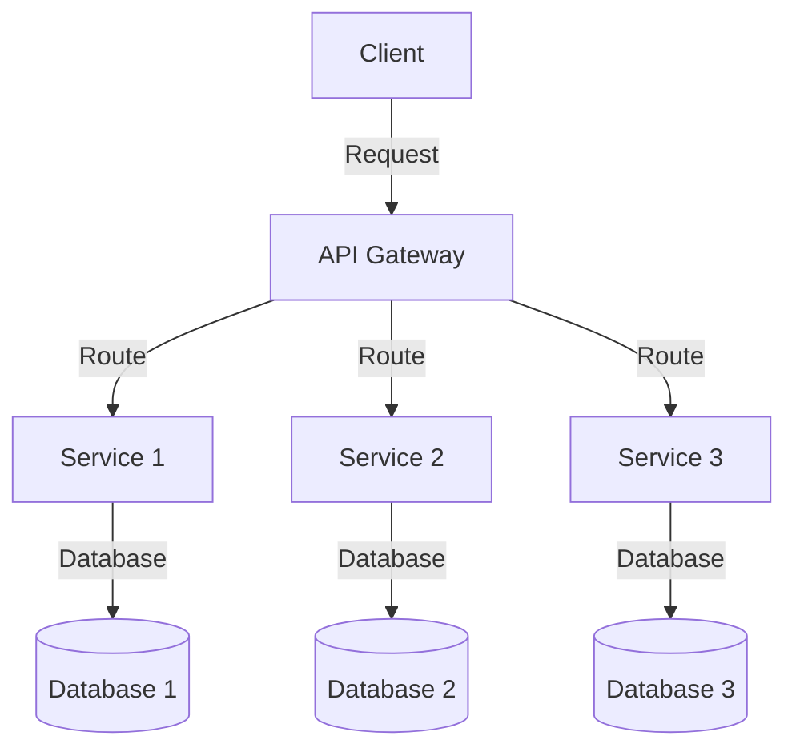

## 7.1 Overview of Architectural Patterns

In the realm of software engineering, architectural patterns play a pivotal role in shaping the structure and organization of applications. Unlike design patterns, which focus on solving specific problems within a software component, architectural patterns provide high-level solutions that guide the overall system architecture. They serve as blueprints for building scalable, maintainable, and robust applications, especially in enterprise-level and large-scale systems.

### Understanding Architectural Patterns

Architectural patterns are templates for organizing software systems. They define the fundamental structural organization of a system, including its components, their relationships, and how they interact. These patterns address the broader concerns of software architecture, such as scalability, maintainability, performance, and security.

#### Difference Between Architectural Patterns and Design Patterns

While both architectural and design patterns aim to solve recurring problems, they operate at different levels of abstraction. Design patterns are concerned with the design of individual components or classes, providing solutions for specific problems like object creation or behavior. Architectural patterns, on the other hand, deal with the overall structure of the application, focusing on how components are organized and interact at a higher level.

### Importance of Architectural Patterns

Architectural patterns are crucial for several reasons:

1. **Scalability**: They provide a framework for designing systems that can scale efficiently as demand grows. For example, microservices architecture allows for independent scaling of services.

2. **Maintainability**: By organizing code into well-defined layers or modules, architectural patterns make it easier to maintain and update applications.

3. **Robustness**: Patterns like event-driven architecture enhance the robustness of applications by decoupling components and enabling asynchronous communication.

4. **Reusability**: Architectural patterns promote reusability by defining standard ways to organize code, which can be applied across different projects.

5. **Consistency**: They ensure consistency in the system architecture, making it easier for teams to collaborate and understand the system's structure.

### Overview of Common Architectural Patterns

In this section, we will explore several architectural patterns that are widely used in software development. Each pattern addresses specific architectural challenges and provides a framework for building effective systems.

#### 1. Layered Architecture

The layered architecture pattern organizes code into layers, each with a specific responsibility. Common layers include presentation, business logic, and data access. This pattern promotes separation of concerns, making it easier to manage and evolve the system.

#### 2. Model-View-Controller (MVC)

MVC is a pattern that separates an application into three interconnected components: Model, View, and Controller. This separation allows for independent development, testing, and maintenance of each component, enhancing the overall flexibility of the application.

#### 3. Microservices Architecture

Microservices architecture involves breaking down a large application into smaller, independent services that communicate over a network. This pattern enables continuous delivery and deployment, as each service can be developed, tested, and deployed independently.

#### 4. Event-Driven Architecture

In event-driven architecture, components communicate by emitting and responding to events. This pattern is highly scalable and responsive, making it ideal for applications that require real-time processing.

#### 5. Service-Oriented Architecture (SOA)

SOA is a design pattern where services are provided to other components by application components, through a communication protocol over a network. It emphasizes interoperability and reusability of services.

#### 6. Hexagonal Architecture (Ports and Adapters)

Hexagonal architecture, also known as Ports and Adapters, aims to isolate the core logic of an application from external factors such as databases and user interfaces. This pattern enhances testability and flexibility by decoupling business logic from infrastructure.

#### 7. Event Sourcing and CQRS

Event sourcing involves storing all changes to the application state as a sequence of events. CQRS (Command Query Responsibility Segregation) separates the read and write models of an application, optimizing performance and scalability.

### Addressing Architectural Challenges

Architectural patterns address several common challenges in software development:

- **Complexity Management**: By providing a clear structure, architectural patterns help manage the complexity of large systems.

- **Change Management**: Patterns like microservices and layered architecture facilitate easier updates and changes, as components can be modified independently.

- **Performance Optimization**: Patterns such as event-driven architecture and CQRS optimize performance by enabling asynchronous processing and efficient data access.

- **Security and Reliability**: Architectural patterns incorporate security and reliability considerations, ensuring that applications are robust and secure.

### Role in Enterprise-Level and Large-Scale Systems

In enterprise-level and large-scale systems, architectural patterns are indispensable. They provide a framework for managing the complexity and scale of such systems, ensuring that they are maintainable, scalable, and robust. By adopting architectural patterns, organizations can achieve greater consistency and efficiency in their software development processes.

### Code Examples and Visualizations

Let's delve into some code examples and visualizations to better understand these architectural patterns.

#### Layered Architecture Example

```java
// Presentation Layer
public class UserController {
    private UserService userService;

    public UserController(UserService userService) {
        this.userService = userService;
    }

    public void displayUser(String userId) {
        User user = userService.getUserById(userId);
        System.out.println("User: " + user.getName());
    }
}

// Business Logic Layer
public class UserService {
    private UserRepository userRepository;

    public UserService(UserRepository userRepository) {
        this.userRepository = userRepository;
    }

    public User getUserById(String userId) {
        return userRepository.findById(userId);
    }
}

// Data Access Layer
public class UserRepository {
    public User findById(String userId) {
        // Simulate database access
        return new User(userId, "John Doe");
    }
}

// User Entity
public class User {
    private String id;
    private String name;

    public User(String id, String name) {
        this.id = id;
        this.name = name;
    }

    public String getName() {
        return name;
    }
}
```

In this example, the application is divided into three layers: presentation, business logic, and data access. Each layer has a specific responsibility, promoting separation of concerns.

#### Microservices Architecture Visualization



This diagram illustrates a simple microservices architecture. The client sends requests to an API Gateway, which routes them to the appropriate service. Each service interacts with its own database, allowing for independent scaling and deployment.

### Try It Yourself

To deepen your understanding, try modifying the layered architecture example by adding a new layer or service. For instance, you could add a caching layer to improve performance or a logging service to track user interactions.

### Knowledge Check

- **What is the primary difference between architectural patterns and design patterns?**
- **How do architectural patterns contribute to the scalability of an application?**
- **What are some common challenges that architectural patterns address?**

### Conclusion

Architectural patterns are essential tools for software architects and developers. They provide a high-level blueprint for organizing system structures, ensuring that applications are scalable, maintainable, and robust. By understanding and applying these patterns, developers can create systems that meet the demands of modern software development.

### Embrace the Journey

Remember, mastering architectural patterns is a journey. As you continue to explore and apply these patterns, you'll gain deeper insights into building effective software systems. Keep experimenting, stay curious, and enjoy the journey!

## Quiz Time!



### What is an architectural pattern?

- [x] A high-level solution for organizing system structures
- [ ] A specific solution for a coding problem
- [ ] A tool for debugging code
- [ ] A method for testing software

> **Explanation:** Architectural patterns provide high-level solutions for organizing the overall structure of a system, unlike design patterns which solve specific coding problems.

### How do architectural patterns differ from design patterns?

- [x] Architectural patterns focus on system structure; design patterns focus on individual components
- [ ] Both focus on individual components
- [ ] Architectural patterns are for debugging; design patterns are for testing
- [ ] Both focus on system structure

> **Explanation:** Architectural patterns address the overall system structure, while design patterns deal with the design of individual components or classes.

### Which pattern is used to separate an application into three interconnected components?

- [x] Model-View-Controller (MVC)
- [ ] Microservices
- [ ] Layered Architecture
- [ ] Event-Driven Architecture

> **Explanation:** The Model-View-Controller (MVC) pattern separates an application into three interconnected components: Model, View, and Controller.

### What is a key benefit of using microservices architecture?

- [x] Independent scaling of services
- [ ] Centralized data storage
- [ ] Simplified debugging
- [ ] Reduced code complexity

> **Explanation:** Microservices architecture allows for independent scaling of services, which is a key benefit for handling varying loads.

### What does the event-driven architecture pattern enhance?

- [x] Scalability and responsiveness
- [ ] Data storage
- [ ] Debugging capabilities
- [ ] Code readability

> **Explanation:** Event-driven architecture enhances scalability and responsiveness by enabling asynchronous communication between components.

### What is the main focus of the hexagonal architecture pattern?

- [x] Isolating core logic from external factors
- [ ] Centralizing data access
- [ ] Simplifying user interfaces
- [ ] Enhancing code readability

> **Explanation:** Hexagonal architecture focuses on isolating the core logic of an application from external factors like databases and user interfaces.

### What is a common challenge addressed by architectural patterns?

- [x] Complexity management
- [ ] Syntax errors
- [ ] Code formatting
- [ ] Variable naming

> **Explanation:** Architectural patterns help manage the complexity of large systems by providing a clear structure.

### What is the primary role of architectural patterns in enterprise-level systems?

- [x] Ensuring maintainability and scalability
- [ ] Simplifying user interfaces
- [ ] Reducing code length
- [ ] Enhancing debugging capabilities

> **Explanation:** In enterprise-level systems, architectural patterns ensure maintainability and scalability, which are crucial for handling complex and large-scale applications.

### Which pattern involves storing all changes to the application state as a sequence of events?

- [x] Event Sourcing
- [ ] Microservices
- [ ] Layered Architecture
- [ ] MVC

> **Explanation:** Event sourcing involves storing all changes to the application state as a sequence of events, which can be replayed to reconstruct the state.

### True or False: Architectural patterns are only useful for small-scale applications.

- [ ] True
- [x] False

> **Explanation:** Architectural patterns are especially useful for large-scale applications, where they help manage complexity, scalability, and maintainability.


