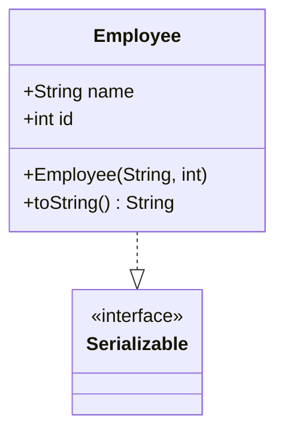
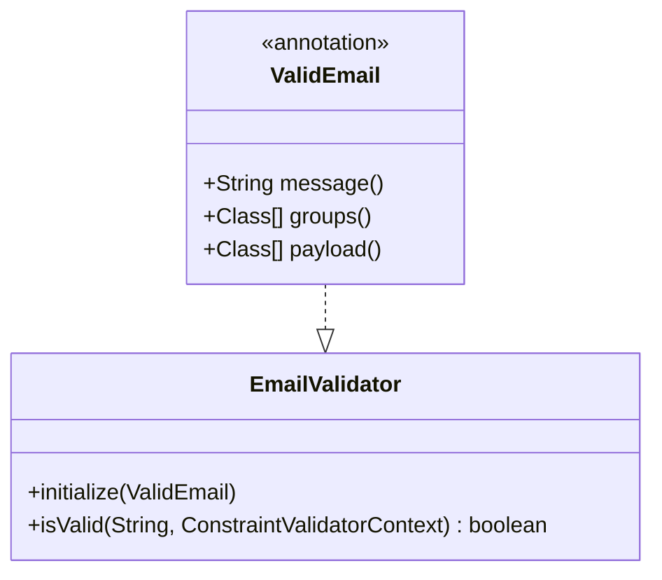

## 7.10.4 Use Cases and Examples

Marker interfaces and annotations are powerful tools in Java that provide metadata to classes and methods, influencing their behavior at runtime. This section delves into practical applications of these constructs, focusing on serialization mechanisms, validation frameworks, and configuration reduction. By understanding these use cases, developers can leverage marker interfaces and annotations to enhance code clarity, maintainability, and efficiency.

### Serialization Mechanisms Using `Serializable`

#### Intent

Serialization is the process of converting an object into a byte stream, enabling it to be easily stored or transmitted. In Java, the `Serializable` marker interface is used to indicate that a class can be serialized. This interface does not contain any methods; its presence signals to the Java Virtual Machine (JVM) that the class is eligible for serialization.

#### Historical Context

The concept of serialization has been integral to Java since its inception. The `Serializable` interface was introduced in Java 1.1 to facilitate object persistence and remote method invocation (RMI). Over time, serialization has evolved to include more sophisticated mechanisms, such as custom serialization and the `Externalizable` interface.

#### Use Case: Saving and Restoring Object State

Consider a scenario where an application needs to save the state of an object to a file and later restore it. Implementing the `Serializable` interface allows the object to be easily serialized and deserialized.

```java
import java.io.*;

class Employee implements Serializable {
    private static final long serialVersionUID = 1L;
    private String name;
    private int id;

    public Employee(String name, int id) {
        this.name = name;
        this.id = id;
    }

    @Override
    public String toString() {
        return "Employee{name='" + name + "', id=" + id + "}";
    }
}

public class SerializationExample {
    public static void main(String[] args) {
        Employee employee = new Employee("John Doe", 12345);

        // Serialize the object
        try (ObjectOutputStream oos = new ObjectOutputStream(new FileOutputStream("employee.ser"))) {
            oos.writeObject(employee);
        } catch (IOException e) {
            e.printStackTrace();
        }

        // Deserialize the object
        try (ObjectInputStream ois = new ObjectInputStream(new FileInputStream("employee.ser"))) {
            Employee deserializedEmployee = (Employee) ois.readObject();
            System.out.println("Deserialized Employee: " + deserializedEmployee);
        } catch (IOException | ClassNotFoundException e) {
            e.printStackTrace();
        }
    }
}
```

**Explanation**: In this example, the `Employee` class implements `Serializable`, allowing instances to be serialized to a file and later deserialized. The `serialVersionUID` is a unique identifier for the class, ensuring compatibility during deserialization.

#### Best Practices

- **Define `serialVersionUID`**: Always define a `serialVersionUID` to maintain version control of serialized objects.
- **Avoid Serialization of Sensitive Data**: Mark sensitive fields as `transient` to prevent them from being serialized.
- **Use Custom Serialization**: Implement `writeObject` and `readObject` methods for custom serialization logic if needed.

### Validation Frameworks Using Custom Annotations

#### Intent

Annotations provide a way to add metadata to Java code, which can be processed at compile-time or runtime. Custom annotations are particularly useful in validation frameworks, where they can define validation rules directly within the code.

#### Use Case: Validating User Input

Consider a scenario where an application needs to validate user input, such as ensuring that a username is not null and an email address is properly formatted. Custom annotations can be used to specify these validation rules.

```java
import javax.validation.Constraint;
import javax.validation.Payload;
import javax.validation.constraints.NotNull;
import javax.validation.constraints.Pattern;
import javax.validation.constraints.Size;
import java.lang.annotation.ElementType;
import java.lang.annotation.Retention;
import java.lang.annotation.RetentionPolicy;
import java.lang.annotation.Target;

// Custom annotation for email validation
@Constraint(validatedBy = EmailValidator.class)
@Target({ ElementType.METHOD, ElementType.FIELD })
@Retention(RetentionPolicy.RUNTIME)
@interface ValidEmail {
    String message() default "Invalid email format";
    Class<?>[] groups() default {};
    Class<? extends Payload>[] payload() default {};
}

// Validator for the custom annotation
class EmailValidator implements javax.validation.ConstraintValidator<ValidEmail, String> {
    private static final String EMAIL_PATTERN = "^[A-Za-z0-9+_.-]+@(.+)$";

    @Override
    public void initialize(ValidEmail constraintAnnotation) {
    }

    @Override
    public boolean isValid(String email, javax.validation.ConstraintValidatorContext context) {
        return email != null && email.matches(EMAIL_PATTERN);
    }
}

// User class with validation annotations
class User {
    @NotNull(message = "Username cannot be null")
    @Size(min = 3, max = 20, message = "Username must be between 3 and 20 characters")
    private String username;

    @ValidEmail
    private String email;

    // Constructors, getters, and setters
}
```

**Explanation**: In this example, a custom annotation `@ValidEmail` is defined to validate email addresses. The `EmailValidator` class implements the validation logic. The `User` class uses standard and custom annotations to enforce validation rules on its fields.

#### Best Practices

- **Keep Annotations Simple**: Define annotations with minimal attributes to maintain simplicity.
- **Use Standard Annotations**: Leverage existing annotations from frameworks like Hibernate Validator whenever possible.
- **Document Custom Annotations**: Provide clear documentation for custom annotations to ensure they are used correctly.

### Reducing Configuration and Improving Code Clarity with Annotations

#### Intent

Annotations can significantly reduce the amount of configuration required in Java applications, especially in frameworks like Spring and JPA. By annotating classes and methods, developers can replace verbose XML configurations with concise, readable code.

#### Use Case: Configuring a Spring Bean

In a Spring application, annotations can be used to define beans, inject dependencies, and configure various aspects of the application context.

```java
import org.springframework.context.annotation.Bean;
import org.springframework.context.annotation.Configuration;
import org.springframework.context.annotation.ComponentScan;
import org.springframework.stereotype.Component;

@Configuration
@ComponentScan(basePackages = "com.example")
public class AppConfig {

    @Bean
    public MyService myService() {
        return new MyServiceImpl();
    }
}

@Component
class MyServiceImpl implements MyService {
    @Override
    public void performService() {
        System.out.println("Service is being performed.");
    }
}

interface MyService {
    void performService();
}
```

**Explanation**: In this example, the `@Configuration` and `@ComponentScan` annotations are used to configure the Spring application context. The `@Bean` annotation defines a bean, while the `@Component` annotation marks a class as a Spring-managed component.

#### Best Practices

- **Use Annotations Judiciously**: Avoid overusing annotations, which can lead to cluttered code.
- **Prefer Annotations Over XML**: Use annotations for configuration to improve readability and maintainability.
- **Understand Annotation Processing**: Be aware of how annotations are processed by frameworks to avoid unexpected behavior.

### Visualizing Marker Interfaces and Annotations

To better understand the structure and interactions of marker interfaces and annotations, consider the following diagrams:

#### Marker Interface Structure



**Caption**: This diagram illustrates the relationship between the `Employee` class and the `Serializable` marker interface.

#### Annotation-Based Validation



**Caption**: This diagram shows the relationship between the `ValidEmail` annotation and the `EmailValidator` class.

### Conclusion

Marker interfaces and annotations are indispensable tools in Java, offering a range of benefits from simplifying serialization to enhancing validation and configuration. By understanding their use cases and best practices, developers can write cleaner, more efficient code. As Java continues to evolve, these constructs will remain vital in building robust and maintainable applications.

### References and Further Reading

- [Java Serialization Documentation](https://docs.oracle.com/en/java/javase/17/docs/api/java.base/java/io/Serializable.html)
- [Java Annotations Documentation](https://docs.oracle.com/javase/tutorial/java/annotations/)
- [Spring Framework Documentation](https://spring.io/projects/spring-framework)

### Test Your Knowledge: Marker Interfaces and Annotations Quiz



### Which interface is used to indicate that a class can be serialized in Java?

- [x] Serializable
- [ ] Cloneable
- [ ] Comparable
- [ ] Iterable

> **Explanation:** The `Serializable` interface is a marker interface used to indicate that a class can be serialized.

### What is the primary purpose of a marker interface?

- [x] To provide metadata to the JVM
- [ ] To define methods that must be implemented
- [ ] To enforce security constraints
- [ ] To optimize performance

> **Explanation:** A marker interface provides metadata to the JVM, indicating that a class possesses certain properties or behaviors.

### How can you prevent a field from being serialized in Java?

- [x] Mark it as transient
- [ ] Use a custom annotation
- [ ] Declare it as private
- [ ] Use the `volatile` keyword

> **Explanation:** Marking a field as `transient` prevents it from being serialized.

### What is the role of the `serialVersionUID` in serialization?

- [x] It ensures compatibility during deserialization
- [ ] It improves serialization performance
- [ ] It encrypts serialized data
- [ ] It defines the serialization format

> **Explanation:** The `serialVersionUID` is a unique identifier that ensures compatibility during deserialization.

### Which annotation is used to define a Spring bean?

- [x] @Bean
- [ ] @Component
- [ ] @Service
- [ ] @Repository

> **Explanation:** The `@Bean` annotation is used to define a Spring bean within a configuration class.

### What is a common use case for custom annotations in Java?

- [x] Validation frameworks
- [ ] Memory management
- [ ] Thread synchronization
- [ ] Network communication

> **Explanation:** Custom annotations are commonly used in validation frameworks to define validation rules.

### How do annotations improve code clarity?

- [x] By reducing configuration
- [ ] By increasing verbosity
- [ ] By enforcing strict typing
- [ ] By optimizing runtime performance

> **Explanation:** Annotations reduce configuration, making code more concise and easier to understand.

### What is the benefit of using annotations over XML configuration?

- [x] Improved readability and maintainability
- [ ] Faster execution
- [ ] Enhanced security
- [ ] Better compatibility

> **Explanation:** Annotations improve readability and maintainability by embedding configuration directly in the code.

### Can annotations be processed at runtime?

- [x] True
- [ ] False

> **Explanation:** Annotations can be processed at runtime, allowing frameworks to dynamically alter behavior based on metadata.

### What is the relationship between `ValidEmail` and `EmailValidator` in the example?

- [x] `ValidEmail` is an annotation processed by `EmailValidator`
- [ ] `EmailValidator` is an annotation processed by `ValidEmail`
- [ ] They are unrelated
- [ ] `ValidEmail` extends `EmailValidator`

> **Explanation:** `ValidEmail` is a custom annotation that is processed by the `EmailValidator` class to enforce validation rules.


