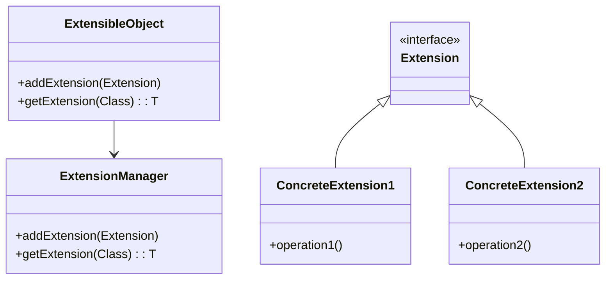

## 7.11.1 Implementing Extension Object in Java

### Introduction

The Extension Object pattern is a structural design pattern that allows developers to add new functionality to existing classes dynamically. This pattern is particularly useful in scenarios where the system needs to be extended without modifying existing code, thus adhering to the Open/Closed Principle. The Extension Object pattern is a powerful tool for creating flexible and maintainable software architectures.

### Intent

The primary intent of the Extension Object pattern is to enable the addition of new behavior to objects without altering their existing structure. This pattern allows objects to be extended with new capabilities at runtime, promoting flexibility and scalability in software design.

### Key Components

The Extension Object pattern involves several key components:

- **Extension**: An interface or abstract class that defines the new functionality to be added.
- **ExtensionManager**: A class responsible for managing extensions and providing access to them.
- **ExtensibleObject**: The base class or interface that supports extensions and allows them to be added or retrieved.

### Structure

The structure of the Extension Object pattern can be visualized as follows:



**Diagram Explanation**: The diagram illustrates the relationship between the `ExtensibleObject`, `ExtensionManager`, and various `Extension` implementations. The `ExtensibleObject` interacts with the `ExtensionManager` to manage extensions, while concrete extensions implement the `Extension` interface.

### Participants

- **ExtensibleObject**: The object that can be extended with new functionality.
- **Extension**: The interface or abstract class that defines the new behavior.
- **ConcreteExtension**: Specific implementations of the `Extension` interface that provide additional functionality.
- **ExtensionManager**: Manages the extensions and provides mechanisms to add and retrieve them.

### Collaborations

The `ExtensibleObject` collaborates with the `ExtensionManager` to manage its extensions. The `ExtensionManager` maintains a collection of extensions and provides methods to add and retrieve them. Concrete extensions implement the `Extension` interface and provide specific functionality.

### Consequences

#### Benefits

- **Flexibility**: New functionality can be added without modifying existing code.
- **Scalability**: The system can be easily extended with new capabilities.
- **Adherence to the Open/Closed Principle**: The pattern allows for extensions without altering existing code.

#### Drawbacks

- **Complexity**: Managing extensions can introduce additional complexity.
- **Performance Overhead**: Dynamic retrieval of extensions may incur performance costs.

### Implementation

#### Implementation Guidelines

1. **Define the Extension Interface**: Create an interface or abstract class that defines the new functionality.
2. **Implement Concrete Extensions**: Develop concrete classes that implement the `Extension` interface.
3. **Create the ExtensionManager**: Implement a class that manages extensions and provides methods to add and retrieve them.
4. **Integrate with ExtensibleObject**: Ensure that the `ExtensibleObject` can interact with the `ExtensionManager` to manage its extensions.

#### Sample Code Snippets

Below is a Java implementation of the Extension Object pattern:

```java
// Define the Extension interface
interface Extension {
    void execute();
}

// Implement a concrete extension
class ConcreteExtension1 implements Extension {
    @Override
    public void execute() {
        System.out.println("Executing ConcreteExtension1");
    }
}

// Implement another concrete extension
class ConcreteExtension2 implements Extension {
    @Override
    public void execute() {
        System.out.println("Executing ConcreteExtension2");
    }
}

// Define the ExtensionManager
class ExtensionManager {
    private Map<Class<? extends Extension>, Extension> extensions = new HashMap<>();

    public void addExtension(Extension extension) {
        extensions.put(extension.getClass(), extension);
    }

    public <T extends Extension> T getExtension(Class<T> extensionType) {
        return extensionType.cast(extensions.get(extensionType));
    }
}

// Define the ExtensibleObject
class ExtensibleObject {
    private ExtensionManager extensionManager = new ExtensionManager();

    public void addExtension(Extension extension) {
        extensionManager.addExtension(extension);
    }

    public <T extends Extension> T getExtension(Class<T> extensionType) {
        return extensionManager.getExtension(extensionType);
    }
}

// Demonstrate the Extension Object pattern
public class ExtensionObjectDemo {
    public static void main(String[] args) {
        ExtensibleObject extensibleObject = new ExtensibleObject();

        // Add extensions
        extensibleObject.addExtension(new ConcreteExtension1());
        extensibleObject.addExtension(new ConcreteExtension2());

        // Retrieve and execute extensions
        Extension extension1 = extensibleObject.getExtension(ConcreteExtension1.class);
        extension1.execute();

        Extension extension2 = extensibleObject.getExtension(ConcreteExtension2.class);
        extension2.execute();
    }
}
```

**Explanation**: In this example, the `Extension` interface defines a method `execute()`. Two concrete extensions, `ConcreteExtension1` and `ConcreteExtension2`, implement this interface. The `ExtensionManager` manages these extensions, allowing them to be added and retrieved. The `ExtensibleObject` interacts with the `ExtensionManager` to manage its extensions.

#### Encouraging Experimentation

Experiment with the code by adding new extensions or modifying existing ones. Consider implementing additional functionality or integrating the pattern into a larger system.

### Sample Use Cases

- **Plugin Systems**: The Extension Object pattern is ideal for implementing plugin systems where new plugins can be added without modifying the core application.
- **Dynamic Feature Addition**: Use this pattern to add features dynamically based on user preferences or configuration files.

### Related Patterns

- **Decorator Pattern**: Both patterns add functionality to objects, but the Extension Object pattern allows for dynamic addition at runtime.
- **Strategy Pattern**: While the Strategy pattern defines a family of algorithms, the Extension Object pattern focuses on adding new behavior.

### Known Uses

- **Eclipse IDE**: The Eclipse platform uses a similar approach to manage plugins and extensions.
- **Spring Framework**: The Spring Framework's extension points allow for dynamic addition of functionality.

### Best Practices

- **Use Generics**: Leverage Java generics to ensure type safety when retrieving extensions.
- **Manage Dependencies**: Carefully manage dependencies between extensions to avoid tight coupling.
- **Consider Performance**: Be mindful of the performance implications of dynamic extension retrieval.

### Conclusion

The Extension Object pattern is a powerful tool for creating flexible and maintainable software architectures. By allowing new functionality to be added dynamically, this pattern promotes adherence to the Open/Closed Principle and enhances the scalability of software systems. Implementing this pattern in Java requires careful consideration of design principles and best practices to ensure a robust and efficient solution.

## Test Your Knowledge: Extension Object Pattern in Java Quiz



### What is the primary intent of the Extension Object pattern?

- [x] To add new functionality to existing classes dynamically.
- [ ] To create a hierarchy of related classes.
- [ ] To encapsulate a family of algorithms.
- [ ] To provide a way to access elements of an aggregate object sequentially.

> **Explanation:** The Extension Object pattern is designed to add new functionality to existing classes dynamically, promoting flexibility and adherence to the Open/Closed Principle.

### Which component is responsible for managing extensions in the Extension Object pattern?

- [ ] ExtensibleObject
- [x] ExtensionManager
- [ ] Extension
- [ ] ConcreteExtension

> **Explanation:** The ExtensionManager is responsible for managing extensions, providing methods to add and retrieve them.

### How does the Extension Object pattern promote adherence to the Open/Closed Principle?

- [x] By allowing new functionality to be added without modifying existing code.
- [ ] By creating a hierarchy of classes.
- [ ] By encapsulating algorithms.
- [ ] By providing a way to access elements sequentially.

> **Explanation:** The pattern allows for new functionality to be added without altering existing code, thus adhering to the Open/Closed Principle.

### What is a potential drawback of the Extension Object pattern?

- [x] It can introduce additional complexity.
- [ ] It limits the scalability of the system.
- [ ] It violates the Open/Closed Principle.
- [ ] It reduces flexibility.

> **Explanation:** Managing extensions can introduce additional complexity, which is a potential drawback of the pattern.

### Which of the following is a real-world use case for the Extension Object pattern?

- [x] Plugin systems
- [ ] Sorting algorithms
- [ ] Data access objects
- [ ] Singleton instances

> **Explanation:** The Extension Object pattern is ideal for implementing plugin systems where new plugins can be added without modifying the core application.

### What is the role of the ExtensibleObject in the Extension Object pattern?

- [x] To support extensions and allow them to be added or retrieved.
- [ ] To define the new functionality.
- [ ] To manage extensions.
- [ ] To implement specific functionality.

> **Explanation:** The ExtensibleObject supports extensions and allows them to be added or retrieved, interacting with the ExtensionManager.

### How can Java generics be used in the Extension Object pattern?

- [x] To ensure type safety when retrieving extensions.
- [ ] To create a hierarchy of classes.
- [ ] To encapsulate algorithms.
- [ ] To provide a way to access elements sequentially.

> **Explanation:** Java generics can be used to ensure type safety when retrieving extensions, preventing runtime errors.

### What is a benefit of using the Extension Object pattern?

- [x] It promotes flexibility and scalability.
- [ ] It simplifies the codebase.
- [ ] It reduces the need for testing.
- [ ] It eliminates the need for documentation.

> **Explanation:** The pattern promotes flexibility and scalability by allowing new functionality to be added dynamically.

### Which pattern is related to the Extension Object pattern?

- [x] Decorator Pattern
- [ ] Singleton Pattern
- [ ] Factory Pattern
- [ ] Observer Pattern

> **Explanation:** The Decorator Pattern is related to the Extension Object pattern, as both add functionality to objects.

### True or False: The Extension Object pattern can be used to add features dynamically based on user preferences.

- [x] True
- [ ] False

> **Explanation:** The Extension Object pattern can be used to add features dynamically based on user preferences or configuration files.



By mastering the Extension Object pattern, Java developers and software architects can create robust, maintainable, and efficient applications that are flexible and scalable. This pattern is a valuable addition to any developer's toolkit, enabling the dynamic addition of functionality and promoting adherence to key design principles.
