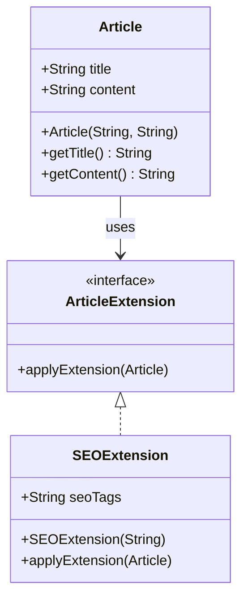

## 7.11.4 Use Cases and Examples

The **Extension Object Pattern** is a structural design pattern that allows for the dynamic addition of new functionality to objects without altering their existing code. This pattern is particularly useful in scenarios where systems need to be open-ended and extensible, such as in content management systems (CMS) and plugin architectures. This section delves into practical use cases and examples, illustrating how the Extension Object Pattern can be effectively implemented in Java applications.

### Real-World Use Cases

#### 1. Content Management Systems (CMS)

Content Management Systems are a prime example where the Extension Object Pattern shines. In a CMS, content types such as articles, blogs, and pages often require additional features or metadata that are not initially defined. The Extension Object Pattern allows developers to extend these content types dynamically.

**Example Scenario**: Consider a CMS where articles need to support additional metadata like SEO tags, social media sharing options, or custom analytics. Instead of modifying the core article class, extensions can be created to add these features.

```java
// Core Article class
public class Article {
    private String title;
    private String content;

    // Basic constructor and methods
    public Article(String title, String content) {
        this.title = title;
        this.content = content;
    }

    public String getTitle() {
        return title;
    }

    public String getContent() {
        return content;
    }
}

// Extension interface
public interface ArticleExtension {
    void applyExtension(Article article);
}

// SEO Extension
public class SEOExtension implements ArticleExtension {
    private String seoTags;

    public SEOExtension(String seoTags) {
        this.seoTags = seoTags;
    }

    @Override
    public void applyExtension(Article article) {
        System.out.println("Applying SEO tags: " + seoTags + " to article: " + article.getTitle());
    }
}

// Usage
public class CMSApplication {
    public static void main(String[] args) {
        Article article = new Article("Design Patterns in Java", "An in-depth guide...");
        ArticleExtension seoExtension = new SEOExtension("Java, Design Patterns, CMS");

        seoExtension.applyExtension(article);
    }
}
```

In this example, the `SEOExtension` class implements the `ArticleExtension` interface, allowing it to be applied to any `Article` object. This approach keeps the core `Article` class unchanged while enabling flexible extensions.

#### 2. Plugin Architectures

Plugin architectures benefit greatly from the Extension Object Pattern, as they require the ability to extend core functionality without altering the base system. This pattern supports modular design, where plugins can be developed independently and integrated seamlessly.

**Example Scenario**: In a software application with a plugin system, each plugin might need to extend the application's core functionality, such as adding new commands or UI components.

```java
// Core Application class
public class Application {
    private List<ApplicationExtension> extensions = new ArrayList<>();

    public void addExtension(ApplicationExtension extension) {
        extensions.add(extension);
    }

    public void executeExtensions() {
        for (ApplicationExtension extension : extensions) {
            extension.execute();
        }
    }
}

// Extension interface
public interface ApplicationExtension {
    void execute();
}

// Command Plugin
public class CommandPlugin implements ApplicationExtension {
    private String commandName;

    public CommandPlugin(String commandName) {
        this.commandName = commandName;
    }

    @Override
    public void execute() {
        System.out.println("Executing command: " + commandName);
    }
}

// Usage
public class PluginApplication {
    public static void main(String[] args) {
        Application app = new Application();
        ApplicationExtension commandPlugin = new CommandPlugin("New Command");

        app.addExtension(commandPlugin);
        app.executeExtensions();
    }
}
```

In this example, the `CommandPlugin` class implements the `ApplicationExtension` interface, allowing it to be added to the `Application` class. This design enables the application to be extended with new plugins without modifying its core structure.

### Supporting Open-Ended Design

The Extension Object Pattern is instrumental in supporting open-ended design, where new features can be added without altering existing code. This capability is crucial in large-scale systems that require flexibility and scalability.

#### Benefits of Open-Ended Design

- **Scalability**: As new requirements emerge, extensions can be added without impacting existing functionality.
- **Maintainability**: The core system remains stable, reducing the risk of introducing bugs when adding new features.
- **Flexibility**: Developers can create and integrate new extensions independently, promoting modular development.

#### Implementation Considerations

When implementing the Extension Object Pattern, consider the following best practices:

- **Define Clear Interfaces**: Ensure that extension interfaces are well-defined and consistent, allowing for easy integration of new extensions.
- **Use Dependency Injection**: Leverage dependency injection frameworks to manage extensions, enhancing flexibility and testability.
- **Encapsulate Extension Logic**: Keep extension logic separate from core functionality to maintain a clean and modular codebase.

### Historical Context and Evolution

The Extension Object Pattern has evolved alongside the increasing complexity of software systems. Historically, systems were often monolithic, with tightly coupled components. As software design principles matured, the need for extensibility and modularity became apparent, leading to the development of patterns like the Extension Object Pattern.

In modern software development, this pattern is widely used in frameworks and libraries that prioritize extensibility, such as Spring and OSGi. These frameworks provide mechanisms for defining and managing extensions, enabling developers to build flexible and scalable applications.

### Visualizing the Extension Object Pattern

To better understand the structure and interactions within the Extension Object Pattern, consider the following class diagram:



**Diagram Explanation**: This diagram illustrates the relationship between the `Article` class and the `ArticleExtension` interface, with `SEOExtension` as a concrete implementation. The `Article` class uses the `ArticleExtension` interface to apply extensions dynamically.

### Conclusion

The Extension Object Pattern is a powerful tool for creating extensible and maintainable software systems. By allowing new functionality to be added dynamically, this pattern supports open-ended design and modular development. Whether in content management systems, plugin architectures, or other extensible applications, the Extension Object Pattern provides a robust framework for managing extensions effectively.

### Encouragement for Experimentation

Developers are encouraged to experiment with the Extension Object Pattern by creating their own extensions and integrating them into existing systems. Consider how this pattern can be applied to current projects to enhance flexibility and scalability.

### Common Pitfalls and How to Avoid Them

- **Overcomplicating Extensions**: Keep extensions simple and focused on specific functionality to avoid unnecessary complexity.
- **Ignoring Interface Design**: Invest time in designing clear and consistent interfaces for extensions to ensure ease of integration.
- **Neglecting Dependency Management**: Use dependency injection to manage extensions and avoid tight coupling with the core system.

### Exercises and Practice Problems

1. **Exercise**: Implement an extension for a `User` class in a social media application that adds support for profile customization.
2. **Practice Problem**: Design a plugin system for a text editor application that allows for the addition of new text formatting options.

### Key Takeaways

- The Extension Object Pattern enables dynamic addition of functionality without altering existing code.
- It is particularly useful in content management systems and plugin architectures.
- This pattern supports open-ended design, promoting scalability and maintainability.

### Reflection

Consider how the Extension Object Pattern can be applied to your own projects. Reflect on the benefits of extensibility and how this pattern can enhance the flexibility of your software designs.

## Test Your Knowledge: Extension Object Pattern Quiz



### What is the primary benefit of using the Extension Object Pattern in a CMS?

- [x] It allows for dynamic addition of new features without altering existing code.
- [ ] It simplifies the database schema.
- [ ] It reduces the need for user authentication.
- [ ] It improves network performance.

> **Explanation:** The Extension Object Pattern enables the dynamic addition of new features, such as metadata or functionality, without modifying the core content types.

### In a plugin architecture, how does the Extension Object Pattern enhance modularity?

- [x] By allowing plugins to extend core functionality independently.
- [ ] By reducing the number of plugins needed.
- [ ] By centralizing all plugin logic in a single class.
- [ ] By eliminating the need for interfaces.

> **Explanation:** The pattern allows plugins to be developed and integrated independently, enhancing modularity and flexibility.

### Which of the following is a key consideration when implementing the Extension Object Pattern?

- [x] Defining clear interfaces for extensions.
- [ ] Minimizing the number of classes.
- [ ] Using global variables for extension management.
- [ ] Avoiding the use of interfaces.

> **Explanation:** Clear interfaces are essential for ensuring that extensions can be easily integrated and managed.

### How does the Extension Object Pattern support open-ended design?

- [x] By enabling new features to be added without altering existing code.
- [ ] By requiring all features to be defined upfront.
- [ ] By limiting the number of extensions that can be added.
- [ ] By enforcing strict type checking.

> **Explanation:** The pattern supports open-ended design by allowing new features to be added dynamically, without changing the existing system.

### What is a common pitfall when using the Extension Object Pattern?

- [x] Overcomplicating extensions with unnecessary features.
- [ ] Using too few classes.
- [ ] Relying solely on inheritance.
- [ ] Avoiding the use of interfaces.

> **Explanation:** Extensions should be kept simple and focused to avoid unnecessary complexity and maintainability issues.

### Which Java feature can enhance the implementation of the Extension Object Pattern?

- [x] Dependency injection frameworks.
- [ ] Static variables.
- [ ] Synchronized methods.
- [ ] Final classes.

> **Explanation:** Dependency injection frameworks help manage extensions and enhance flexibility and testability.

### How can the Extension Object Pattern be visualized in a class diagram?

- [x] By showing the relationship between the core class and extension interfaces.
- [ ] By listing all possible extensions in a single class.
- [ ] By using only abstract classes.
- [ ] By avoiding any interface representation.

> **Explanation:** A class diagram should illustrate the relationship between the core class and extension interfaces, highlighting how extensions are applied.

### What is a benefit of using the Extension Object Pattern in a CMS?

- [x] It allows for the addition of new metadata or functionality without altering core content types.
- [ ] It reduces the need for database transactions.
- [ ] It simplifies user authentication.
- [ ] It improves image rendering.

> **Explanation:** The pattern allows for the dynamic addition of new metadata or functionality, enhancing the flexibility of content types.

### How does the Extension Object Pattern relate to plugin architectures?

- [x] It enables plugins to extend core functionality without altering the base system.
- [ ] It centralizes all plugin logic in a single class.
- [ ] It limits the number of plugins that can be added.
- [ ] It requires all plugins to be defined at compile time.

> **Explanation:** The pattern allows plugins to extend core functionality independently, supporting modular and flexible design.

### True or False: The Extension Object Pattern is only applicable to Java applications.

- [x] False
- [ ] True

> **Explanation:** The Extension Object Pattern is a design pattern that can be applied in various programming languages, not just Java.



By exploring these use cases and examples, developers can gain a deeper understanding of the Extension Object Pattern and its practical applications in real-world scenarios. This knowledge empowers them to design more flexible and scalable software systems, leveraging the full potential of this powerful design pattern.
