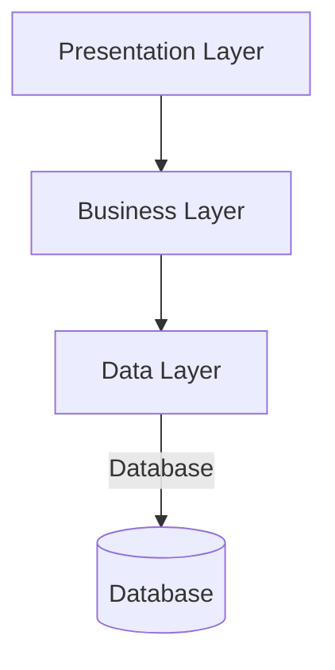

## 7.2.1 Implementing Layered Architecture in Java

In this section, we will delve into the implementation of layered architecture in Java, a design paradigm that promotes a clean separation of concerns by organizing code into distinct layers. This approach enhances maintainability, scalability, and testability of applications. We will guide you through the process of structuring your Java applications into presentation, business, and data layers, complete with code examples, best practices, and considerations for dependency management.

### Understanding Layered Architecture

Layered architecture is a software design pattern that divides an application into layers, each with a specific responsibility. The primary layers are:

1. **Presentation Layer**: Handles user interface and user interaction.
2. **Business Layer**: Contains business logic and rules.
3. **Data Layer**: Manages data access and persistence.

Each layer is responsible for a specific part of the application, and they interact with each other in a hierarchical manner. This separation of concerns allows for easier maintenance and scalability.

### Step-by-Step Guide to Implementing Layered Architecture in Java

#### Step 1: Define the Layers

Before diving into code, it's crucial to define the responsibilities of each layer clearly.

- **Presentation Layer**: This layer is responsible for displaying information to the user and interpreting user commands. It typically contains servlets, JSPs, or front-end frameworks like Angular or React when working with Java-based web applications.
  
- **Business Layer**: This layer contains the core functionality of the application. It processes data received from the presentation layer and sends it to the data layer. It includes business logic, validation, and calculations.

- **Data Layer**: This layer is responsible for interacting with the database. It includes data access objects (DAOs) and repositories that handle CRUD operations.

#### Step 2: Structure Your Project

Organize your Java project into packages that represent each layer. Here's a typical structure:

```
com.example.application
│
├── presentation
│   ├── controller
│   └── view
│
├── business
│   ├── service
│   └── logic
│
└── data
    ├── dao
    └── repository
```

#### Step 3: Implement the Presentation Layer

The presentation layer is where user interaction occurs. In a Java web application, this might involve servlets or JSPs. For modern applications, you might use frameworks like Spring MVC or Thymeleaf.

**Example: A Simple Controller in Spring MVC**

```java
package com.example.application.presentation.controller;

import com.example.application.business.service.UserService;
import org.springframework.beans.factory.annotation.Autowired;
import org.springframework.stereotype.Controller;
import org.springframework.ui.Model;
import org.springframework.web.bind.annotation.GetMapping;

@Controller
public class UserController {

    @Autowired
    private UserService userService;

    @GetMapping("/users")
    public String getUsers(Model model) {
        model.addAttribute("users", userService.getAllUsers());
        return "userList";
    }
}
```

**Explanation**: This controller handles HTTP GET requests for the `/users` endpoint, retrieves user data from the business layer, and adds it to the model for rendering in the view.

#### Step 4: Implement the Business Layer

The business layer processes data and contains the application's core logic. It should be independent of the presentation and data layers, focusing solely on business rules and operations.

**Example: A Service Class**

```java
package com.example.application.business.service;

import com.example.application.data.dao.UserDao;
import com.example.application.data.entity.User;
import org.springframework.beans.factory.annotation.Autowired;
import org.springframework.stereotype.Service;

import java.util.List;

@Service
public class UserService {

    @Autowired
    private UserDao userDao;

    public List<User> getAllUsers() {
        return userDao.findAll();
    }
}
```

**Explanation**: The `UserService` class interacts with the data layer to retrieve user information. It abstracts the data access details from the presentation layer.

#### Step 5: Implement the Data Layer

The data layer handles interactions with the database. It includes DAOs or repositories that perform CRUD operations.

**Example: A DAO Interface and Implementation**

```java
package com.example.application.data.dao;

import com.example.application.data.entity.User;
import java.util.List;

public interface UserDao {
    List<User> findAll();
}
```

```java
package com.example.application.data.dao.impl;

import com.example.application.data.dao.UserDao;
import com.example.application.data.entity.User;
import org.springframework.stereotype.Repository;

import javax.persistence.EntityManager;
import javax.persistence.PersistenceContext;
import java.util.List;

@Repository
public class UserDaoImpl implements UserDao {

    @PersistenceContext
    private EntityManager entityManager;

    @Override
    public List<User> findAll() {
        return entityManager.createQuery("SELECT u FROM User u", User.class).getResultList();
    }
}
```

**Explanation**: The `UserDaoImpl` class uses JPA to interact with the database, abstracting the persistence logic from the business layer.

### Interaction Between Layers

Layers interact with each other through well-defined interfaces. The presentation layer calls the business layer, which in turn interacts with the data layer. This interaction should be unidirectional to maintain separation of concerns.

**Data and Control Flow**

- **Data Flow**: Data flows from the presentation layer to the business layer, where it is processed, and then to the data layer for storage or retrieval.
- **Control Flow**: Control flows in the opposite direction, from the data layer to the business layer, and finally to the presentation layer, where results are displayed.

### Best Practices for Layered Architecture

1. **Define Clear Interfaces**: Use interfaces to define contracts between layers. This promotes loose coupling and makes it easier to swap implementations.

2. **Use Dependency Injection**: Leverage frameworks like Spring to manage dependencies between layers. This allows for easier testing and configuration.

3. **Separate Concerns**: Ensure each layer has a single responsibility. Avoid mixing business logic with data access or presentation code.

4. **Encapsulate Business Logic**: Keep business rules and logic within the business layer. This makes it easier to modify and test.

5. **Utilize Frameworks**: Use frameworks like Spring Boot to facilitate layered architecture. They provide tools for dependency injection, transaction management, and more.

### Dependency Injection and Inversion of Control

Dependency Injection (DI) and Inversion of Control (IoC) are crucial for managing dependencies in a layered architecture. They allow you to inject dependencies at runtime, making your code more flexible and testable.

**Example: Using Spring for Dependency Injection**

In the examples above, we used Spring's `@Autowired` annotation to inject dependencies. This is a form of constructor injection, which is preferred for mandatory dependencies.

**Benefits of DI and IoC**

- **Loose Coupling**: Components are less dependent on each other, making it easier to change one without affecting others.
- **Testability**: Dependencies can be mocked or stubbed in tests, allowing for isolated testing of components.
- **Configuration Flexibility**: Dependencies can be configured externally, making it easier to change them without modifying code.

### Tools and Frameworks for Layered Architecture

Several tools and frameworks can help implement layered architecture in Java:

1. **Spring Framework**: Provides comprehensive support for DI, transaction management, and MVC, making it ideal for layered applications.

2. **Hibernate**: An ORM framework that simplifies data access and persistence in the data layer.

3. **Thymeleaf**: A modern server-side Java template engine for web and standalone environments, supporting HTML5.

4. **Spring Boot**: Simplifies the setup and development of new Spring applications, providing defaults for many configuration settings.

### Visualizing Layered Architecture

To better understand the interaction between layers, let's visualize the architecture using a diagram.



**Diagram Explanation**: This diagram illustrates the flow of data and control between the layers. The presentation layer interacts with the business layer, which in turn communicates with the data layer to perform operations on the database.

### Try It Yourself

To solidify your understanding, try modifying the code examples:

- **Add a new feature**: Implement a new endpoint in the presentation layer and corresponding logic in the business and data layers.
- **Refactor the business logic**: Move some logic from the presentation layer to the business layer to ensure separation of concerns.
- **Test the layers**: Write unit tests for each layer, mocking dependencies to isolate the tests.

### Knowledge Check

- **What are the primary responsibilities of each layer in a layered architecture?**
- **How does dependency injection improve the testability of a layered architecture?**
- **What are the benefits of using frameworks like Spring in a layered architecture?**

### Summary

Implementing a layered architecture in Java involves organizing your application into distinct layers, each with a specific responsibility. This separation of concerns enhances maintainability, scalability, and testability. By defining clear interfaces, using dependency injection, and leveraging frameworks like Spring, you can create a robust and flexible application architecture.

Remember, this is just the beginning. As you progress, you'll build more complex and interactive applications. Keep experimenting, stay curious, and enjoy the journey!

## Quiz Time!



### What is the primary purpose of the presentation layer in a layered architecture?

- [x] To handle user interface and interaction
- [ ] To manage data access and persistence
- [ ] To contain business logic and rules
- [ ] To perform database transactions

> **Explanation:** The presentation layer is responsible for handling user interface and interaction, displaying information to the user, and interpreting user commands.

### Which Java framework is commonly used for implementing dependency injection in layered architecture?

- [x] Spring Framework
- [ ] Hibernate
- [ ] Thymeleaf
- [ ] Apache Struts

> **Explanation:** The Spring Framework is widely used for implementing dependency injection, providing tools for managing dependencies and configuration.

### In a layered architecture, which layer is responsible for processing data and containing the application's core logic?

- [ ] Presentation Layer
- [x] Business Layer
- [ ] Data Layer
- [ ] Integration Layer

> **Explanation:** The business layer is responsible for processing data and containing the application's core logic, including business rules and operations.

### What is the benefit of using interfaces to define contracts between layers?

- [x] Promotes loose coupling
- [ ] Increases code complexity
- [ ] Reduces testability
- [ ] Limits flexibility

> **Explanation:** Using interfaces to define contracts between layers promotes loose coupling, making it easier to change implementations without affecting other layers.

### What is the role of the data layer in a layered architecture?

- [ ] To handle user interface and interaction
- [ ] To contain business logic and rules
- [x] To manage data access and persistence
- [ ] To perform user authentication

> **Explanation:** The data layer is responsible for managing data access and persistence, including interactions with the database.

### Which of the following is a benefit of using dependency injection?

- [x] Enhances testability
- [ ] Increases code duplication
- [ ] Reduces configuration flexibility
- [ ] Limits scalability

> **Explanation:** Dependency injection enhances testability by allowing dependencies to be mocked or stubbed in tests, enabling isolated testing of components.

### How does Spring Boot simplify the development of new Spring applications?

- [x] By providing defaults for many configuration settings
- [ ] By eliminating the need for dependency injection
- [ ] By reducing the number of layers in the architecture
- [ ] By replacing the business layer with a data layer

> **Explanation:** Spring Boot simplifies the development of new Spring applications by providing defaults for many configuration settings, making setup and development easier.

### What is the purpose of the `@Autowired` annotation in Spring?

- [x] To inject dependencies at runtime
- [ ] To define a new layer in the architecture
- [ ] To create a new database connection
- [ ] To handle user authentication

> **Explanation:** The `@Autowired` annotation in Spring is used to inject dependencies at runtime, allowing for flexible and configurable application components.

### Which tool or framework is used to simplify data access and persistence in the data layer?

- [ ] Spring MVC
- [x] Hibernate
- [ ] Thymeleaf
- [ ] Apache Kafka

> **Explanation:** Hibernate is an ORM framework that simplifies data access and persistence in the data layer, abstracting database interactions.

### True or False: In a layered architecture, the control flow is bidirectional between layers.

- [ ] True
- [x] False

> **Explanation:** In a layered architecture, the control flow is unidirectional, typically flowing from the data layer to the business layer and finally to the presentation layer.


