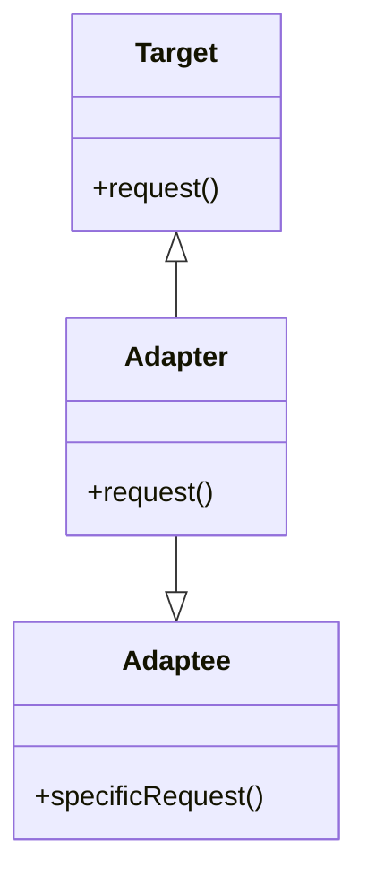
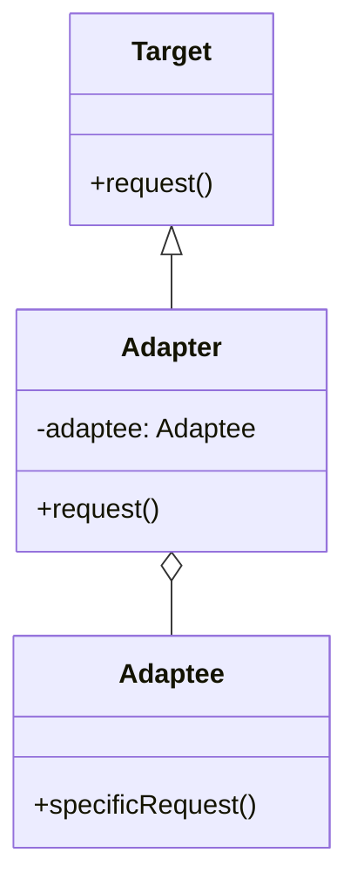

## 7.2.1 Implementing Adapter in Java

The Adapter pattern is a structural design pattern that allows objects with incompatible interfaces to work together. It acts as a bridge between two incompatible interfaces by converting the interface of a class into another interface that clients expect. This pattern is particularly useful when integrating third-party libraries or legacy systems into new applications.

### Intent

The primary intent of the Adapter pattern is to allow classes with incompatible interfaces to collaborate. By doing so, it promotes the reusability of existing classes without modifying their source code, which is especially beneficial when dealing with third-party libraries or legacy systems.

### Motivation

In software development, it is common to encounter situations where a class cannot be used because its interface does not match the one expected by a client. The Adapter pattern solves this problem by creating a wrapper class that translates the interface of the existing class into one that the client can work with. This approach allows developers to reuse existing code and integrate it into new systems seamlessly.

### Participants

The Adapter pattern involves the following participants:

- **Target**: Defines the domain-specific interface that the client uses.
- **Adapter**: Adapts the interface of the Adaptee to the Target interface.
- **Adaptee**: Defines an existing interface that needs adapting.
- **Client**: Collaborates with objects conforming to the Target interface.

### Structure

The Adapter pattern can be implemented in two ways: class adapter and object adapter. Below is a UML diagram illustrating the class relationships for both implementations.

#### Class Adapter



*Figure 1: Class Adapter Pattern Structure*

#### Object Adapter



*Figure 2: Object Adapter Pattern Structure*

### Implementation

#### Class Adapter Implementation

The class adapter uses inheritance to adapt the Adaptee to the Target interface. This approach is limited by Java's single inheritance constraint, meaning the Adapter can only extend one class.

```java
// Target interface
interface Target {
    void request();
}

// Adaptee class with an incompatible interface
class Adaptee {
    void specificRequest() {
        System.out.println("Adaptee's specific request.");
    }
}

// Adapter class that adapts Adaptee to Target
class Adapter extends Adaptee implements Target {
    @Override
    public void request() {
        // Translate the request to the specific request
        specificRequest();
    }
}

// Client code
public class Client {
    public static void main(String[] args) {
        Target target = new Adapter();
        target.request(); // Outputs: Adaptee's specific request.
    }
}
```

*Explanation*: In this example, the `Adapter` class extends `Adaptee` and implements the `Target` interface. The `request` method in `Adapter` calls the `specificRequest` method of `Adaptee`, thus adapting the interface.

#### Object Adapter Implementation

The object adapter uses composition to achieve the adaptation. This approach is more flexible as it allows the Adapter to work with multiple Adaptees.

```java
// Target interface
interface Target {
    void request();
}

// Adaptee class with an incompatible interface
class Adaptee {
    void specificRequest() {
        System.out.println("Adaptee's specific request.");
    }
}

// Adapter class that adapts Adaptee to Target
class Adapter implements Target {
    private Adaptee adaptee;

    public Adapter(Adaptee adaptee) {
        this.adaptee = adaptee;
    }

    @Override
    public void request() {
        // Translate the request to the specific request
        adaptee.specificRequest();
    }
}

// Client code
public class Client {
    public static void main(String[] args) {
        Adaptee adaptee = new Adaptee();
        Target target = new Adapter(adaptee);
        target.request(); // Outputs: Adaptee's specific request.
    }
}
```

*Explanation*: In this example, the `Adapter` class holds a reference to an `Adaptee` object. The `request` method in `Adapter` calls the `specificRequest` method of the `Adaptee`, thus adapting the interface.

### Practical Applications

The Adapter pattern is widely used in scenarios where systems need to integrate with third-party libraries or legacy systems. For example, consider a payment processing system that needs to integrate with multiple payment gateways, each with its own API. By using the Adapter pattern, developers can create a uniform interface for the payment processing system, allowing it to interact with different payment gateways seamlessly.

### Promoting Reusability

The Adapter pattern promotes reusability by allowing existing classes to be used in new contexts without modification. This is particularly beneficial when working with third-party libraries, where modifying the source code is not an option. By creating an adapter, developers can integrate these libraries into their systems without altering their interfaces.

### Integrating Third-Party Libraries and Legacy Systems

When integrating third-party libraries or legacy systems, the Adapter pattern provides a way to bridge the gap between incompatible interfaces. For example, if a legacy system uses a different data format than a new application, an adapter can be created to convert the data format, allowing the two systems to communicate effectively.

### Best Practices

- **Favor Composition Over Inheritance**: When possible, use the object adapter approach as it provides more flexibility and adheres to the principle of favoring composition over inheritance.
- **Single Responsibility Principle**: Ensure that the adapter only handles the translation of interfaces and does not introduce additional logic.
- **Interface Segregation**: Design the Target interface to be as minimal as possible, exposing only the necessary methods to the client.

### Common Pitfalls

- **Overuse of Adapters**: Avoid using adapters excessively, as this can lead to a complex and hard-to-maintain codebase.
- **Performance Overhead**: Be mindful of the potential performance overhead introduced by the adapter, especially in performance-critical applications.

### Exercises

1. Implement an adapter for a third-party logging library that uses a different logging interface than your application.
2. Create an adapter that allows a legacy XML-based configuration system to work with a new JSON-based configuration system.

### Conclusion

The Adapter pattern is a powerful tool for integrating incompatible interfaces, promoting code reusability, and facilitating the integration of third-party libraries and legacy systems. By understanding and applying this pattern, developers can create flexible and maintainable software systems that can adapt to changing requirements.

## Test Your Knowledge: Java Adapter Pattern Quiz



### What is the primary purpose of the Adapter pattern?

- [x] To allow incompatible interfaces to work together.
- [ ] To create a new interface for existing classes.
- [ ] To enhance the performance of existing classes.
- [ ] To simplify the design of complex systems.

> **Explanation:** The Adapter pattern is used to allow incompatible interfaces to work together by converting the interface of one class into an interface expected by the clients.

### Which of the following is a participant in the Adapter pattern?

- [x] Target
- [ ] Observer
- [ ] Singleton
- [ ] Factory

> **Explanation:** The Target is one of the participants in the Adapter pattern, defining the domain-specific interface that the client uses.

### In the class adapter implementation, which Java feature is primarily used?

- [x] Inheritance
- [ ] Composition
- [ ] Polymorphism
- [ ] Encapsulation

> **Explanation:** The class adapter implementation primarily uses inheritance to adapt the Adaptee to the Target interface.

### What is a key advantage of using the object adapter approach?

- [x] It allows for more flexibility by using composition.
- [ ] It is easier to implement than the class adapter.
- [ ] It provides better performance than the class adapter.
- [ ] It requires less code than the class adapter.

> **Explanation:** The object adapter approach allows for more flexibility by using composition, enabling the adapter to work with multiple Adaptees.

### Which principle does the object adapter approach adhere to?

- [x] Favor composition over inheritance
- [ ] Open/Closed Principle
- [ ] Liskov Substitution Principle
- [ ] Dependency Inversion Principle

> **Explanation:** The object adapter approach adheres to the principle of favoring composition over inheritance, providing more flexibility in design.

### What is a common pitfall when using the Adapter pattern?

- [x] Overuse of adapters leading to complex code
- [ ] Increased performance
- [ ] Simplified codebase
- [ ] Reduced flexibility

> **Explanation:** Overuse of adapters can lead to a complex and hard-to-maintain codebase, which is a common pitfall when using the Adapter pattern.

### How does the Adapter pattern promote reusability?

- [x] By allowing existing classes to be used in new contexts without modification.
- [ ] By creating new classes for each use case.
- [ ] By simplifying the existing class interfaces.
- [ ] By reducing the number of classes in the system.

> **Explanation:** The Adapter pattern promotes reusability by allowing existing classes to be used in new contexts without modification, facilitating integration with new systems.

### What is the role of the Client in the Adapter pattern?

- [x] To collaborate with objects conforming to the Target interface.
- [ ] To define the interface that needs adapting.
- [ ] To implement the Adapter interface.
- [ ] To convert the interface of the Adaptee.

> **Explanation:** The Client collaborates with objects conforming to the Target interface, using the adapted interface provided by the Adapter.

### Which of the following is a benefit of using the Adapter pattern?

- [x] It allows for the integration of third-party libraries.
- [ ] It reduces the number of classes in a system.
- [ ] It simplifies the design of complex systems.
- [ ] It enhances the performance of existing classes.

> **Explanation:** The Adapter pattern allows for the integration of third-party libraries by adapting their interfaces to match the expected interfaces in the system.

### True or False: The Adapter pattern can only be used with legacy systems.

- [ ] True
- [x] False

> **Explanation:** False. The Adapter pattern can be used with both legacy systems and new systems, as well as for integrating third-party libraries.



By mastering the Adapter pattern, Java developers can enhance their ability to integrate disparate systems and promote the reusability of existing code, making it a valuable tool in the software architect's toolkit.
