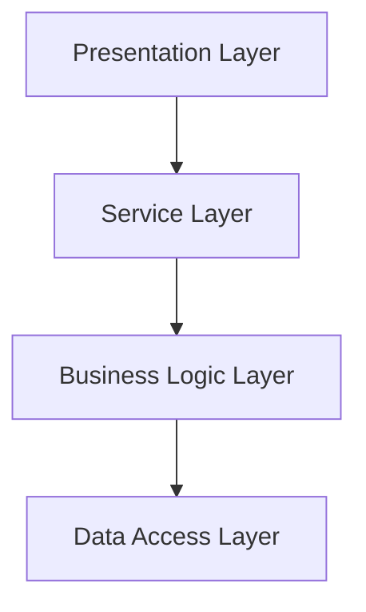
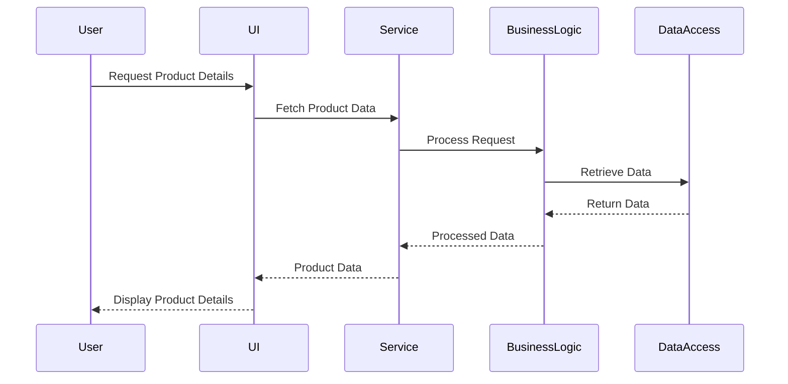

## 7.2.2 Separation of Concerns

In the realm of software engineering, the principle of **Separation of Concerns (SoC)** is a fundamental concept that guides the organization of code into distinct sections, each addressing a specific aspect of the application. This principle is pivotal in enhancing the maintainability, scalability, and clarity of software systems. In this section, we will delve into the importance of SoC, how it is enforced through layered architecture, and the real-world benefits it brings to software development.

### Understanding Separation of Concerns

**Separation of Concerns** is a design principle that advocates for dividing a software application into distinct sections, each responsible for a specific functionality or concern. The primary goal is to reduce complexity and improve the manageability of the codebase by ensuring that each section can be developed, tested, and maintained independently.

#### Key Concepts of Separation of Concerns

- **Modularity**: By breaking down a system into modules, each with a distinct responsibility, developers can focus on one aspect of the system at a time.
- **Encapsulation**: Each module should hide its internal workings from others, exposing only what is necessary for interaction.
- **Interchangeability**: Modules can be replaced or upgraded without affecting the rest of the system, provided they adhere to the agreed interfaces.

### Importance of Separation of Concerns in Software Design

The importance of SoC in software design cannot be overstated. Here are some key reasons why it is crucial:

- **Improved Maintainability**: When concerns are separated, changes in one part of the system are less likely to impact others, making the code easier to maintain.
- **Enhanced Scalability**: As the system grows, new features can be added to specific modules without affecting the entire application.
- **Simplified Testing**: With clear boundaries between concerns, testing becomes more straightforward, as each module can be tested in isolation.
- **Facilitated Team Collaboration**: Different teams can work on different modules simultaneously without stepping on each other's toes.

### Layered Architecture and Separation of Concerns

Layered architecture is a common approach to enforcing the principle of SoC. It organizes the system into layers, each responsible for a specific aspect of the application. This structure not only enforces separation but also provides a clear roadmap for the development process.

#### Layers in a Typical Software Architecture

1. **Presentation Layer**: This is the user interface of the application. It handles user interactions and displays information.
2. **Business Logic Layer**: This layer contains the core functionality of the application. It processes data and enforces business rules.
3. **Data Access Layer**: This layer is responsible for interacting with the database or any other data storage system.
4. **Service Layer**: Often acts as an intermediary between the presentation and business logic layers, handling communication and data exchange.



**Diagram Description**: This diagram illustrates a typical layered architecture, showing the flow of data from the Presentation Layer through the Service Layer to the Business Logic Layer, and finally to the Data Access Layer.

### Real-World Benefits of Layered Architecture

The layered architecture provides numerous benefits, which are directly tied to the principle of Separation of Concerns:

- **Easier Code Maintenance**: Changes in the user interface, for example, do not affect the business logic or data access layers. This isolation makes it easier to update or refactor code.
- **Improved Testing**: Each layer can be tested independently, ensuring that changes in one layer do not inadvertently affect others.
- **Enhanced Collaboration**: Teams can specialize in different layers, such as UI/UX design, business logic development, or database management, allowing for parallel development.
- **Scalability and Flexibility**: New features can be added to specific layers without requiring a complete overhaul of the system.

### Example: Impact of Changes in One Layer

Consider a scenario where a new feature is added to the user interface of an e-commerce application. By adhering to the principles of SoC and using a layered architecture, this change can be implemented without affecting the underlying business logic or data access layers.

```java
// Presentation Layer: Adding a new feature to display product reviews
public class ProductReviewUI {
    public void displayReviews(List<Review> reviews) {
        // Code to render reviews on the UI
    }
}

// Business Logic Layer: No changes needed
public class ProductService {
    public List<Review> getProductReviews(int productId) {
        // Fetch reviews from the data access layer
        return reviewRepository.findByProductId(productId);
    }
}

// Data Access Layer: No changes needed
public class ReviewRepository {
    public List<Review> findByProductId(int productId) {
        // Query database for reviews
        return database.query("SELECT * FROM reviews WHERE product_id = ?", productId);
    }
}
```

**Code Explanation**: In this example, a new feature is added to the Presentation Layer to display product reviews. The Business Logic Layer and Data Access Layer remain unchanged, demonstrating how changes in one layer do not impact others.

### Strategies to Maintain Separation of Concerns

To effectively maintain SoC in a layered architecture, consider the following strategies:

- **Enforce Layer Access Rules**: Ensure that each layer only interacts with the layer directly below it. For example, the Presentation Layer should not directly access the Data Access Layer.
- **Use Interfaces and Abstractions**: Define clear interfaces for each layer to interact with others. This abstraction allows for flexibility and interchangeability.
- **Implement Dependency Injection**: Use dependency injection to manage dependencies between layers. This approach promotes loose coupling and enhances testability.
- **Adopt Design Patterns**: Utilize design patterns such as MVC (Model-View-Controller) or MVVM (Model-View-ViewModel) to enforce separation and organize code effectively.

### Visualizing Layer Interactions

To better understand how layers interact while maintaining separation, consider the following sequence diagram:



**Diagram Description**: This sequence diagram illustrates the interaction between layers when a user requests product details. Each layer communicates only with the adjacent layer, maintaining separation of concerns.

### Knowledge Check

Before we move on, let's reflect on what we've learned:

- **Why is Separation of Concerns important in software design?**
- **How does layered architecture enforce Separation of Concerns?**
- **What are some strategies to maintain strict separation between layers?**

### Try It Yourself

Experiment with the code examples provided by:

- Modifying the `ProductReviewUI` class to include additional features, such as sorting or filtering reviews.
- Implementing a new layer, such as a caching layer, to improve performance without affecting existing layers.
- Refactoring the code to use dependency injection for better testability and flexibility.

### Embrace the Journey

Remember, mastering Separation of Concerns and layered architecture is a journey. As you continue to apply these principles, you'll find that your code becomes more modular, maintainable, and scalable. Keep experimenting, stay curious, and enjoy the process of building robust software systems!

## Quiz Time!



### What is the main goal of Separation of Concerns in software design?

- [x] To reduce complexity and improve manageability by dividing the system into distinct sections.
- [ ] To increase the number of lines of code.
- [ ] To make the system more complex.
- [ ] To ensure all code is in a single file.

> **Explanation:** Separation of Concerns aims to reduce complexity by dividing the system into distinct sections, each responsible for a specific functionality.

### How does layered architecture enforce Separation of Concerns?

- [x] By organizing the system into layers, each responsible for a specific aspect of the application.
- [ ] By combining all functionalities into a single layer.
- [ ] By removing all layers and having a flat structure.
- [ ] By ensuring all layers have access to each other.

> **Explanation:** Layered architecture enforces Separation of Concerns by organizing the system into layers, each responsible for a specific aspect of the application.

### Which of the following is NOT a benefit of Separation of Concerns?

- [ ] Improved maintainability
- [x] Increased code duplication
- [ ] Simplified testing
- [ ] Enhanced collaboration

> **Explanation:** Separation of Concerns reduces code duplication, not increases it. It improves maintainability, simplifies testing, and enhances collaboration.

### What is a key strategy to maintain strict separation between layers?

- [x] Enforce layer access rules
- [ ] Allow all layers to interact freely
- [ ] Combine all layers into one
- [ ] Use global variables for communication

> **Explanation:** Enforcing layer access rules is a key strategy to maintain strict separation between layers, ensuring each layer only interacts with the layer directly below it.

### In the provided code example, what change was made to the Presentation Layer?

- [x] A new feature to display product reviews was added.
- [ ] The business logic was modified.
- [ ] The data access layer was changed.
- [ ] The entire application was rewritten.

> **Explanation:** A new feature to display product reviews was added to the Presentation Layer, demonstrating how changes in one layer do not impact others.

### What is the role of the Service Layer in a layered architecture?

- [x] Acts as an intermediary between the presentation and business logic layers.
- [ ] Directly accesses the database.
- [ ] Handles user interactions.
- [ ] Contains the core functionality of the application.

> **Explanation:** The Service Layer acts as an intermediary between the presentation and business logic layers, handling communication and data exchange.

### Which design pattern is commonly used to enforce Separation of Concerns?

- [x] MVC (Model-View-Controller)
- [ ] Singleton
- [ ] Factory
- [ ] Decorator

> **Explanation:** The MVC (Model-View-Controller) design pattern is commonly used to enforce Separation of Concerns by organizing code into distinct components.

### What is the primary benefit of using interfaces and abstractions in layered architecture?

- [x] Allows for flexibility and interchangeability between layers.
- [ ] Increases code complexity.
- [ ] Reduces code readability.
- [ ] Ensures all layers are tightly coupled.

> **Explanation:** Using interfaces and abstractions allows for flexibility and interchangeability between layers, promoting loose coupling.

### How can dependency injection help maintain Separation of Concerns?

- [x] By managing dependencies between layers, promoting loose coupling and enhancing testability.
- [ ] By increasing the number of dependencies.
- [ ] By directly accessing global variables.
- [ ] By combining all dependencies into a single module.

> **Explanation:** Dependency injection helps maintain Separation of Concerns by managing dependencies between layers, promoting loose coupling and enhancing testability.

### True or False: Separation of Concerns makes it easier to add new features to a software system.

- [x] True
- [ ] False

> **Explanation:** True. Separation of Concerns makes it easier to add new features to a software system by isolating changes to specific modules.


