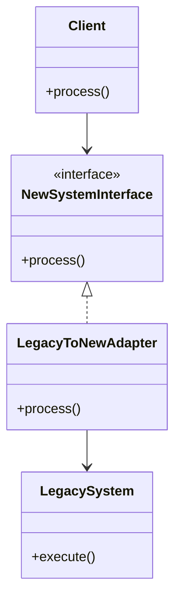
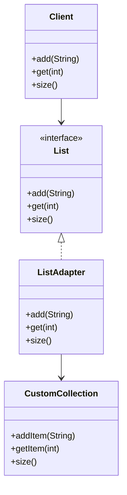

## 7.2.3 Interface vs. Implementation Adapters

In the realm of software design patterns, the Adapter pattern serves as a bridge between incompatible interfaces, allowing them to work together seamlessly. This section delves into the nuances of **interface adapters** and **implementation adapters**, exploring how each can be employed to adapt interfaces and implementations effectively. Understanding these distinctions is crucial for experienced Java developers and software architects aiming to create robust, maintainable, and efficient applications.

### Differentiating Interface and Implementation Adapters

#### Interface Adapters

**Interface adapters** focus on altering the interface that a client interacts with, without modifying the underlying implementation. This approach is particularly useful when you need to integrate a class with an interface it does not originally conform to. The adapter acts as a translator, converting the interface of a class into another interface expected by the client.

**Key Characteristics:**
- **Interface Focused**: Primarily concerned with changing the interface presented to the client.
- **Non-Intrusive**: Does not alter the underlying implementation of the adapted class.
- **Transparent to Clients**: Clients interact with the adapter as if it were the original interface.

**Example Scenario:**
Consider a scenario where you have a legacy system with a class that provides data in a format incompatible with a new system interface. An interface adapter can be used to wrap the legacy class, translating its interface to match the new system's requirements.

```java
// Existing interface
interface NewSystemInterface {
    void process();
}

// Legacy class with a different interface
class LegacySystem {
    void execute() {
        System.out.println("Executing legacy system.");
    }
}

// Interface Adapter
class LegacyToNewAdapter implements NewSystemInterface {
    private LegacySystem legacySystem;

    public LegacyToNewAdapter(LegacySystem legacySystem) {
        this.legacySystem = legacySystem;
    }

    @Override
    public void process() {
        legacySystem.execute(); // Adapting the interface
    }
}

// Client code
public class Client {
    public static void main(String[] args) {
        LegacySystem legacySystem = new LegacySystem();
        NewSystemInterface adapter = new LegacyToNewAdapter(legacySystem);
        adapter.process(); // Client uses the new interface
    }
}
```

In this example, the `LegacyToNewAdapter` class adapts the `LegacySystem` class to the `NewSystemInterface`, allowing the client to interact with the legacy system using the new interface.

#### Implementation Adapters

**Implementation adapters**, on the other hand, focus on adapting the behavior of an implementation to conform to a given interface. This approach often involves wrapping the original implementation and potentially modifying its behavior to meet specific requirements.

**Key Characteristics:**
- **Behavior Focused**: Concerned with adapting the behavior of the implementation.
- **Potentially Intrusive**: May involve modifying or extending the behavior of the adapted class.
- **Enhances Functionality**: Can add additional functionality or modify existing behavior.

**Example Scenario:**
Suppose you have a collection class that needs to be adapted to conform to a standard interface, such as `List`. An implementation adapter can wrap the collection, providing additional methods or modifying existing ones to meet the `List` interface requirements.

```java
import java.util.ArrayList;
import java.util.List;

// Custom collection class
class CustomCollection {
    private List<String> items = new ArrayList<>();

    void addItem(String item) {
        items.add(item);
    }

    String getItem(int index) {
        return items.get(index);
    }

    int size() {
        return items.size();
    }
}

// Implementation Adapter
class ListAdapter implements List<String> {
    private CustomCollection customCollection;

    public ListAdapter(CustomCollection customCollection) {
        this.customCollection = customCollection;
    }

    @Override
    public boolean add(String item) {
        customCollection.addItem(item);
        return true;
    }

    @Override
    public String get(int index) {
        return customCollection.getItem(index);
    }

    @Override
    public int size() {
        return customCollection.size();
    }

    // Other List methods would be implemented similarly
    // ...
}

// Client code
public class Client {
    public static void main(String[] args) {
        CustomCollection customCollection = new CustomCollection();
        List<String> adapter = new ListAdapter(customCollection);
        adapter.add("Item 1");
        System.out.println("First item: " + adapter.get(0));
    }
}
```

In this example, the `ListAdapter` class adapts the `CustomCollection` class to the `List` interface, allowing the client to interact with the custom collection as if it were a standard list.

### Best Practices for Using Adapters

1. **Maintain Transparency**: Ensure that the adapter is transparent to the client, providing a seamless experience as if interacting with the original interface.
2. **Minimize Intrusiveness**: When using implementation adapters, strive to minimize changes to the underlying implementation to avoid introducing bugs or unexpected behavior.
3. **Encapsulate Complexity**: Use adapters to encapsulate complex conversion logic, keeping the client code clean and focused on its primary responsibilities.
4. **Leverage Polymorphism**: Utilize polymorphism to allow clients to interact with different implementations through a common interface, enhancing flexibility and extensibility.
5. **Document Adaptations**: Clearly document the adaptations made by the adapter, including any changes to behavior or interface, to aid future maintenance and understanding.

### Historical Context and Evolution

The Adapter pattern has its roots in the early days of software engineering, where the need to integrate disparate systems and components became increasingly prevalent. As software systems grew in complexity, the ability to adapt interfaces and implementations became a critical skill for developers and architects. The pattern has evolved alongside programming languages, with modern languages like Java providing robust support for implementing adapters through interfaces and abstract classes.

### Practical Applications and Real-World Scenarios

The Adapter pattern is widely used in various domains, including:

- **Legacy System Integration**: Adapting legacy systems to work with modern interfaces without altering the original code.
- **Third-Party Library Integration**: Wrapping third-party libraries to conform to internal interfaces or standards.
- **Cross-Platform Development**: Adapting platform-specific implementations to a common interface for cross-platform compatibility.
- **API Versioning**: Providing backward compatibility by adapting new implementations to match older API versions.

### Visualizing Interface vs. Implementation Adapters

To further illustrate the differences between interface and implementation adapters, consider the following diagrams:

#### Interface Adapter Structure



*Caption: The structure of an interface adapter, where the adapter implements the target interface and delegates calls to the adapted class.*

#### Implementation Adapter Structure



*Caption: The structure of an implementation adapter, where the adapter implements the target interface and wraps the adapted class, potentially modifying its behavior.*

### Conclusion

Understanding the distinction between interface and implementation adapters is essential for effectively employing the Adapter pattern in Java. By focusing on either adapting interfaces or implementations, developers can ensure seamless integration between disparate components, enhancing the flexibility and maintainability of their applications. By adhering to best practices and leveraging the power of Java's interfaces and abstract classes, developers can create robust adapters that meet the evolving needs of modern software systems.

### References and Further Reading

- [Oracle Java Documentation](https://docs.oracle.com/en/java/)
- [Design Patterns: Elements of Reusable Object-Oriented Software](https://en.wikipedia.org/wiki/Design_Patterns) by Erich Gamma, Richard Helm, Ralph Johnson, and John Vlissides
- [Cloud Design Patterns](https://learn.microsoft.com/en-us/azure/architecture/patterns/) by Microsoft

### Exercises and Practice Problems

1. **Exercise 1**: Implement an interface adapter for a legacy payment processing system to conform to a new payment gateway interface.
2. **Exercise 2**: Create an implementation adapter for a custom logging framework to conform to the `java.util.logging.Logger` interface.
3. **Exercise 3**: Modify the provided code examples to add additional functionality to the adapters, such as logging or error handling.

### Quiz

## Test Your Knowledge: Interface vs. Implementation Adapters in Java



### What is the primary focus of an interface adapter?

- [x] Altering the interface presented to the client without changing the underlying implementation.
- [ ] Modifying the behavior of the implementation.
- [ ] Enhancing the functionality of the adapted class.
- [ ] Changing the underlying data structure.

> **Explanation:** Interface adapters focus on changing the interface that the client interacts with, without altering the underlying implementation.

### How does an implementation adapter differ from an interface adapter?

- [x] It may modify the behavior of the implementation.
- [ ] It only changes the interface presented to the client.
- [ ] It does not wrap the original implementation.
- [ ] It is always non-intrusive.

> **Explanation:** Implementation adapters focus on adapting the behavior of the implementation, which may involve modifying or extending the original behavior.

### In which scenario would you use an interface adapter?

- [x] Integrating a legacy system with a new interface.
- [ ] Modifying the behavior of a collection class.
- [ ] Enhancing the functionality of a logging framework.
- [ ] Changing the data format of a file.

> **Explanation:** Interface adapters are used to integrate a class with an interface it does not originally conform to, such as adapting a legacy system to a new interface.

### What is a key characteristic of implementation adapters?

- [x] They can add additional functionality or modify existing behavior.
- [ ] They only change the interface presented to the client.
- [ ] They do not wrap the original implementation.
- [ ] They are always non-intrusive.

> **Explanation:** Implementation adapters can add additional functionality or modify existing behavior to meet specific requirements.

### Which best practice should be followed when using adapters?

- [x] Maintain transparency to the client.
- [ ] Always modify the underlying implementation.
- [ ] Avoid using interfaces.
- [ ] Use adapters only for legacy systems.

> **Explanation:** Maintaining transparency to the client ensures a seamless experience, allowing the client to interact with the adapter as if it were the original interface.

### What is the role of polymorphism in using adapters?

- [x] It allows clients to interact with different implementations through a common interface.
- [ ] It changes the underlying data structure.
- [ ] It modifies the behavior of the implementation.
- [ ] It enhances the functionality of the adapted class.

> **Explanation:** Polymorphism allows clients to interact with different implementations through a common interface, enhancing flexibility and extensibility.

### How can adapters encapsulate complexity?

- [x] By encapsulating complex conversion logic, keeping client code clean.
- [ ] By modifying the behavior of the implementation.
- [ ] By changing the underlying data structure.
- [ ] By enhancing the functionality of the adapted class.

> **Explanation:** Adapters encapsulate complex conversion logic, keeping client code clean and focused on its primary responsibilities.

### What is a common use case for the Adapter pattern?

- [x] Legacy system integration.
- [ ] Changing the data format of a file.
- [ ] Enhancing the functionality of a logging framework.
- [ ] Modifying the behavior of a collection class.

> **Explanation:** The Adapter pattern is commonly used for legacy system integration, allowing legacy systems to work with modern interfaces.

### How does the Adapter pattern enhance cross-platform development?

- [x] By adapting platform-specific implementations to a common interface.
- [ ] By changing the underlying data structure.
- [ ] By modifying the behavior of the implementation.
- [ ] By enhancing the functionality of the adapted class.

> **Explanation:** The Adapter pattern enhances cross-platform development by adapting platform-specific implementations to a common interface, ensuring compatibility.

### True or False: An interface adapter can modify the behavior of the adapted class.

- [ ] True
- [x] False

> **Explanation:** An interface adapter focuses on changing the interface presented to the client without modifying the behavior of the adapted class.


