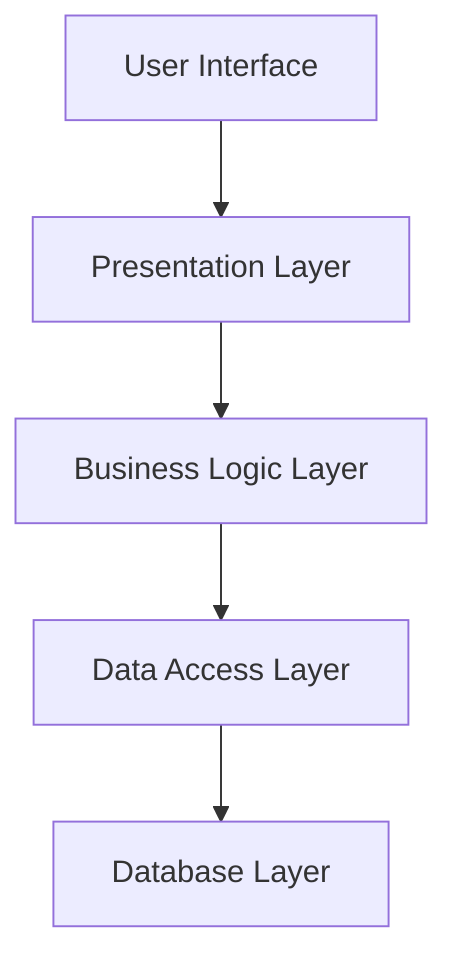
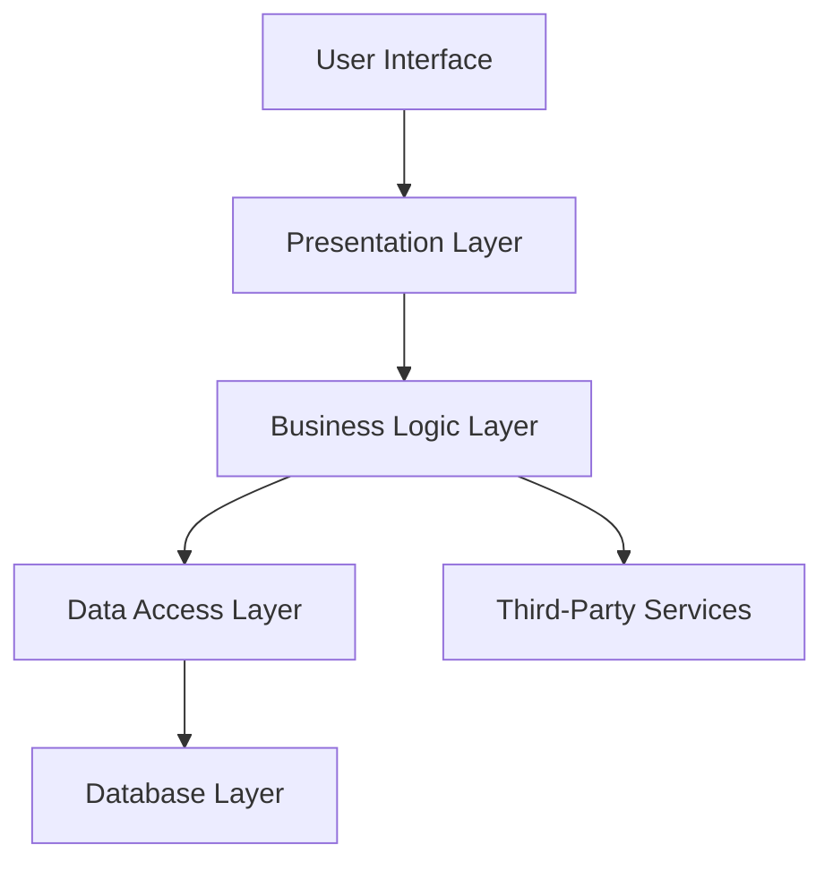
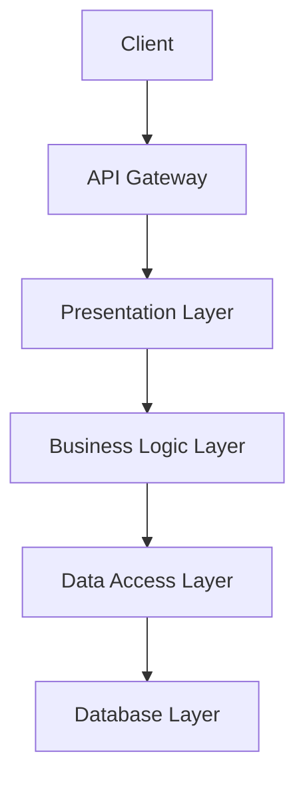

## 7.2.3 Use Cases and Examples

In the realm of software engineering, the Layered Architecture pattern stands as a cornerstone for building scalable and maintainable applications. This pattern, which organizes code into distinct layers with specific responsibilities, is particularly effective in enterprise applications and web services. In this section, we'll delve into real-world scenarios where the Layered Architecture pattern has been successfully applied, such as online banking systems, e-commerce platforms, and RESTful web services. We'll explore how this architectural approach addresses specific challenges, and we'll share lessons learned and best practices derived from these examples.

### Understanding Layered Architecture

Before we dive into specific use cases, let's briefly recap the core concept of Layered Architecture. This pattern divides an application into layers, each with a distinct role. Common layers include:

- **Presentation Layer**: Manages user interface and user interaction.
- **Business Logic Layer**: Contains the core functionality and business rules.
- **Data Access Layer**: Handles data storage and retrieval.
- **Database Layer**: Manages the database, often abstracted by the Data Access Layer.

This separation of concerns facilitates modularity, making it easier to manage, test, and scale applications.

### Use Case 1: Online Banking System

#### Scenario Overview

Online banking systems are complex applications that require robust security, seamless user experience, and reliable transaction processing. A layered architecture is ideal for such systems due to its ability to separate concerns and enhance maintainability.

#### Architectural Diagram

#### Implementation Details

1. **Presentation Layer**: This layer includes web pages and mobile app interfaces that users interact with. It communicates with the Business Logic Layer through RESTful APIs.

2. **Business Logic Layer**: This layer handles core banking operations such as account management, transaction processing, and fraud detection. It enforces business rules and ensures data integrity.

3. **Data Access Layer**: This layer abstracts the database interactions, providing a consistent API for the Business Logic Layer to perform CRUD operations.

4. **Database Layer**: This layer includes the actual database systems, such as SQL or NoSQL databases, that store user data and transaction records.

#### Addressing Challenges

- **Security**: By isolating the Business Logic Layer, sensitive operations are protected from direct exposure to the user interface.
- **Scalability**: Each layer can be scaled independently, allowing the system to handle increased loads without a complete overhaul.
- **Maintainability**: Changes in one layer, such as updating the user interface, do not affect other layers, reducing the risk of introducing bugs.

#### Lessons Learned

- **Modular Design**: Emphasizing modularity in each layer enhances the ability to update and maintain the system.
- **Clear Interfaces**: Defining clear interfaces between layers ensures smooth communication and reduces coupling.

### Use Case 2: E-commerce Platform

#### Scenario Overview

E-commerce platforms must provide a seamless shopping experience, manage large inventories, and process transactions efficiently. The Layered Architecture pattern helps manage these complexities by organizing the application into manageable sections.

#### Architectural Diagram

#### Implementation Details

1. **Presentation Layer**: This layer includes the website and mobile app interfaces, providing product browsing, shopping cart management, and checkout processes.

2. **Business Logic Layer**: This layer manages product catalogs, pricing, promotions, and order processing. It integrates with third-party services for payment processing and shipping.

3. **Data Access Layer**: This layer abstracts the database interactions, ensuring efficient data retrieval and storage.

4. **Database Layer**: This layer includes databases that store product information, customer data, and order histories.

5. **Third-Party Services**: This layer handles integrations with external services, such as payment gateways and shipping providers.

#### Addressing Challenges

- **Performance**: By caching frequently accessed data in the Data Access Layer, the system can handle high traffic without degrading performance.
- **Flexibility**: The modular design allows for easy integration of new features, such as adding new payment methods or promotional campaigns.
- **Reliability**: By isolating third-party integrations, the system can handle failures gracefully without affecting core functionalities.

#### Lessons Learned

- **Caching Strategies**: Implementing caching in the Data Access Layer can significantly improve performance.
- **Resilient Integrations**: Designing the system to handle third-party service failures ensures a robust and reliable platform.

### Use Case 3: RESTful Web Services

#### Scenario Overview

RESTful web services are a common way to expose functionality over the internet. They require a clear separation of concerns to ensure scalability and maintainability.

#### Architectural Diagram

#### Implementation Details

1. **API Gateway**: This layer acts as a single entry point for all client requests, routing them to the appropriate services.

2. **Presentation Layer**: This layer handles request parsing and response formatting, ensuring consistent API responses.

3. **Business Logic Layer**: This layer implements the core functionality exposed by the APIs, such as data processing and validation.

4. **Data Access Layer**: This layer abstracts database interactions, providing a consistent interface for data operations.

5. **Database Layer**: This layer includes the databases that store application data.

#### Addressing Challenges

- **Scalability**: By decoupling the API Gateway from the Business Logic Layer, the system can scale horizontally to handle increased loads.
- **Security**: The API Gateway provides a centralized point for implementing security measures, such as authentication and rate limiting.
- **Maintainability**: The separation of concerns allows for independent updates to each layer, reducing the risk of introducing errors.

#### Lessons Learned

- **Centralized Security**: Implementing security measures at the API Gateway simplifies management and enhances protection.
- **Consistent API Design**: Ensuring consistent request and response formats improves client integration and reduces errors.

### Best Practices for Layered Architecture

1. **Define Clear Boundaries**: Ensure each layer has a well-defined role and communicates with other layers through clear interfaces.

2. **Encapsulate Business Logic**: Keep business rules and logic centralized in the Business Logic Layer to maintain consistency and reduce duplication.

3. **Use Dependency Injection**: Leverage dependency injection to manage dependencies between layers, enhancing testability and flexibility.

4. **Implement Caching Wisely**: Use caching to improve performance, but ensure it is implemented in a way that maintains data consistency.

5. **Monitor and Optimize Performance**: Regularly monitor the performance of each layer and optimize as needed to ensure the system can handle expected loads.

### Try It Yourself

To gain hands-on experience with the Layered Architecture pattern, try implementing a simple e-commerce application. Start by defining the layers and their responsibilities, then build out each layer incrementally. Experiment with different caching strategies and third-party integrations to see how they affect performance and reliability.

### Conclusion

The Layered Architecture pattern is a powerful tool for building scalable and maintainable applications. By organizing code into distinct layers, developers can manage complexity, enhance modularity, and improve maintainability. Whether you're building an online banking system, an e-commerce platform, or a RESTful web service, the lessons learned from these use cases can guide you in creating robust and efficient applications.

## Quiz Time!



### Which layer in the Layered Architecture pattern is responsible for handling user interactions?

- [x] Presentation Layer
- [ ] Business Logic Layer
- [ ] Data Access Layer
- [ ] Database Layer

> **Explanation:** The Presentation Layer manages user interfaces and interactions.

### What is a key benefit of using the Layered Architecture pattern?

- [x] Separation of concerns
- [ ] Increased complexity
- [ ] Reduced modularity
- [ ] Direct database access

> **Explanation:** The Layered Architecture pattern separates concerns, making the system more modular and maintainable.

### In a RESTful web service, which layer typically handles request parsing and response formatting?

- [ ] Business Logic Layer
- [x] Presentation Layer
- [ ] Data Access Layer
- [ ] Database Layer

> **Explanation:** The Presentation Layer handles request parsing and response formatting in a RESTful web service.

### How does the Layered Architecture pattern enhance security in an online banking system?

- [x] By isolating business logic from direct user access
- [ ] By allowing direct database access
- [ ] By increasing system complexity
- [ ] By reducing modularity

> **Explanation:** Isolating business logic from direct user access enhances security by protecting sensitive operations.

### Which of the following is a lesson learned from implementing Layered Architecture in e-commerce platforms?

- [x] Implement caching strategies to improve performance
- [ ] Avoid third-party integrations
- [ ] Use a single layer for all functionalities
- [ ] Directly expose databases to users

> **Explanation:** Implementing caching strategies can significantly improve performance in e-commerce platforms.

### What role does the API Gateway play in a RESTful web service?

- [x] Acts as a single entry point for client requests
- [ ] Handles business logic
- [ ] Manages database interactions
- [ ] Formats API responses

> **Explanation:** The API Gateway acts as a single entry point for client requests, routing them to the appropriate services.

### How does the Layered Architecture pattern improve maintainability?

- [x] By allowing independent updates to each layer
- [ ] By increasing system complexity
- [ ] By reducing modularity
- [ ] By directly exposing databases

> **Explanation:** Independent updates to each layer reduce the risk of introducing errors, improving maintainability.

### Which layer in the Layered Architecture pattern abstracts database interactions?

- [ ] Presentation Layer
- [ ] Business Logic Layer
- [x] Data Access Layer
- [ ] Database Layer

> **Explanation:** The Data Access Layer abstracts database interactions, providing a consistent API for data operations.

### What is a best practice for implementing Layered Architecture?

- [x] Define clear boundaries between layers
- [ ] Use a single layer for all functionalities
- [ ] Directly expose databases to users
- [ ] Avoid using dependency injection

> **Explanation:** Defining clear boundaries between layers ensures each layer has a well-defined role and communicates effectively.

### True or False: The Layered Architecture pattern can be used to build scalable and maintainable applications.

- [x] True
- [ ] False

> **Explanation:** The Layered Architecture pattern is designed to build scalable and maintainable applications by organizing code into distinct layers.



Remember, this is just the beginning. As you progress, you'll build more complex and interactive systems. Keep experimenting, stay curious, and enjoy the journey!
