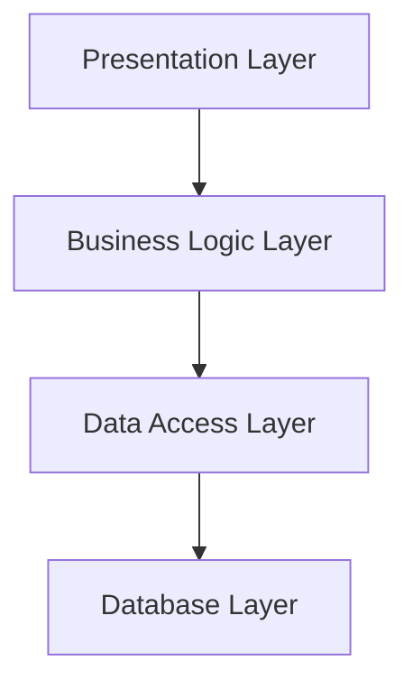
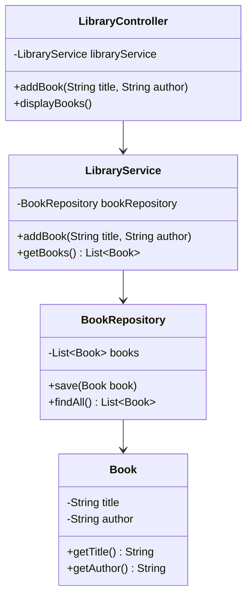

## 7.2 Layered Architecture Pattern

In the realm of software engineering, the Layered Architecture Pattern stands as a cornerstone for building robust, maintainable, and scalable applications. This pattern organizes code into distinct layers, each with its own responsibility, fostering a clear separation of concerns. Let's delve into the intricacies of this architectural style, its benefits, potential drawbacks, and how it compares to other architectural patterns.

### Understanding the Layered Architecture Pattern

The Layered Architecture Pattern, also known as the n-tier architecture, is a design paradigm that divides an application into logical layers. Each layer has a specific role, and layers interact with each other in a structured manner. The primary intent of this pattern is to separate concerns, making the system easier to manage, test, and scale.

#### Key Concepts

- **Separation of Concerns**: Each layer in the architecture has a distinct responsibility, which helps in isolating changes and reducing the impact on other layers.
- **Modularity**: By organizing code into layers, the system becomes modular, allowing developers to work on different parts of the application independently.
- **Reusability**: Layers can be reused across different applications, promoting code reuse and reducing redundancy.

### The Layers of a Typical Layered Architecture

A typical layered architecture consists of the following layers:

1. **Presentation Layer**: This is the topmost layer, responsible for handling user interactions. It includes user interfaces, views, and controllers. The presentation layer communicates with the business logic layer to process user inputs and display results.

2. **Business Logic Layer**: Also known as the application layer, this layer contains the core functionality of the application. It processes data, applies business rules, and performs calculations. The business logic layer acts as a bridge between the presentation layer and the data access layer.

3. **Data Access Layer**: This layer is responsible for interacting with the database or any other data storage system. It performs CRUD (Create, Read, Update, Delete) operations and abstracts the complexities of data access from the business logic layer.

4. **Database Layer**: Although sometimes considered part of the data access layer, the database layer specifically refers to the physical storage of data. It includes database servers, tables, and other data storage mechanisms.



*Figure 1: Visualizing the Layered Architecture Pattern*

### Responsibilities of Each Layer

#### Presentation Layer

- **User Interface Management**: Handles the display of data and user interactions.
- **Input Validation**: Ensures that user inputs are valid before passing them to the business logic layer.
- **Communication with Business Logic**: Sends user requests to the business logic layer and receives responses.

#### Business Logic Layer

- **Business Rule Processing**: Implements the core functionality and business rules of the application.
- **Data Transformation**: Converts data between different formats as needed.
- **Coordination**: Manages the flow of data between the presentation and data access layers.

#### Data Access Layer

- **Database Interaction**: Executes queries and updates to the database.
- **Data Abstraction**: Provides an abstract interface for data access, hiding the complexities of database operations.
- **Transaction Management**: Ensures data integrity and consistency during operations.

#### Database Layer

- **Data Storage**: Physically stores data in tables or other structures.
- **Data Retrieval**: Provides mechanisms for retrieving stored data efficiently.
- **Backup and Recovery**: Manages data backups and recovery processes.

### Benefits of Layered Architecture

The layered architecture pattern offers several advantages:

- **Ease of Maintenance**: By separating concerns, changes in one layer do not directly affect others, making maintenance easier.
- **Testability**: Each layer can be tested independently, improving the overall testability of the system.
- **Scalability**: Layers can be scaled independently, allowing the system to handle increased loads more efficiently.
- **Reusability**: Common functionality can be encapsulated in layers and reused across different applications.

### Potential Drawbacks

While the layered architecture pattern has many benefits, it also has some potential drawbacks:

- **Performance Overhead**: The separation of layers can introduce performance overhead due to additional processing and communication between layers.
- **Strict Coupling**: Although layers are logically separated, they can become tightly coupled if not designed carefully, making changes more difficult.
- **Complexity**: For small applications, the layered architecture can introduce unnecessary complexity.

### Comparing Layered Architecture with Other Architectural Styles

The layered architecture pattern is just one of many architectural styles. Let's compare it with a few others:

- **Microservices Architecture**: Unlike the layered architecture, which organizes code into layers, microservices architecture divides an application into small, independent services. Each service is responsible for a specific business capability and can be developed, deployed, and scaled independently.

- **Event-Driven Architecture**: This style focuses on the production, detection, and consumption of events. It is suitable for systems that require real-time processing and asynchronous communication. In contrast, the layered architecture is more synchronous and structured.

- **Hexagonal Architecture**: Also known as the Ports and Adapters pattern, this architecture emphasizes the separation of the application's core logic from external systems. It allows for more flexibility and adaptability compared to the layered architecture.

### Code Example: Implementing a Layered Architecture in Java

Let's explore a simple Java application that follows the layered architecture pattern. We'll create a basic application for managing a library system.

#### Presentation Layer

```java
// Presentation Layer: LibraryController.java
public class LibraryController {
    private final LibraryService libraryService;

    public LibraryController(LibraryService libraryService) {
        this.libraryService = libraryService;
    }

    public void addBook(String title, String author) {
        libraryService.addBook(title, author);
        System.out.println("Book added successfully.");
    }

    public void displayBooks() {
        libraryService.getBooks().forEach(book -> 
            System.out.println(book.getTitle() + " by " + book.getAuthor()));
    }
}
```

#### Business Logic Layer

```java
// Business Logic Layer: LibraryService.java
import java.util.List;

public class LibraryService {
    private final BookRepository bookRepository;

    public LibraryService(BookRepository bookRepository) {
        this.bookRepository = bookRepository;
    }

    public void addBook(String title, String author) {
        Book book = new Book(title, author);
        bookRepository.save(book);
    }

    public List<Book> getBooks() {
        return bookRepository.findAll();
    }
}
```

#### Data Access Layer

```java
// Data Access Layer: BookRepository.java
import java.util.ArrayList;
import java.util.List;

public class BookRepository {
    private final List<Book> books = new ArrayList<>();

    public void save(Book book) {
        books.add(book);
    }

    public List<Book> findAll() {
        return new ArrayList<>(books);
    }
}
```

#### Database Layer

For simplicity, we'll use an in-memory list to simulate the database layer. In a real-world application, this would involve a database server.

```java
// Database Layer: Book.java
public class Book {
    private final String title;
    private final String author;

    public Book(String title, String author) {
        this.title = title;
        this.author = author;
    }

    public String getTitle() {
        return title;
    }

    public String getAuthor() {
        return author;
    }
}
```

### Try It Yourself

To experiment with this layered architecture example, try the following:

- **Add More Functionality**: Extend the `LibraryService` to include methods for removing books or searching by author.
- **Implement Validation**: Add input validation in the `LibraryController` to ensure valid data is passed to the service layer.
- **Simulate a Real Database**: Replace the in-memory list in `BookRepository` with a database connection using JDBC or an ORM framework like Hibernate.

### Visualizing the Layered Architecture

The following UML diagram illustrates the structure of our library management application, highlighting the interaction between layers.



*Figure 2: UML Diagram of the Library Management Application*

### Knowledge Check

- **What are the primary responsibilities of the presentation layer?**
- **How does the business logic layer interact with the data access layer?**
- **What are some potential drawbacks of using a layered architecture?**
- **How does the layered architecture pattern compare to microservices architecture?**

### Conclusion

The Layered Architecture Pattern is a powerful tool for organizing code in a way that promotes modularity, scalability, and maintainability. By separating concerns into distinct layers, developers can build systems that are easier to manage and extend. However, it's important to be aware of potential drawbacks, such as performance overhead and strict coupling, and to weigh these against the benefits when choosing an architectural style.

Remember, this is just the beginning. As you progress, you'll build more complex and interactive systems. Keep experimenting, stay curious, and enjoy the journey!

## Quiz Time!



### What is the primary intent of the Layered Architecture Pattern?

- [x] To separate concerns and make the system easier to manage
- [ ] To increase coupling between different parts of the system
- [ ] To simplify the user interface
- [ ] To enhance database performance

> **Explanation:** The primary intent of the Layered Architecture Pattern is to separate concerns, making the system easier to manage, test, and scale.

### Which layer is responsible for handling user interactions in a layered architecture?

- [x] Presentation Layer
- [ ] Business Logic Layer
- [ ] Data Access Layer
- [ ] Database Layer

> **Explanation:** The Presentation Layer is responsible for handling user interactions, including user interfaces, views, and controllers.

### What is a potential drawback of the Layered Architecture Pattern?

- [x] Performance overhead due to additional processing and communication
- [ ] Lack of modularity
- [ ] Difficulty in testing
- [ ] Inability to scale

> **Explanation:** A potential drawback of the Layered Architecture Pattern is performance overhead due to additional processing and communication between layers.

### How does the Business Logic Layer interact with the Data Access Layer?

- [x] It processes data and applies business rules before interacting with the Data Access Layer for CRUD operations.
- [ ] It directly communicates with the database without any intermediate layer.
- [ ] It handles user interactions and passes them to the Data Access Layer.
- [ ] It stores data in the database.

> **Explanation:** The Business Logic Layer processes data and applies business rules before interacting with the Data Access Layer for CRUD operations.

### Which architectural style divides an application into small, independent services?

- [x] Microservices Architecture
- [ ] Layered Architecture
- [ ] Event-Driven Architecture
- [ ] Hexagonal Architecture

> **Explanation:** Microservices Architecture divides an application into small, independent services, each responsible for a specific business capability.

### What is the role of the Data Access Layer in a layered architecture?

- [x] To interact with the database and perform CRUD operations
- [ ] To handle user interactions
- [ ] To apply business rules
- [ ] To store data in tables

> **Explanation:** The Data Access Layer is responsible for interacting with the database and performing CRUD operations.

### How can the Layered Architecture Pattern improve testability?

- [x] By allowing each layer to be tested independently
- [ ] By increasing the complexity of the system
- [ ] By reducing the number of layers
- [ ] By tightly coupling layers

> **Explanation:** The Layered Architecture Pattern improves testability by allowing each layer to be tested independently.

### What is a key benefit of using a layered approach?

- [x] Ease of maintenance due to separation of concerns
- [ ] Increased performance due to fewer layers
- [ ] Simplified user interface design
- [ ] Direct access to the database

> **Explanation:** A key benefit of using a layered approach is ease of maintenance due to the separation of concerns.

### Which layer is responsible for physically storing data in a layered architecture?

- [x] Database Layer
- [ ] Presentation Layer
- [ ] Business Logic Layer
- [ ] Data Access Layer

> **Explanation:** The Database Layer is responsible for physically storing data in tables or other structures.

### True or False: The Layered Architecture Pattern is suitable for small applications.

- [ ] True
- [x] False

> **Explanation:** The Layered Architecture Pattern can introduce unnecessary complexity for small applications, making it less suitable.


