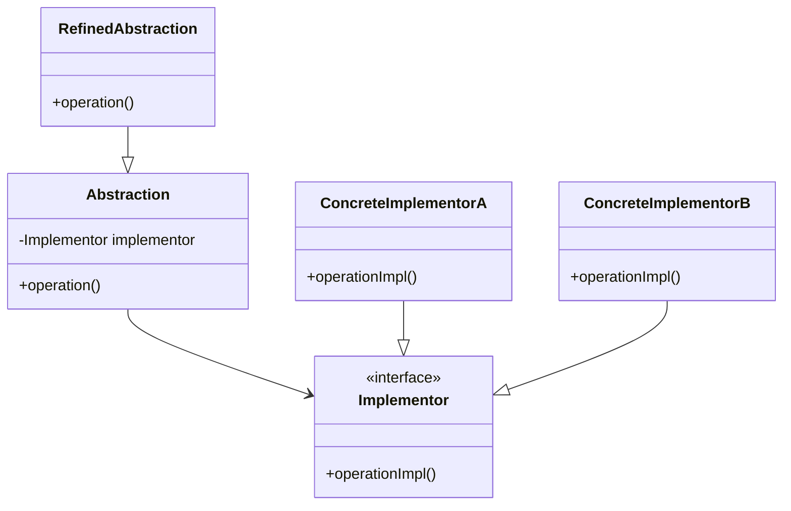

## 7.3.1 Implementing Bridge in Java

### Introduction

The **Bridge Pattern** is a structural design pattern that plays a crucial role in software architecture by decoupling an abstraction from its implementation, allowing both to evolve independently. This pattern is particularly useful when you want to avoid a permanent binding between an abstraction and its implementation, enabling flexibility and scalability in your codebase.

### Intent

The primary intent of the Bridge Pattern is to separate an abstraction from its implementation so that both can be modified independently. This separation allows for more flexible code that can adapt to changing requirements without necessitating significant rewrites.

### Applicability

The Bridge Pattern is applicable in scenarios where:

- You want to avoid a permanent binding between an abstraction and its implementation.
- Both the abstraction and its implementation should be extensible by subclassing.
- Changes in the implementation of an abstraction should not affect the client code.
- You need to share an implementation among multiple objects and hide the implementation details from the client.

### Key Components

The Bridge Pattern involves several key components:

- **Abstraction**: Defines the abstraction's interface and maintains a reference to an object of type `Implementor`.
- **RefinedAbstraction**: Extends the interface defined by `Abstraction`.
- **Implementor**: Defines the interface for implementation classes. This interface does not need to correspond directly to `Abstraction`'s interface; it can be entirely different.
- **ConcreteImplementor**: Implements the `Implementor` interface and provides concrete implementations.

### Structure

Below is a UML diagram illustrating the structure of the Bridge Pattern:



**Diagram Explanation**: The diagram shows how `Abstraction` maintains a reference to `Implementor`, allowing `RefinedAbstraction` to extend `Abstraction` and `ConcreteImplementor` classes to implement `Implementor`.

### Java Code Example

Let's explore a practical implementation of the Bridge Pattern in Java. Consider a scenario where we have different types of remote controls (abstractions) that can operate various devices (implementations).

#### Step 1: Define the Implementor Interface

```java
// Implementor Interface
interface Device {
    void turnOn();
    void turnOff();
    void setVolume(int volume);
}
```

#### Step 2: Create Concrete Implementors

```java
// Concrete Implementor A
class Television implements Device {
    private int volume;

    @Override
    public void turnOn() {
        System.out.println("Television is turned on.");
    }

    @Override
    public void turnOff() {
        System.out.println("Television is turned off.");
    }

    @Override
    public void setVolume(int volume) {
        this.volume = volume;
        System.out.println("Television volume set to " + this.volume);
    }
}

// Concrete Implementor B
class Radio implements Device {
    private int volume;

    @Override
    public void turnOn() {
        System.out.println("Radio is turned on.");
    }

    @Override
    public void turnOff() {
        System.out.println("Radio is turned off.");
    }

    @Override
    public void setVolume(int volume) {
        this.volume = volume;
        System.out.println("Radio volume set to " + this.volume);
    }
}
```

#### Step 3: Define the Abstraction

```java
// Abstraction
abstract class RemoteControl {
    protected Device device;

    public RemoteControl(Device device) {
        this.device = device;
    }

    public abstract void togglePower();
    public abstract void volumeUp();
    public abstract void volumeDown();
}
```

#### Step 4: Create Refined Abstractions

```java
// Refined Abstraction
class BasicRemoteControl extends RemoteControl {

    public BasicRemoteControl(Device device) {
        super(device);
    }

    @Override
    public void togglePower() {
        System.out.println("Toggling power.");
        // Assume some logic to check current state
        device.turnOn();
    }

    @Override
    public void volumeUp() {
        System.out.println("Increasing volume.");
        device.setVolume(10); // Simplified for demonstration
    }

    @Override
    public void volumeDown() {
        System.out.println("Decreasing volume.");
        device.setVolume(5); // Simplified for demonstration
    }
}
```

#### Step 5: Use the Bridge Pattern

```java
public class BridgePatternDemo {
    public static void main(String[] args) {
        Device tv = new Television();
        RemoteControl tvRemote = new BasicRemoteControl(tv);

        tvRemote.togglePower();
        tvRemote.volumeUp();

        Device radio = new Radio();
        RemoteControl radioRemote = new BasicRemoteControl(radio);

        radioRemote.togglePower();
        radioRemote.volumeDown();
    }
}
```

### Explanation

In this example, the `RemoteControl` class acts as the `Abstraction`, while `BasicRemoteControl` is the `RefinedAbstraction`. The `Device` interface is the `Implementor`, and `Television` and `Radio` are `ConcreteImplementors`. This setup allows the remote control to operate different devices without being tightly coupled to any specific device implementation.

### Benefits of Decoupling

The Bridge Pattern offers several benefits:

- **Flexibility**: By decoupling abstraction from implementation, you can easily extend both hierarchies without affecting each other.
- **Scalability**: New abstractions and implementations can be added independently, supporting the Open/Closed Principle.
- **Maintainability**: Changes in one part of the code do not necessitate changes in other parts, reducing the risk of introducing bugs.

### Supporting the Open/Closed Principle

The Bridge Pattern supports the Open/Closed Principle by allowing new abstractions and implementations to be added without modifying existing code. This is achieved by defining interfaces for both abstraction and implementation, enabling new classes to be added through subclassing.

### Real-World Scenarios

The Bridge Pattern is commonly used in GUI toolkits, where different look-and-feel implementations can be applied to the same set of widgets. It is also used in database drivers, where the same database interface can support multiple database engines.

### Related Patterns

The Bridge Pattern is related to the [Adapter Pattern]( "Adapter Pattern"), which also involves an interface between two classes. However, the Adapter Pattern is primarily used to make incompatible interfaces compatible, while the Bridge Pattern focuses on decoupling abstraction from implementation.

### Known Uses

The Java AWT (Abstract Window Toolkit) uses the Bridge Pattern to separate the abstraction of GUI components from their platform-specific implementations.

### Conclusion

The Bridge Pattern is a powerful tool for creating flexible and scalable software architectures. By decoupling abstraction from implementation, it allows developers to extend both hierarchies independently, supporting the Open/Closed Principle and enhancing maintainability.

---

## Test Your Knowledge: Bridge Pattern in Java Quiz



### What is the primary intent of the Bridge Pattern?

- [x] To decouple an abstraction from its implementation so that the two can vary independently.
- [ ] To provide a way to create objects without specifying the exact class of object that will be created.
- [ ] To define a family of algorithms, encapsulate each one, and make them interchangeable.
- [ ] To ensure a class has only one instance and provide a global point of access to it.

> **Explanation:** The Bridge Pattern's primary intent is to decouple an abstraction from its implementation, allowing both to vary independently.

### Which of the following is a key component of the Bridge Pattern?

- [x] Abstraction
- [ ] Singleton
- [ ] Factory
- [ ] Observer

> **Explanation:** The Bridge Pattern involves key components such as Abstraction, Implementor, RefinedAbstraction, and ConcreteImplementor.

### How does the Bridge Pattern support the Open/Closed Principle?

- [x] By allowing new abstractions and implementations to be added independently.
- [ ] By ensuring that a class has only one instance.
- [ ] By providing a way to create objects without specifying the exact class.
- [ ] By defining a family of algorithms and making them interchangeable.

> **Explanation:** The Bridge Pattern supports the Open/Closed Principle by allowing new abstractions and implementations to be added independently without modifying existing code.

### In the Bridge Pattern, what role does the `Implementor` play?

- [x] It defines the interface for implementation classes.
- [ ] It extends the interface defined by Abstraction.
- [ ] It provides concrete implementations of the Abstraction.
- [ ] It maintains a reference to an object of type Abstraction.

> **Explanation:** The `Implementor` defines the interface for implementation classes, allowing different implementations to be used interchangeably.

### Which of the following is a benefit of using the Bridge Pattern?

- [x] Flexibility
- [x] Scalability
- [ ] Increased coupling
- [ ] Reduced maintainability

> **Explanation:** The Bridge Pattern offers benefits such as flexibility and scalability by decoupling abstraction from implementation.

### What is the role of `ConcreteImplementor` in the Bridge Pattern?

- [x] It implements the `Implementor` interface and provides concrete implementations.
- [ ] It defines the interface for implementation classes.
- [ ] It extends the interface defined by Abstraction.
- [ ] It maintains a reference to an object of type Implementor.

> **Explanation:** The `ConcreteImplementor` implements the `Implementor` interface and provides concrete implementations for the methods defined in the interface.

### How does the Bridge Pattern differ from the Adapter Pattern?

- [x] The Bridge Pattern focuses on decoupling abstraction from implementation, while the Adapter Pattern makes incompatible interfaces compatible.
- [ ] The Bridge Pattern ensures a class has only one instance, while the Adapter Pattern provides a global point of access.
- [ ] The Bridge Pattern defines a family of algorithms, while the Adapter Pattern encapsulates each one.
- [ ] The Bridge Pattern provides a way to create objects without specifying the exact class, while the Adapter Pattern creates objects.

> **Explanation:** The Bridge Pattern focuses on decoupling abstraction from implementation, whereas the Adapter Pattern is used to make incompatible interfaces compatible.

### In the provided Java example, what role does `BasicRemoteControl` play?

- [x] RefinedAbstraction
- [ ] ConcreteImplementor
- [ ] Implementor
- [ ] Abstraction

> **Explanation:** `BasicRemoteControl` is the `RefinedAbstraction` that extends the interface defined by `Abstraction` and provides additional functionality.

### What is a common real-world use case for the Bridge Pattern?

- [x] GUI toolkits with different look-and-feel implementations.
- [ ] Ensuring a class has only one instance.
- [ ] Creating objects without specifying the exact class.
- [ ] Defining a family of algorithms and making them interchangeable.

> **Explanation:** A common real-world use case for the Bridge Pattern is in GUI toolkits, where different look-and-feel implementations can be applied to the same set of widgets.

### True or False: The Bridge Pattern allows for a permanent binding between an abstraction and its implementation.

- [ ] True
- [x] False

> **Explanation:** False. The Bridge Pattern is designed to avoid a permanent binding between an abstraction and its implementation, allowing both to vary independently.



By understanding and implementing the Bridge Pattern, Java developers can create more flexible and scalable applications, enhancing their ability to manage complex software architectures effectively.
