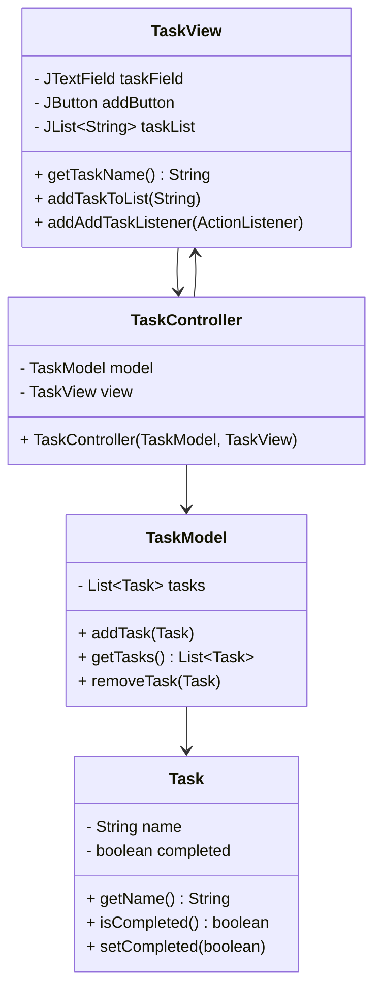

## 7.3.1 Implementing MVC in Java

The Model-View-Controller (MVC) pattern is a fundamental architectural pattern that promotes separation of concerns in software applications. By dividing an application into three interconnected components—Model, View, and Controller—MVC facilitates organized code, enhances maintainability, and supports scalability. In this section, we will explore how to implement MVC in Java, providing step-by-step guidance, code examples, and insights into handling data binding and event handling.

### Understanding MVC Components

Before diving into the implementation, let's briefly revisit the roles of each MVC component:

- **Model**: Represents the data and business logic of the application. It is responsible for managing the data, responding to requests for information, and updating the data when necessary.
- **View**: The user interface of the application. It displays data to the user and sends user commands to the controller.
- **Controller**: Acts as an intermediary between the Model and the View. It listens to the View, processes user input, and updates the Model.

### Step-by-Step Implementation of MVC in Java

Let's implement a simple Java application using the MVC pattern. We'll create a basic application to manage a list of tasks, demonstrating how each MVC component interacts.

#### Step 1: Setting Up the Model

The Model is responsible for managing the data. In our example, we'll create a `Task` class and a `TaskModel` class to manage a list of tasks.

```java
// Task.java
public class Task {
    private String name;
    private boolean completed;

    public Task(String name) {
        this.name = name;
        this.completed = false;
    }

    public String getName() {
        return name;
    }

    public boolean isCompleted() {
        return completed;
    }

    public void setCompleted(boolean completed) {
        this.completed = completed;
    }
}

// TaskModel.java
import java.util.ArrayList;
import java.util.List;

public class TaskModel {
    private List<Task> tasks;

    public TaskModel() {
        tasks = new ArrayList<>();
    }

    public void addTask(Task task) {
        tasks.add(task);
    }

    public List<Task> getTasks() {
        return tasks;
    }

    public void removeTask(Task task) {
        tasks.remove(task);
    }
}
```

In this setup, `Task` represents a single task, while `TaskModel` manages a list of tasks, providing methods to add, remove, and retrieve tasks.

#### Step 2: Creating the View

The View is responsible for displaying data to the user. We'll use Java Swing to create a simple user interface.

```java
// TaskView.java
import javax.swing.*;
import java.awt.*;
import java.awt.event.ActionListener;

public class TaskView extends JFrame {
    private JTextField taskField;
    private JButton addButton;
    private JList<String> taskList;
    private DefaultListModel<String> listModel;

    public TaskView() {
        setTitle("Task Manager");
        setSize(400, 300);
        setDefaultCloseOperation(JFrame.EXIT_ON_CLOSE);

        taskField = new JTextField(20);
        addButton = new JButton("Add Task");
        listModel = new DefaultListModel<>();
        taskList = new JList<>(listModel);

        JPanel panel = new JPanel();
        panel.setLayout(new FlowLayout());
        panel.add(taskField);
        panel.add(addButton);

        add(panel, BorderLayout.NORTH);
        add(new JScrollPane(taskList), BorderLayout.CENTER);
    }

    public String getTaskName() {
        return taskField.getText();
    }

    public void addTaskToList(String taskName) {
        listModel.addElement(taskName);
    }

    public void addAddTaskListener(ActionListener listener) {
        addButton.addActionListener(listener);
    }
}
```

The `TaskView` class creates a simple GUI with a text field for task input, an "Add Task" button, and a list to display tasks. It also provides methods to interact with the GUI components.

#### Step 3: Implementing the Controller

The Controller connects the Model and the View. It listens to user actions in the View and updates the Model accordingly.

```java
// TaskController.java
import java.awt.event.ActionEvent;
import java.awt.event.ActionListener;

public class TaskController {
    private TaskModel model;
    private TaskView view;

    public TaskController(TaskModel model, TaskView view) {
        this.model = model;
        this.view = view;

        this.view.addAddTaskListener(new AddTaskListener());
    }

    class AddTaskListener implements ActionListener {
        @Override
        public void actionPerformed(ActionEvent e) {
            String taskName = view.getTaskName();
            if (!taskName.isEmpty()) {
                Task task = new Task(taskName);
                model.addTask(task);
                view.addTaskToList(taskName);
            }
        }
    }
}
```

The `TaskController` class initializes the Model and the View, and sets up an `ActionListener` for the "Add Task" button. When the button is clicked, a new task is created and added to both the Model and the View.

#### Step 4: Integrating MVC Components

Now that we have our Model, View, and Controller, let's integrate them into a main application class.

```java
// TaskApp.java
public class TaskApp {
    public static void main(String[] args) {
        TaskModel model = new TaskModel();
        TaskView view = new TaskView();
        TaskController controller = new TaskController(model, view);

        view.setVisible(true);
    }
}
```

The `TaskApp` class initializes the MVC components and makes the View visible. This setup completes our basic MVC implementation.

### Handling Data Binding and Event Handling

In Java, data binding and event handling are crucial for maintaining synchronization between the Model and the View. JavaFX provides robust support for data binding, allowing properties in the Model to be directly bound to UI components in the View.

#### Data Binding with JavaFX

JavaFX simplifies data binding with its `Property` classes. Let's modify our `Task` class to use JavaFX properties.

```java
// Task.java (JavaFX)
import javafx.beans.property.SimpleStringProperty;
import javafx.beans.property.SimpleBooleanProperty;

public class Task {
    private SimpleStringProperty name;
    private SimpleBooleanProperty completed;

    public Task(String name) {
        this.name = new SimpleStringProperty(name);
        this.completed = new SimpleBooleanProperty(false);
    }

    public String getName() {
        return name.get();
    }

    public void setName(String name) {
        this.name.set(name);
    }

    public boolean isCompleted() {
        return completed.get();
    }

    public void setCompleted(boolean completed) {
        this.completed.set(completed);
    }

    public SimpleStringProperty nameProperty() {
        return name;
    }

    public SimpleBooleanProperty completedProperty() {
        return completed;
    }
}
```

With JavaFX properties, you can bind UI components directly to the Model, ensuring that changes in the Model automatically update the View.

#### Event Handling in JavaFX

JavaFX also provides a streamlined approach to event handling. Let's update our View to use JavaFX.

```java
// TaskView.java (JavaFX)
import javafx.application.Application;
import javafx.scene.Scene;
import javafx.scene.control.*;
import javafx.scene.layout.VBox;
import javafx.stage.Stage;

public class TaskView extends Application {
    private TextField taskField;
    private Button addButton;
    private ListView<String> taskList;

    @Override
    public void start(Stage primaryStage) {
        taskField = new TextField();
        addButton = new Button("Add Task");
        taskList = new ListView<>();

        VBox vbox = new VBox(taskField, addButton, taskList);
        Scene scene = new Scene(vbox, 400, 300);

        primaryStage.setScene(scene);
        primaryStage.setTitle("Task Manager");
        primaryStage.show();
    }

    public String getTaskName() {
        return taskField.getText();
    }

    public void addTaskToList(String taskName) {
        taskList.getItems().add(taskName);
    }

    public Button getAddButton() {
        return addButton;
    }
}
```

In this JavaFX version, we use a `ListView` to display tasks and a `Button` for adding tasks. The `TaskView` class extends `Application`, allowing it to be launched as a JavaFX application.

### Using MVC Frameworks in Java

Several frameworks support MVC in Java, including JavaFX and Swing, as demonstrated. Another popular option is Spring MVC, which is widely used for web applications.

#### Spring MVC Overview

Spring MVC is a framework for building web applications using the MVC pattern. It provides a comprehensive set of features for handling web requests, data binding, and validation.

- **Model**: Typically represented by Java objects or POJOs.
- **View**: Usually implemented with JSP, Thymeleaf, or other templating engines.
- **Controller**: Handles web requests and returns a view name.

#### Implementing a Simple Spring MVC Application

Let's create a simple Spring MVC application to manage tasks.

1. **Set Up Spring Boot Project**

   Use Spring Initializr to create a new Spring Boot project with dependencies for Spring Web and Thymeleaf.

2. **Create the Model**

   Define a `Task` class similar to our previous examples.

3. **Create the Controller**

   ```java
   // TaskController.java (Spring MVC)
   import org.springframework.stereotype.Controller;
   import org.springframework.ui.Model;
   import org.springframework.web.bind.annotation.GetMapping;
   import org.springframework.web.bind.annotation.PostMapping;
   import org.springframework.web.bind.annotation.RequestParam;

   import java.util.ArrayList;
   import java.util.List;

   @Controller
   public class TaskController {
       private List<Task> tasks = new ArrayList<>();

       @GetMapping("/")
       public String viewTasks(Model model) {
           model.addAttribute("tasks", tasks);
           return "taskView";
       }

       @PostMapping("/addTask")
       public String addTask(@RequestParam("taskName") String taskName) {
           tasks.add(new Task(taskName));
           return "redirect:/";
       }
   }
   ```

   The `TaskController` class handles HTTP GET and POST requests, managing tasks and updating the view.

4. **Create the View**

   Use Thymeleaf to create a simple HTML page for displaying and adding tasks.

   ```html
   <!-- taskView.html -->
   <!DOCTYPE html>
   <html xmlns:th="http://www.thymeleaf.org">
   <head>
       <title>Task Manager</title>
   </head>
   <body>
       <h1>Task Manager</h1>
       <form action="#" th:action="@{/addTask}" method="post">
           <input type="text" name="taskName" placeholder="Enter task name" required>
           <button type="submit">Add Task</button>
       </form>
       <ul>
           <li th:each="task : ${tasks}" th:text="${task.name}"></li>
       </ul>
   </body>
   </html>
   ```

   This Thymeleaf template displays tasks and provides a form for adding new tasks.

### Common Challenges and Solutions

Implementing MVC in Java can present several challenges. Here are some common issues and how to address them:

- **Complex Data Binding**: Use frameworks like JavaFX or Spring MVC, which offer robust data binding features.
- **Event Handling**: Ensure that event listeners are properly registered and managed to avoid memory leaks.
- **Separation of Concerns**: Maintain clear boundaries between Model, View, and Controller to prevent code from becoming entangled.

### Visualizing MVC in Java

To better understand the interaction between MVC components, let's visualize the architecture using a class diagram.



### Try It Yourself

Experiment with the code examples provided:

- **Modify the Task Model**: Add additional properties to the `Task` class, such as a due date or priority, and update the View and Controller accordingly.
- **Enhance the View**: Use JavaFX to create a more interactive and visually appealing UI.
- **Extend Functionality**: Implement additional features, such as editing or deleting tasks, and observe how the MVC pattern facilitates these changes.

### Conclusion

Implementing the MVC pattern in Java applications enhances code organization, maintainability, and scalability. By clearly separating concerns, developers can focus on individual components without affecting the entire system. Whether using JavaFX, Swing, or Spring MVC, the MVC pattern remains a powerful tool for building robust Java applications.

## Quiz Time!



### What is the primary role of the Model in the MVC pattern?

- [x] To manage the data and business logic of the application.
- [ ] To display data to the user.
- [ ] To handle user input and update the view.
- [ ] To act as an intermediary between the Model and the View.

> **Explanation:** The Model is responsible for managing the data and business logic of the application.

### Which Java framework is commonly used for implementing MVC in web applications?

- [ ] JavaFX
- [x] Spring MVC
- [ ] Swing
- [ ] JavaBeans

> **Explanation:** Spring MVC is a popular framework for implementing MVC in web applications.

### In the MVC pattern, which component is responsible for updating the Model based on user input?

- [ ] Model
- [ ] View
- [x] Controller
- [ ] Service

> **Explanation:** The Controller handles user input and updates the Model accordingly.

### Which JavaFX class is used for data binding in the Model?

- [ ] JTextField
- [x] SimpleStringProperty
- [ ] JButton
- [ ] JFrame

> **Explanation:** JavaFX uses `SimpleStringProperty` for data binding in the Model.

### What is the advantage of using JavaFX properties in the Model?

- [x] They allow direct binding to UI components.
- [ ] They simplify event handling.
- [ ] They enhance the visual appearance of the application.
- [ ] They reduce the need for controllers.

> **Explanation:** JavaFX properties allow direct binding to UI components, ensuring synchronization between the Model and the View.

### What is a common challenge when implementing MVC in Java?

- [ ] Lack of frameworks
- [ ] Complex data binding
- [ ] Limited event handling capabilities
- [x] All of the above

> **Explanation:** Implementing MVC in Java can present challenges such as complex data binding and event handling.

### Which component in the MVC pattern is responsible for displaying data to the user?

- [ ] Model
- [x] View
- [ ] Controller
- [ ] Service

> **Explanation:** The View is responsible for displaying data to the user.

### What is the purpose of the `TaskController` class in the provided code example?

- [x] To connect the Model and the View and handle user actions.
- [ ] To manage the list of tasks.
- [ ] To display tasks to the user.
- [ ] To store task data.

> **Explanation:** The `TaskController` connects the Model and the View and handles user actions.

### How does Spring MVC handle web requests?

- [ ] By using JavaFX properties
- [x] Through controllers that map HTTP requests to handler methods
- [ ] By directly manipulating the Model
- [ ] By using Swing components

> **Explanation:** Spring MVC handles web requests through controllers that map HTTP requests to handler methods.

### True or False: In the MVC pattern, the View directly modifies the Model.

- [ ] True
- [x] False

> **Explanation:** In the MVC pattern, the View does not directly modify the Model; the Controller handles updates to the Model.


