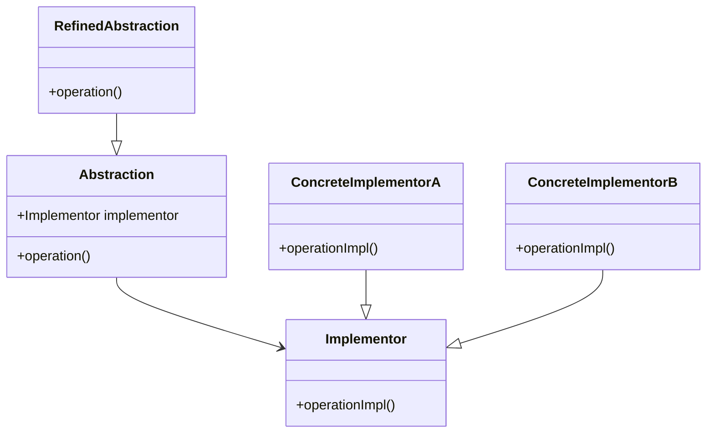

## 7.3.2 Decoupling Abstraction and Implementation

### Introduction

In the realm of software design, one of the most critical challenges is managing the complexity that arises from tightly coupled code. When abstraction is tightly bound to its implementation, any change in the implementation necessitates changes in the abstraction, leading to a fragile and difficult-to-maintain system. The **Bridge Pattern**, a structural design pattern, offers a solution by decoupling abstraction from implementation, allowing them to vary independently. This section delves into the intricacies of this pattern, illustrating its significance in creating robust and flexible Java applications.

### The Problem with Tight Coupling

Tightly coupled systems are characterized by a strong dependency between abstraction and implementation. This coupling can lead to several issues:

- **Limited Flexibility**: Changes in the implementation often require changes in the abstraction, making the system rigid and difficult to modify.
- **Class Explosion**: Using inheritance to extend functionality can lead to an exponential increase in the number of classes, as each combination of abstraction and implementation requires a new subclass.
- **Difficult Maintenance**: As the system grows, maintaining and understanding the codebase becomes increasingly challenging due to the intertwined nature of abstraction and implementation.

#### Example: Class Explosion with Inheritance

Consider a scenario where you need to create a drawing application that supports different shapes (e.g., Circle, Square) and rendering methods (e.g., Vector, Raster). Using inheritance alone, you might end up with a class hierarchy like this:

```java
// Base class for all shapes
abstract class Shape {
    abstract void draw();
}

// Circle with Vector rendering
class VectorCircle extends Shape {
    @Override
    void draw() {
        System.out.println("Drawing Circle as Vector");
    }
}

// Circle with Raster rendering
class RasterCircle extends Shape {
    @Override
    void draw() {
        System.out.println("Drawing Circle as Raster");
    }
}

// Square with Vector rendering
class VectorSquare extends Shape {
    @Override
    void draw() {
        System.out.println("Drawing Square as Vector");
    }
}

// Square with Raster rendering
class RasterSquare extends Shape {
    @Override
    void draw() {
        System.out.println("Drawing Square as Raster");
    }
}
```

In this example, adding a new shape or rendering method requires creating additional subclasses, leading to a combinatorial explosion of classes.

### The Bridge Pattern: A Solution

The Bridge Pattern addresses these issues by separating abstraction from implementation, using composition instead of inheritance. This separation allows both abstraction and implementation to evolve independently, enhancing flexibility and reducing class proliferation.

#### Structure of the Bridge Pattern

The Bridge Pattern involves two main components:

- **Abstraction**: Defines the abstraction's interface and maintains a reference to the implementor.
- **Implementor**: Defines the interface for implementation classes. Concrete implementors provide specific implementations.



*Diagram: The Bridge Pattern structure, illustrating the separation of abstraction and implementation.*

#### Implementing the Bridge Pattern in Java

Let's revisit the drawing application example and apply the Bridge Pattern to decouple shape abstraction from rendering implementation.

```java
// Implementor interface
interface Renderer {
    void render(String shape);
}

// Concrete Implementor A
class VectorRenderer implements Renderer {
    @Override
    public void render(String shape) {
        System.out.println("Rendering " + shape + " as Vector");
    }
}

// Concrete Implementor B
class RasterRenderer implements Renderer {
    @Override
    public void render(String shape) {
        System.out.println("Rendering " + shape + " as Raster");
    }
}

// Abstraction
abstract class Shape {
    protected Renderer renderer;

    public Shape(Renderer renderer) {
        this.renderer = renderer;
    }

    abstract void draw();
}

// Refined Abstraction
class Circle extends Shape {
    public Circle(Renderer renderer) {
        super(renderer);
    }

    @Override
    void draw() {
        renderer.render("Circle");
    }
}

// Refined Abstraction
class Square extends Shape {
    public Square(Renderer renderer) {
        super(renderer);
    }

    @Override
    void draw() {
        renderer.render("Square");
    }
}

// Client code
public class BridgePatternDemo {
    public static void main(String[] args) {
        Shape vectorCircle = new Circle(new VectorRenderer());
        Shape rasterSquare = new Square(new RasterRenderer());

        vectorCircle.draw();  // Output: Rendering Circle as Vector
        rasterSquare.draw();  // Output: Rendering Square as Raster
    }
}
```

*Code Explanation*: In this implementation, `Renderer` acts as the implementor interface, with `VectorRenderer` and `RasterRenderer` as concrete implementors. `Shape` is the abstraction, and `Circle` and `Square` are refined abstractions. This setup allows you to mix and match shapes and rendering methods without creating a new class for each combination.

### Benefits of Decoupling Abstraction and Implementation

1. **Enhanced Flexibility**: By decoupling abstraction from implementation, the Bridge Pattern allows you to change either independently. You can add new shapes or rendering methods without affecting existing code.

2. **Improved Maintainability**: The separation of concerns makes the codebase easier to understand and maintain. Changes in one part of the system do not ripple through the entire codebase.

3. **Reduced Class Explosion**: The use of composition over inheritance minimizes the number of classes, simplifying the class hierarchy and reducing complexity.

4. **Increased Extensibility**: The pattern supports the open/closed principle, allowing the system to be extended with new functionality without modifying existing code.

### Practical Applications and Real-World Scenarios

The Bridge Pattern is particularly useful in scenarios where:

- You need to support multiple variants of an abstraction and implementation.
- You anticipate frequent changes in both abstraction and implementation.
- You want to avoid a rigid class hierarchy and promote flexibility.

#### Real-World Example: GUI Frameworks

Consider a GUI framework that needs to support multiple platforms (e.g., Windows, macOS, Linux) and different UI components (e.g., buttons, text fields). The Bridge Pattern can be used to separate the platform-specific rendering logic from the UI component abstraction, allowing the framework to support new platforms or components with minimal changes.

### Historical Context and Evolution

The Bridge Pattern, part of the "Gang of Four" design patterns, was introduced in the seminal book "Design Patterns: Elements of Reusable Object-Oriented Software" by Erich Gamma, Richard Helm, Ralph Johnson, and John Vlissides. The pattern has evolved to accommodate modern programming paradigms, such as dependency injection and interface-based design, making it a staple in contemporary software architecture.

### Common Pitfalls and How to Avoid Them

- **Over-Engineering**: Avoid using the Bridge Pattern when a simpler solution suffices. The pattern introduces additional complexity, which may not be justified for small or straightforward systems.
- **Misidentifying Abstraction and Implementation**: Clearly define the boundaries between abstraction and implementation to ensure the pattern is applied correctly.
- **Ignoring Performance Considerations**: While the Bridge Pattern promotes flexibility, it may introduce a slight performance overhead due to the additional layer of indirection. Evaluate the trade-offs in performance-sensitive applications.

### Exercises and Practice Problems

1. **Exercise**: Implement a media player application using the Bridge Pattern, where the abstraction is the media player and the implementation is the media format (e.g., MP3, MP4, WAV).

2. **Challenge**: Extend the drawing application to support new shapes (e.g., Triangle) and rendering methods (e.g., 3D rendering). Analyze how the Bridge Pattern facilitates these extensions.

3. **Reflection**: Consider a project you are currently working on. Identify areas where abstraction and implementation are tightly coupled and explore how the Bridge Pattern could improve the design.

### Key Takeaways

- The Bridge Pattern is a powerful tool for decoupling abstraction from implementation, promoting flexibility and maintainability.
- By using composition over inheritance, the pattern reduces class explosion and simplifies the class hierarchy.
- The pattern is widely applicable in scenarios requiring support for multiple variants and frequent changes.

### Conclusion

Decoupling abstraction from implementation is a cornerstone of effective software design. The Bridge Pattern provides a structured approach to achieving this separation, enabling developers to create adaptable and resilient systems. By mastering this pattern, Java developers and software architects can enhance their ability to design robust applications that stand the test of time.

---

## Test Your Knowledge: Mastering the Bridge Pattern in Java



### What is the primary benefit of using the Bridge Pattern?

- [x] It decouples abstraction from implementation, allowing them to vary independently.
- [ ] It simplifies the code by using inheritance.
- [ ] It increases the number of classes in the system.
- [ ] It improves performance by reducing method calls.

> **Explanation:** The Bridge Pattern decouples abstraction from implementation, allowing both to vary independently, which enhances flexibility and maintainability.

### How does the Bridge Pattern help in reducing class explosion?

- [x] By using composition instead of inheritance.
- [ ] By creating more subclasses.
- [ ] By merging abstraction and implementation into a single class.
- [ ] By eliminating the need for interfaces.

> **Explanation:** The Bridge Pattern uses composition over inheritance, which reduces the need for numerous subclasses and minimizes class explosion.

### In the Bridge Pattern, what role does the Implementor play?

- [x] It defines the interface for implementation classes.
- [ ] It acts as the main abstraction.
- [ ] It provides the user interface for the application.
- [ ] It manages the lifecycle of objects.

> **Explanation:** The Implementor defines the interface for implementation classes, allowing different implementations to be used interchangeably.

### Which of the following is a potential drawback of the Bridge Pattern?

- [x] It may introduce a slight performance overhead due to additional indirection.
- [ ] It tightly couples abstraction and implementation.
- [ ] It increases the number of subclasses.
- [ ] It restricts the flexibility of the system.

> **Explanation:** The Bridge Pattern may introduce a slight performance overhead due to the additional layer of indirection between abstraction and implementation.

### What is a common pitfall when applying the Bridge Pattern?

- [x] Over-engineering the solution when a simpler approach would suffice.
- [ ] Using inheritance instead of composition.
- [ ] Ignoring the need for abstraction.
- [ ] Focusing solely on performance.

> **Explanation:** A common pitfall is over-engineering the solution by applying the Bridge Pattern when a simpler approach would suffice, adding unnecessary complexity.

### Which design principle does the Bridge Pattern support?

- [x] Open/Closed Principle
- [ ] Single Responsibility Principle
- [ ] Law of Demeter
- [ ] YAGNI (You Aren't Gonna Need It)

> **Explanation:** The Bridge Pattern supports the Open/Closed Principle by allowing the system to be extended with new functionality without modifying existing code.

### How does the Bridge Pattern improve maintainability?

- [x] By separating concerns and allowing changes in one part without affecting others.
- [ ] By merging abstraction and implementation into a single class.
- [ ] By reducing the number of classes.
- [ ] By eliminating the need for interfaces.

> **Explanation:** The Bridge Pattern improves maintainability by separating concerns, allowing changes in one part of the system without affecting others.

### In which scenario is the Bridge Pattern particularly useful?

- [x] When you need to support multiple variants of an abstraction and implementation.
- [ ] When you have a single, fixed implementation.
- [ ] When performance is the primary concern.
- [ ] When you want to eliminate all interfaces.

> **Explanation:** The Bridge Pattern is particularly useful when you need to support multiple variants of an abstraction and implementation, allowing them to vary independently.

### What is the historical significance of the Bridge Pattern?

- [x] It was introduced in the "Gang of Four" design patterns book.
- [ ] It was developed for real-time systems.
- [ ] It was created to replace all other design patterns.
- [ ] It was designed for procedural programming languages.

> **Explanation:** The Bridge Pattern was introduced in the "Gang of Four" design patterns book, which is a seminal work in the field of software design patterns.

### True or False: The Bridge Pattern is only applicable in object-oriented programming languages.

- [x] True
- [ ] False

> **Explanation:** The Bridge Pattern is primarily applicable in object-oriented programming languages, where abstraction and implementation can be effectively separated.



---
