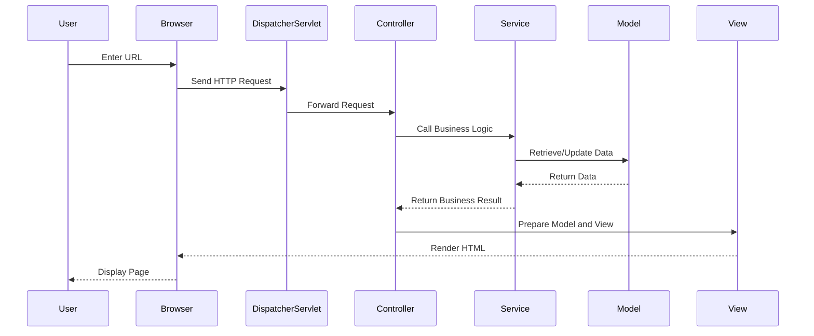

## 7.3.2 MVC in Web Frameworks

The Model-View-Controller (MVC) pattern is a cornerstone of web application architecture, providing a structured approach to building applications by separating concerns. In this section, we will delve into how MVC is implemented in web frameworks, with a particular focus on Spring MVC, a popular Java framework. We'll explore configuring controllers, defining views, managing models, and leveraging annotations and conventions to simplify development. We'll also provide best practices for building scalable and maintainable web applications using MVC.

### Understanding MVC in Web Frameworks

The MVC pattern divides an application into three interconnected components:

- **Model**: Represents the application's data and business logic. It directly manages the data, logic, and rules of the application.
- **View**: Displays data to the user and sends user commands to the controller. It is responsible for rendering the model's data.
- **Controller**: Acts as an interface between Model and View components. It processes user input, interacts with the model, and renders the final output.

This separation allows for modular development, where each component can be developed independently, promoting code reuse and maintainability.

### Implementing MVC with Spring MVC

Spring MVC is a powerful framework that simplifies the development of web applications by providing a comprehensive infrastructure for building MVC-based applications. It uses a dispatcher servlet to route requests to appropriate controllers, which then interact with models and views.

#### Configuring Controllers

Controllers in Spring MVC are responsible for handling user requests and returning the appropriate response. They are typically annotated with `@Controller` to indicate their role.

```java
import org.springframework.stereotype.Controller;
import org.springframework.web.bind.annotation.GetMapping;
import org.springframework.web.bind.annotation.RequestMapping;
import org.springframework.web.servlet.ModelAndView;

@Controller
@RequestMapping("/greeting")
public class GreetingController {

    @GetMapping
    public ModelAndView showGreeting() {
        ModelAndView modelAndView = new ModelAndView("greeting");
        modelAndView.addObject("message", "Hello, World!");
        return modelAndView;
    }
}
```

**Explanation**: In this example, the `GreetingController` handles HTTP GET requests to the `/greeting` URL. It returns a `ModelAndView` object that specifies the view name (`greeting`) and adds a message to the model.

#### Defining Views

Views in Spring MVC are typically JSP files, Thymeleaf templates, or other view technologies. They are responsible for rendering the model data to the user.

For a JSP view, you might have a file named `greeting.jsp`:

```jsp
<%@ taglib uri="http://java.sun.com/jsp/jstl/core" prefix="c" %>
<html>
<head>
    <title>Greeting</title>
</head>
<body>
    <h1>${message}</h1>
</body>
</html>
```

**Explanation**: The JSP file uses JSTL to display the message from the model. The `${message}` expression is resolved to the value added to the model in the controller.

#### Managing Models

Models in Spring MVC are typically simple Java objects (POJOs) that hold data to be displayed by the view. They are often passed to the view via the `ModelAndView` object or `@ModelAttribute`.

```java
import org.springframework.stereotype.Controller;
import org.springframework.ui.Model;
import org.springframework.web.bind.annotation.GetMapping;

@Controller
public class UserController {

    @GetMapping("/user")
    public String getUser(Model model) {
        User user = new User("John", "Doe");
        model.addAttribute("user", user);
        return "userProfile";
    }
}
```

**Explanation**: Here, the `UserController` adds a `User` object to the model, which can then be accessed in the `userProfile` view.

### The Role of Annotations and Conventions

Spring MVC leverages annotations to simplify configuration and reduce boilerplate code. Some key annotations include:

- `@Controller`: Marks a class as a Spring MVC controller.
- `@RequestMapping`: Maps HTTP requests to handler methods.
- `@GetMapping`, `@PostMapping`, etc.: Specialized annotations for HTTP methods.
- `@ModelAttribute`: Binds a method parameter or method return value to a named model attribute.
- `@ResponseBody`: Indicates that the return value of a method should be bound to the web response body.

These annotations, combined with Spring's convention-over-configuration approach, streamline the development process by minimizing the need for explicit configuration.

### Request Handling and View Rendering

Spring MVC's request handling is centered around the `DispatcherServlet`, which acts as the front controller. It routes requests to appropriate handlers based on URL patterns and annotations.

```java
import org.springframework.web.bind.annotation.RestController;
import org.springframework.web.bind.annotation.GetMapping;

@RestController
public class ApiController {

    @GetMapping("/api/data")
    public Data getData() {
        return new Data("Sample Data");
    }
}
```

**Explanation**: In this example, the `ApiController` uses `@RestController`, which combines `@Controller` and `@ResponseBody`, to handle RESTful web service requests. The `getData` method returns a `Data` object that is automatically converted to JSON.

### Best Practices for Scalable and Maintainable MVC Applications

1. **Separation of Concerns**: Ensure that each component (Model, View, Controller) has a single responsibility. Avoid business logic in controllers or views.

2. **Use of Services**: Encapsulate business logic in service classes, which can be reused across multiple controllers.

3. **Consistent Naming Conventions**: Follow consistent naming conventions for controllers, models, and views to improve readability and maintainability.

4. **Validation and Error Handling**: Implement robust validation and error handling mechanisms to ensure data integrity and user-friendly error messages.

5. **Security Considerations**: Use Spring Security to protect your application from common security threats like CSRF, XSS, and SQL injection.

6. **Testing**: Write unit and integration tests for your controllers, services, and models to ensure correctness and facilitate refactoring.

7. **Performance Optimization**: Use caching, lazy loading, and other performance optimization techniques to improve application responsiveness.

### Visualizing MVC in Spring Framework

To better understand the flow of data and control in an MVC application, let's visualize the interaction between components using a sequence diagram.



**Explanation**: This diagram illustrates the typical flow of a request in a Spring MVC application. The `DispatcherServlet` routes the request to the appropriate controller, which interacts with the service and model layers to process the request and prepare the view.

### Try It Yourself

To deepen your understanding, try modifying the provided code examples:

- Change the URL mappings and observe how the application behavior changes.
- Add new fields to the `User` model and update the view to display them.
- Implement a new controller method to handle POST requests and update the model.

### References and Further Reading

- [Spring MVC Documentation](https://docs.spring.io/spring-framework/docs/current/reference/html/web.html)
- [Thymeleaf Documentation](https://www.thymeleaf.org/documentation.html)
- [Spring Boot Reference Guide](https://docs.spring.io/spring-boot/docs/current/reference/htmlsingle/)

### Knowledge Check

Before moving on, consider these questions:

- How does the `DispatcherServlet` facilitate request handling in Spring MVC?
- What are the benefits of using annotations in Spring MVC?
- How can you ensure that your MVC application is scalable and maintainable?

### Embrace the Journey

Remember, mastering MVC in web frameworks is a journey. As you progress, you'll build more complex and interactive web applications. Keep experimenting, stay curious, and enjoy the journey!

## Quiz Time!



### What is the primary role of the Controller in the MVC pattern?

- [x] To handle user input and update the model
- [ ] To display data to the user
- [ ] To manage the application's data
- [ ] To store business logic

> **Explanation:** The Controller in MVC handles user input, interacts with the model, and updates the view.

### Which annotation is used to mark a class as a controller in Spring MVC?

- [x] @Controller
- [ ] @Service
- [ ] @Repository
- [ ] @Component

> **Explanation:** The `@Controller` annotation is used to mark a class as a controller in Spring MVC.

### What is the purpose of the `ModelAndView` object in Spring MVC?

- [x] To hold both the model data and the view name
- [ ] To store only the view name
- [ ] To store only the model data
- [ ] To manage HTTP requests

> **Explanation:** `ModelAndView` in Spring MVC holds both the model data and the view name.

### How does Spring MVC simplify configuration?

- [x] By using annotations and conventions
- [ ] By requiring XML configuration
- [ ] By using only Java code
- [ ] By using external libraries

> **Explanation:** Spring MVC simplifies configuration through the use of annotations and conventions.

### Which component in MVC is responsible for rendering the data?

- [x] View
- [ ] Controller
- [ ] Model
- [ ] Service

> **Explanation:** The View component is responsible for rendering data to the user.

### What is the function of the `DispatcherServlet` in Spring MVC?

- [x] To route requests to the appropriate controllers
- [ ] To manage database connections
- [ ] To render views
- [ ] To handle business logic

> **Explanation:** The `DispatcherServlet` routes requests to the appropriate controllers in Spring MVC.

### Which of the following is a best practice for building scalable MVC applications?

- [x] Use of services to encapsulate business logic
- [ ] Include business logic in views
- [ ] Use only one controller for all requests
- [ ] Avoid using annotations

> **Explanation:** Encapsulating business logic in services is a best practice for building scalable MVC applications.

### What is a common view technology used in Spring MVC?

- [x] JSP
- [ ] JavaFX
- [ ] Swing
- [ ] AWT

> **Explanation:** JSP is a common view technology used in Spring MVC.

### How can you enhance the performance of a Spring MVC application?

- [x] By using caching and lazy loading
- [ ] By avoiding the use of models
- [ ] By using only synchronous requests
- [ ] By minimizing the use of controllers

> **Explanation:** Performance can be enhanced by using caching and lazy loading techniques.

### True or False: The `@RestController` annotation in Spring MVC combines `@Controller` and `@ResponseBody`.

- [x] True
- [ ] False

> **Explanation:** The `@RestController` annotation combines `@Controller` and `@ResponseBody` to simplify RESTful web service development.


