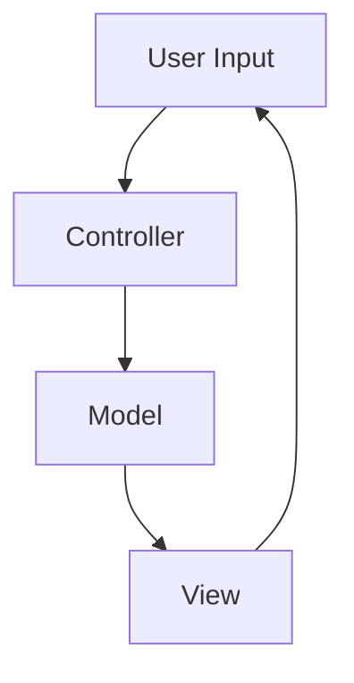

## 7.3.3 Use Cases and Examples

The Model-View-Controller (MVC) pattern is a cornerstone of software architecture, especially in Java development. It separates an application into three interconnected components: Model, View, and Controller. This separation facilitates modular development, making applications easier to manage and scale. In this section, we will delve into real-world applications of the MVC pattern in both web and GUI contexts, highlighting its benefits and providing code examples to illustrate its implementation.

### Real-World Applications of MVC

#### Web Applications

Web applications are perhaps the most common domain where MVC is applied. The separation of concerns that MVC provides is particularly beneficial in web development, where the user interface and business logic often need to be decoupled for better maintainability and scalability.

##### Case Study: E-commerce Platforms

E-commerce platforms like Amazon and eBay handle complex interactions between users and the system. They require a robust architecture to manage user data, product catalogs, and transactions efficiently. Here's how MVC can be applied:

- **Model**: Represents the data and business logic. In an e-commerce application, this includes user accounts, product information, and order processing.
- **View**: The user interface that displays data to the user. This could be HTML pages rendered by a web server or dynamic content generated by JavaScript.
- **Controller**: Handles user input and updates the Model and View accordingly. It processes requests, invokes business logic, and determines which View to render.

**Benefits**:
- **Scalability**: By separating the business logic from the user interface, developers can scale each component independently.
- **Maintainability**: Changes in the user interface do not affect the business logic, and vice versa, making updates and maintenance easier.

**Example**:

```java
// Model
public class Product {
    private String id;
    private String name;
    private double price;

    // Getters and setters
}

// View
public class ProductView {
    public void printProductDetails(String productName, double productPrice) {
        System.out.println("Product: " + productName);
        System.out.println("Price: $" + productPrice);
    }
}

// Controller
public class ProductController {
    private Product model;
    private ProductView view;

    public ProductController(Product model, ProductView view) {
        this.model = model;
        this.view = view;
    }

    public void setProductName(String name) {
        model.setName(name);
    }

    public String getProductName() {
        return model.getName();
    }

    public void updateView() {
        view.printProductDetails(model.getName(), model.getPrice());
    }
}

// Main
public class MVCPatternDemo {
    public static void main(String[] args) {
        Product model = new Product();
        model.setName("Laptop");
        model.setPrice(1500.00);

        ProductView view = new ProductView();
        ProductController controller = new ProductController(model, view);

        controller.updateView();
    }
}
```

In this example, the `Product` class represents the Model, the `ProductView` class represents the View, and the `ProductController` class acts as the Controller. This separation allows developers to modify the way products are displayed without altering the underlying data structure.

##### Case Study: Social Media Platforms

Social media platforms like Facebook and Twitter also benefit from the MVC architecture. These platforms need to handle a large number of user interactions and data updates in real-time.

- **Model**: Manages user data, posts, comments, and likes.
- **View**: Displays the user interface, which includes timelines, profiles, and notifications.
- **Controller**: Responds to user actions like posting a comment or liking a post.

**Benefits**:
- **Real-time Updates**: MVC allows for efficient handling of real-time data updates, which is crucial for social media platforms.
- **User Experience**: By separating concerns, developers can focus on enhancing the user experience without worrying about the underlying data management.

**Example**:

```java
// Model
public class Post {
    private String content;
    private String author;

    // Getters and setters
}

// View
public class PostView {
    public void displayPost(String author, String content) {
        System.out.println(author + ": " + content);
    }
}

// Controller
public class PostController {
    private Post model;
    private PostView view;

    public PostController(Post model, PostView view) {
        this.model = model;
        this.view = view;
    }

    public void setPostContent(String content) {
        model.setContent(content);
    }

    public void updateView() {
        view.displayPost(model.getAuthor(), model.getContent());
    }
}

// Main
public class SocialMediaApp {
    public static void main(String[] args) {
        Post model = new Post();
        model.setAuthor("Alice");
        model.setContent("Hello, world!");

        PostView view = new PostView();
        PostController controller = new PostController(model, view);

        controller.updateView();
    }
}
```

In this example, the `Post` class represents the Model, the `PostView` class represents the View, and the `PostController` class acts as the Controller. This setup ensures that changes in the user interface do not affect the data model.

#### GUI Applications

MVC is not limited to web applications; it is also widely used in desktop GUI applications. The pattern helps in organizing code for applications with complex user interfaces.

##### Case Study: Desktop Publishing Software

Desktop publishing software like Adobe InDesign requires a sophisticated architecture to manage documents, layouts, and user interactions.

- **Model**: Manages document data, including text, images, and formatting.
- **View**: Renders the document on the screen, allowing users to interact with it.
- **Controller**: Handles user inputs such as mouse clicks and keyboard events, updating the Model and View accordingly.

**Benefits**:
- **Complex UI Management**: MVC allows developers to manage complex user interfaces more effectively by separating the data and presentation layers.
- **Flexibility**: Developers can easily add new features or modify existing ones without disrupting the entire application.

**Example**:

```java
// Model
public class Document {
    private String text;

    // Getters and setters
}

// View
public class DocumentView {
    public void displayDocument(String text) {
        System.out.println("Document: " + text);
    }
}

// Controller
public class DocumentController {
    private Document model;
    private DocumentView view;

    public DocumentController(Document model, DocumentView view) {
        this.model = model;
        this.view = view;
    }

    public void setDocumentText(String text) {
        model.setText(text);
    }

    public void updateView() {
        view.displayDocument(model.getText());
    }
}

// Main
public class DesktopPublishingApp {
    public static void main(String[] args) {
        Document model = new Document();
        model.setText("Welcome to the desktop publishing software!");

        DocumentView view = new DocumentView();
        DocumentController controller = new DocumentController(model, view);

        controller.updateView();
    }
}
```

In this example, the `Document` class represents the Model, the `DocumentView` class represents the View, and the `DocumentController` class acts as the Controller. This separation allows for a clean and organized codebase, making it easier to manage complex interactions.

##### Case Study: Financial Applications

Financial applications, such as trading platforms, require real-time data processing and user interactions. MVC helps in managing these requirements effectively.

- **Model**: Manages financial data, including stocks, transactions, and user portfolios.
- **View**: Displays data to users in the form of charts, tables, and dashboards.
- **Controller**: Handles user inputs like buying or selling stocks, updating the Model and View accordingly.

**Benefits**:
- **Real-time Data Processing**: MVC facilitates efficient handling of real-time data updates, which is crucial for financial applications.
- **User Interaction**: By separating concerns, developers can focus on improving user interaction without affecting the underlying data processing.

**Example**:

```java
// Model
public class Stock {
    private String symbol;
    private double price;

    // Getters and setters
}

// View
public class StockView {
    public void displayStock(String symbol, double price) {
        System.out.println("Stock: " + symbol + " Price: $" + price);
    }
}

// Controller
public class StockController {
    private Stock model;
    private StockView view;

    public StockController(Stock model, StockView view) {
        this.model = model;
        this.view = view;
    }

    public void setStockPrice(double price) {
        model.setPrice(price);
    }

    public void updateView() {
        view.displayStock(model.getSymbol(), model.getPrice());
    }
}

// Main
public class FinancialApp {
    public static void main(String[] args) {
        Stock model = new Stock();
        model.setSymbol("AAPL");
        model.setPrice(150.00);

        StockView view = new StockView();
        StockController controller = new StockController(model, view);

        controller.updateView();
    }
}
```

In this example, the `Stock` class represents the Model, the `StockView` class represents the View, and the `StockController` class acts as the Controller. This setup ensures that changes in the user interface do not affect the data model.

### Benefits of MVC in Real-World Applications

The MVC pattern offers several benefits that make it a popular choice for both web and GUI applications:

1. **Separation of Concerns**: By separating the application into Model, View, and Controller, developers can focus on one aspect of the application at a time, making it easier to manage and maintain.

2. **Scalability**: MVC allows each component to be scaled independently, making it easier to handle increased loads or add new features.

3. **Maintainability**: Changes in one component do not affect the others, making it easier to update and maintain the application.

4. **Testability**: Each component can be tested independently, improving the overall quality of the application.

5. **Reusability**: Components can be reused across different parts of the application or even in different projects.

### Insights into MVC Development Workflows

Implementing MVC in real-world applications requires careful planning and execution. Here are some insights into how MVC can facilitate better development workflows:

- **Modular Development**: By separating concerns, developers can work on different components simultaneously without interfering with each other's work. This modular approach speeds up development and reduces the risk of conflicts.

- **Clear Responsibilities**: MVC clearly defines the responsibilities of each component, making it easier for developers to understand and work with the codebase.

- **Improved Collaboration**: With a clear separation of concerns, teams can collaborate more effectively, with front-end developers focusing on the View, back-end developers on the Model, and full-stack developers on the Controller.

- **Efficient Debugging**: By isolating components, developers can quickly identify and fix issues, improving the overall efficiency of the development process.

### Visualizing MVC Architecture

To better understand how MVC components interact, let's visualize the architecture using a diagram.



**Diagram Description**: This diagram illustrates the flow of data in an MVC application. The user provides input, which is handled by the Controller. The Controller updates the Model, and the Model notifies the View of any changes. The View then updates the user interface, completing the cycle.

### Try It Yourself

To deepen your understanding of the MVC pattern, try modifying the code examples provided. Here are some suggestions:

- **Add New Features**: Extend the e-commerce example by adding functionality for handling user reviews or managing a shopping cart.
- **Experiment with Views**: Create different views for the social media example, such as a mobile-friendly interface or a dark mode theme.
- **Implement Real-Time Updates**: Enhance the financial application by implementing real-time stock price updates using a web socket or similar technology.

### Conclusion

The MVC pattern is a powerful tool for organizing code in both web and GUI applications. By separating concerns, it facilitates modular development, improves maintainability, and enhances scalability. Through real-world examples and case studies, we have seen how MVC can be applied effectively in various contexts. As you continue to develop your skills, consider how MVC can be used to improve your own projects.

## Quiz Time!



### What is the primary benefit of using the MVC pattern in software development?

- [x] Separation of concerns
- [ ] Increased complexity
- [ ] Reduced performance
- [ ] Single point of failure

> **Explanation:** The MVC pattern separates an application into three interconnected components, which helps in managing complexity and improving maintainability.

### In the MVC pattern, which component is responsible for handling user input?

- [ ] Model
- [x] Controller
- [ ] View
- [ ] Database

> **Explanation:** The Controller handles user input and updates the Model and View accordingly.

### How does the MVC pattern improve scalability in web applications?

- [x] By allowing each component to be scaled independently
- [ ] By reducing the number of components
- [ ] By increasing the complexity of the View
- [ ] By tightly coupling the Model and View

> **Explanation:** MVC allows each component to be scaled independently, making it easier to handle increased loads or add new features.

### Which of the following is a common use case for the MVC pattern in GUI applications?

- [ ] Network management
- [x] Desktop publishing software
- [ ] Operating system kernels
- [ ] Database indexing

> **Explanation:** Desktop publishing software often uses MVC to manage complex user interfaces and interactions.

### What role does the Model play in the MVC pattern?

- [x] It manages the data and business logic
- [ ] It handles user input
- [ ] It displays data to the user
- [ ] It manages network connections

> **Explanation:** The Model is responsible for managing the data and business logic of the application.

### How does MVC facilitate better development workflows?

- [x] By enabling modular development and clear responsibilities
- [ ] By increasing the number of developers needed
- [ ] By reducing the need for testing
- [ ] By making debugging more difficult

> **Explanation:** MVC enables modular development and clear responsibilities, allowing developers to work on different components simultaneously.

### Which component in the MVC pattern is responsible for displaying data to the user?

- [ ] Model
- [ ] Controller
- [x] View
- [ ] Database

> **Explanation:** The View is responsible for displaying data to the user and updating the user interface.

### What is a common benefit of using MVC in social media platforms?

- [x] Efficient handling of real-time data updates
- [ ] Increased server load
- [ ] Reduced user interaction
- [ ] Tighter coupling of components

> **Explanation:** MVC facilitates efficient handling of real-time data updates, which is crucial for social media platforms.

### In the MVC pattern, which component updates the Model based on user input?

- [ ] View
- [x] Controller
- [ ] Model
- [ ] Database

> **Explanation:** The Controller updates the Model based on user input and determines which View to render.

### True or False: The MVC pattern is only applicable to web applications.

- [ ] True
- [x] False

> **Explanation:** The MVC pattern is applicable to both web and GUI applications, as it helps in organizing code and managing complexity.


