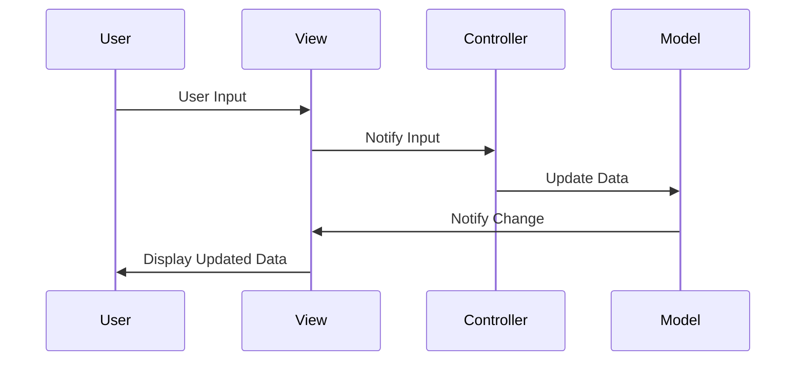
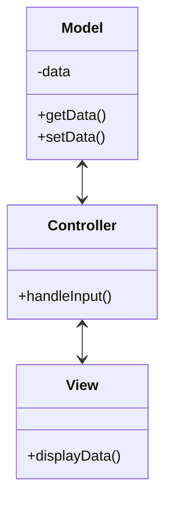

## 7.3 Model-View-Controller (MVC) Pattern

The Model-View-Controller (MVC) pattern is a fundamental architectural pattern that separates an application into three interconnected components: Model, View, and Controller. This separation facilitates modularity, scalability, and maintainability, making it a cornerstone of modern software development, particularly in web and desktop applications.

### Understanding the MVC Pattern

#### Definition and Intent

The MVC pattern is designed to separate the internal representations of information from the ways that information is presented and accepted by the user. By dividing an application into three components, MVC enables developers to manage complex applications by organizing code into logical sections. This separation allows for parallel development, where different team members can work on the user interface, business logic, and input control simultaneously.

#### Historical Significance

The MVC pattern was first introduced by Trygve Reenskaug in the late 1970s while working on the Smalltalk-80 programming language. It was developed to address the growing complexity of graphical user interfaces and has since become a standard in software engineering, influencing the design of frameworks and libraries across various programming languages.

### Components of the MVC Pattern

#### 1. Model

The Model represents the application's data and business logic. It is responsible for managing the data of the application, responding to requests for information about its state, and responding to instructions to change state. The Model directly manages the data, logic, and rules of the application.

- **Responsibilities**:
  - Encapsulate application data.
  - Define business rules and logic.
  - Notify observers (usually the View) of any changes in state.

- **Example**:
  ```java
  public class UserModel {
      private String name;
      private String email;

      public UserModel(String name, String email) {
          this.name = name;
          this.email = email;
      }

      public String getName() {
          return name;
      }

      public void setName(String name) {
          this.name = name;
      }

      public String getEmail() {
          return email;
      }

      public void setEmail(String email) {
          this.email = email;
      }
  }
  ```

#### 2. View

The View is responsible for rendering the user interface. It displays data to the user and sends user commands to the Controller. The View is essentially the presentation layer that the user interacts with.

- **Responsibilities**:
  - Display data from the Model to the user.
  - Capture user input and send it to the Controller.

- **Example**:
  ```java
  public class UserView {
      public void printUserDetails(String userName, String userEmail) {
          System.out.println("User: ");
          System.out.println("Name: " + userName);
          System.out.println("Email: " + userEmail);
      }
  }
  ```

#### 3. Controller

The Controller acts as an intermediary between the Model and the View. It receives user input from the View, processes it (possibly updating the Model), and returns the output display to the View.

- **Responsibilities**:
  - Interpret user inputs from the View.
  - Update the Model based on user inputs.
  - Update the View with new data from the Model.

- **Example**:
  ```java
  public class UserController {
      private UserModel model;
      private UserView view;

      public UserController(UserModel model, UserView view) {
          this.model = model;
          this.view = view;
      }

      public void setUserName(String name) {
          model.setName(name);
      }

      public String getUserName() {
          return model.getName();
      }

      public void setUserEmail(String email) {
          model.setEmail(email);
      }

      public String getUserEmail() {
          return model.getEmail();
      }

      public void updateView() {
          view.printUserDetails(model.getName(), model.getEmail());
      }
  }
  ```

### Flow of Data and Control

The MVC pattern facilitates a clear flow of data and control between its components:

1. **User Interaction**: The user interacts with the View, triggering an event (e.g., clicking a button).
2. **Controller Processing**: The Controller receives the input from the View, processes it, and updates the Model accordingly.
3. **Model Update**: The Model changes its state based on the Controller's instructions.
4. **View Update**: The View queries the Model for updated data and refreshes the display to reflect the new state.

This flow ensures a clean separation of concerns, making it easier to manage and scale applications.



### Benefits of the MVC Pattern

- **Separation of Concerns**: By dividing an application into three distinct components, MVC promotes a clean separation of concerns, making it easier to manage and scale applications.
- **Parallel Development**: Different developers can work on the Model, View, and Controller simultaneously, speeding up the development process.
- **Reusability**: Components can be reused across different parts of the application or even in different projects.
- **Maintainability**: Changes to one component have minimal impact on others, making the application easier to maintain and extend.

### UML Diagram of MVC Pattern

Below is a UML diagram illustrating the structure of the MVC pattern:



### Historical Significance of MVC

The MVC pattern has played a crucial role in the evolution of software engineering. It was one of the first patterns to address the complexity of user interfaces in software applications. Over the years, MVC has influenced the design of numerous frameworks and libraries, such as JavaServer Faces (JSF), Spring MVC, and AngularJS, among others. Its principles continue to guide developers in creating scalable and maintainable software.

### Try It Yourself

To better understand the MVC pattern, try modifying the code examples provided:

1. **Add a New Attribute**: Introduce a new attribute to the `UserModel`, such as `phoneNumber`, and update the `UserView` and `UserController` to handle this new attribute.
2. **Enhance the View**: Modify the `UserView` to display user details in a different format or style.
3. **Extend the Controller**: Add a method to the `UserController` that allows updating multiple attributes at once.

### Knowledge Check

- **What is the primary purpose of the MVC pattern?**
- **How does the Controller interact with the Model and View?**
- **What are the benefits of using the MVC pattern in software development?**

### Summary

The Model-View-Controller (MVC) pattern is a powerful architectural pattern that separates an application into three interconnected components: Model, View, and Controller. This separation facilitates modularity, scalability, and maintainability, making it a cornerstone of modern software development. By understanding and implementing the MVC pattern, developers can create applications that are easier to manage, extend, and scale.

Remember, this is just the beginning. As you progress, you'll build more complex and interactive applications. Keep experimenting, stay curious, and enjoy the journey!

## Quiz Time!



### What is the primary purpose of the MVC pattern?

- [x] To separate an application into three interconnected components: Model, View, and Controller.
- [ ] To combine the user interface and business logic into a single component.
- [ ] To create a monolithic application structure.
- [ ] To simplify database interactions.

> **Explanation:** The MVC pattern is designed to separate an application into three components: Model, View, and Controller, to facilitate modularity and maintainability.

### How does the Controller interact with the Model and View?

- [x] The Controller updates the Model and instructs the View to refresh.
- [ ] The Controller directly modifies the View's display.
- [ ] The Controller stores data for the Model.
- [ ] The Controller acts as a data repository.

> **Explanation:** The Controller updates the Model based on user input and instructs the View to refresh with the new data.

### What are the benefits of using the MVC pattern?

- [x] Separation of concerns, parallel development, reusability, and maintainability.
- [ ] Faster execution speed and reduced memory usage.
- [ ] Simplified database schema and reduced data redundancy.
- [ ] Direct manipulation of user interface elements.

> **Explanation:** The MVC pattern provides benefits such as separation of concerns, parallel development, reusability, and maintainability.

### Which component of MVC is responsible for rendering the user interface?

- [x] View
- [ ] Model
- [ ] Controller
- [ ] Database

> **Explanation:** The View component is responsible for rendering the user interface and displaying data to the user.

### In the MVC pattern, what is the role of the Model?

- [x] To manage the application's data and business logic.
- [ ] To capture user input and send it to the Controller.
- [ ] To render the user interface.
- [ ] To handle HTTP requests.

> **Explanation:** The Model manages the application's data and business logic, responding to requests for information and instructions to change state.

### What historical significance does the MVC pattern have?

- [x] It was one of the first patterns to address the complexity of user interfaces.
- [ ] It was designed specifically for web applications.
- [ ] It was introduced in the 1990s for mobile applications.
- [ ] It was developed to simplify database interactions.

> **Explanation:** The MVC pattern was one of the first to address the complexity of user interfaces and has influenced many frameworks and libraries.

### Which of the following is NOT a benefit of MVC?

- [ ] Separation of concerns
- [ ] Parallel development
- [ ] Reusability
- [x] Direct database access

> **Explanation:** Direct database access is not a benefit of MVC; instead, MVC focuses on separation of concerns, parallel development, and reusability.

### What does the View component do in the MVC pattern?

- [x] Displays data from the Model to the user.
- [ ] Manages the application's data and business logic.
- [ ] Handles user input and updates the Model.
- [ ] Stores data for the application.

> **Explanation:** The View component displays data from the Model to the user and captures user input to send to the Controller.

### How can the MVC pattern facilitate parallel development?

- [x] By allowing different developers to work on the Model, View, and Controller simultaneously.
- [ ] By combining all components into a single module.
- [ ] By reducing the number of developers needed for a project.
- [ ] By eliminating the need for a user interface.

> **Explanation:** The MVC pattern allows different developers to work on the Model, View, and Controller simultaneously, facilitating parallel development.

### True or False: The MVC pattern is only applicable to web applications.

- [ ] True
- [x] False

> **Explanation:** False. The MVC pattern is applicable to various types of applications, including desktop and mobile applications, not just web applications.


