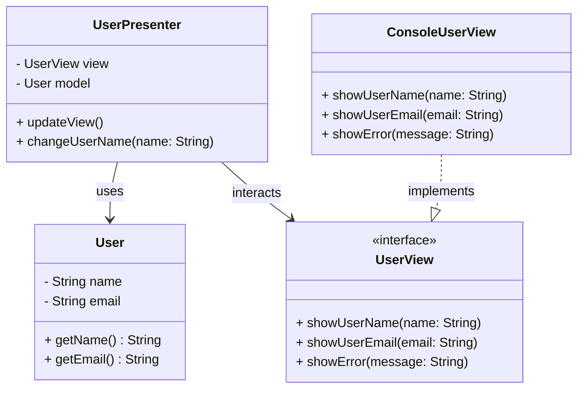

## 7.4.1 Implementing MVP in Java

The Model-View-Presenter (MVP) pattern is a derivative of the Model-View-Controller (MVC) pattern, designed to improve the separation of concerns in software architecture. It is particularly useful in Java applications where testability and maintainability are priorities. In this section, we will delve into the MVP pattern, exploring its components, implementation, and benefits.

### Understanding MVP: Roles and Responsibilities

The MVP pattern divides the application into three interconnected components: Model, View, and Presenter. Each component has distinct responsibilities, which helps in maintaining a clean separation of concerns.

#### Model

The Model represents the data and business logic of the application. It is responsible for managing the data, responding to requests for information, and updating the data when necessary. The Model is independent of the user interface and can be reused across different views.

#### View

The View is responsible for displaying data to the user and capturing user input. It is the visual representation of the data and should be as passive as possible, meaning it should not contain any business logic. The View interacts with the Presenter to update the display based on user actions.

#### Presenter

The Presenter acts as an intermediary between the Model and the View. It retrieves data from the Model and formats it for display in the View. The Presenter also handles user interactions, updating the Model as needed. It contains the presentation logic and is responsible for updating the View.

### Implementing MVP in Java: Step-by-Step Guide

Let's walk through the process of implementing the MVP pattern in a Java application. We'll create a simple application to demonstrate the interaction between the Model, View, and Presenter.

#### Step 1: Define the Model

The Model in our application will be a simple class that holds data. For this example, let's create a `User` class with basic attributes.

```java
public class User {
    private String name;
    private String email;

    public User(String name, String email) {
        this.name = name;
        this.email = email;
    }

    public String getName() {
        return name;
    }

    public String getEmail() {
        return email;
    }
}
```

#### Step 2: Create the View Interface

The View should be an interface that defines the methods for updating the UI. This allows for different implementations of the View, such as console-based or GUI-based.

```java
public interface UserView {
    void showUserName(String name);
    void showUserEmail(String email);
    void showError(String message);
}
```

#### Step 3: Implement the Presenter

The Presenter will handle the logic of retrieving data from the Model and updating the View. It will also manage user interactions.

```java
public class UserPresenter {
    private UserView view;
    private User model;

    public UserPresenter(UserView view, User model) {
        this.view = view;
        this.model = model;
    }

    public void updateView() {
        view.showUserName(model.getName());
        view.showUserEmail(model.getEmail());
    }

    public void changeUserName(String name) {
        if (name == null || name.isEmpty()) {
            view.showError("Name cannot be empty");
        } else {
            model = new User(name, model.getEmail());
            updateView();
        }
    }
}
```

#### Step 4: Implement the View

The View implementation will depend on the platform. For simplicity, let's create a console-based implementation.

```java
public class ConsoleUserView implements UserView {
    @Override
    public void showUserName(String name) {
        System.out.println("User Name: " + name);
    }

    @Override
    public void showUserEmail(String email) {
        System.out.println("User Email: " + email);
    }

    @Override
    public void showError(String message) {
        System.err.println("Error: " + message);
    }
}
```

#### Step 5: Assemble the Components

Finally, we need to assemble the components and run the application.

```java
public class MVPExample {
    public static void main(String[] args) {
        User model = new User("Alice", "alice@example.com");
        UserView view = new ConsoleUserView();
        UserPresenter presenter = new UserPresenter(view, model);

        presenter.updateView();
        presenter.changeUserName("Bob");
    }
}
```

### Enhancing Testability with MVP

One of the significant advantages of the MVP pattern is its ability to enhance testability. By decoupling the View from the Presenter, we can test the presentation logic independently of the UI. This separation allows us to use mock objects to simulate the View during testing.

#### Unit Testing the Presenter

Let's create a unit test for the `UserPresenter` using a mock View.

```java
import org.junit.jupiter.api.BeforeEach;
import org.junit.jupiter.api.Test;
import static org.mockito.Mockito.*;

public class UserPresenterTest {
    private UserView mockView;
    private User model;
    private UserPresenter presenter;

    @BeforeEach
    public void setUp() {
        mockView = mock(UserView.class);
        model = new User("Alice", "alice@example.com");
        presenter = new UserPresenter(mockView, model);
    }

    @Test
    public void testUpdateView() {
        presenter.updateView();
        verify(mockView).showUserName("Alice");
        verify(mockView).showUserEmail("alice@example.com");
    }

    @Test
    public void testChangeUserName() {
        presenter.changeUserName("Bob");
        verify(mockView).showUserName("Bob");
    }

    @Test
    public void testChangeUserNameWithEmptyName() {
        presenter.changeUserName("");
        verify(mockView).showError("Name cannot be empty");
    }
}
```

### Common Pitfalls and Best Practices

When implementing the MVP pattern, there are several common pitfalls to avoid and best practices to follow.

#### Pitfalls

1. **Tight Coupling**: Avoid tight coupling between the View and Presenter. Use interfaces to define the View's contract.
2. **Complex Presenters**: Keep the Presenter focused on presentation logic. Avoid embedding business logic in the Presenter.
3. **Overloaded Views**: Ensure the View remains passive and does not contain logic that belongs in the Presenter.

#### Best Practices

1. **Use Interfaces**: Define the View as an interface to allow for multiple implementations.
2. **Mock Views in Tests**: Use mock objects for the View in unit tests to isolate the Presenter logic.
3. **Keep Views Simple**: Ensure the View only handles UI updates and user input, delegating logic to the Presenter.

### Visualizing MVP in Java

To better understand the interaction between the components in the MVP pattern, let's visualize the flow using a class diagram.



### Try It Yourself

To deepen your understanding of the MVP pattern, try modifying the example code:

- **Add a new field** to the `User` class, such as a phone number, and update the View and Presenter to handle it.
- **Create a GUI-based View** using JavaFX or Swing to see how the pattern adapts to different UI technologies.
- **Implement additional validation** in the Presenter, such as checking for valid email formats.

### Conclusion

The MVP pattern is a powerful tool for structuring Java applications, promoting separation of concerns and enhancing testability. By clearly defining the roles of the Model, View, and Presenter, developers can create maintainable and scalable applications. Remember to keep the View passive, the Presenter focused on presentation logic, and the Model independent of the UI.

## Quiz Time!



### What is the primary role of the Presenter in the MVP pattern?

- [x] To act as an intermediary between the Model and the View
- [ ] To manage the application's data
- [ ] To display data to the user
- [ ] To handle database connections

> **Explanation:** The Presenter acts as an intermediary between the Model and the View, handling presentation logic and user interactions.

### How does the MVP pattern enhance testability?

- [x] By decoupling the View from the Presenter
- [ ] By embedding business logic in the View
- [ ] By using complex data structures
- [ ] By tightly coupling the Model and View

> **Explanation:** MVP enhances testability by decoupling the View from the Presenter, allowing for independent testing of presentation logic.

### In the MVP pattern, what should the View primarily handle?

- [x] UI updates and user input
- [ ] Business logic
- [ ] Data storage
- [ ] Network communication

> **Explanation:** The View should handle UI updates and user input, delegating logic to the Presenter.

### Which of the following is a common pitfall in MVP implementation?

- [x] Tight coupling between the View and Presenter
- [ ] Using interfaces for the View
- [ ] Keeping the View passive
- [ ] Isolating the Presenter logic

> **Explanation:** Tight coupling between the View and Presenter is a common pitfall, as it reduces flexibility and testability.

### What is a best practice when implementing the MVP pattern?

- [x] Define the View as an interface
- [ ] Embed business logic in the View
- [ ] Use the Presenter for data storage
- [ ] Keep the Model dependent on the UI

> **Explanation:** Defining the View as an interface allows for multiple implementations and enhances flexibility.

### What is the role of the Model in the MVP pattern?

- [x] To manage the application's data and business logic
- [ ] To handle user input
- [ ] To display data to the user
- [ ] To update the UI

> **Explanation:** The Model manages the application's data and business logic, independent of the UI.

### How can you test the Presenter in the MVP pattern?

- [x] By using mock objects for the View
- [ ] By embedding UI logic in the Presenter
- [ ] By tightly coupling the Model and View
- [ ] By using complex data structures

> **Explanation:** Using mock objects for the View allows for isolated testing of the Presenter logic.

### What should you avoid in the Presenter when implementing MVP?

- [x] Embedding business logic
- [ ] Handling presentation logic
- [ ] Interacting with the View
- [ ] Updating the Model

> **Explanation:** The Presenter should focus on presentation logic and avoid embedding business logic.

### True or False: The View in MVP should contain business logic.

- [ ] True
- [x] False

> **Explanation:** The View should not contain business logic; it should be as passive as possible, handling only UI updates and user input.

### Which component in MVP is responsible for formatting data for display?

- [x] Presenter
- [ ] Model
- [ ] View
- [ ] Controller

> **Explanation:** The Presenter is responsible for formatting data from the Model for display in the View.


