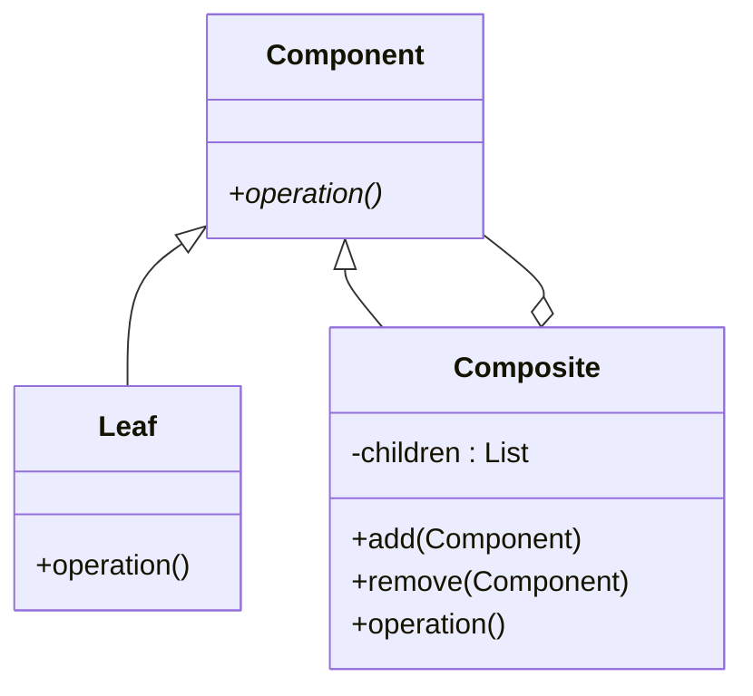

## 7.4.1 Implementing Composite in Java

The Composite design pattern is a structural pattern that allows you to compose objects into tree structures to represent part-whole hierarchies. It enables clients to treat individual objects and compositions of objects uniformly. This pattern is particularly useful in scenarios where you need to work with tree-like structures, such as file systems, organizational hierarchies, or graphical user interfaces.

### Intent

The primary intent of the Composite pattern is to allow clients to treat individual objects and compositions of objects uniformly. This is achieved by defining a common interface for both simple and complex objects, enabling recursive composition.

### Structure

The Composite pattern consists of the following key components:

- **Component**: An interface or abstract class that defines the common operations for both simple and complex objects.
- **Leaf**: Represents the individual objects in the composition. A leaf has no children.
- **Composite**: Represents the complex objects that may have children. A composite can contain both leaf and composite objects.

#### UML Diagram

Below is a UML diagram representing the structure of the Composite pattern:



*Diagram Caption*: This UML diagram illustrates the Composite pattern's structure, showing the relationships between the `Component`, `Leaf`, and `Composite` classes.

### Participants

- **Component**: Declares the interface for objects in the composition and implements default behavior for the interface common to all classes, as appropriate.
- **Leaf**: Represents leaf objects in the composition. A leaf has no children and implements the `Component` interface.
- **Composite**: Defines behavior for components having children and stores child components. Implements child-related operations in the `Component` interface.

### Collaborations

- **Component**: The `Component` interface is implemented by both `Leaf` and `Composite` classes, allowing them to be treated uniformly.
- **Leaf**: Implements the `Component` interface and provides the behavior for leaf nodes.
- **Composite**: Manages child components and implements operations that involve child components.

### Consequences

- **Uniformity**: Clients treat individual objects and compositions uniformly, simplifying client code.
- **Extensibility**: New `Leaf` or `Composite` classes can be added without modifying existing code.
- **Complexity**: The pattern can introduce complexity due to the recursive nature of the composition.

### Implementation

#### Implementation Guidelines

1. **Define the Component Interface**: Create an interface or abstract class that declares the operations common to both simple and complex objects.
2. **Implement Leaf Class**: Create a class that implements the `Component` interface and represents leaf objects.
3. **Implement Composite Class**: Create a class that implements the `Component` interface and manages child components.
4. **Use Recursion**: Implement operations in the `Composite` class using recursion to traverse the tree structure.

#### Sample Code Snippets

Below is a Java implementation of the Composite pattern:

```java
// Component interface
interface Graphic {
    void draw();
}

// Leaf class
class Circle implements Graphic {
    @Override
    public void draw() {
        System.out.println("Drawing a Circle");
    }
}

// Composite class
class CompositeGraphic implements Graphic {
    private List<Graphic> children = new ArrayList<>();

    public void add(Graphic graphic) {
        children.add(graphic);
    }

    public void remove(Graphic graphic) {
        children.remove(graphic);
    }

    @Override
    public void draw() {
        for (Graphic graphic : children) {
            graphic.draw();
        }
    }
}

// Client code
public class CompositePatternDemo {
    public static void main(String[] args) {
        // Create leaf objects
        Graphic circle1 = new Circle();
        Graphic circle2 = new Circle();

        // Create composite object
        CompositeGraphic compositeGraphic = new CompositeGraphic();
        compositeGraphic.add(circle1);
        compositeGraphic.add(circle2);

        // Draw composite graphic
        compositeGraphic.draw();
    }
}
```

*Explanation*: In this example, the `Graphic` interface defines the `draw` operation. The `Circle` class is a leaf that implements the `Graphic` interface. The `CompositeGraphic` class is a composite that can contain multiple `Graphic` objects, both `Circle` and other `CompositeGraphic` objects.

### Sample Use Cases

- **Graphical User Interfaces**: The Composite pattern is often used in GUI frameworks to represent components like windows, panels, and buttons.
- **File Systems**: File systems use the Composite pattern to represent directories and files, allowing operations to be performed uniformly on both.
- **Organizational Hierarchies**: The pattern can represent organizational structures, where employees can be treated uniformly regardless of their position in the hierarchy.

### Related Patterns

- **[6.6 Singleton Pattern]( "Singleton Pattern")**: While not directly related, the Singleton pattern can be used in conjunction with the Composite pattern to manage shared resources.
- **Decorator Pattern**: Both patterns allow for the dynamic composition of objects, but the Decorator pattern focuses on adding responsibilities to individual objects, while the Composite pattern focuses on part-whole hierarchies.

### Known Uses

- **Java AWT and Swing**: Both frameworks use the Composite pattern extensively to manage GUI components.
- **Apache Commons Collections**: The library uses the Composite pattern to manage collections of objects.

### Best Practices

- **Use Interfaces**: Define the `Component` as an interface to allow for flexibility and extensibility.
- **Manage Complexity**: Be mindful of the complexity introduced by recursive structures and ensure operations are efficient.
- **Consider Thread Safety**: If the composite structure is accessed by multiple threads, ensure thread safety in the `Composite` class.

### Common Pitfalls

- **Overcomplicating Simple Structures**: Avoid using the Composite pattern for simple structures where a single class would suffice.
- **Inefficient Operations**: Ensure that operations on the composite structure are efficient, especially when dealing with large hierarchies.

### Exercises

1. **Modify the Example**: Extend the example by adding a `Rectangle` class and include it in the composite structure.
2. **Implement a File System**: Create a simple file system using the Composite pattern, with `File` and `Directory` classes.
3. **Explore Thread Safety**: Modify the `CompositeGraphic` class to be thread-safe.

### Summary

The Composite pattern is a powerful tool for managing part-whole hierarchies in Java applications. By allowing clients to treat individual objects and compositions uniformly, it simplifies client code and enhances flexibility. When implementing the Composite pattern, consider the trade-offs between uniformity and complexity, and ensure efficient operations over the composite structure.

## Test Your Knowledge: Composite Pattern in Java Quiz



### What is the primary intent of the Composite pattern?

- [x] To allow clients to treat individual objects and compositions uniformly.
- [ ] To manage object creation.
- [ ] To provide a way to access the elements of an aggregate object sequentially.
- [ ] To define a one-to-many dependency between objects.

> **Explanation:** The Composite pattern's primary intent is to enable uniform treatment of individual objects and compositions.

### Which class in the Composite pattern represents individual objects?

- [x] Leaf
- [ ] Component
- [ ] Composite
- [ ] Client

> **Explanation:** The `Leaf` class represents individual objects in the Composite pattern.

### What operation does the Composite class typically perform?

- [x] Manages child components and performs operations on them.
- [ ] Creates new objects.
- [ ] Provides a global point of access to a resource.
- [ ] Defines a family of algorithms.

> **Explanation:** The `Composite` class manages child components and performs operations on them.

### How does the Composite pattern simplify client code?

- [x] By allowing uniform treatment of individual and composite objects.
- [ ] By reducing the number of classes.
- [ ] By eliminating the need for interfaces.
- [ ] By using inheritance to share code.

> **Explanation:** The Composite pattern simplifies client code by enabling uniform treatment of individual and composite objects.

### What is a common use case for the Composite pattern?

- [x] Graphical User Interfaces
- [ ] Database connections
- [ ] Network protocols
- [ ] Memory management

> **Explanation:** The Composite pattern is commonly used in graphical user interfaces to manage components.

### Which pattern is related to the Composite pattern by allowing dynamic composition of objects?

- [x] Decorator Pattern
- [ ] Singleton Pattern
- [ ] Factory Pattern
- [ ] Observer Pattern

> **Explanation:** The Decorator pattern is related to the Composite pattern as both allow dynamic composition of objects.

### What should be considered when implementing the Composite pattern?

- [x] Thread safety
- [ ] Database normalization
- [ ] Network latency
- [ ] Memory allocation

> **Explanation:** Thread safety should be considered when implementing the Composite pattern, especially in multi-threaded environments.

### What is a potential drawback of the Composite pattern?

- [x] Increased complexity due to recursive structures.
- [ ] Limited scalability.
- [ ] Reduced flexibility.
- [ ] Inefficient memory usage.

> **Explanation:** The Composite pattern can introduce complexity due to its recursive nature.

### How can the Composite pattern be extended?

- [x] By adding new Leaf or Composite classes.
- [ ] By modifying the Component interface.
- [ ] By removing existing classes.
- [ ] By changing the client code.

> **Explanation:** The Composite pattern can be extended by adding new Leaf or Composite classes.

### True or False: The Composite pattern is only applicable to graphical user interfaces.

- [ ] True
- [x] False

> **Explanation:** False. The Composite pattern is applicable to various domains, including file systems and organizational hierarchies.



By following these guidelines and examples, you can effectively implement the Composite pattern in Java, enhancing the flexibility and maintainability of your applications.
