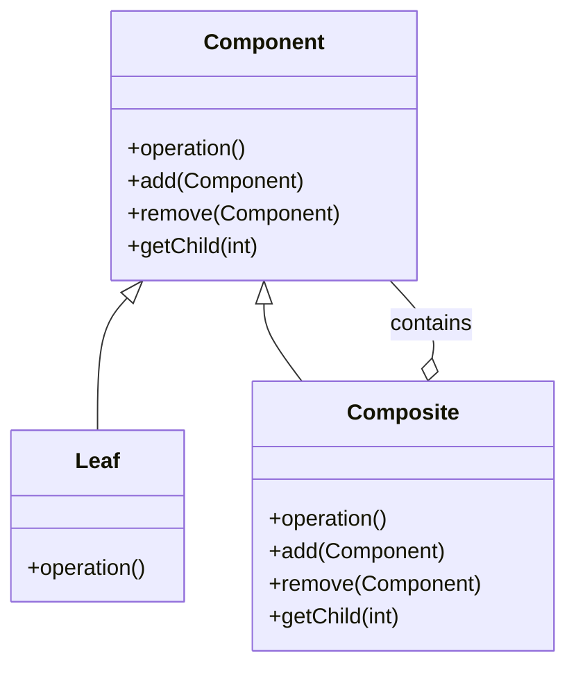

## 7.4.2 Component, Leaf, and Composite Classes

The Composite Pattern is a structural design pattern that allows you to compose objects into tree structures to represent part-whole hierarchies. This pattern lets clients treat individual objects and compositions of objects uniformly. In this section, we will delve into the core components of the Composite Pattern: the `Component`, `Leaf`, and `Composite` classes. Understanding these roles is crucial for implementing the pattern effectively in Java.

### Component Class

#### Intent

The `Component` class serves as the base class or interface in the Composite Pattern. It defines the common operations that can be performed on both simple and complex objects. This abstraction allows clients to interact with all objects in the hierarchy without needing to know their specific types.

#### Structure

The `Component` class typically includes:

- **Common Operations**: Methods that can be executed on both individual objects (`Leaf`) and composite objects (`Composite`).
- **Optional Methods**: Methods for managing child components, which may be implemented as default methods or throw exceptions in the `Leaf` class.

#### Implementation

```java
// Component.java
public interface Component {
    void operation();
    
    // Optional methods for managing children
    default void add(Component component) {
        throw new UnsupportedOperationException();
    }

    default void remove(Component component) {
        throw new UnsupportedOperationException();
    }

    default Component getChild(int index) {
        throw new UnsupportedOperationException();
    }
}
```

In this example, the `Component` interface defines a single method `operation()`, which all components must implement. The methods `add()`, `remove()`, and `getChild()` are optional and throw exceptions by default, as not all components will support these operations.

### Leaf Class

#### Intent

The `Leaf` class represents the end objects in a composition. A `Leaf` has no children and implements the `Component` interface directly. It performs the actual operations defined by the `Component` interface.

#### Structure

- **Concrete Implementation**: Implements the operations defined in the `Component` interface.
- **No Child Management**: Does not implement child management methods, as it cannot have children.

#### Implementation

```java
// Leaf.java
public class Leaf implements Component {
    private String name;

    public Leaf(String name) {
        this.name = name;
    }

    @Override
    public void operation() {
        System.out.println("Leaf " + name + " operation performed.");
    }
}
```

The `Leaf` class implements the `operation()` method, providing the specific behavior for leaf nodes. It does not override the child management methods, as it does not support them.

### Composite Class

#### Intent

The `Composite` class represents a node that can have children. It implements the `Component` interface and provides implementations for managing child components. This class allows you to build complex structures by combining multiple `Component` objects.

#### Structure

- **Child Management**: Implements methods to add, remove, and access child components.
- **Delegation**: Delegates operations to its children, allowing for recursive composition.

#### Implementation

```java
// Composite.java
import java.util.ArrayList;
import java.util.List;

public class Composite implements Component {
    private List<Component> children = new ArrayList<>();

    @Override
    public void operation() {
        System.out.println("Composite operation performed.");
        for (Component child : children) {
            child.operation();
        }
    }

    @Override
    public void add(Component component) {
        children.add(component);
    }

    @Override
    public void remove(Component component) {
        children.remove(component);
    }

    @Override
    public Component getChild(int index) {
        return children.get(index);
    }
}
```

The `Composite` class maintains a list of child components and implements the `operation()` method by iterating over its children and invoking their `operation()` methods. It also provides implementations for `add()`, `remove()`, and `getChild()` to manage its children.

### Practical Applications

The Composite Pattern is widely used in scenarios where you need to represent hierarchies of objects. Common examples include:

- **Graphical User Interfaces (GUIs)**: Where windows, panels, and buttons can be composed into complex layouts.
- **File Systems**: Where directories can contain files and other directories.
- **Document Object Models (DOM)**: Where elements can contain other elements and text nodes.

### Real-World Scenario

Consider a graphical application where you need to render a complex scene composed of various shapes. Using the Composite Pattern, you can treat individual shapes and groups of shapes uniformly, simplifying the rendering logic.

```java
public class Client {
    public static void main(String[] args) {
        Component leaf1 = new Leaf("Leaf 1");
        Component leaf2 = new Leaf("Leaf 2");
        Component composite = new Composite();
        
        composite.add(leaf1);
        composite.add(leaf2);
        
        composite.operation();
    }
}
```

In this example, the `Client` class creates a simple hierarchy with two `Leaf` objects and a `Composite` object. The `operation()` method is called on the `Composite`, which in turn calls the `operation()` method on each of its children.

### Visualizing the Composite Pattern



**Diagram Explanation**: This class diagram illustrates the relationships between the `Component`, `Leaf`, and `Composite` classes. The `Composite` class contains multiple `Component` objects, forming a tree structure.

### Key Takeaways

- **Uniformity**: The Composite Pattern allows you to treat individual objects and compositions uniformly, simplifying client code.
- **Flexibility**: You can easily add new types of components without modifying existing code.
- **Complexity**: Managing the hierarchy can become complex, especially with deep or wide structures.

### Best Practices

- **Use Interfaces**: Define the `Component` as an interface to allow for flexible implementations.
- **Exception Handling**: Use default methods or exceptions for unsupported operations in the `Leaf` class.
- **Performance Considerations**: Be mindful of performance when dealing with large hierarchies, as operations may involve traversing the entire structure.

### Common Pitfalls

- **Overuse**: Avoid using the Composite Pattern when a simpler solution would suffice.
- **Inefficient Operations**: Ensure that operations on the hierarchy are efficient, especially for large structures.

### Exercises

1. Modify the `Composite` class to support a method that counts the total number of `Leaf` objects in the hierarchy.
2. Implement a new type of `Component` that represents a different kind of node, such as a `Decorator`.
3. Experiment with different data structures for managing children in the `Composite` class, such as a `Set` or `Map`.

### Conclusion

The Composite Pattern is a powerful tool for managing complex hierarchies of objects. By understanding the roles of `Component`, `Leaf`, and `Composite` classes, you can create flexible and maintainable designs that simplify client interactions with complex structures.

## Test Your Knowledge: Composite Pattern in Java Quiz



### What is the primary role of the Component class in the Composite Pattern?

- [x] To define common operations for both simple and complex objects.
- [ ] To manage child components in a hierarchy.
- [ ] To perform specific operations for leaf nodes.
- [ ] To provide a concrete implementation of operations.

> **Explanation:** The Component class serves as the base class or interface, defining common operations that can be performed on both simple and complex objects.

### Which class represents end objects with no children in the Composite Pattern?

- [x] Leaf
- [ ] Composite
- [ ] Component
- [ ] Node

> **Explanation:** The Leaf class represents end objects in a composition, which have no children and implement the Component interface directly.

### How does the Composite class manage its children?

- [x] By implementing methods to add, remove, and access child components.
- [ ] By overriding the operation method to perform specific tasks.
- [ ] By defining common operations for all components.
- [ ] By throwing exceptions for unsupported operations.

> **Explanation:** The Composite class provides implementations for managing child components, allowing it to build complex structures by combining multiple Component objects.

### In which scenarios is the Composite Pattern most beneficial?

- [x] When you need to represent hierarchies of objects.
- [ ] When you need to perform operations on individual objects only.
- [ ] When you need to avoid using interfaces.
- [ ] When you need to simplify operations on simple objects.

> **Explanation:** The Composite Pattern is beneficial in scenarios where you need to represent hierarchies of objects, such as GUIs, file systems, and DOMs.

### What is a common pitfall when using the Composite Pattern?

- [x] Overuse in situations where a simpler solution would suffice.
- [ ] Using interfaces to define common operations.
- [ ] Implementing child management methods in the Leaf class.
- [ ] Treating individual objects and compositions uniformly.

> **Explanation:** A common pitfall is overusing the Composite Pattern in situations where a simpler solution would suffice, leading to unnecessary complexity.

### How can you ensure efficient operations on large hierarchies in the Composite Pattern?

- [x] By optimizing the traversal and management of the hierarchy.
- [ ] By avoiding the use of interfaces.
- [ ] By implementing child management methods in the Leaf class.
- [ ] By using exceptions for unsupported operations.

> **Explanation:** Ensuring efficient operations on large hierarchies involves optimizing the traversal and management of the hierarchy to avoid performance issues.

### What is the benefit of using interfaces in the Composite Pattern?

- [x] They allow for flexible implementations of components.
- [ ] They simplify operations on individual objects.
- [ ] They provide concrete implementations of operations.
- [ ] They prevent the use of child management methods.

> **Explanation:** Using interfaces allows for flexible implementations of components, enabling easy addition of new types of components without modifying existing code.

### How does the Composite Pattern simplify client code?

- [x] By allowing clients to treat individual objects and compositions uniformly.
- [ ] By providing concrete implementations of operations.
- [ ] By avoiding the use of interfaces.
- [ ] By implementing child management methods in the Leaf class.

> **Explanation:** The Composite Pattern simplifies client code by allowing clients to treat individual objects and compositions uniformly, reducing complexity.

### What is the role of the operation method in the Composite Pattern?

- [x] To define the behavior that all components must implement.
- [ ] To manage child components in a hierarchy.
- [ ] To provide a concrete implementation of operations.
- [ ] To perform specific tasks for leaf nodes.

> **Explanation:** The operation method defines the behavior that all components must implement, allowing for uniform treatment of objects in the hierarchy.

### True or False: The Leaf class in the Composite Pattern can have child components.

- [x] False
- [ ] True

> **Explanation:** False. The Leaf class represents end objects in a composition and does not have child components.



By mastering the Composite Pattern and its core components, you can design flexible and scalable applications that handle complex object hierarchies with ease.
