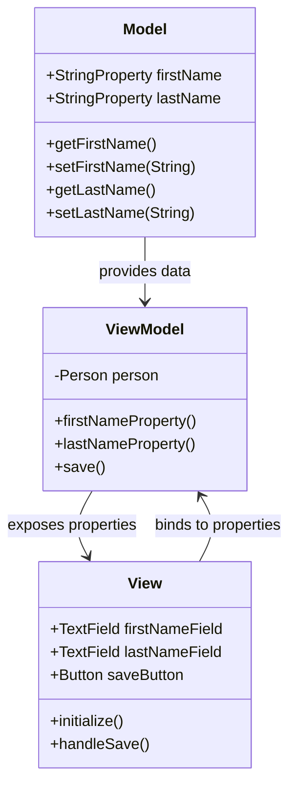

## 7.4.2 MVVM Pattern in Java

The Model-View-ViewModel (MVVM) pattern is a powerful architectural pattern that facilitates the separation of concerns in software development, particularly in UI applications. It is especially useful in Java applications using frameworks like JavaFX, where it simplifies the development process through data binding and enhances maintainability. In this section, we will delve into the MVVM pattern, its components, and its implementation in Java, focusing on JavaFX.

### Understanding the MVVM Pattern

The MVVM pattern is an evolution of the Model-View-Controller (MVC) pattern, designed to address some of its limitations by introducing a ViewModel component. This pattern is particularly beneficial in applications with complex user interfaces, as it allows for a clean separation between the UI and business logic.

#### Components of MVVM

1. **Model**: Represents the application's data and business logic. It is responsible for retrieving data from the database or any other data source and providing it to the ViewModel. The Model is independent of the View and ViewModel, ensuring that changes in the UI do not affect the data layer.

2. **View**: The UI layer that displays data to the user and sends user interactions to the ViewModel. In JavaFX, the View is typically defined using FXML files or Java code, and it is responsible for rendering the UI components.

3. **ViewModel**: Acts as an intermediary between the View and the Model. It exposes data from the Model to the View and handles user interactions by updating the Model. The ViewModel contains properties that the View can bind to, facilitating a two-way data binding mechanism.

### Data Binding in MVVM

Data binding is a key feature of the MVVM pattern, allowing for automatic synchronization between the View and ViewModel. In JavaFX, data binding is achieved through the use of observable properties and listeners, which ensure that changes in the Model are reflected in the View and vice versa.

#### How Data Binding Works

- **Two-Way Binding**: This allows changes in the View to update the ViewModel and changes in the ViewModel to update the View. It is particularly useful for form inputs where user changes need to be reflected in the underlying data model.

- **One-Way Binding**: This is used when the View needs to display data from the ViewModel, but changes in the View do not affect the ViewModel. It is suitable for read-only data displays.

- **Listeners**: JavaFX provides listeners that can be attached to properties to react to changes. These listeners can be used to perform actions when a property value changes, such as updating the UI.

### Implementing MVVM in Java with JavaFX

JavaFX is a rich client platform for Java that provides a comprehensive set of UI components and a powerful data binding mechanism, making it an ideal choice for implementing the MVVM pattern.

#### Setting Up a JavaFX Project

To get started with JavaFX and MVVM, you need to set up a JavaFX project. You can use an IDE like IntelliJ IDEA or Eclipse with JavaFX support.

1. **Create a New JavaFX Project**: Use your IDE to create a new JavaFX project. Ensure that you have the JavaFX SDK installed and configured in your project settings.

2. **Define the Model**: Create a class to represent your data model. This class should contain the data properties and methods to manipulate the data.

```java
public class Person {
    private final StringProperty firstName = new SimpleStringProperty();
    private final StringProperty lastName = new SimpleStringProperty();

    public String getFirstName() {
        return firstName.get();
    }

    public void setFirstName(String firstName) {
        this.firstName.set(firstName);
    }

    public StringProperty firstNameProperty() {
        return firstName;
    }

    public String getLastName() {
        return lastName.get();
    }

    public void setLastName(String lastName) {
        this.lastName.set(lastName);
    }

    public StringProperty lastNameProperty() {
        return lastName;
    }
}
```

3. **Create the ViewModel**: The ViewModel will expose the properties of the Model to the View and handle user interactions.

```java
public class PersonViewModel {
    private final Person person;

    public PersonViewModel(Person person) {
        this.person = person;
    }

    public StringProperty firstNameProperty() {
        return person.firstNameProperty();
    }

    public StringProperty lastNameProperty() {
        return person.lastNameProperty();
    }

    public void save() {
        // Logic to save the person data
    }
}
```

4. **Design the View**: Use FXML to define the UI layout. You can use Scene Builder to visually design the UI and generate the FXML file.

```xml
<?xml version="1.0" encoding="UTF-8"?>

<?import javafx.scene.control.*?>
<?import javafx.scene.layout.*?>

<VBox xmlns:fx="http://javafx.com/fxml" fx:controller="com.example.PersonController">
    <TextField fx:id="firstNameField" />
    <TextField fx:id="lastNameField" />
    <Button text="Save" onAction="#handleSave" />
</VBox>
```

5. **Connect the View and ViewModel**: In the controller class, bind the UI components to the ViewModel properties.

```java
public class PersonController {
    @FXML
    private TextField firstNameField;
    @FXML
    private TextField lastNameField;

    private PersonViewModel viewModel;

    public void initialize() {
        Person person = new Person();
        viewModel = new PersonViewModel(person);

        firstNameField.textProperty().bindBidirectional(viewModel.firstNameProperty());
        lastNameField.textProperty().bindBidirectional(viewModel.lastNameProperty());
    }

    @FXML
    private void handleSave() {
        viewModel.save();
    }
}
```

### Benefits of MVVM in Java

Implementing the MVVM pattern in Java applications offers several advantages:

- **Reduced Boilerplate Code**: Data binding eliminates the need for manual synchronization between the View and Model, reducing the amount of code required to manage UI updates.

- **Enhanced Code Maintainability**: By separating the UI logic from the business logic, MVVM makes it easier to maintain and extend applications. Changes to the UI do not affect the underlying data model, and vice versa.

- **Improved Testability**: The ViewModel can be tested independently of the View, allowing for more comprehensive unit testing. This separation of concerns facilitates the creation of testable and robust applications.

- **Scalability**: MVVM supports the development of scalable applications by promoting a modular architecture. Components can be developed and tested independently, making it easier to manage large codebases.

### Challenges of MVVM

Despite its benefits, the MVVM pattern also presents some challenges:

- **Learning Curve**: Developers new to MVVM may find the pattern complex, particularly when it comes to understanding data binding and the interaction between components.

- **Debugging Data Bindings**: Debugging issues related to data bindings can be challenging, as errors may not be immediately apparent. It requires a good understanding of the binding mechanisms and the ability to trace data flow through the application.

- **Overhead**: In some cases, the use of MVVM can introduce additional complexity and overhead, particularly in smaller applications where the benefits of separation of concerns may not be as pronounced.

### Visualizing MVVM Architecture

To better understand the MVVM pattern, let's visualize the architecture using a class diagram.



This diagram illustrates the relationships between the Model, ViewModel, and View. The Model provides data to the ViewModel, which exposes properties to the View. The View binds to these properties, allowing for automatic synchronization between the UI and data model.

### Try It Yourself

To gain a deeper understanding of the MVVM pattern, try modifying the code examples provided:

- **Add New Properties**: Extend the `Person` class with additional properties, such as `email` or `phoneNumber`, and update the ViewModel and View accordingly.

- **Implement Validation**: Add validation logic to the ViewModel to ensure that user inputs are valid before saving the data.

- **Experiment with Listeners**: Use listeners to perform actions when certain properties change, such as enabling or disabling the save button based on input validity.

### References and Further Reading

- [JavaFX Documentation](https://openjfx.io/)
- [Oracle JavaFX Tutorials](https://docs.oracle.com/javase/8/javase-clienttechnologies.htm)
- [MVVM Pattern on Wikipedia](https://en.wikipedia.org/wiki/Model%E2%80%93view%E2%80%93viewmodel)

### Knowledge Check

To reinforce your understanding of the MVVM pattern, consider the following questions:

- How does data binding simplify the synchronization between the View and ViewModel?
- What are the advantages of using the MVVM pattern in Java applications?
- What challenges might you encounter when implementing MVVM, and how can you address them?

## Quiz Time!



### What is the primary role of the ViewModel in the MVVM pattern?

- [x] To act as an intermediary between the View and the Model.
- [ ] To directly handle user input.
- [ ] To render the UI components.
- [ ] To store the application's data.

> **Explanation:** The ViewModel acts as an intermediary between the View and the Model, exposing data and handling user interactions.

### Which JavaFX feature is crucial for implementing MVVM?

- [x] Data binding
- [ ] Event handling
- [ ] CSS styling
- [ ] Animation

> **Explanation:** Data binding is crucial for implementing MVVM as it allows automatic synchronization between the View and ViewModel.

### What is a common challenge when using MVVM?

- [x] Debugging data bindings
- [ ] Writing business logic
- [ ] Designing UI layouts
- [ ] Managing database connections

> **Explanation:** Debugging data bindings can be challenging due to the complexity of tracing data flow and identifying errors.

### In MVVM, what is the View responsible for?

- [x] Displaying data and sending user interactions to the ViewModel.
- [ ] Storing and retrieving data from the database.
- [ ] Handling business logic and calculations.
- [ ] Managing application configuration.

> **Explanation:** The View is responsible for displaying data and sending user interactions to the ViewModel.

### What benefit does MVVM provide in terms of testability?

- [x] The ViewModel can be tested independently of the View.
- [ ] The View can be tested independently of the Model.
- [ ] The Model can be tested independently of the ViewModel.
- [ ] The entire application can be tested without any dependencies.

> **Explanation:** MVVM enhances testability by allowing the ViewModel to be tested independently of the View.

### Which component in MVVM is responsible for business logic?

- [x] Model
- [ ] View
- [ ] ViewModel
- [ ] Controller

> **Explanation:** The Model is responsible for the application's business logic and data management.

### How does two-way data binding work in MVVM?

- [x] Changes in the View update the ViewModel, and changes in the ViewModel update the View.
- [ ] Changes in the Model update the View, and changes in the View update the Model.
- [ ] Changes in the ViewModel update the Model, and changes in the Model update the ViewModel.
- [ ] Changes in the View update the Model, and changes in the Model update the View.

> **Explanation:** Two-way data binding allows changes in the View to update the ViewModel and vice versa.

### What is a potential drawback of using MVVM in small applications?

- [x] Increased complexity and overhead
- [ ] Lack of separation of concerns
- [ ] Difficulty in managing UI components
- [ ] Limited scalability

> **Explanation:** In small applications, MVVM can introduce unnecessary complexity and overhead.

### What tool can be used to visually design JavaFX UIs?

- [x] Scene Builder
- [ ] NetBeans
- [ ] Eclipse
- [ ] IntelliJ IDEA

> **Explanation:** Scene Builder is a tool that allows developers to visually design JavaFX UIs.

### True or False: The ViewModel in MVVM directly interacts with the database.

- [ ] True
- [x] False

> **Explanation:** The ViewModel does not directly interact with the database; it interacts with the Model, which handles data access.



Remember, mastering the MVVM pattern in Java is a journey. As you continue to explore and experiment with this pattern, you'll discover new ways to enhance your applications and improve your development workflow. Keep learning, stay curious, and enjoy the process!
